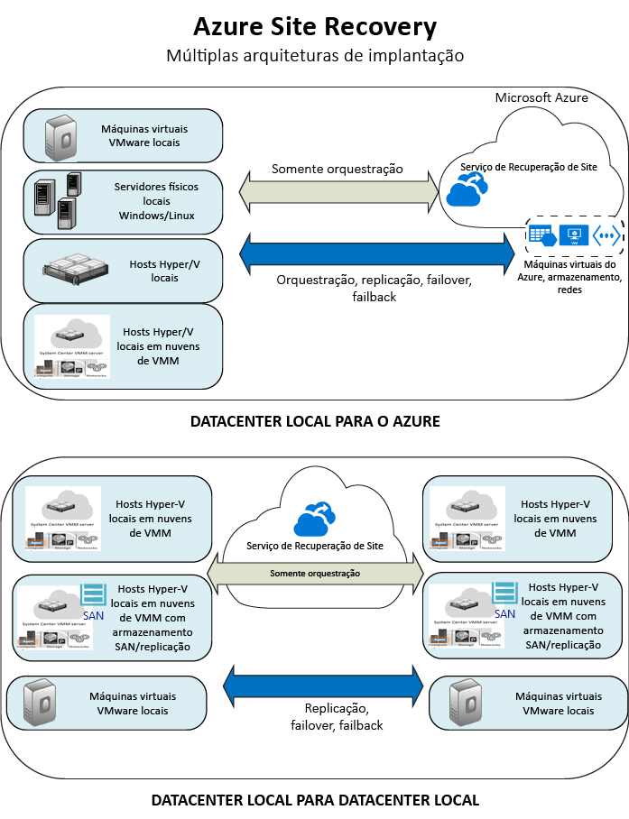

<properties
	pageTitle="O que é a Recuperação de Site?" 
	description="O Azure Site Recovery coordena a replicação, o failover e a recuperação de máquinas virtuais e servidores físicos locais para o Azure ou para um site local secundário." 
	services="site-recovery" 
	documentationCenter="" 
	authors="rayne-wiselman" 
	manager="jwhit" 
	editor=""/>

<tags 
	ms.service="site-recovery" 
	ms.devlang="na"
	ms.topic="get-started-article"
	ms.tgt_pltfrm="na"
	ms.workload="storage-backup-recovery" 
	ms.date="11/29/2015" 
	ms.author="raynew"/>

#  O que é a Recuperação de Site?

A Recuperação de Site é um serviço do Azure que colabora com sua estratégia de BCDR (continuidade de negócios e recuperação de desastre) por meio da coordenação da replicação de seus servidores locais e de suas máquinas virtuais para um datacenter local secundário ou para o Azure. A Recuperação de Site lida com a replicação e você pode disparar failover e recuperação com um simples clique. Leia uma lista de perguntas comuns nas [perguntas frequentes](site-recovery-faq.md)

## Por que usar a Recuperação de Site? 
- **BCDR mais simples** - a Recuperação de Site facilita o manuseio da replicação, do failover e da recuperação para suas cargas de trabalho e seus aplicativos locais.
- **Replicação flexível** - você pode replicar servidores locais, máquinas virtuais do Hyper-V e máquinas virtuais VMware. A Recuperação de Site usa a replicação inteligente, replicando apenas os blocos de dados e não todo o VHD para a replicação inicial. Somente as alterações delta são replicadas durante a replicação contínua. A Recuperação de Site dá suporte à transferência de dados offline e funciona com otimizadores WAN. 
- **Eliminar a necessidade de um datacenter secundário** - a Recuperação de Site pode automatizar a replicação entre datacenters, mas também oferece a oportunidade de abrir mão de um local de site secundário por meio da replicação no Azure. Os dados replicados são guardados no Armazenamento do Azure, com toda resiliência que ele oferece.

## Cenários de implantação

Esta tabela resume os cenários de replicação com suporte da Recuperação de Site.

**REPLICATE** | **REPLICAR DE** | **REPLICAR PARA** | **ARTIGO**
---|---|---|---
Máquinas virtuais da VMware | Servidor VMware local | Armazenamento do Azure | [Implantar](site-recovery-vmware-to-azure.md)
Servidor físico do Windows/Linux | Servidor físico local | Armazenamento do Azure | [Implantar](site-recovery-vmware-to-azure.md)
Máquinas virtuais do Hyper-V | Servidor de host Hyper-V local em nuvem de VMM | Armazenamento do Azure | [Implantar](site-recovery-vmm-to-azure.md)
Máquinas virtuais do Hyper-V | Site do Hyper-V local (um ou mais servidores de host do Hyper-V) | Armazenamento do Azure | [Implantar](site-recovery-hyper-v-site-to-azure.md)
Máquinas virtuais do Hyper-V locais| Servidor de host Hyper-V local em nuvem de VMM | Servidor de host Hyper-V local em nuvem de VMM no datacenter secundário | [Implantar](site-recovery-vmm-to-vmm)
Máquinas virtuais do Hyper-V | Servidor de host Hyper-V local em nuvem de VMM com armazenamento SAN| Servidor de host Hyper-V local em nuvem de VMM com armazenamento SAN no datacenter secundário | [Implantar](site-recovery-vmm-san.md)
Máquinas virtuais da VMware | Servidor VMware local | Datacenter secundário executando o VMware | [Implantar](https://microsoft.sharepoint.com/sites/academy/media/AEVD-3-85237) 
Servidor físico do Windows/Linux | Servidor físico local | Armazenamento de dados secundário | [Implantar](https://microsoft.sharepoint.com/sites/academy/media/AEVD-3-85237) 

Eles serão resumidos nos diagramas a seguir.

## Quais cargas de trabalho posso proteger?

A Recuperação de Site ajuda na continuidade de negócios com reconhecimento de dispositivo. Você pode usar a Recuperação de Site para coordenar a recuperação de desastre para o Windows e aplicativos de terceiros. Essa proteção com reconhecimento de aplicativo oferece:

- Replicação quase síncrona com RPOs de até 30 segundos para o Hyper-V e replicação contínua para VMware, para atender às necessidades dos aplicativos mais importantes.
- Instantâneos consistentes de aplicativos para aplicativos simples ou de N camadas
- Integre com o SQL Server AlwaysOn, o parceiro com outras tecnologias de replicação em nível de aplicativo, incluindo a replicação do Active Directory, o Exchange DAGS e o Oracle Data Guard.
- Os planos de recuperação flexíveis permitem a recuperação de uma pilha inteira de aplicativos com um único clique e incluem scripts externos ou até mesmo ações manuais. 
- O gerenciamento avançado de rede na Recuperação de Site e no Azure simplifica os requisitos de rede para um aplicativo, incluindo a reserva de endereços IP, a configuração de balanceadores de carga ou a integração do Gerenciador de Tráfego do Azure para switchovers de rede de baixo RTO.
- Uma biblioteca de automação avançada que fornece scripts específicos do aplicativo, prontos para produção, que pode ser baixada e integrada à Recuperação de Site.  

Leia mais em [Quais cargas de trabalho a Recuperação de Site pode proteger?](site-recovery-workload.md).

## Próximas etapas

Depois de concluir esta visão geral, [saiba mais](site-recovery-components.md) sobre a arquitetura da Recuperação de Site.
 

<!---HONumber=AcomDC_1203_2015-->