# Resultados do teste para a replicação Hyper-V do local para o local com o Site Recovery

Você pode usar o Microsoft Azure Site Recovery para orquestrar e gerenciar a replicação de máquinas virtuais e de servidores físicos para o Azure ou em um datacenter secundário. Este artigo fornece os resultados do teste de desempenho que fizemos ao replicar máquinas virtuais do Hyper-V entre dois datacenters locais.

## Objetivos do teste

O objetivo do teste é examinar o desempenho do Azure Site Recovery durante a replicação em estado estável. A replicação em estado estável ocorre após a conclusão da replicação inicial das máquinas virtuais e durante a sincronizando das alterações delta. É importante medir o desempenho usando o estado estável, pois esse é o estado no qual a maioria das máquinas virtuais permanece, a menos que ocorra alguma interrupção inesperada.

A implantação de teste é formada por dois sites locais com um servidor VMM em cada site. Essa implantação de teste é típica de uma implantação de sede/filial, na qual a sede age como o site primário e a filial como o site secundário, ou de recuperação.

## O que fizemos

Veja o que fizemos no teste aprovado:

1. Criação de máquinas virtuais usando modelos do VMM.
2. Inicialização das máquinas virtuais e captura das métricas de desempenho de linha de base durante 12 horas.
3. Criação de nuvens em servidores VMM primário e de recuperação.
4. Configuração da proteção da nuvem no Azure Site Recovery, incluindo o mapeamento de nuvens de origem e de recuperação.
5. Habilitação da proteção para máquinas virtuais e permissão para conclusão da replicação inicial.
6. Espera de algumas horas para a estabilização do sistema.
7. Captura de métricas de desempenho durante 12 horas, garantindo que todas as máquinas virtuais permaneçam em um estado de replicação esperado durante essas 12 horas.
8. Medição do delta entre as métricas de desempenho de linha de base e as métricas de desempenho de replicação.

## Desempenho do servidor primário

* A Réplica do Hyper-V armazena de forma assíncrona as alterações em um arquivo de log, com o mínimo de sobrecarga de armazenamento no servidor primário.
* A Réplica do Hyper-V utiliza um cache de memória mantido automaticamente para minimizar a sobrecarga de IOPS do armazenamento. Ela armazena gravações feitas no VHDX na memória e as descarrega no arquivo de log antes de o log ser enviado ao site de recuperação. Também ocorrerá uma limpeza do disco se as gravações atingirem um limite predeterminado.
* O gráfico abaixo mostra a sobrecarga de IOPS em estado estável para replicação. Podemos ver que a sobrecarga de IOPS causada pela replicação é de aproximadamente 5%, que é um valor muito baixo.

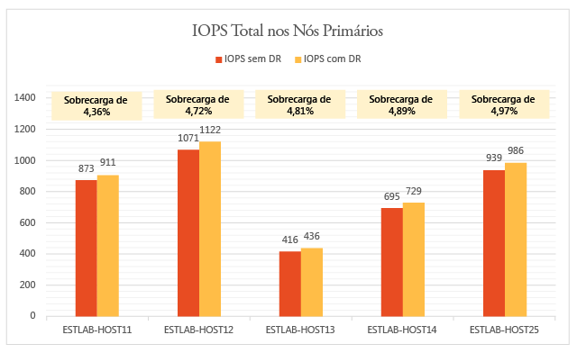

A Réplica do Hyper-V utiliza a memória no servidor primário para aprimorar o desempenho do disco. Conforme mostra o gráfico a seguir, a sobrecarga da memória em todos os servidores no cluster primário é insignificante. A sobrecarga da memória exibida é a porcentagem da memória usada pela replicação em comparação à memória total instalada no servidor Hyper-V.

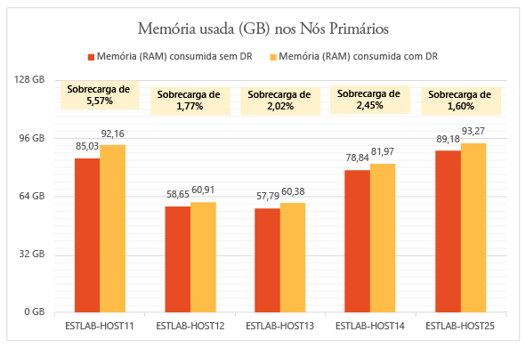

A Réplica do Hyper-V tem uma sobrecarga mínima de CPU. Conforme mostra o gráfico, a sobrecarga de replicação está na faixa de 2 a 3%.

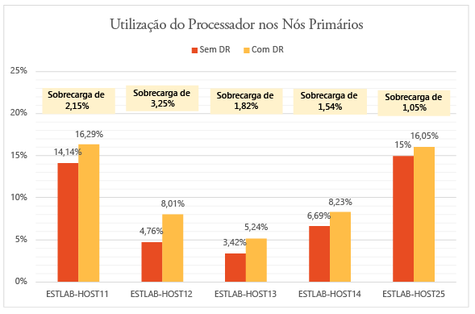

## Desempenho do servidor secundário (recuperação)

A Réplica do Hyper-V usa uma pequena quantidade de memória no servidor de recuperação para otimizar o número de operações de armazenamento. O gráfico resume o uso da memória no servidor de recuperação. A sobrecarga da memória exibida é a porcentagem da memória usada pela replicação em comparação à memória total instalada no servidor Hyper-V.

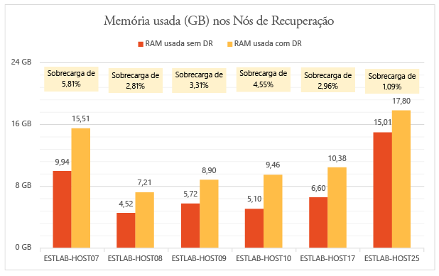

A quantidade de operações de E/S no site de recuperação é uma função do número de operações de gravação no site primário. Vamos examinar o total de operações de E/S no site de recuperação, em comparação com o total de operações de E/S e de operações de gravação no site primário. Os gráficos mostram que o total de IOPS no site de recuperação é de

* Cerca de 1,5 vezes o IOPS de gravação no primário.
* Cerca de 37% do IOPS total no site primário.

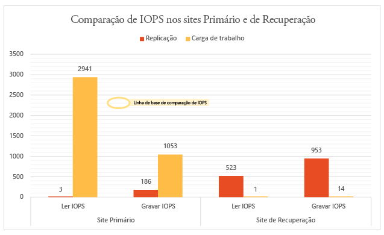

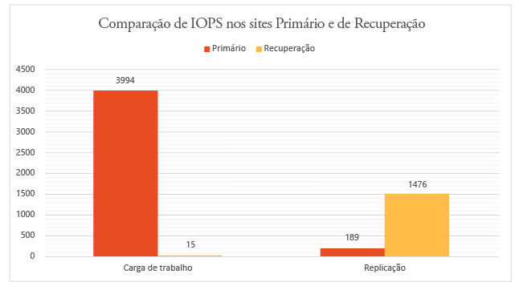

## Efeito na utilização da rede

Foi usada uma média de 275 MB por segundo de largura de banda de rede entre os nós primário e de recuperação (com compactação habilitada) de uma largura de banda existente de 5 GB por segundo.

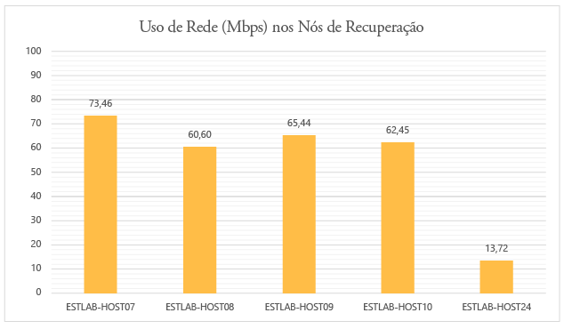

## Efeito no desempenho da VM

Uma consideração importante é o impacto da replicação nas cargas de trabalho de produção em execução nas máquinas virtuais. Se o site primário for adequadamente provisionado para replicação, não deverá haver qualquer impacto nas cargas de trabalho. O mecanismo leve de controle leve da Réplica do Hyper-V garante que as cargas de trabalho em execução nas máquinas virtuais não sejam afetadas durante a replicação em estado estável. Os gráficos a seguir ilustram isso.

Este gráfico mostra o IOPS realizado por máquinas virtuais executando cargas de trabalho diferentes, antes e depois da habilitação da replicação. Perceba que não há diferença entre elas.

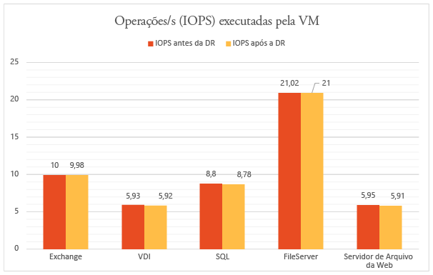

O gráfico a seguir mostra a taxa de transferência de máquinas virtuais executando cargas de trabalho diferentes, antes e depois da habilitação da replicação. Você pode observar que a replicação não tem impacto significativo.

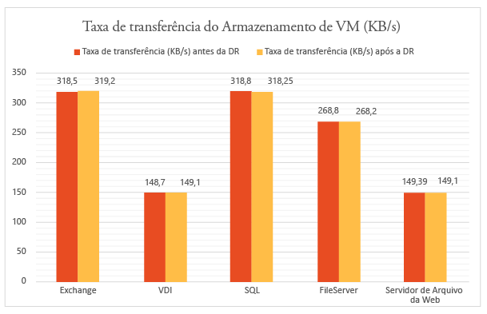

## Conclusão

Os resultados mostram claramente que o Azure Site Recovery, junto com a Réplica do Hyper-V, se ajusta muito bem com uma sobrecarga mínima para um cluster grande.  O Azure Site Recovery oferece implantação, replicação, gerenciamento e monitoramento simplificado. A Réplica do Hyper-V fornece a infraestrutura necessária para o ajuste da replicação. Para planejar uma implantação ideal, sugerimos que você baixe o [Capacity Planner da Réplica Hyper-V](https://www.microsoft.com/download/details.aspx?id=39057).

## Detalhes do ambiente de teste

### Site primário

* O site primário tem um cluster com cinco servidores Hyper-V executando 470 máquinas virtuais.
* As máquinas virtuais executam cargas de trabalho diferentes e todas têm a proteção do Azure Site Recovery habilitada.
* O armazenamento para o nó do cluster é fornecido por uma SAN do iSCSI. Modelo – Hitachi HUS130.
* Cada servidor de cluster tem quatro placas de rede (NICs) de um Gbps cada.
* Duas das placas de rede estão conectadas a uma rede iSCSI privada e duas estão conectadas a uma rede empresarial externa. Uma das redes externas está reservada apenas para comunicações de cluster.

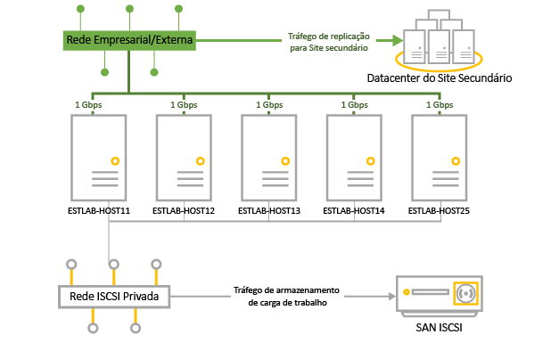

| Servidor | RAM | Modelo | Processador | Número de processadores | NIC | Software |
| --- | --- | --- | --- | --- | --- | --- |
| Servidores Hyper-V no cluster:   ESTLAB-HOST11 ESTLAB-HOST12 ESTLAB-HOST13 ESTLAB-HOST14 ESTLAB-HOST25 |128ESTLAB-HOST25 tem 256 |Dell ™ PowerEdge ™ R820 |Intel(R) Xeon(R) CPU E5-4620 0 a 2.20GHz |4 |I Gbps x 4 |Windows Server Datacenter 2012 R2 (x64) + função Hyper-V |
| Servidor VMM |2 | | |2 |1 Gbps |Windows Server Database 2012 R2 (x64) + VMM 2012 R2 |

### Site secundário (recuperação)

* O site secundário tem um cluster de failover com seis nós.
* O armazenamento para o nó do cluster é fornecido por uma SAN do iSCSI. Modelo – Hitachi HUS130.

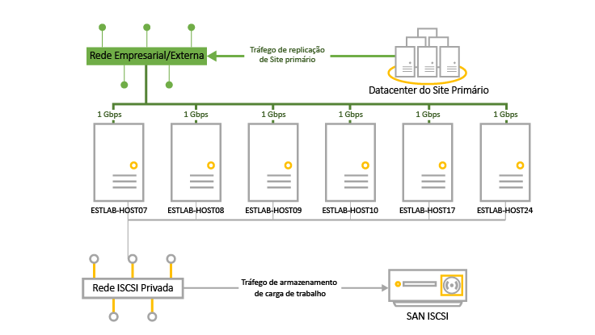

| Servidor | RAM | Modelo | Processador | Número de processadores | NIC | Software |
| --- | --- | --- | --- | --- | --- | --- |
| Servidores Hyper-V no cluster:   ESTLAB-HOST07 ESTLAB-HOST08 ESTLAB-HOST09 ESTLAB-HOST10 |96 |Dell ™ PowerEdge ™ R720 |Intel(R) Xeon(R) CPU E5-2630 0 a 2.30GHz |2 |I Gbps x 4 |Windows Server Datacenter 2012 R2 (x64) + função Hyper-V |
| ESTLAB-HOST17 |128 |Dell ™ PowerEdge ™ R820 |Intel(R) Xeon(R) CPU E5-4620 0 a 2.20GHz |4 | |Windows Server Datacenter 2012 R2 (x64) + função Hyper-V |
| ESTLAB-HOST24 |256 |Dell ™ PowerEdge ™ R820 |Intel(R) Xeon(R) CPU E5-4620 0 a 2.20GHz |2 | |Windows Server Datacenter 2012 R2 (x64) + função Hyper-V |
| Servidor VMM |2 | | |2 |1 Gbps |Windows Server Database 2012 R2 (x64) + VMM 2012 R2 |

### Cargas de trabalho do servidor

* Para fins de teste, escolhemos as cargas de trabalho normalmente usadas em cenários de clientes empresariais.
* Usamos [IOMeter](http://www.iometer.org) com as características de carga de trabalho resumidas na tabela para fins de simulação.
* Todos os perfis do IOMeter são definidos para gravar bytes aleatórios a fim de simular os piores padrões de gravação para cargas de trabalho.

| Carga de trabalho | Tamanho de E/S (KB) | % de acesso | % de leitura | E/Ss pendentes | Padrão de E/S |
| --- | --- | --- | --- | --- | --- |
| Servidor de arquivos |48163264 |60%20%5%5%10% |80%80%80%80%80% |88888 |Todos 100% aleatórios |
| SQL Server (volume 1) SQL Server (volume 2) |864 |100%100% |70%0% |88 |100% aleatório 100% sequencial |
| Exchange |32 |100% |67% |8 |100% aleatório |
| Estação de trabalho/VDI |464 |66%34% |70%95% |11 |Ambos 100% aleatórios |
| Servidor de arquivos da Web |4864 |33%34%33% |95%95%95% |888 |Todos 75% aleatórios |

### Configuração da VM

* 470 máquinas virtuais no cluster primário.
* Todas as máquinas virtuais com disco VHDX.
* Máquinas virtuais executando cargas de trabalho resumidas na tabela. Todas foram criadas com modelos do VMM.

| Carga de trabalho | Nº de VMs | RAM mínima (GB) | RAM máxima (GB) | Tamanho de disco lógico (GB) por VM | IOPS máximo |
| --- | --- | --- | --- | --- | --- |
| SQL Server |51 |1 |4 |167 |10 |
| Exchange Server |71 |1 |4 |552 |10 |
| Servidor de arquivos |50 |1 |2 |552 |22 |
| VDI |149 |.5 |1 |80 |6 |
| Servidor Web |149 |.5 |1 |80 |6 |
| TOTAL |470 | | |96,83 TB |4108 |

### Configurações do Site Recovery

* O Azure Site Recovery foi configurada para do local para o local
* O servidor VMM tem quatro nuvens configuradas e contendo servidores de cluster do Hyper-V e suas máquinas virtuais.

| Nuvem VMM primária | Máquinas virtuais protegidas na nuvem | Frequência de replicação | Pontos de recuperação adicionais |
| --- | --- | --- | --- |
| PrimaryCloudRpo15m |142 |15 min |Nenhum |
| PrimaryCloudRpo30s |47 |30 segundos |Nenhum |
| PrimaryCloudRpo30sArp1 |47 |30 segundos |1 |
| PrimaryCloudRpo5m |235 |5 min |Nenhum |

### Métricas de desempenho

A tabela resume as métricas e os contadores de desempenho medidos na implantação.

| Métrica | Contador |
| --- | --- |
| CPU |\Processador(_Total)\% Tempo do processador |
| Memória disponível |\Memória\MBytes disponíveis |
| IOPS |\Disco físico(_Total)\Transferências do disco/seg |
| Operações de leitura da VM (IOPS)/seg |\Dispositivo de armazenamento virtual do Hyper-V (<VHD>)\Operações de leitura/Seg |
| Operações de gravação da VM (IOPS)/seg |\Dispositivo de armazenamento virtual do Hyper-V (<VHD>)\Operações de gravação/S |
| Taxa de transferência de leitura da VM |\Dispositivo de armazenamento virtual do Hyper-V (<VHD>)\Bytes de leitura/seg |
| Taxa de transferência de gravação da VM |\Dispositivo de armazenamento virtual do Hyper-V (<VHD>)\Bytes de gravação/seg |

## Próximas etapas

[Configurar a replicação entre dois sites locais VMM](site-recovery-vmm-to-vmm.md)
