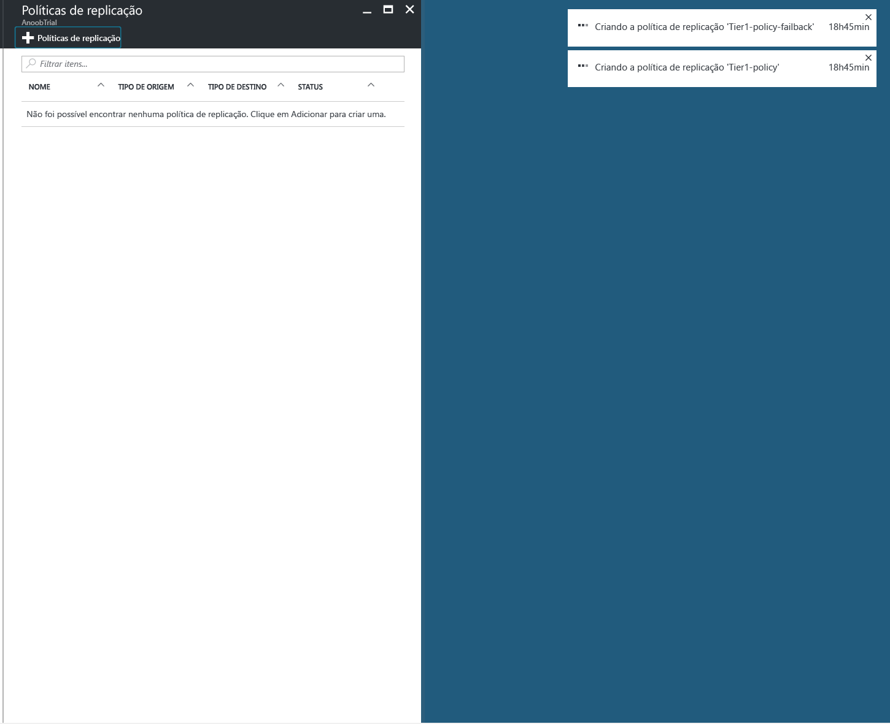
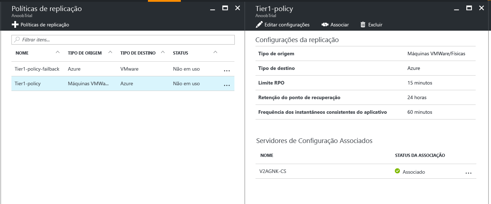
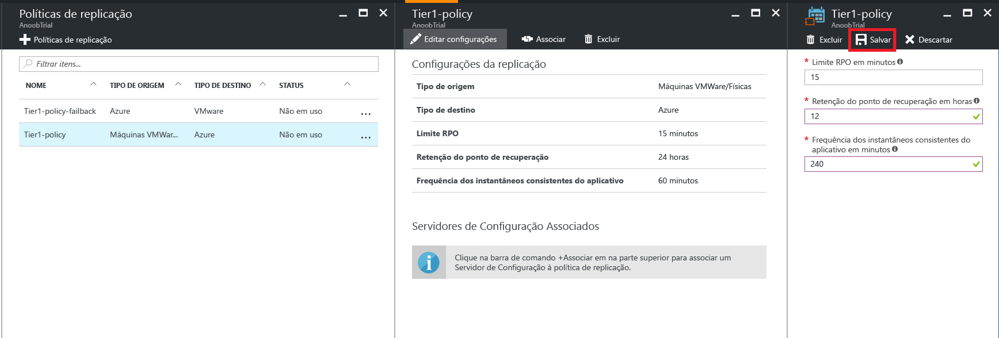

# Gerenciar a política de replicação para VMware no Azure

## Criar uma política de replicação

1. Selecione **Gerenciar** > **Infraestrutura do Site Recovery**.
2. Selecione **Políticas de replicação** em **Para VMware e Computadores físicos**.
3. Selecione **+ Política de replicação**.

    

4. Insira o nome da política.

5. Em **Limite de RPO**, especifique o limite de RPO. Alertas serão gerados quando a replicação contínua excede esse limite.
6. Em **Retenção do ponto de recuperação**, especifique (em horas) a duração da janela de retenção para cada ponto de recuperação. Os computadores protegidos podem ser recuperados para qualquer ponto em uma janela de retenção.

    > [!NOTE]
    > Há suporte para até 24 horas de retenção para computadores replicados no armazenamento premium. Há suporte para até 72 horas de retenção para computadores replicados no armazenamento standard.

    > [!NOTE]
    > Uma política de replicação para failback é criada automaticamente.

7. Em **Frequência de instantâneos consistente com o aplicativo**, especifique com que frequência (em minutos) serão criados os pontos de recuperação que contém instantâneos consistentes com aplicativos.

8. Clique em **OK**. A política deve ser criada em 30 a 60 segundos.

## Associar um servidor de configuração com uma política de replicação
1. Escolha a política de replicação à qual você deseja associar o servidor de configuração.
2. Clique em **Associar**.

3. Selecione o servidor de configuração na lista de servidores.
4. Clique em **OK**. O servidor de configuração deve ser associado em um ou dois minutos.

## Editar uma política de replicação
1. Escolha a política de replicação para a qual você deseja editar as configurações de replicação.

2. Clique em **Editar Configurações**.

3. Altere as configurações com base nas suas necessidades.
4. Clique em **Salvar**. A política deve ser salva em cerca de dois a cinco minutos, dependendo de quantas VMs usam essa política de replicação.

## Desassociar um servidor de configuração de uma política de replicação
1. Escolha a política de replicação à qual você deseja associar o servidor de configuração.
2. Clique em **Desassociar**.
3. Selecione o servidor de configuração na lista de servidores.
4. Clique em **OK**. O servidor de configuração deve ser desassociado em um ou dois minutos.

    > [!NOTE]
    > Não será possível desassociar um servidor de configuração se houver pelo menos um item replicado usando a política. Verifique se não existem itens replicados usando a política antes de desassociar o servidor de configuração.

## Excluir uma política de replicação

1. Escolha a política de replicação que você deseja excluir.
2. Clique em **Excluir**. A política deve ser excluída em 30 a 60 segundos.

    > [!NOTE]
    > Você não poderá excluir uma política de replicação se ela tiver pelo menos um servidor de configuração associado a ela. Verifique se não há itens replicados usando a política e exclua todos os servidores de configuração associados antes de excluir a política.
