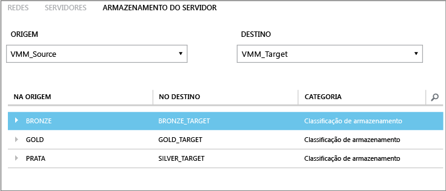
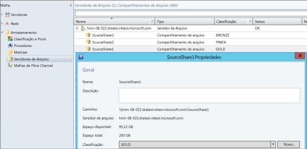

<properties
	pageTitle="Mapeamento de armazenamento de Recuperação de Site"
	description="O Azure Site Recovery coordena a replicação, o failover e a recuperação de máquinas virtuais e servidores físicos locais para o Azure ou para um site local secundário."
	services="site-recovery"
	documentationCenter=""
	authors="rayne-wiselman"
	manager="jwhit"
	editor=""/>

<tags
	ms.service="site-recovery"
	ms.devlang="na"
	ms.topic="get-started-article"
	ms.tgt_pltfrm="na"
	ms.workload="storage-backup-recovery"
	ms.date="05/08/2015"
	ms.author="raynew"/>

# Mapeamento de armazenamento de Recuperação de Site

O Azure Site Recovery contribui para sua estratégia de BCDR (continuidade de negócios e recuperação de desastre) gerenciando replicação, failover e recuperação de máquinas virtuais em vários cenários de implantação. Leia sobre possíveis cenários de implantação na [Visão geral sobre a Recuperação de Site](site-recovery-overview.md).

## Sobre este artigo

Mapeamento de armazenamento é um elemento importante da sua implantação de Recuperação de Site. Ele garante que você esteja usando o armazenamento da melhor maneira possível. Este artigo descreve o mapeamento de armazenamento e fornece alguns exemplos para ajudar você a entender como funciona o mapeamento de armazenamento.

Publique qualquer pergunta no [Fórum dos Serviços de Recuperação do Azure](https://social.msdn.microsoft.com/forums/azure/home?forum=hypervrecovmgr).

## Visão geral

A maneira com a qual você configura o mapeamento de armazenamento depende de seu cenário de implantação da Recuperação de Site.

- **De local para local (replicação com a Réplica do Hyper-V)** — mapeie as classificações de armazenamento em servidores VMM de origem e de destino para fazer o seguinte:

	- **Identificar o armazenamento de destino para máquinas virtuais de réplica** — as máquinas virtuais serão replicadas para um destino de armazenamento escolhido por você (compartilhamento SMB ou volumes compartilhados de cluster (CSVs)).
	- **Posicionamento das máquinas virtuais de réplica** — o Mapeamento de armazenamento é usado para posicionar de forma ideal as máquinas virtuais de réplica em servidores host Hyper-V. As máquinas virtuais de réplica serão colocadas em hosts que possam acessar as redes VM mapeadas.
	- **Nenhum mapeamento de armazenamento** — se você não configurar o mapeamento de armazenamento, as máquinas virtuais serão replicadas para o local de armazenamento padrão especificado no servidor host Hyper-V associado à máquina virtual de réplica.

- **De local para local (replicação com SAN)** — mapeia os pools de matriz de armazenamento em servidores VMM de origem e de destino para fazer o seguinte:
	- **Identificar pools de armazenamento de destino** — o mapeamento de armazenamento garante que os LUNs em um grupo de replicação sejam replicados no pool de armazenamento de destino mapeado.

## Classificações de armazenamento

Mapeie entre as classificações de armazenamento nos servidores VMM de origem e de destino ou em um único servidor VMM se dois locais forem gerenciados pelo mesmo servidor VMM. Quando o mapeamento estiver configurado corretamente e a replicação estiver habilitada, disco rígido virtual de uma máquina virtual no local primário será replicado no armazenamento no local de destino mapeado. Observe que:

- As classificações de armazenamento devem estar disponíveis para os grupos de host localizados nas nuvens de origem e de destino.
- - As classificações não precisam ter o mesmo tipo de armazenamento. Por exemplo, você pode mapear uma classificação de origem que contenha compartilhamentos SMB para uma classificação de destino que contenha CSVs.
- Leia mais em [Como criar classificações de armazenamento np VMM](https://technet.microsoft.com/library/gg610685.aspx).

## Exemplo

Se as classificações estiverem configuradas corretamente no VMM quando você selecionar os servidores VMM de origem e de destino durante o mapeamento de armazenamento, as classificações de origem e de destino serão exibidas. Veja um exemplo de compartilhamentos de arquivos de armazenamento e classificações para uma organização com duas localizações, Nova Iorque e Chicago.

**Localidade** | **Servidor VMM** | **Compartilhamento de arquivos (origem)** | **Classificação (origem)** | **Mapeado para** | **Compartilhamento de arquivos (destino)**
---|---|--- |---|---|---
Nova Iorque | VMM_Source| SourceShare1 | GOLD | GOLD_TARGET | TargetShare1
 | | SourceShare2 | SILVER | SILVER_TARGET | TargetShare2
 | | SourceShare3 | BRONZE | BRONZE_TARGET | TargetShare3
Chicago | VMM_Target | | GOLD_TARGET | Não mapeado |
| | | SILVER_TARGET | Não mapeado |
 | | | BRONZE_TARGET | Não mapeado

Você deve configurá-los na guia **Armazenamento do Servidor**, na página **Recursos**, do portal de Recuperação de Site.

Com este exemplo: - quando uma máquina virtual de réplica for criada para qualquer máquina virtual no armazenamento GOLD (SourceShare1), ela será replicada para um armazenamento GOLD_TARGET (TargetShare1). -Quando uma máquina virtual de réplica for criada para qualquer máquina virtual no armazenamento SILVER (SourceShare2), ela será replicada para um armazenamento SILVER_TARGET (TargetShare2) e assim por diante.

Os compartilhamentos de arquivo reais e suas classificações atribuídas no VMM seriam da seguinte maneira.

## Vários locais de armazenamento

Se a classificação de destino for atribuída a vários compartilhamentos SMB ou CSV, o local de armazenamento ideal será selecionado automaticamente quando a máquina virtual estiver protegida. Se nenhum armazenamento de destino adequado estiver disponível com a classificação especificada, o local de armazenamento padrão especificado no host Hyper-V será usado para posicionar os discos rígidos virtuais de réplica.

A tabela a seguir mostram como a classificação de armazenamento e os volumes compartilhados do cluster são configurados em nosso exemplo.

**Localidade** | **Classificação** | **Armazenamento associado**
---|---|---
Nova Iorque | GOLD | 
C:\ClusterStorage\SourceVolume1

\FileServer\SourceShare1

 | SILVER | 
C:\ClusterStorage\SourceVolume2

\FileServer\SourceShare2

Chicago | GOLD_TARGET | 
C:\ClusterStorage\TargetVolume1

\FileServer\TargetShare1

 | SILVER_TARGET| 
C:\ClusterStorage\TargetVolume2

\FileServer\TargetShare2

Esta tabela resume o comportamento ao ativar a proteção para máquinas virtuais (VM1 - VM5) neste ambiente de exemplo.

**Máquina virtual** | **Armazenamento de origem** | **Classificação de origem** | **Armazenamento de destino mapeado**
---|---|---|---
VM1 | C:\ClusterStorage\SourceVolume1 | GOLD | 
C:\ClusterStorage\SourceVolume1

\FileServer\SourceShare1

Ambos GOLD_TARGET

VM2 | \FileServer\SourceShare1 | GOLD | 
C:\ClusterStorage\SourceVolume1

\FileServer\SourceShare1
 
Ambos GOLD_TARGET

VM3 | C:\ClusterStorage\SourceVolume2 | SILVER | 
C:\ClusterStorage\SourceVolume2

\FileServer\SourceShare2

VM4 | \FileServer\SourceShare2 | SILVER |
C:\ClusterStorage\SourceVolume2

\FileServer\SourceShare2

Ambos SILVER_TARGET

VM5 | C:\ClusterStorage\SourceVolume3 | N/D | Nenhum mapeamento; sendo assim, o local de armazenamento padrão do host Hyper-V é usado

## Próximas etapas

Agora que você tem uma compreensão melhor sobre o mapeamento de armazenamento, comece a ler as [práticas recomendadas](site-recovery-best-practices.md) para se preparar para a implantação.
 

<!---HONumber=58_postMigration-->