# Replicar máquinas virtuais Hyper-V em nuvens VMM para o Azure
> [!div class="op_single_selector"]
> * [Portal do Azure](site-recovery-vmm-to-azure.md)
> * [PowerShell – Resource Manager](site-recovery-vmm-to-azure-powershell-resource-manager.md)
> * [Portal clássico](site-recovery-vmm-to-azure-classic.md)
> * [PowerShell - clássico](site-recovery-deploy-with-powershell.md)
> 
> 

O Azure Site Recovery contribui para sua estratégia de BCDR (continuidade de negócios e recuperação de desastre) administrando a replicação, o failover e a recuperação de máquinas virtuais e servidores físicos. As máquinas podem ser replicadas no Azure ou em um datacenter local secundário. Para uma breve visão geral, leia [O que é o Azure Site Recovery?](site-recovery-overview.md).

## Visão geral
Este artigo descreve como implantar a Recuperação de Site para replicar máquinas virtuais Hyper-V em servidores host Hyper-V que estão localizados em nuvens privadas VMM no Azure.

O artigo inclui os pré-requisitos para o cenário e mostra como configurar um cofre do Site Recovery, instalar o Provedor do Azure Site Recovery no servidor VMM de origem, registrar o servidor no cofre, adicionar uma conta de armazenamento do Azure, instalar o agente de Serviços de Recuperação do Azure nos servidores host Hyper-V, definir configurações de proteção para nuvens VMM que serão aplicadas a todas as máquinas virtuais protegidas e habilitar a proteção para essas máquinas virtuais. Conclua testando o failover para verificar se tudo está funcionando conforme o esperado.

Publique eventuais comentários ou perguntas no final deste artigo ou no [Fórum dos Serviços de Recuperação do Azure](https://social.msdn.microsoft.com/forums/azure/home?forum=hypervrecovmgr).

## Arquitetura
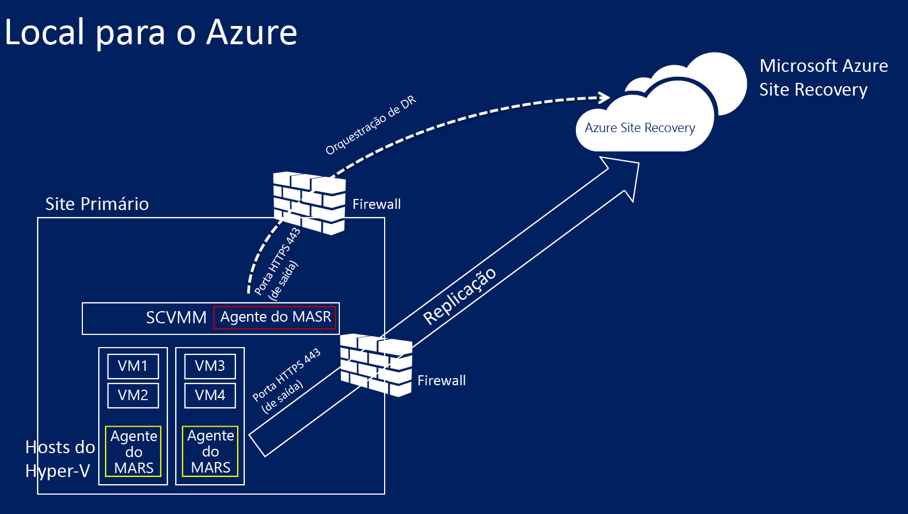

* O provedor do Azure Site Recovery é instalado no VMM durante a implantação da Recuperação de Site, e o servidor VMM é registrado no cofre de Recuperação de Site. O Provedor se comunica com a Recuperação de Site para lidar com a orquestração de replicação.
* O agente de Serviços de Recuperação do Azure é instalado em servidores host Hyper-V durante a implantação da Recuperação de Site. Ele lida com a replicação de dados para o armazenamento do Azure.

## Pré-requisitos do Azure
Veja o que será necessário no Azure.

| **Pré-requisito** | **Detalhes** |
| --- | --- |
| **Conta do Azure** |Você precisará de uma conta do [Microsoft Azure](https://azure.microsoft.com/) . Você pode começar com uma [avaliação gratuita](https://azure.microsoft.com/pricing/free-trial/). [Saiba mais](https://azure.microsoft.com/pricing/details/site-recovery/) sobre os preços da Recuperação de Site. |
| **Armazenamento do Azure** |Você precisará de uma conta de armazenamento do Azure para armazenar os dados replicados no Azure. Os dados replicados são armazenados no armazenamento do Azure e as VMs do Azure se adaptam quando ocorre failover.   Você precisa de uma [conta de armazenamento com redundância geográfica padrão](../storage/storage-redundancy.md#geo-redundant-storage). A conta deve estar localizada na mesma região do serviço do Site Recovery e associada à mesma assinatura. Observe que, atualmente, não há suporte para a replicação em contas de armazenamento premium, então ela não deve ser usada.  [Leia sobre o](../storage/storage-introduction.md) armazenamento do Azure. |
| **Rede do Azure** |Você precisará de uma rede virtual do Azure com a qual as máquinas virtuais do Azure se conectarão quando ocorrer failover. A rede virtual do Azure deve estar na mesma região que o cofre de Recuperação de Site. |

## Pré-requisitos do local
Veja o que será necessário no local.

| **Pré-requisito** | **Detalhes** |
| --- | --- |
| **VMM** |Você precisará de pelo menos um servidor do VMM implantado como servidor físico ou virtual autônomo ou como um cluster virtual.   O servidor VMM deve estar executando o System Center 2012 R2 com as atualizações cumulativas mais recentes.  Você precisará de pelo menos uma nuvem configurada no servidor VMM.  A nuvem de origem que você deseja proteger deve conter um ou mais grupos de host VMM.  Saiba mais sobre a configuração de nuvens do VMM em [Walkthrough: Creating private clouds with System Center 2012 SP1 VMM](http://blogs.technet.com/b/keithmayer/archive/2013/04/18/walkthrough-creating-private-clouds-with-system-center-2012-sp1-virtual-machine-manager-build-your-private-cloud-in-a-month.aspx) (Passo a passo: Criando nuvens privadas com o System Center 2012 SP1 VMM) no blog de Keith Mayer. |
| **Hyper-V** |Você precisará de um ou mais servidores host Hyper-V ou clusters na nuvem VMM. O servidor host deve ter uma ou mais VMs.   O servidor host do Hyper-V deve estar executando pelo menos o **Windows Server 2012 R2** com a função Hyper-V ou o **Microsoft Hyper-V Server 2012 R2** e ter as atualizações mais recentes instaladas.  Qualquer servidor Hyper-V que contenha as VMs que deseja proteger deve estar localizado em uma nuvem VMM.  Se você estiver executando o Hyper-V em um cluster, observe que o agente de cluster não será criado automaticamente se você tiver um cluster de baseados em endereços IP estáticos. Você precisará configurar o agente de cluster manualmente. [Saiba mais](https://www.petri.com/use-hyper-v-replica-broker-prepare-host-clusters) na entrada do blog de Aidan Finn. |
| **Computadores protegidos** |As VMs que você deseja proteger devem cumprir os [requisitos do Azure](site-recovery-best-practices.md#azure-virtual-machine-requirements). |

## Pré-requisitos de mapeamento de rede
Quando você proteger máquinas virtuais na rede do Azure mapeando mapas entre redes VM no servidor VMM de origem e nas redes do Azure destino para habilitar o seguinte:

* Todos os computadores que forem submetidos a failover na mesma rede poderão se conectar entre si, independentemente do plano de recuperação em que estão.
* Além disso, se um gateway de rede for configurado na rede Azure de destino, as máquinas virtuais poderão se conectar a outras máquinas virtuais locais.
* Se você não configurar o mapeamento de rede, somente máquinas virtuais com failover no mesmo plano de recuperação poderão se conectar entre si após o failover no Azure.

Se desejar implantar o mapeamento de rede, você precisará do seguinte:

* As máquinas virtuais que você deseja proteger no servidor VMM de origem devem estar conectadas a uma rede VM. Essa rede deve ser vinculada a uma rede lógica que esteja associada à nuvem.
* Uma rede do Azure à qual as máquinas virtuais replicadas possam se conectar após o failover. Você selecionará esta rede no momento do failover. A rede deve estar na mesma região de sua assinatura do Azure Site Recovery.

Prepare o mapeamento de rede da seguinte maneira:

1. [Leia sobre](site-recovery-network-mapping.md) os requisitos de mapeamento de rede.
2. Prepare redes de VM no VMM:
   
   * [Configure redes lógicas](https://technet.microsoft.com/library/jj721568.aspx).
   * [Configure as redes de VMM](https://technet.microsoft.com/library/jj721575.aspx).

## Etapa 1: criar um cofre de Recuperação de Site
1. Entre no [Portal de Gerenciamento](https://portal.azure.com) do servidor VMM que você deseja registrar.
2. Clique em **Serviços de Dados** > **Serviços de Recuperação** > **Cofre de Recuperação de Site**.
3. Clique em **Criar Novo** > **Criação Rápida**.
4. Em **Nome**, digite um nome amigável para identificar o cofre.
5. Em **Região**, selecione a região geográfica para o cofre. Para verificar as regiões com suporte, consulte a Disponibilidade Geográfica nos [Detalhes dos Preços do Azure Site Recovery](https://azure.microsoft.com/pricing/details/site-recovery/).
6. Clique em **Criar cofre**.
   
    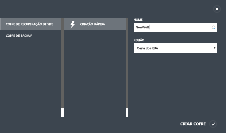

Verifique a barra de status para confirmar que o cofre foi criado com sucesso. O cofre será listado como **Ativo** na página de Serviços de Recuperação.

## Etapa 2: gerar uma chave de registro do cofre
Gere uma chave de registro no cofre. Após baixar o Provedor do Azure Site Recovery e instalá-lo no servidor VMM, você usará essa chave para registrar o servidor VMM no cofre.

1. Na página **Serviços de Recuperação** , clique no cofre para abrir na página de Início Rápido. O Início Rápido pode também ser aberto a qualquer tempo usando o ícone.
   
    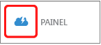
2. Na lista suspensa, selecione **Entre um site do VMM local e o Microsoft Azure**.
3. Em **Preparar Servidores VMM**, clique no arquivo **Gerar chave de registro**. O arquivo de chave é gerado automaticamente e é válido por cinco dias após ter sido gerado. Se não estiver acessando o portal do Azure por meio do servidor VMM, você precisará copiar esse arquivo para o servidor.
   
    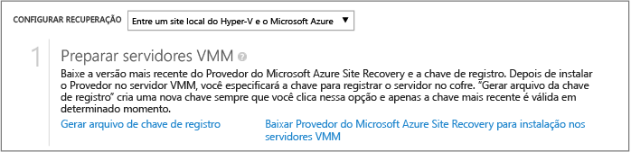

## Etapa 3: instalar o Provedor do Azure Site Recovery
1. No **Início Rápido** > **Preparar servidores VMM**, clique em **Baixar o Provedor do Microsoft Azure Site Recovery para instalação nos servidores VMM** para obter a versão mais recente do arquivo de instalação do Provedor.
2. Execute esse arquivo no servidor VMM de origem.
   
   > [!NOTE]
   > Se o VMM for implantado em um cluster e você estiver instalando o Provedor pela primeira vez, instale-o em um nó ativo e conclua a instalação para registrar o servidor VMM no cofre. Em seguida, instale o Provedor nos outros nós. Observe que, se estiver atualizando o Provedor você precisará fazer a atualização em todos os nós porque todos eles devem estar executando a mesma versão do Provedor.
   > 
   > 
3. O Instalador faz uma verificação de pré-requisitos e solicita permissão para interromper o serviço VMM para iniciar a instalação do Provedor. O Serviço VMM será reiniciado automaticamente quando a instalação for finalizada. Se estiver instalando em um cluster do VMM, você deverá parar a função de Cluster.
4. No **Microsoft Update** você pode optar por atualizações. Com esta configuração de Provedor habilitada, a atualização será instalada de acordo com a política do Microsoft Update.
   
    
5. O local de instalação para o Provedor é definido como **<SystemDrive>\Arquivos de Programas\Microsoft System Center 2012 R2\Virtual Machine Manager\bin**. Clique em **Instalar**.
   
   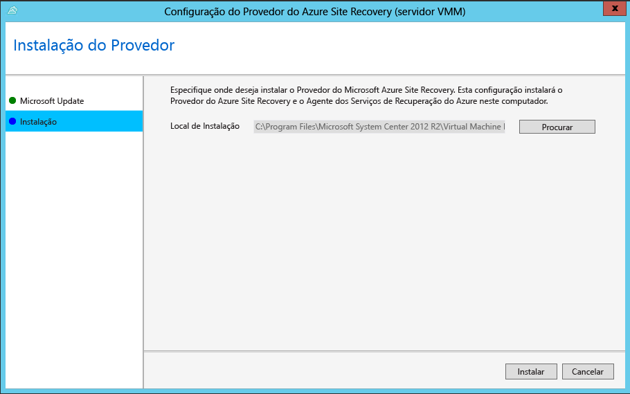
6. Após a instalação do Provedor, clique em **Registrar** para registrar o servidor no cofre.
   
    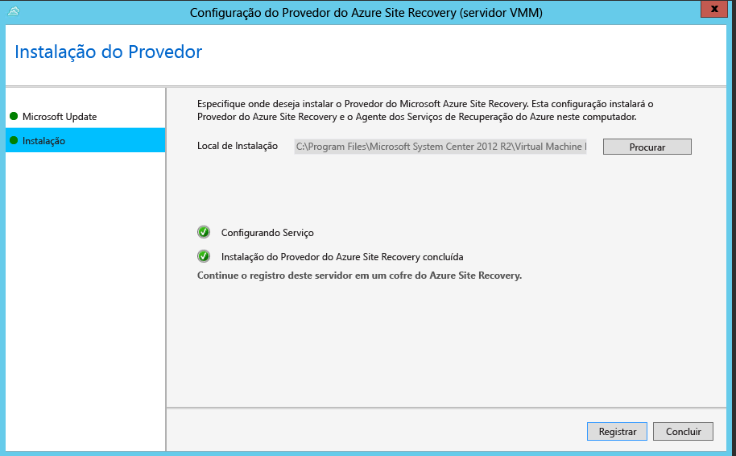
7. Em **Nome do cofre**, verifique o nome do cofre para o qual o servidor será registrado. Clique em *Próximo*.
   
    
8. Em **Conexão de Internet** , especifique como o Provedor em execução no servidor VMM se conecta à Internet. Selecione **Conectar-se com as configurações de proxy existentes** para usar as configurações de conexão com a Internet padrão definidas no servidor.
   
    
   
   * Se quiser usar um proxy personalizado, você deverá configurá-lo antes de instalar o provedor. Quando você definir as configurações personalizadas de proxy, será executado um teste para verificar a conexão proxy.
   * Se usar um proxy personalizado ou se seu proxy padrão exigir autenticação, você precisará inserir os detalhes do proxy, incluindo a porta e o endereço do proxy.
   * As URLs a seguir devem estar acessíveis no servidor do VMM e nos hosts Hyper-V
     * *.hypervrecoverymanager.windowsazure.com
     * *.accesscontrol.windows.net
     * *.backup.windowsazure.com
     * *.blob.core.windows.net
     * *.store.core.windows.net
   * Permita os endereços IP descritos em [Intervalos de IP do armazenamento de dados do Azure](https://www.microsoft.com/download/confirmation.aspx?id=41653) e o protocolo HTTPS (443). Você teria que fazer uma lista de intervalos IP válidos da região do Azure que você planeja usar e do oeste dos EUA.
   * Se você usar um proxy personalizado, uma conta RunAs VMM (DRAProxyAccount) será criada automaticamente usando as credenciais de proxy especificadas. Configure o servidor proxy para que essa conta possa ser autenticada com êxito. As configurações da conta RunAs VMM podem ser modificadas no console do VMM. Para fazer isso, abra o espaço de trabalho **Configurações**, expanda **Segurança**, clique em **Contas Executar como** e modifique a senha de DRAProxyAccount. Você precisará reiniciar o serviço VMM para que essa configuração entre em vigor.
9. Em **Chave de Registro**, selecione a chave que você baixou no Azure Site Recovery e copiou para o servidor VMM.
10. A configuração de criptografia é usada somente quando você estiver replicando VMs do Hyper-V em nuvens do VMM no Azure. Se estiver replicando para um site secundário, ela não é usada.
11. Em **Nome do servidor**, especifique um nome amigável para identificar o servidor VMM no cofre. Em uma configuração de cluster, especifique o nome de função de cluster do VMM.
12. Em **Sincronizar metadados de nuvem** , selecione se você deseja sincronizar os metadados para todas as nuvens no servidor do VMM com o cofre. Esta ação só precisa acontecer uma vez em cada servidor. Se você não quiser sincronizar todas as nuvens, você pode deixar essa configuração desmarcada e sincronizar cada nuvem individualmente nas propriedades da nuvem no console VMM.
13. Clique em **Avançar** para concluir o processo. Após o registro, os metadados do servidor VMM é recuperado pela Recuperação de Site do Azure. O servidor é exibido na guia **Servidores VMM** da página **Servidores** no cofre.
    
    

Após o registro, os metadados do servidor VMM é recuperado pela Recuperação de Site do Azure. O servidor é exibido na guia **Servidores VMM** da página **Servidores** no cofre.

### Instalação de linha de comando
O Provedor do Azure Site Recovery também pode ser instalado usando a linha de comando a seguir. Esse método pode ser usado para instalar o provedor em um Núcleo de Servidor para o Windows Server 2012 R2.

1. Baixar o arquivo de instalação do provedor e a chave de registro em uma pasta. Por exemplo: C:\ASR.
2. Parar o serviço System Center Virtual Machine Manager
3. Em um prompt de comando com privilégios elevados, extraia o instalador do Provedor com estes comandos:
   
        C:\Windows\System32> CD C:\ASR
        C:\ASR> AzureSiteRecoveryProvider.exe /x:. /q
4. Instale o provedor da seguinte maneira:
   
        C:\ASR> setupdr.exe /i
5. Registre o Provedor da seguinte maneira:
   
        CD C:\Program Files\Microsoft System Center 2012 R2\Virtual Machine Manager\bin
        C:\Program Files\Microsoft System Center 2012 R2\Virtual Machine Manager\bin\> DRConfigurator.exe /r  /Friendlyname <friendly name of the server> /Credentials <path of the credentials file> /EncryptionEnabled <full file name to save the encryption certificate>       

Em que parâmetros são os seguintes:

* **/Credentials** : parâmetro obrigatório que especifica o local no qual o arquivo da chave de registro está localizado  
* **/FriendlyName** : parâmetro obrigatório para o nome do servidor do host Hyper-V que aparece no portal do Azure Site Recovery.
* **/EncryptionEnabled** : parâmetro opcional para especificar se você deseja criptografar suas máquinas virtuais no Azure (criptografia em repouso). O nome de arquivo deve ter uma extensão **.pfx** .
* **/proxyAddress** : parâmetro opcional que especifica o endereço do servidor proxy.
* **/proxyport** : parâmetro opcional que especifica a porta do servidor proxy.
* **/proxyUsername** : parâmetro opcional que especifica o nome de usuário proxy.
* **/proxyPassword** : parâmetro opcional que especifica a senha proxy.  

## Etapa 4: criar uma conta de armazenamento do Azure
1. Se você não tiver uma conta de armazenamento do Azure, clique em **Adicionar uma Conta de Armazenamento do Azure** para criar uma conta.
2. Crie uma conta com a replicação geográfica habilitada. Ela deve estar na mesma região do serviço do Azure Site Recovery e associada à mesma assinatura.
   
    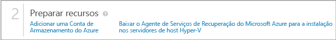

> [!NOTE]
> [Migração de contas de armazenamento](../resource-group-move-resources.md) nos grupos de recursos dentro da mesma assinatura ou nas assinaturas não tem suporte para as contas de armazenamento usadas para a implantação do Site Recovery.
> 
> 

## Etapa 5: instalar o Agente de Serviços de Recuperação do Azure
Instale o agente de Serviços de Recuperação do Azure em cada servidor host Hyper-V na nuvem VMM.

1. Clique em **Início Rápido** > **Baixar Agente dos Serviços do Azure Site Recovery e instalar nos hosts** para obter a versão mais recente do arquivo de instalação do agente.
   
    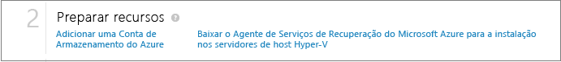
2. Execute o arquivo de instalação em cada servidor host Hyper-V.
3. Na página **Verificação de pré-requisitos**, clique em **Avançar**. Quaisquer pré-requisitos faltantes serão instalados automaticamente.
   
    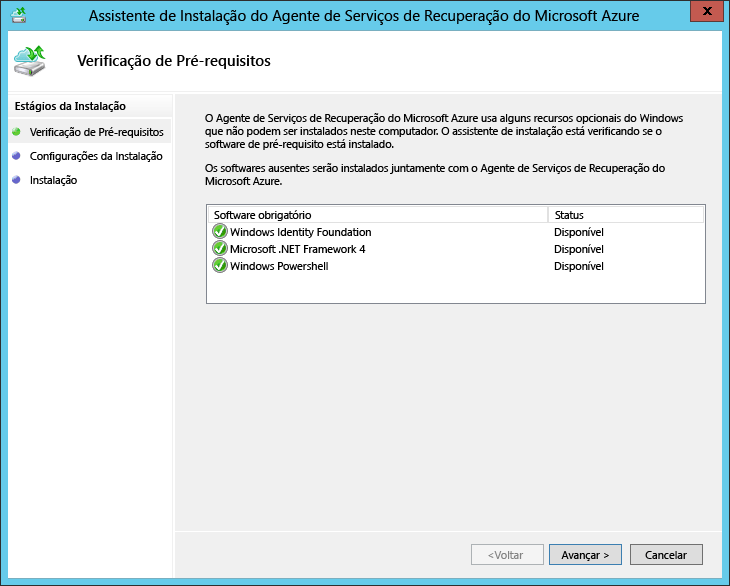
4. Na página **Configurações de Instalação** , especifique onde você deseja instalar o agente e selecione a localização do cache na qual os metadados de backup serão instalados. Em seguida, clique em **Instalar**.
5. Após a instalação terminar, clique em **Fechar** para concluir o assistente.
   
    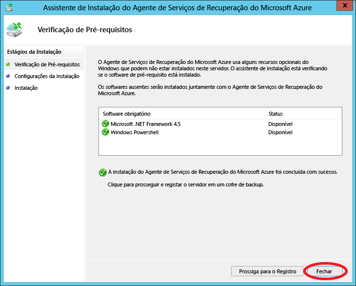

### Instalação de linha de comando
Você também pode instalar o agente de Serviços de Recuperação do Microsoft Azure por meio da linha de comando usando este comando:

    marsagentinstaller.exe /q /nu

## Etapa 6: definir as configurações da proteção de nuvem
Após o registro do servidor VMM, você poderá definir as configurações de proteção de nuvem. Você habilitou a opção **Sincronizar dados de nuvem com o cofre** ao instalar o Provedor, então todas as nuvens no servidor VMM aparecerão na guia <b>Itens Protegidos</b> no cofre.

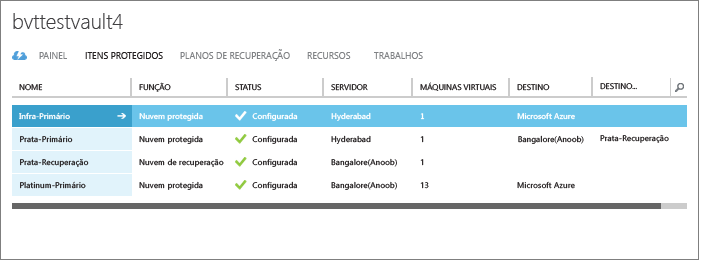

1. Na página de Início Rápido, clique em **Configurar a proteção para nuvens VMM**.
2. Na guia **Itens Protegidos**, clique na nuvem que você deseja configurar e vá até a guia **Configuração**.
3. Em **Destino** select **Azure**.
4. Em **Conta de Armazenamento** , selecione a conta de armazenamento do Azure usada para a replicação.
5. Defina **Criptografar dados armazenados** como **Desligado**. Essa configuração especifica que os dados podem ser criptografados e replicados entre o site local e o Azure.
6. Em **Copiar frequência** , mantenha a configuração padrão. Esse valor especifica a frequência com que dados devem ser sincronizados entre os locais de origem e de destino.
7. Em **Manter pontos de recuperação para**, mantenha a configuração padrão. Com um valor padrão de zero, apenas o ponto de recuperação mais recente para uma máquina virtual primária é armazenado em um servidor de host de réplica.
8. Em **Frequência dos Instantâneos Consistentes de Aplicativo**, mantenha a configuração padrão. Esse valor especifica a frequência de criação de snapshots. Os snapshots usam o Volume Shadow Copy Service (VSS) para garantir que os aplicativos estejam em um estado consistente quando o instantâneo é obtido.  Se você definir um valor, certifique-se de que ele seja menor que o número dos pontos de recuperação adicionais que você configurar.
9. Em **Hora de início para replicação**, especifique quando a replicação inicial dos dados para o Azure deve começar. O fuso horário do servidor de host Hyper-V será usado. Recomendamos que você agende a replicação inicial fora dos horários de pico.
   
    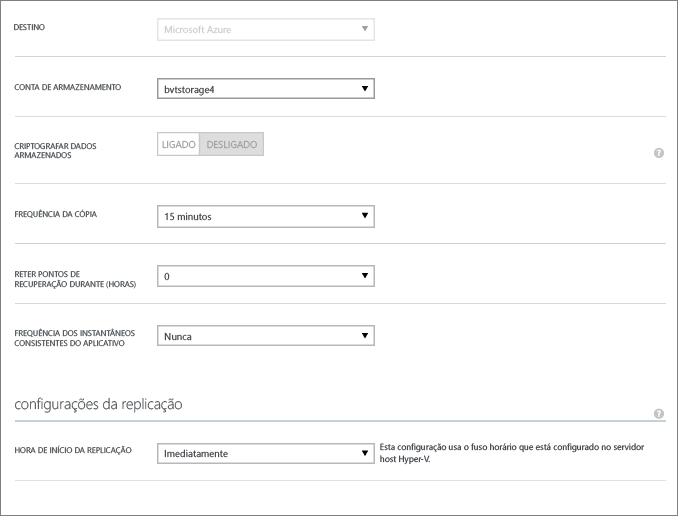

Depois de salvar as configurações, um trabalho será criado e poderá ser monitorado pela guia **Trabalhos** . Todos os servidores de host Hyper-V na nuvem VMM de origem serão configurados para replicação.

Após o salvamento, as configurações de nuvem podem ser modificadas a partir da guia **Configurar** . Para modificar o local de destino ou a conta de armazenamento de destino, será necessário remover a configuração de nuvem e reconfigurar a nuvem. Observe que, se você mudar a conta de armazenamento, a mudança só será aplicada para máquinas virtuais habilitadas para proteção, após a conta de armazenamento ter sido modificada. Máquinas virtuais existentes não são migradas para a nova conta de armazenamento.

## Etapa 7: configurar o mapeamento de rede
Antes de começar o mapeamento de rede, verifique se as máquinas virtuais no servidor VMM de origem estão conectadas a uma rede VM. Além disso, crie uma ou mais redes virtuais do Azure. Observe que várias redes VM podem ser mapeadas para uma única rede do Azure.

1. Na página Início Rápido, clique em **Mapear redes**.
2. Na guia **Redes**, em **Local de origem**, selecione o servidor VMM de origem. Em **Local de destino** , selecione Azure.
3. Em redes de **Origem** , é exibida uma lista de redes VM associadas ao servidor VMM. Em redes de **Destino** , são exibidas as redes do Azure associadas à assinatura.
4. Selecione a rede VM de origem e clique em **Mapear**.
5. Na página **Selecionar uma Rede de Destino** , selecione a rede de destino do Azure que deseja usar.
6. Clique na marca de seleção para concluir o processo de mapeamento.
   
    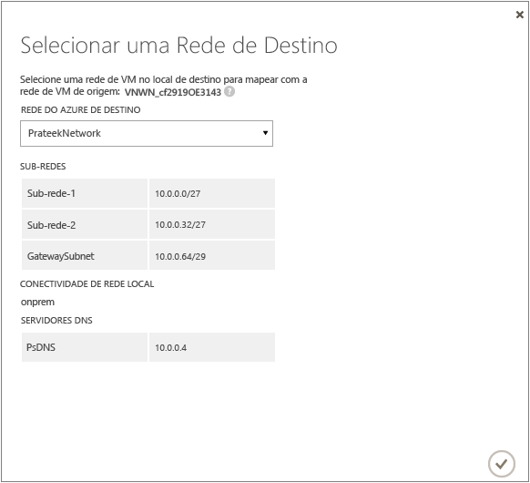

Depois que você salvar as configurações, um trabalho começará a acompanhar o progresso do mapeamento e poderá ser monitorado na guia Trabalhos. As máquinas virtuais de réplica existentes que corresponderem à rede VM de origem serão conectadas às redes do Azure de destino. As máquinas virtuais que estiverem conectadas à rede VM de origem serão conectadas à rede do Azure mapeada após a replicação. Se você modificar um mapeamento existente com uma nova rede, as máquinas virtuais de réplica serão conectadas usando as novas configurações.

Observe que, se a rede de destino tiver várias sub-redes, e uma dessas sub-redes tiver o mesmo nome que a sub-rede em que a máquina virtual de origem está localizada, a máquina virtual de réplica será conectada à sub-rede de destino após o failover. Se não houver uma sub-rede de destino com um nome correspondente, a máquina virtual será conectada à primeira sub-rede na rede.

> [!NOTE]
> [Migração de redes](../resource-group-move-resources.md) nos grupos de recursos dentro da mesma assinatura ou nas assinaturas não tem suporte para as redes usadas para a implantação do Site Recovery.
> 
> 

## Etapa 8: habilitar a proteção para máquinas virtuais
Depois de redes, servidores e nuvens estarem configurados corretamente, você pode ativar a proteção para máquinas virtuais na nuvem. Observe o seguinte:

* As máquinas virtuais devem atender os [requisitos do Azure](site-recovery-best-practices.md#azure-virtual-machine-requirements).
* Para habilitar a proteção, o sistema operacional e as propriedades do disco do sistema operacional devem estar definidos para as máquinas virtuais. Ao criar uma máquina virtual no VMM usando um modelo de máquina virtual, é possível definir a propriedade. Você também pode definir essas propriedades para máquinas virtuais existentes nas guias **Geral** e **Configuração de Hardware** das propriedades da máquina virtual. Se você não definir essas propriedades no VMM, poderá configurá-las no portal de Recuperação de Site do Azure.
  
    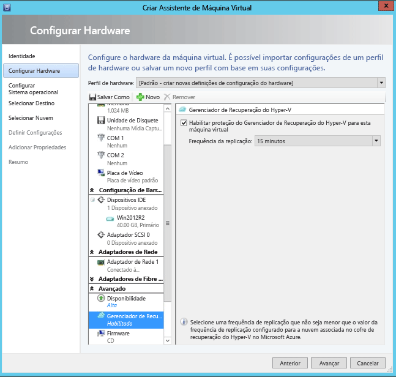
  
    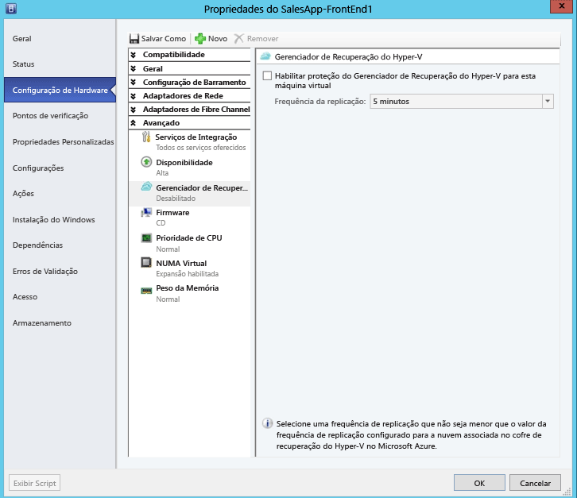

1. Para habilitar a proteção, na guia **Máquinas Virtuais**, na nuvem na qual a máquina virtual está localizada, clique em **Habilitar proteção** > **Adicionar máquinas virtuais**.
2. Na lista de máquinas virtuais na nuvem, selecione uma que você quer proteger.
   
    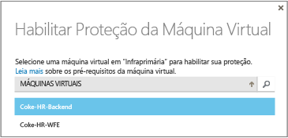
   
    Acompanhe o progresso da ação **Habilitar Proteção** na guia **Trabalhos**, incluindo a replicação inicial. Após o trabalho de **Finalizar Proteção** ser executado, a máquina virtual está pronta para failover. Após a proteção estar habilitada e as máquinas virtuais serem replicadas, você será capaz de visualizá-los no Azure.

    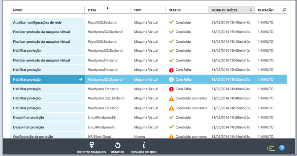

1. Verifique as propriedades da máquina virtual e modifique-as conforme o necessário.
   
    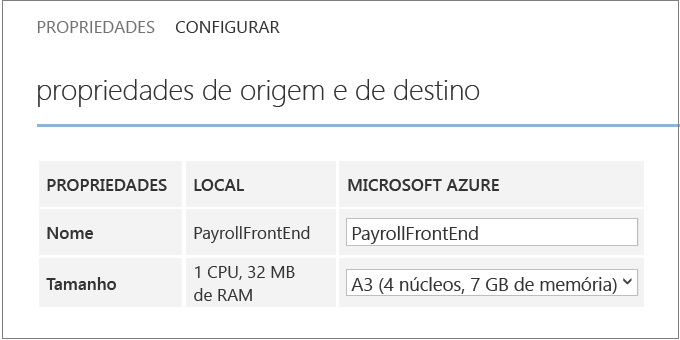
2. Na guia **Configurar** das propriedades da máquina virtual, as seguintes propriedades de rede podem ser modificadas.

* **Número de adaptadores de rede na máquina virtual de destino** - o número de adaptadores de rede é determinado pelo tamanho especificado para a máquina virtual de destino. Verifique as [especificações de tamanho da máquina virtual](../virtual-machines/virtual-machines-linux-sizes.md#size-tables) para saber o número de adaptadores suportado pelo tamanho da máquina virtual. Quando você altera a dimensão de uma máquina virtual e salva as configurações, o número do adaptador de rede é alterado na próxima vez em que você abrir a página **Configurar** . O número de adaptadores de rede de máquinas virtuais de destino é o número mínimo de adaptadores de rede na máquina virtual de origem e o número máximo de adaptadores de rede compatíveis com o tamanho da máquina virtual selecionada, conforme indicado a seguir:
  
  * Se o número de adaptadores de rede na máquina de origem for menor ou igual ao número de adaptadores permitido para o tamanho da máquina de destino, o destino terá o mesmo número de adaptadores que a origem.
  * Se o número de adaptadores para máquina virtual de origem exceder o número permitido para o tamanho de destino e o tamanho máximo de destino será usado.
  * Por exemplo, se uma máquina de origem tiver dois adaptadores de rede e o tamanho da máquina de destino der suporte a quatro, a máquina de destino terá dois adaptadores. Se a máquina de origem tiver dois adaptadores, mas o tamanho de destino com suporte oferecer suporte apenas a uma máquina de destino, ela terá apenas um adaptador.     
* **Rede da máquina virtual de destino** - a rede que a máquina virtual conecta é determinada pelo mapeamento da rede da máquina virtual de origem. Se a máquina virtual de origem tiver mais de um adaptador de rede e as redes de origem estarem mapeadas para diferentes redes no destino, você precisará escolher entre uma das redes de destino.
* **Sub-rede de cada adaptador de rede** - para cada adaptador de rede, você pode selecionar a sub-rede que a máquina virtual com failover deve conectar.
* **Endereço IP de destino** - se o adaptador de rede da máquina virtual de origem estiver configurado para usar um endereço IP estático, você poderá fornecer o endereço IP da máquina virtual de destino. Use esse recurso para reter o endereço IP de uma máquina virtual de origem após um failover. Se nenhum endereço IP for fornecido, qualquer endereço IP disponível será fornecido ao adaptador de rede no momento do failover. Se o endereço IP de destino for especificado, mas já estiver sendo usado por outra máquina virtual em execução no Azure, o failover falhará.  
  
    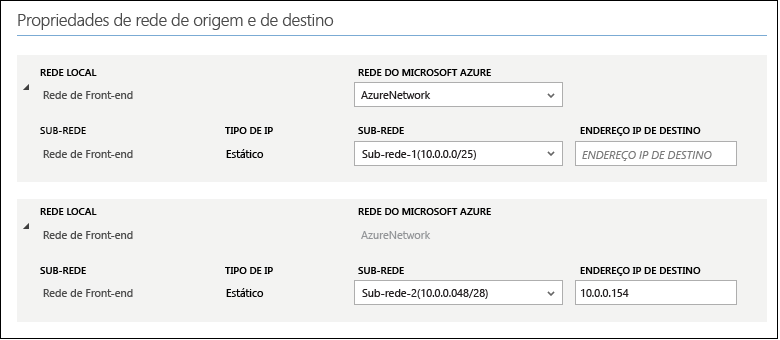

> [!NOTE]
> Não há suporte para máquinas virtuais Linux com um endereço IP estático.
> 
> 

## Teste a implantação
Para testar sua implantação, você pode executar um failover de teste para uma única máquina virtual, ou criar um plano de recuperação consistente de várias máquinas virtuais e executar um failover de teste para o plano.  

O failover de teste simula o mecanismo de failover e recuperação em uma rede isolada. Observe que:

* Se você quiser se conectar à máquina virtual no Azure usando a Área de trabalho remota após o failover, habilite a Conexão de Área de Trabalho Remota na máquina virtual antes de executar o teste de failover.
* Após o failover, você usará um endereço IP público para conectar-se à máquina virtual no Azure usando a Área de trabalho remota. Se você quiser fazer isso, verifique se não tem nenhuma política de domínio que o impeça de se conectar a uma máquina virtual usando um endereço público.

> [!NOTE]
> Para obter o melhor desempenho ao fazer um failover para o Azure, não deixe de instalar o agente do Azure no computador protegido. Isso ajuda na inicialização mais rápida e também no diagnóstico em caso de problemas. O agente do Linux pode ser encontrado [aqui](https://github.com/Azure/WALinuxAgent) e o agente do Windows pode ser encontrado [aqui](http://go.microsoft.com/fwlink/?LinkID=394789)
> 
> 

### Criar um plano de recuperação
1. Na guia **Planos de Recuperação** , adicione um novo plano. Especifique um nome, o **VMM** em **Tipo de origem** e o servidor VMM de origem em **Origem**; o destino será o Azure.
   
    
2. Na página **Selecionar Máquinas Virtuais** , selecione as máquinas virtuais para adicionar ao plano de recuperação. Essas máquinas virtuais são adicionadas ao grupo padrão do plano de recuperação, o Grupo 1. Foi testado um máximo de 100 máquinas virtuais em um único plano de recuperação.

* Se você desejar verificar as propriedades das máquinas virtuais antes de adicioná-las ao plano, clique na máquina virtual na página Propriedades da nuvem na qual ela está localizada. Você também pode configurar as propriedades da máquina virtual no console do VMM.
* Todas as máquinas virtuais que são exibidas foram habilitadas para a proteção. A lista inclui as máquinas virtuais que estão habilitadas para proteção com a replicação inicial concluída e as que estão habilitadas para proteção com a replicação inicial pendente. Somente as máquinas virtuais com replicação inicial concluída podem realizar failover como parte de um plano de recuperação.
  
    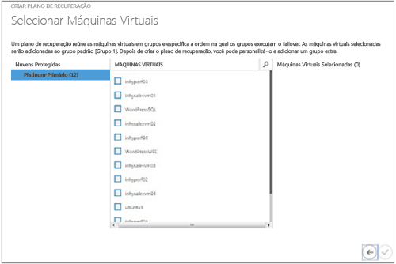

Após a criação de um plano de recuperação, ele será exibido na guia **Planos de Recuperação** . Você também pode adicionar [runbooks de automação do Azure](site-recovery-runbook-automation.md) ao plano de recuperação para automatizar as ações durante o failover.

### Execute um teste de failover
Há duas maneiras de executar um failover de teste no Azure.

* **Failover de teste sem uma rede do Azure**– esse tipo de failover de teste verifica se a máquina virtual é mostrada corretamente no Azure. A máquina virtual não será conectada a nenhuma rede do Azure após o failover.
* **Failover de teste com uma rede do Azure**— esse tipo de failover verifica se o ambiente de replicação inteiro é mostrado conforme o esperado e se as máquinas virtuais com failover serão conectadas à rede do Azure de destino especificada. Para a manipulação de sub-rede, para failover de teste, a sub-rede da máquina virtual de teste será determinada com base na sub-rede da máquina virtual de réplica. Isso é diferente da replicação normal quando a sub-rede de uma máquina virtual de réplica baseia-se na sub-rede da máquina virtual de origem.

Se você quiser executar um failover de teste para uma máquina virtual habilitada para proteção no Azure sem especificar uma rede de destino do Azure, não será necessário preparar nada. Para executar um failover de teste com uma rede do Azure de destino, você precisará criar uma nova rede do Azure isolada da rede de produção do Azure (o comportamento padrão quando você cria uma nova rede no Azure). Veja como [executar um failover de teste](site-recovery-failover.md#run-a-test-failover) para obter mais detalhes.

Você também precisará configurar a infraestrutura para que a máquina virtual replicada funcione como esperado. Por exemplo, uma máquina virtual com o Controlador de Domínio e DNS pode ser replicada para o Azure usando o Azure Site Recovery, e pode ser criada na rede de teste usando o Failover de teste. Examine as [considerações sobre o failover de teste para o Active Directory](site-recovery-active-directory.md#considerations-for-test-failover) para obter mais detalhes.

Para executar um failover de teste, faça o seguinte:

1. Na guia **Planos de Recuperação**, selecione o plano e clique em **Failover de Teste**.
2. Na página **Confirmar Failover de Teste**, selecione **Nenhum** ou uma rede específica do Azure.  Observe que, se você selecionar Nenhum, o failover de teste verificará se a máquina virtual foi replicada corretamente para o Azure, mas não verificará sua configuração de rede de replicação.
   
    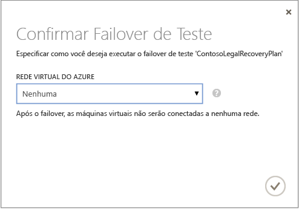
3. Se a criptografia de dados estiver habilitada para a nuvem, em **Chave de Criptografia** , selecione o certificado emitido durante a instalação do Provedor no servidor VMM quando você ativou a opção para habilitar a criptografia de dados para uma nuvem.
4. Na guia **Trabalhos** , você pode acompanhar o progresso do failover. Você também deverá ver a réplica de teste de máquina virtual no portal do Azure. Se tiver configurado para máquinas virtuais de acesso a rede local, você pode iniciar uma conexão de área de trabalho remota para a máquina virtual.
5. Quando o failover atinge a fase **Concluir teste**, clique em **Concluir Teste** para concluir o failover de teste. Você pode fazer uma busca detalhada na guia **Trabalho** para acompanhar o progresso e o status do failover, e para realizar as ações necessárias.
6. Após o failover, você poderá ver a réplica de teste da máquina virtual no portal do Azure. Se tiver configurado para máquinas virtuais de acesso a rede local, você pode iniciar uma conexão de área de trabalho remota para a máquina virtual. Faça o seguinte:
   
   1. Verificar se as máquinas virtuais foram iniciadas com êxito.
   2. Se você quiser se conectar à máquina virtual no Azure usando a Área de trabalho remota após o failover, habilite a Conexão de Área de Trabalho Remota na máquina virtual antes de executar o teste de failover. Você também precisará adicionar um ponto de extremidade RDP na máquina virtual. Você pode aproveitar um [Runbooks de Automação do Azure](site-recovery-runbook-automation.md) para fazer isso.
   3. Após o failover, se você usar um endereço IP público para se conectar à máquina virtual no Azure usando a Área de Trabalho Remota, verifique se você não tem qualquer política de domínio que impeça a conexão com uma máquina virtual usando um endereço público.
7. Após a conclusão do teste, faça o seguinte:
   
   * Clique em **Failover de teste concluído**. Limpe o ambiente de teste para desligar automaticamente e excluir as máquinas virtuais de teste.
   * Clique em **Observações** para gravar e salvar observações associadas ao failover de teste.

>

## Próximas etapas
Saiba mais sobre [como configurar os planos de recuperação](site-recovery-create-recovery-plans.md) e o [failover](site-recovery-failover.md).

<!--HONumber=Nov16_HO2-->

