# Replicar máquinas virtuais Hyper-V em nuvens VMM no Azure usando o Site Recovery no Portal do Azure
> [!div class="op_single_selector"]
> * [Portal do Azure](site-recovery-vmm-to-azure.md)
> * [Azure clássico](site-recovery-vmm-to-azure-classic.md)
> * [Implantação do Resource Manager do PowerShell](site-recovery-vmm-to-azure-powershell-resource-manager.md)
> * [Implantação clássica do PowerShell](site-recovery-deploy-with-powershell.md)

Este artigo descreve como replicar máquinas virtuais Hyper-V locais gerenciadas em nuvens do System Center VMM para o Azure, usando o serviço [Azure Site Recovery](site-recovery-overview.md) no Portal do Azure.

Depois de ler este artigo, poste comentários na parte inferior ou no [Fórum dos Serviços de Recuperação do Azure](https://social.msdn.microsoft.com/forums/azure/home?forum=hypervrecovmgr).

Se você quiser migrar computadores para o Azure (sem failback), saiba mais [neste artigo](site-recovery-migrate-to-azure.md).

## Etapas de implantação.

Siga o artigo para concluir estas etapas de implantação:

1. [Saiba mais](site-recovery-components.md) sobre a arquitetura dessa implantação. Além disso, [saiba mais sobre](site-recovery-hyper-v-azure-architecture.md) como funciona a replicação do Hyper-V no Site Recovery.
2. Verifique os pré-requisitos e as limitações.
3. Configure contas de rede e armazenamento do Azure.
4. Prepare o servidor VMM local e os hosts Hyper-V.
5. Crie um cofre dos Serviços de Recuperação. O cofre contém definições de configuração e orquestra a replicação.
6. Especifique as configurações de origem. Registre o servidor VMM no cofre. Instale o Provedor do Azure Site Recovery no servidor VMM Instale o agente dos Serviços de Recuperação da Microsoft nos hosts Hyper-V.
7. Defina as configurações de destino e de replicação.
8. Habilite a replicação para as VMs.
9. Execute um failover de teste para verificar se tudo está funcionando como esperado.

## Pré-requisitos

**Requisito de suporte** | **Detalhes**
--- | ---
**As tabelas** | Saiba mais sobre os [requisitos do Azure](site-recovery-prereq.md#azure-requirements).
**Servidores locais** | [Saiba mais](site-recovery-prereq.md#disaster-recovery-of-hyper-v-vms-in-vmm-clouds-to-azure) sobre os requisitos do servidor VMM local e dos hosts Hyper-V.
**VMs do Hyper-V locais** | As VMs que você deseja replicar devem estar executando um [sistema operacional com suporte](site-recovery-support-matrix-to-azure.md#support-for-replicated-machine-os-versions) e estar de acordo com os [pré-requisitos do Azure](site-recovery-support-matrix-to-azure.md#failed-over-azure-vm-requirements).
**URLs do Azure** | O servidor VMM precisa de acesso a estas URLs:   [!INCLUDE [site-recovery-URLS](../../includes/site-recovery-URLS.md)]   Se tiver regras de firewall baseadas no endereço IP, verifique se elas permitem a comunicação com o Azure.   Permita os [Intervalos de IP do Datacenter do Azure](https://www.microsoft.com/download/confirmation.aspx?id=41653) e a porta HTTPS (443).   Permita os intervalos de endereços IP para a região do Azure da sua assinatura e para o Oeste dos EUA (usados para Controle de Acesso e Gerenciamento de Identidade).

## Preparar para a implantação
Para preparar a implantação, você precisa de:

1. [Configurar uma rede do Azure](#set-up-an-azure-network) na qual as VMs do Azure estarão localizadas após o failover.
2. [Configure uma conta de armazenamento do Azure](#set-up-an-azure-storage-account) para os dados replicados.
3. [Preparar o servidor VMM](#prepare-the-vmm-server) para a implantação da Recuperação de Site.
4. Prepare-se para o mapeamento de rede. Configure as redes de modo que você possa configurar o mapeamento de rede durante a implantação da Recuperação de Site.

### Configurar uma rede do Azure
Você precisa de uma rede do Azure à qual as VMs do Azure criadas após o failover serão conectadas.

* A rede deve estar na mesma região que o cofre dos Serviços de Recuperação.
* Dependendo do modelo de recurso que deseja usar para as VMs do Azure com failover, você configura uma rede do Azure no [modo Resource Manager](../virtual-network/virtual-networks-create-vnet-arm-pportal.md) ou no [modo clássico](../virtual-network/virtual-networks-create-vnet-classic-pportal.md).
* É recomendável configurar uma rede antes de começar. Caso você não faça isso, será necessário fazê-lo durante a implantação da Recuperação de Site.
As redes do Azure usadas pelo Site Recovery não podem ser [movidas](../azure-resource-manager/resource-group-move-resources.md) dentro de uma mesma assinatura ou entre assinaturas diferentes.

### Configure uma conta de armazenamento do Azure
* Você precisa de uma conta de armazenamento do Azure standard/premium para conter dados replicados para o Azure. O [Armazenamento premium](../storage/storage-premium-storage.md) é usado para máquinas virtuais que precisam de um desempenho de E/S consistentemente alto e baixa latência para hospedar cargas de trabalho com uso intensivo de E/S. Se você desejar usar uma conta premium para armazenar dados replicados, também precisará de uma conta de armazenamento standard para armazenar os logs de replicação que capturam as alterações contínuas nos dados locais. A rede deve estar na mesma região do que o cofre dos Serviços de Recuperação.
* Dependendo do modelo de recurso que você deseja usar para as VMs do Azure com failover, você configurará uma conta no [modo Resource Manager](../storage/storage-create-storage-account.md) ou no [modo clássico](../storage/storage-create-storage-account-classic-portal.md).
* É recomendável que você configure uma conta antes de começar. Caso você não faça isso, será necessário fazê-lo durante a implantação da Recuperação de Site.
- Observe que as contas de armazenamento usadas pelo Site Recovery não podem ser [movidas](../azure-resource-manager/resource-group-move-resources.md) dentro de uma mesma assinatura ou entre assinaturas diferentes.

### Preparar o servidor VMM
* Certifique-se de que o servidor do VMM seja compatível com o [pré-requisitos](#prerequisites).
* Durante a implantação da Recuperação de Site, você pode especificar que todas as nuvens em um servidor do VMM deverão estar disponíveis no portal do Azure. Se você só quiser que nuvens específicas apareçam no portal, poderá habilitar essa configuração na nuvem no console de administrador do VMM.

### Prepare-se para o mapeamento de rede
É necessário configurar o mapeamento de rede durante a implantação do Site Recovery. O mapeamento de rede ocorre entre as redes de VM de origem do VMM e as redes do Azure de destino para habilitar o seguinte:

* Os computadores que fizerem failover na mesma rede poderão se conectar umas com as outras, mesmo se não tiverem feito failover da mesma maneira ou no mesmo plano de recuperação.
* Se um gateway de rede for configurado na rede de destino do Azure, as máquinas virtuais poderão se conectar a outras máquinas virtuais locais.
* Para configurar o mapeamento de rede, veja o que será necessário:

  * Verifique se as VMs do servidor host de origem do Hyper-V estão conectadas a uma rede de VMs do VMM. Essa rede deve ser vinculada a uma rede lógica que esteja associada à nuvem.
  * Uma rede do Azure conforme descrito [acima](#set-up-an-azure-network)

## Criar um cofre dos Serviços de Recuperação
1. Entre no [Portal do Azure](https://portal.azure.com).
2. Clique em **Novo** > **Monitoramento + Gerenciamento** > **Backup e Site Recovery (OMS)**.

    
3. Em **Nome**, especifique um nome amigável para identificar o cofre. Se você tiver mais de uma assinatura, selecione uma delas.
4. [Crie um grupo de recursos](../azure-resource-manager/resource-group-template-deploy-portal.md)ou selecione um existente. Especifique uma região do Azure. Os computadores serão replicados para essa região. Para verificar as regiões suportadas, consulte a Disponibilidade Geográfica nos [Detalhes dos Preços de Recuperação de Site do Azure](https://azure.microsoft.com/pricing/details/site-recovery/)
5. Se você deseja acessar rapidamente o cofre pelo Painel, clique em **Fixar no painel** > **Criar cofre**.

    

O novo cofre é exibido no **Painel** > **Todos os recursos** e na folha **Cofres dos Serviços de Recuperação** principal.

## Selecionar o objetivo de proteção

Selecione o que você deseja replicar e para onde deseja replicar.

1. Em **Cofres dos Serviços de Recuperação**, selecione o cofre.
2. Em **Introdução**, clique em **Site Recovery** > **Preparar a infraestrutura** > **Meta de proteção**.

    
3. Em **Objetivo de proteção**, selecione **Para o Azure** e selecione **Sim, com o Hyper-V**. Selecione **Sim** para confirmar que você está usando o VMM para gerenciar hosts do Hyper-V e o site de recuperação. Em seguida, clique em **OK**.

## Configurar o ambiente de origem

Instale o Provedor do Azure Site Recovery no servidor do VMM e registre o servidor no cofre. Instalar o agente dos Serviços de Recuperação do Azure em hosts do Hyper-V

1. Clique em **Preparar a Infraestrutura** > **Origem**.

    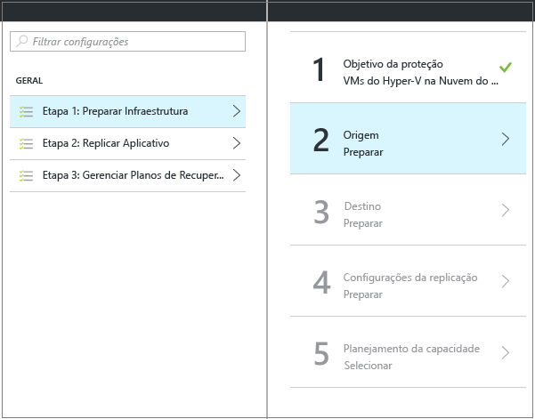

2. Em **Preparar origem**, clique em **+ VMM** para adicionar um servidor VMM.

    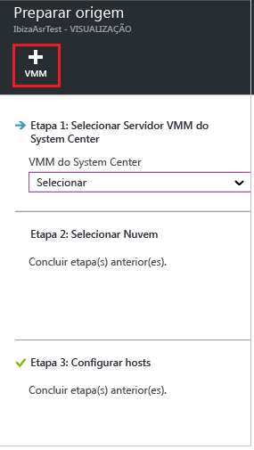

3. Em **Adicionar Servidor**, verifique se **Servidor System Center VMM** é exibido em **Tipo de servidor** e se o servidor VMM atende aos [pré-requisitos e aos requisitos de URL](#prerequisites).
4. Baixe o arquivo de instalação do Provedor do Azure Site Recovery.
5. Baixe a chave do registro. Você precisará dela quando executar a instalação. A chave é válida por cinco dias após ser gerada.

    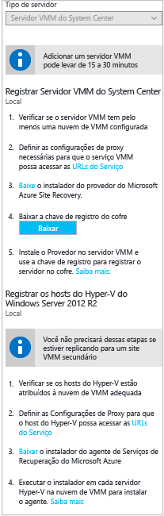

## Instalar o Provedor no servidor VMM

1. Execute o arquivo de configuração do provedor no servidor VMM.
2. No **Microsoft Update**, você pode aceitar as atualizações para que as atualizações do Provedor sejam instaladas de acordo com a política do Microsoft Update.
3. Em **Instalação**, aceite ou modifique o local de instalação padrão do Provedor e clique em **Instalar**.

    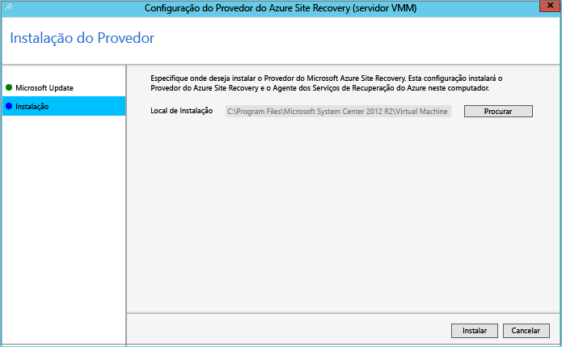
4. Quando a instalação terminar, clique em **Registrar** para registrar o servidor do VMM no cofre.
5. Na página **Configurações do Cofre**, clique em **Procurar** para selecionar o arquivo da chave do cofre. Especifique a assinatura do Azure Site Recovery e o nome do cofre.

    
6. Em **Conexão da Internet**, especifique como o Provedor em execução no servidor VMM conectará a Recuperação de Site pela Internet.

   * Se você quiser que o Provedor se conecte diretamente, selecione **Conectar diretamente o Azure Site Recovery sem um proxy**.
   * Se o proxy existente exigir autenticação ou se você quiser usar um proxy personalizado, selecione **Conectar o Azure Site Recovery com um servidor proxy**.
   * Se você usar um proxy personalizado, especifique o endereço, a porta e as credenciais.
   * Se estiver usando um proxy, você já deverá ter concedido as URLs descritas em [pré-requisitos](#on-premises-prerequisites).
   * Se você usar um proxy personalizado, uma conta RunAs VMM (DRAProxyAccount) será criada automaticamente usando as credenciais de proxy especificadas. Configure o servidor proxy para que essa conta possa ser autenticada com êxito. As configurações da conta RunAs VMM podem ser modificadas no console do VMM. Em **Configurações**, expanda **Segurança** > **Contas Executar como** e modifique a senha de DRAProxyAccount. Você precisará reiniciar o serviço VMM para que essa configuração entre em vigor.

     
7. Aceite ou modifique o local de um certificado SSL automaticamente gerado para criptografia de dados. Esse certificado é usado se você habilitar a criptografia de dados para uma nuvem protegida pelo Azure no portal de Recuperação de Site do Azure. Mantenha esse certificado protegido. Quando você executar um failover para o Azure, precisará dele para descriptografar se a criptografia de dados estiver habilitada.
8. Em **Nome do servidor**, especifique um nome amigável para identificar o servidor VMM no cofre. Em uma configuração de cluster, especifique o nome de função de cluster do VMM.
9. Habilite **Sincronizar metadados de nuvem**, se quiser sincronizar os metadados para todas as nuvens no servidor VMM com o cofre. Esta ação só precisa acontecer uma vez em cada servidor. Se você não quiser sincronizar todas as nuvens, você pode deixar essa configuração desmarcada e sincronizar cada nuvem individualmente nas propriedades da nuvem no console VMM. Clique em **Registrar** para concluir o processo.

    
10. O registro é iniciado. Após a conclusão do registro, o servidor é exibido em **Infraestrutura do Site Recovery** > **Servidores VMM**.

## Instalar o Agente de Serviços de Recuperação do Azure em hosts do Hyper-V

1. Depois de configurar o Provedor, será necessário baixar o arquivo de instalação do agente de Serviços de Recuperação do Azure. Execute a instalação em cada servidor do Hyper-V na nuvem do VMM.

    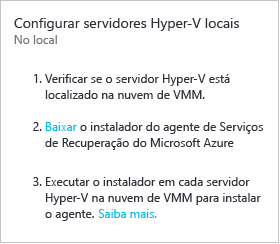
2. Em **Verificação de Pré-requisitos**, clique em **Avançar**. Quaisquer pré-requisitos faltantes serão instalados automaticamente.

    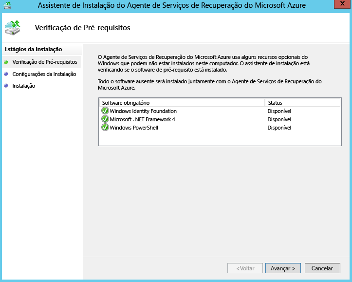
3. Em **Configurações da Instalação**, aceite ou modifique o local de instalação e o local do cache. Você pode configurar o cache em uma unidade que tenha pelo menos 5 GB de armazenamento disponível, mas é recomendável uma unidade de cache com 600 GB ou mais de espaço livre. Em seguida, clique em **Instalar**.
4. Quando a instalação terminar, clique no botão **Fechar** para concluir.

    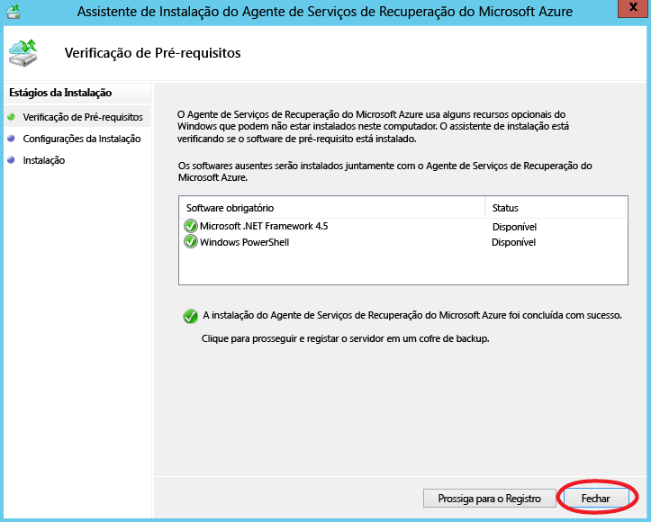

### Instalação de linha de comando
Você pode instalar o Agente de Serviços de Recuperação do Microsoft Azure por meio da linha de comando usando o comando a seguir:

     marsagentinstaller.exe /q /nu

### Configurar o acesso de proxy de Internet para a Recuperação de Site de hosts do Hyper-V

O agente dos Serviços de Recuperação em execução em hosts do Hyper-V precisam de acesso à Internet para o Azure para a replicação de VMs. Se você estiver acessando a Internet por meio de um proxy, configure-o da seguinte maneira:

1. Abra o snap-in MMC do Backup do Microsoft Azure no host do Hyper-V. Por padrão, um atalho para o Backup do Microsoft Azure está disponível na área de trabalho ou C:\Arquivos de Programas\Microsoft Azure Recovery Services Agent\bin\wabadmin.
2. No snap-in, clique em **Alterar Propriedades**.
3. Na guia **Configuração do Proxy** , especifique as informações do servidor proxy.

    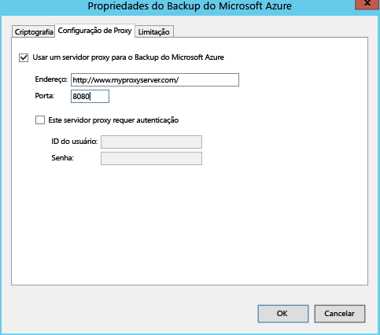
4. Verifique se o agente pode acessar as URLs descritas nos [pré-requisitos](#on-premises-prerequisites).

## Configurar o ambiente de origem
Especifique a conta de armazenamento do Azure a ser usada para a replicação e a rede do Azure à qual as VMs do Azure se conectarão após o failover.

1. Clique em **Preparar infraestrutura** > **Destino**, selecione a assinatura e o grupo de recursos no qual deseja criar as máquinas virtuais do failover. Escolha o modelo de implantação que você deseja usar no Azure (clássico ou gerenciamento de recursos) para as máquinas virtuais do failover.

    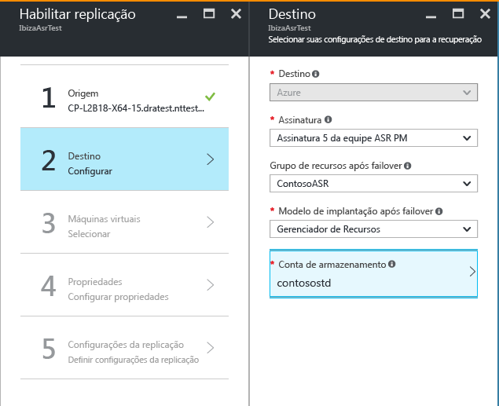

2. A Recuperação de Site verifica se você tem uma ou mais contas de armazenamento e redes do Azure compatíveis.

    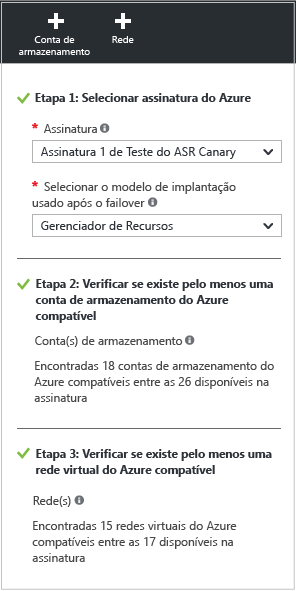

3. Se você não tiver criado uma conta de armazenamento e se desejar criar uma usando o Resource Manager, clique em **+Conta de armazenamento** para fazer isso de forma embutida.  Na folha **Criar conta de armazenamento** , especifique um nome de conta, um tipo, uma assinatura e uma localização. A conta deve estar no mesmo local do que o cofre dos Serviços de Recuperação.

   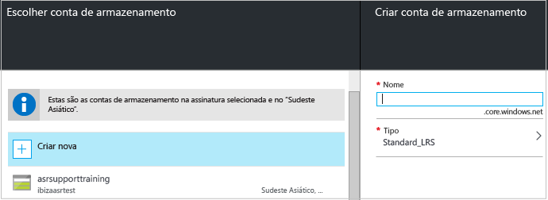

   * Se você quiser criar uma conta de armazenamento usando o modelo clássico, faça isso no portal do Azure. [Saiba mais](../storage/storage-create-storage-account-classic-portal.md)
   * Se você estiver usando uma conta de armazenamento premium para os dados replicados, configure uma conta de armazenamento standard adicional para armazenar os logs de replicação que capturam as alterações contínuas nos dados locais.
5. Se você não tiver criado uma rede do Azure e se quiser criar uma usando o Resource Manager, clique em **+Rede** para fazer isso de forma embutida. Na folha **Criar rede virtual** , especifique um nome de rede, um intervalo de endereços, detalhes de sub-rede, uma assinatura e uma localização. A rede deve estar no mesmo local do que o cofre dos Serviços de Recuperação.

   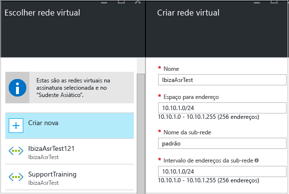

   Se você quiser criar uma rede usando o modelo clássico, faça isso no portal do Azure. [Saiba mais](../virtual-network/virtual-networks-create-vnet-classic-pportal.md).

### Configurar o mapeamento de rede

* [Leia](#prepare-for-network-mapping) uma rápida visão geral sobre o que o mapeamento de rede faz.
* Verifique se as máquinas virtuais no servidor do VMM estão conectadas a uma rede VM e se você criou pelo menos uma rede virtual do Azure. Várias redes VM podem ser mapeadas para uma única rede do Azure.

Configure o mapeamento da seguinte maneira:

1. Em **Infraestrutura do Site Recovery** > **Mapeamentos de rede** > **Mapeamento de Rede**, clique no ícone **+Mapeamento de Rede**.

    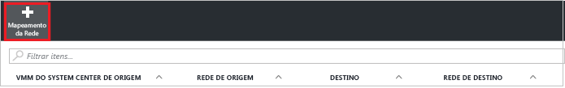
2. Em **Adicionar mapeamento de rede**, selecione o servidor do VMM de origem e **Azure** como o destino.
3. Verifique a assinatura e o modelo de implantação após o failover.
4. Em **Rede de origem**, selecione a rede de VMs locais de origem que você deseja mapear na lista associada ao servidor do VMM.
5. Em **Rede de destino**, selecione a rede do Azure na qual as VMs do Azure de réplica estarão localizadas quando criadas. Em seguida, clique em **OK**.

    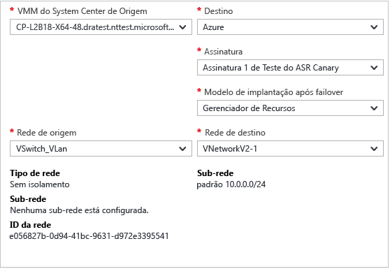

Veja o que acontece quando começa o mapeamento de rede:

* As máquinas virtuais existentes na rede VM de origem estão conectadas à rede de destino quando o mapeamento começa. As VMs que estiverem conectadas à rede VM de origem serão conectadas à rede do Azure mapeada quando a replicação ocorrer.
* Se você modificar um mapeamento de rede existente, as máquinas virtuais de réplica serão conectadas usando as novas configurações.
* Se a rede de destino tiver várias sub-redes e uma dessas sub-redes tiver o mesmo nome que a sub-rede em que a máquina virtual de origem está localizada, a máquina virtual de réplica será conectada à sub-rede de destino após o failover.
* Se não houver uma sub-rede de destino com um nome correspondente, a máquina virtual será conectada à primeira sub-rede na rede.

## Definir configurações de replicação
1. Para criar uma nova política de replicação, clique em **Preparar a Infraestrutura** > **Configurações de Replicação** > **+Criar e associar**.

    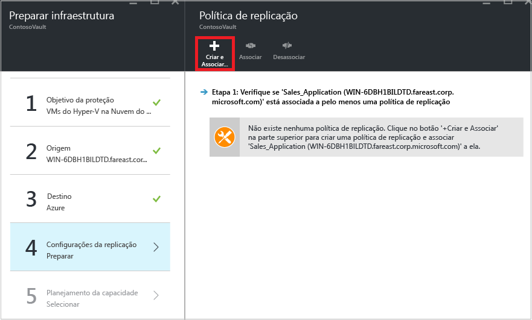
2. Em **Criar e associar política**, especifique um nome de política.
3. Em **Frequência de cópia**, especifique com que frequência você deseja replicar os dados delta após a replicação inicial (a cada 30 segundos, 5 ou 15 minutos).

    > [!NOTE]
    >  Não há suporte para uma frequência de 30 segundos ao replicar para armazenamento premium. A limitação é determinada pelo número de instantâneos por blob (100) com suporte pelo armazenamento premium. [Saiba mais](../storage/storage-premium-storage.md#snapshots-and-copy-blob)

4. Em **Retenção do ponto de recuperação**, especifique, em horas, qual será a duração da janela de retenção para cada ponto de recuperação. Os computadores protegidos podem ser recuperados para qualquer ponto nessa janela.
5. Em **Frequência do instantâneo consistente com aplicativo**, especifique com que frequência (1 a 12 horas) são criados os pontos de recuperação que incluam instantâneos consistentes com aplicativos. O Hyper-V usa dois tipos de instantâneos: um instantâneo padrão, que fornece um instantâneo incremental de toda a máquina virtual, e um instantâneo consistente com aplicativos, que cria um instantâneo pontual dos dados do aplicativo na máquina virtual. Os instantâneos consistentes com aplicativos usam o Serviço de VSS (Cópias de Sombra de Volume) para garantir que os aplicativos estejam em um estado consistente quando o instantâneo for obtido. Observe que, se você habilitar instantâneos consistentes com aplicativos, isso afetará o desempenho de aplicativos executados em máquinas virtuais de origem. Verifique se o valor definido é menor do que o número de pontos de recuperação adicionais que você configurar.
6. Em **Hora de início para replicação inicial**, indique quando a replicação inicial deve começar. A replicação ocorre pela largura de banda da Internet, pois talvez você queira agendá-la fora dos horários de pico.
7. Em **Criptografar os dados armazenados no Azure**, especifique se os dados em repouso serão criptografados no armazenamento do Azure. Em seguida, clique em **OK**.

    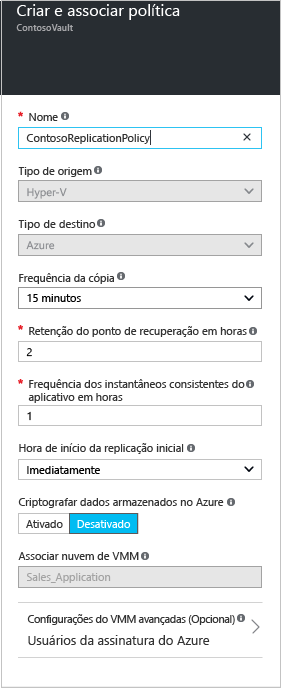
8. Quando você cria uma nova política, ela é automaticamente associada à nuvem do VMM. Clique em **OK**. É possível associar nuvens do VMM adicionais (e as VMs nelas) a essa política de replicação em **Replicação** > nome da política > **Associar Nuvem do VMM**.

    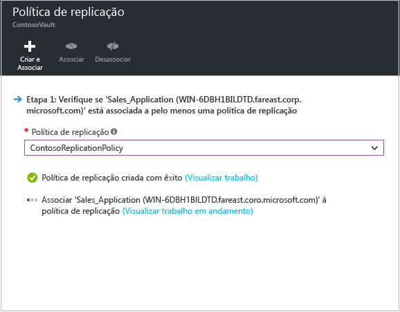

## Planejamento da capacidade

Agora que você tem a infraestrutura básica configurada, pense no planejamento de capacidade e confira se precisa de recursos adicionais.

O Site Recovery fornece um planejador de capacidade para ajudar você a alocar os recursos certos para seu ambiente de origem, os componentes do Site Recovery, a rede e o armazenamento. É possível executar o planejador no modo rápido para estimativas baseadas em um número médio de VMs, de discos e de armazenamento, ou no modo detalhado, no qual você insere números no nível de carga de trabalho. Antes de começar:

* Reunir informações sobre seu ambiente de replicação, inclusive VMs, discos por VMs e armazenamento por disco.
* Estimar a taxa de alteração (variação) diária de dados replicados. Você pode usar o [Planejador de Capacidade para Réplica do Hyper-V](https://www.microsoft.com/download/details.aspx?id=39057) para ajudá-lo a fazer isso.

1. Clique em **Baixar** para baixar a ferramenta e executá-la. [Leia o artigo](site-recovery-capacity-planner.md) que acompanha a ferramenta.
2. Quando terminar, selecione **Sim** em **Você executou o Planejador de Capacidade**?

   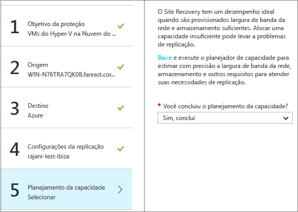

   Saiba mais sobre [controle de largura de banda de rede](#network-bandwidth-considerations)

## Habilitar a replicação

Antes de começar, verifique se a sua conta de usuário do Azure tem as [permissões](site-recovery-role-based-linked-access-control.md#permissions-required-to-enable-replication-for-new-virtual-machines) necessárias para habilitar a replicação de uma nova máquina virtual no Azure.

Agora habilite a replicação da seguinte maneira:

1. Clique em **Etapa 2: replicar aplicativo** > **Origem**. Depois de habilitar a replicação pela primeira vez, clique em **+Replicar** no cofre para habilitar a replicação para outros computadores.

    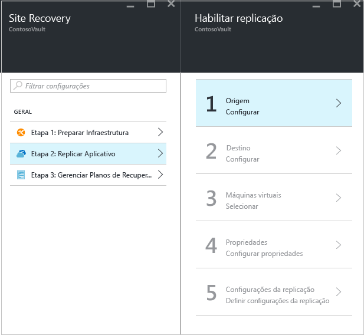
2. Na folha **Origem**, selecione o servidor do VMM e a nuvem na qual os hosts do Hyper-V estão localizados. Em seguida, clique em **OK**.

    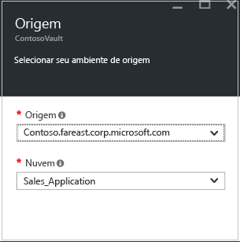
3. Em **Destino**, selecione a assinatura, o modelo de implantação pós-failover e a conta de armazenamento que você está usando para os dados replicados.

    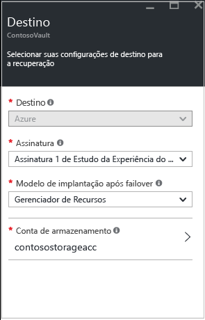
4. Selecione a conta de armazenamento que você deseja usar. Se quiser usar uma conta de armazenamento diferente da que você tem, poderá [criar uma](#set-up-an-azure-storage-account). Se você estiver usando uma conta de armazenamento premium para os dados replicados, precisará selecionar uma conta de armazenamento standard adicional para armazenar os logs de replicação que capturam as alterações contínuas nos dados locais. Para criar uma conta de armazenamento usando o modelo do Resource Manager, clique em **Criar nova**. Se você quiser criar uma conta de armazenamento usando o modelo clássico, faça isso no [portal do Azure](../storage/storage-create-storage-account-classic-portal.md). Em seguida, clique em **OK**.
5. Selecione a rede e a sub-rede do Azure às quais as VMs do Azure se conectarão quando forem criadas após o failover. Selecione **Configurar agora para computadores selecionados** para aplicar a configuração de rede a todos os computadores selecionados para proteção. Selecione **Configurar mais tarde** para selecionar a rede do Azure por computador. Se quiser usar uma rede diferente da que você tem, poderá [criar uma](#set-up-an-azure-network). Para criar uma rede usando o modelo do Gerenciador de Recursos, clique em **Criar novo**. Se você quiser criar uma rede usando o modelo clássico, terá de fazer isso [no portal do Azure](../virtual-network/virtual-networks-create-vnet-classic-pportal.md). Selecione uma sub-rede, se aplicável. Em seguida, clique em **OK**.
6. Em **Máquinas Virtuais** > **Selecionar máquinas virtuais**, clique e selecione cada máquina que você deseja replicar. Você só pode selecionar computadores para os quais a replicação pode ser habilitada. Em seguida, clique em **OK**.

    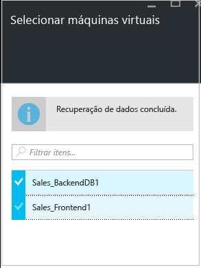

7. Em **Propriedades** > **Configurar propriedades**, selecione o sistema operacional para as VMs selecionadas e o disco do sistema operacional.

    - Verifique se o nome da VM do Azure (nome de destino) está em conformidade com os [Requisitos de máquina virtual do Azure](site-recovery-support-matrix-to-azure.md#failed-over-azure-vm-requirements).   
    - Por padrão, todos os discos da VM são selecionados para replicação, mas você pode limpar os discos para excluí-los.

        - Talvez você queira excluir discos para reduzir a largura de banda de replicação. Por exemplo, talvez você não queira replicar discos com os dados temporários ou dados que são atualizados cada vez que um computador ou um aplicativo é reiniciado (por exemplo, pagefile.sys ou Microsoft SQL Server tempdb). Para excluir o disco da replicação, você deverá desmarcá-lo.
        - Apenas discos básicos podem ser excluídos. Você não pode excluir discos do sistema operacional.
        - É recomendável que você não exclua discos dinâmicos. O Site Recovery não pode identificar se um disco rígido virtual dentro de uma VM convidada é básico ou dinâmico. Se todos os discos de volume dinâmico dependentes não forem excluídos, o disco protegido dinâmico aparecerá como um disco com falha quando ocorrer o failover da VM e os dados nesse disco não poderão ser acessados.
        - Depois que a replicação estiver habilitada, você não poderá adicionar ou remover discos para replicação. Se desejar adicionar ou excluir um disco, você precisará desabilitar a proteção da VM e habilitá-la novamente.
        - Discos que você criar manualmente no Azure não sofrerão failback. Por exemplo, se você realizar failover de três discos e criar dois discos diretamente na VM do Azure, apenas três discos que sofreram failover sofrerão failback do Azure para o Hyper-V. Você não pode incluir discos criados manualmente em failback ou em replicação inversa do Hyper-V para o Azure.
        - Se você excluir um disco necessário para um aplicativo operar, após o failover no Azure você precisará criá-lo manualmente no Azure para que possa executar o aplicativo replicado. Como alternativa, integre a automação do Azure em um plano de recuperação para criar o disco durante o failover do computador.

    Clique em **OK** para salvar as alterações. Você pode definir propriedades adicionais posteriormente.

    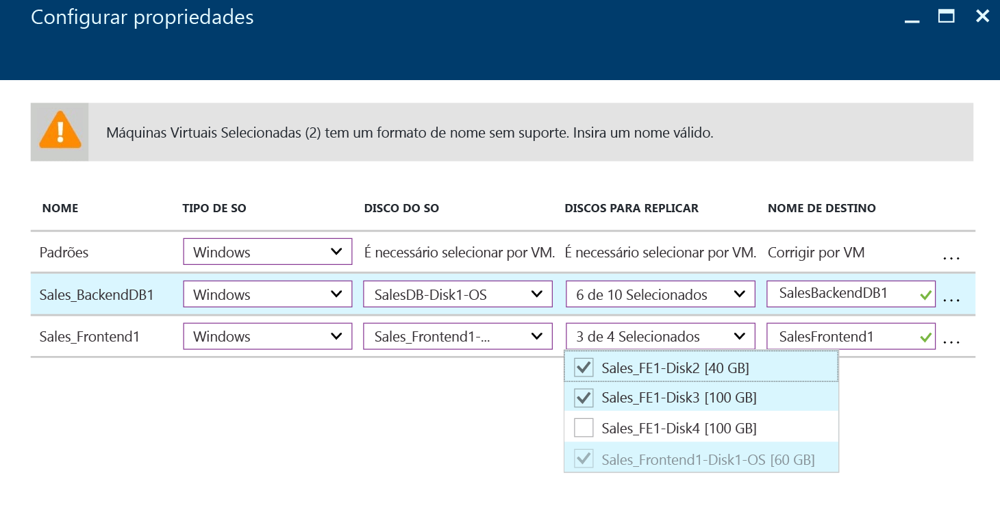

8. Em **Configurações de replicação** > **Definir configurações de replicação**, selecione a política de replicação que você deseja aplicar para as VMs protegidas. Em seguida, clique em **OK**. É possível modificar a política de replicação em **Políticas de replicação** > nome da política > **Editar Configurações**. As alterações aplicadas são usadas para computadores que já estejam replicando e para novas máquinas.

   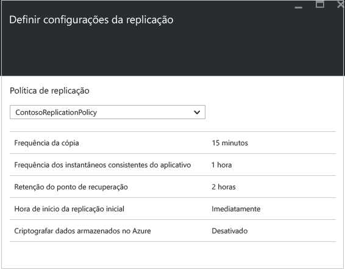

É possível acompanhar o progresso do trabalho **Habilitar Proteção** em **Trabalhos** > **Trabalhos do Site Recovery**. Após o trabalho de **Finalizar Proteção** ser executado, o computador estará pronto para failover.

### Exibir e gerenciar as propriedades da VM

É recomendável que você verifique as propriedades do computador de origem. Lembre-se de que o nome da VM do Azure deve estar em conformidade com os [Requisitos de máquina virtual do Azure](site-recovery-support-matrix-to-azure.md#failed-over-azure-vm-requirements).

1. Em **Itens Protegidos**, clique em **Itens Replicados** e selecione o computador para ver seus detalhes.

    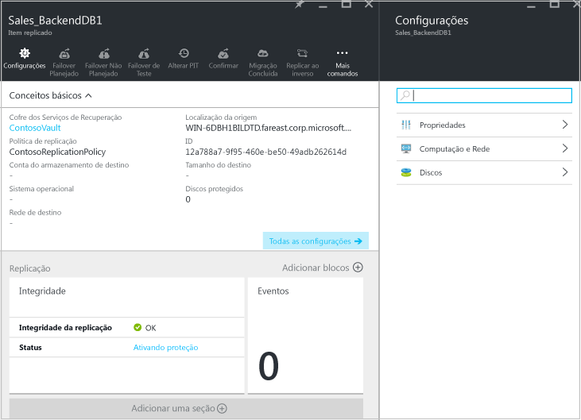
2. Em **Propriedades**, você pode exibir informações de replicação e de failover para a VM.

    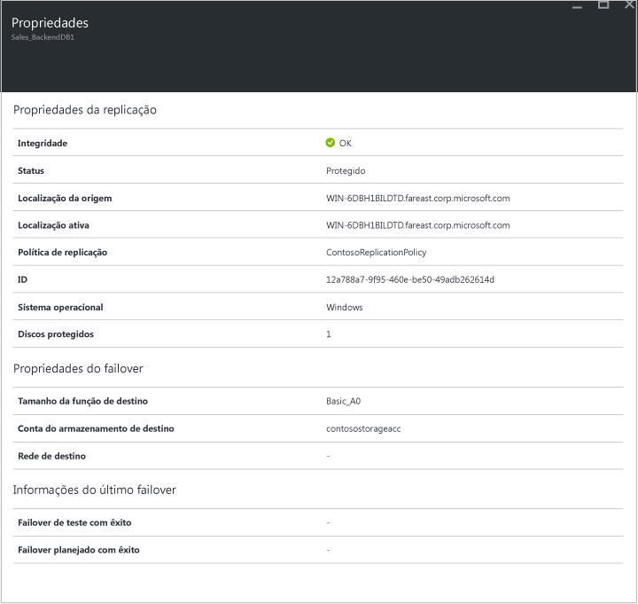
3. Em **Computação e Rede** > **Propriedades de computação**, você pode especificar o nome da VM do Azure e o tamanho de destino. Modifique o nome para que ele fique em conformidade com os [requisitos do Azure](site-recovery-support-matrix-to-azure.md#failed-over-azure-vm-requirements) , se for necessário. Você também pode exibir e modificar as informações sobre a rede de destino, a sub-rede e o endereço IP que será atribuído à VM do Azure.
Observe que:

   * Você pode definir o endereço IP de destino. Se você não fornecer um endereço, o computador com failover usará o DHCP. Se você definir um endereço que não esteja disponível no failover, o failover falhará. O mesmo endereço IP de destino poderá ser usado para failover de teste caso o endereço esteja disponível na rede de failover de teste.
   * O número de adaptadores de rede é determinado pelo tamanho especificado para a máquina virtual de destino, como a seguir:

     * Se o número de adaptadores de rede na máquina de origem for menor ou igual ao número de adaptadores permitido para o tamanho da máquina de destino, o destino terá o mesmo número de adaptadores que a origem.
     * Se o número de adaptadores para máquina virtual de origem exceder o número permitido para o tamanho de destino e o tamanho máximo de destino usado.
     * Por exemplo, se uma máquina de origem tiver dois adaptadores de rede e o tamanho da máquina de destino oferecer suporte a quatro, a máquina de destino terá dois adaptadores. Se a máquina de origem tiver dois adaptadores, mas o tamanho de destino com suporte der suporte apenas a uma máquina de destino, ela terá apenas um adaptador.     
     * Se a máquina virtual tiver vários adaptadores de rede, todos eles se conectarão à mesma rede.

     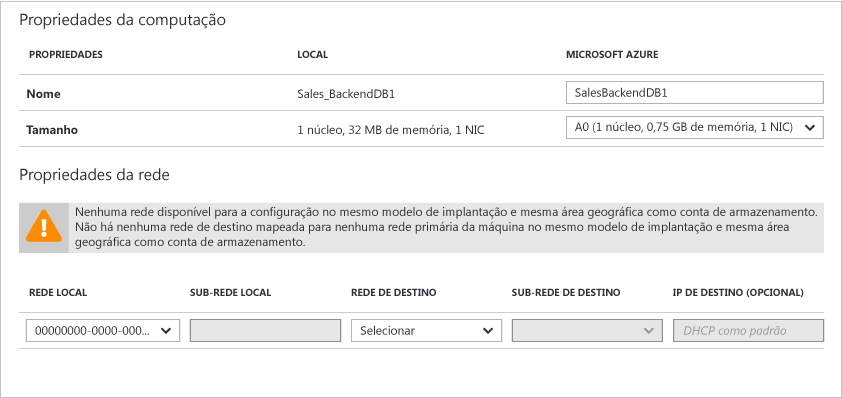

4. Em **Discos** , você pode ver o sistema operacional e os discos de dados na VM que serão replicados.

#### Discos gerenciados

Em **Computação e Rede** > **Propriedades de computação**, você poderá definir a configuração "Usar managed disks" como "Sim" para a VM se quiser anexar managed disks ao seu computador na migração para o Azure. O Managed Disks simplifica o gerenciamento de discos para VMs da IaaS do Azure por meio do gerenciamento de contas de armazenamento associadas aos discos da VM. [Saiba mais sobre managed disks](https://docs.microsoft.com/en-us/azure/storage/storage-managed-disks-overview).

   - Managed disks são criados e anexados à máquina virtual somente em um failover para o Azure. Ao habilitar a proteção, os dados de computadores locais continuarão sendo replicados para contas de armazenamento.
   Managed disks podem ser criados apenas para máquinas virtuais implantadas usando o modelo de implantação do Resource Manager.  

  > [!NOTE]
  > Não há suporte para failback do Azure para o ambiente do Hyper-V local para computadores com managed disks. Defina "Usar managed disks" como "Sim" apenas se você pretender migrar esse computador para o Azure.

   - Quando você define "Usar managed disks" como "Sim", apenas conjuntos de disponibilidade no grupo de recursos com "Usar managed disks" definido como "Sim" estarão disponíveis para seleção. Isso ocorre porque as máquinas virtuais com managed disks apenas podem fazer parte de conjuntos de disponibilidade com a propriedade "Usar managed disks" definida como "Sim". Crie conjuntos de disponibilidade com a propriedade "Usar managed disks" definida com base em sua intenção de usar managed disks no failover.  Da mesma maneira, quando você define "Usar managed disks" como "Não", apenas conjuntos de disponibilidade no grupo de recursos com a propriedade "Usar managed disks" definida como "Não" estarão disponíveis para seleção. [Saiba mais sobre managed disks e conjuntos de disponibilidade](https://docs.microsoft.com/en-us/azure/virtual-machines/windows/manage-availability#use-managed-disks-for-vms-in-an-availability-set).

  > [!NOTE]
  > Se a conta de armazenamento usada para a replicação tiver sido criptografada com Criptografia de Serviço de Armazenamento em qualquer ponto no tempo, a criação de managed disks durante o failover falhará. Você pode definir "Usar managed disks" como "Não" e repetir o failover ou desabilitar a proteção para a máquina virtual e protegê-la para uma conta de armazenamento que não tenha criptografia de Serviço de armazenamento habilitada em nenhum ponto no tempo.
  > [Saiba mais sobre Criptografia do serviço de armazenamento e managed disks](https://docs.microsoft.com/en-us/azure/storage/storage-managed-disks-overview#managed-disks-and-encryption).

## Teste a implantação

Para testar a implantação, você pode executar um failover de teste para uma única máquina virtual ou um plano de recuperação que contém uma ou mais máquinas virtuais.

### Antes de começar

 - Se você quiser se conectar às VMs do Azure usando o RDP após o failover, aprenda sobre [preparação para conexão](site-recovery-test-failover-to-azure.md#prepare-to-connect-to-azure-vms-after-failover).
 - Para um teste completo, você precisa copiar o Active Directory e o DNS para seu ambiente de teste. [Saiba mais](site-recovery-active-directory.md#test-failover-considerations).

### Execute um teste de failover

1. Para fazer failover em uma única VM, em **Itens Replicados**, clique na VM > **+Failover de Teste**.
2. Para executar failover de um plano de recuperação, em **Planos de Recuperação**, clique com o botão direito do mouse no plano > **Failover de Teste**. Para criar um plano de recuperação, [siga estas instruções](site-recovery-create-recovery-plans.md).
3. Em **Failover de Teste**, selecione a rede do Azure à qual as VMs do Azure serão conectadas após o failover.
4. Clique em **OK** para iniciar o failover. É possível acompanhar o andamento clicando na VM para abrir suas propriedades ou no trabalho **Failover de Teste** em **Trabalhos do Site Recovery**.
5. Após a conclusão do failover, você também deve ver a réplica do computador do Azure no portal do Azure > **Máquinas Virtuais**. Verifique se a VM é do tamanho apropriado, se está conectada à rede adequada e se está em execução.
6. Se você tiver se preparado para conexões após o failover, você deverá poder se conectar à VM do Azure.
7. Quando terminar, clique em **Failover de teste de limpeza** no plano de recuperação. Em **Observações** , registre e salve todas as observações associadas ao failover de teste. Isso excluirá as máquinas virtuais que foram criadas durante o failover de teste.

Para obter mais detalhes, leia o artigo [Failover de teste para o Azure](site-recovery-test-failover-to-azure.md).

## Monitorar a implantação

Veja como você pode monitorar as definições de configuração, o status e a integridade para a implantação do Site Recovery:

1. Clique no nome do cofre para acessar o painel **Conceitos básicos** . Neste painel, você pode ver os trabalhos da Recuperação de Site, o status da replicação, os planos de recuperação, a integridade do servidor e os eventos.  Você pode personalizar os **Conceitos básicos** para mostrar os blocos e os layouts mais úteis, incluindo o status de outros cofres da Recuperação de Site e do Backup.

    
2. Em **Integridade**, é possível monitorar problemas em servidores locais (servidores VMM ou de configuração) e os eventos gerados pelo Site Recovery nas últimas 24 horas.
3. Nos blocos **Itens Duplicados**, **Planos de Recuperação** e **Trabalhos de Recuperação de Site**, você pode gerenciar e monitorar a replicação. É possível analisar detalhadamente os trabalhos em **Trabalhos** > **Trabalhos do Site Recovery**.

## Instalação de linha de comando para o Provedor do Azure Site Recovery

O Provedor do Azure Site Recovery pode ser instalado da linha de comando. Esse método pode ser usado para instalar o Provedor em um Server Core para o Windows Server 2012 R2.

1. Baixar o arquivo de instalação do provedor e a chave de registro em uma pasta. Por exemplo, C:\ASR.
2. Em um prompt de comando com privilégios elevados, execute estes comandos para extrair o instalador do Provedor:

            C:\Windows\System32> CD C:\ASR
            C:\ASR> AzureSiteRecoveryProvider.exe /x:. /q
3. Execute este comando para instalar os componentes:

            C:\ASR> setupdr.exe /i
4. Em seguida, execute estes comandos para registrar o servidor no cofre:

        CD C:\Program Files\Microsoft System Center 2012 R2\Virtual Machine Manager\bin
        C:\Program Files\Microsoft System Center 2012 R2\Virtual Machine Manager\bin\> DRConfigurator.exe /r  /Friendlyname <friendly name of the server> /Credentials <path of the credentials file> /EncryptionEnabled <full file name to save the encryption certificate>       

Em que:

* **/Credentials**: parâmetro obrigatório que especifica onde o arquivo da chave de registro está localizado.  
* **/FriendlyName**: parâmetro obrigatório para o nome do servidor do host Hyper-V que aparece no portal do Azure Site Recovery.
* * **/EncryptionEnabled**: parâmetro opcional quando você está replicando as VMs do Hyper-V nas nuvens do VMM para o Azure. Especifique se deseja criptografar as máquinas virtuais no Azure (com criptografia em repouso). Verifique se o nome do arquivo tem uma extensão **.pfx** . A criptografia está desativado por padrão.
* **/proxyAddress**: parâmetro opcional que especifica o endereço do servidor proxy.
* **/proxyport**: parâmetro opcional que especifica a porta do servidor proxy.
* **/proxyUsername**: parâmetro opcional que especifica o nome de usuário de Proxy (se o proxy exige autenticação).
* **/proxyPassword**: parâmetro opcional que especifica a senha para se autenticar no servidor proxy (se o proxy requer autenticação).

### Considerações sobre largura de banda de rede
Você pode usar a ferramenta de planejador de capacidade para calcular a largura de banda necessária para a replicação (replicação inicial e depois a delta). Para controlar a quantidade de uso de largura de banda para a replicação, você tem algumas opções:

* **Limitar largura de banda**: o tráfego do Hyper-V replicado para um site secundário passa por um host específico do Hyper-V. Você pode limitar a largura de banda no servidor host.
* **Ajustar largura de banda**: você pode influenciar a largura de banda usada para a replicação usando algumas chaves do Registro.

#### Limitar largura de banda
1. Abra o snap-in MMC do Backup do Microsoft Azure no servidor host do Hyper-V. Por padrão, um atalho para o Backup do Microsoft Azure está disponível na área de trabalho ou C:\Arquivos de Programas\Microsoft Azure Recovery Services Agent\bin\wabadmin.
2. No snap-in, clique em **Alterar Propriedades**.
3. Na guia **Limitação**, selecione **Habilitar limitação de uso de largura de banda da Internet para operações de backup** e defina os limites do horário comercial e não comercial. Os intervalos válidos são de 512 Kbps a 102 Mbps por segundo.

    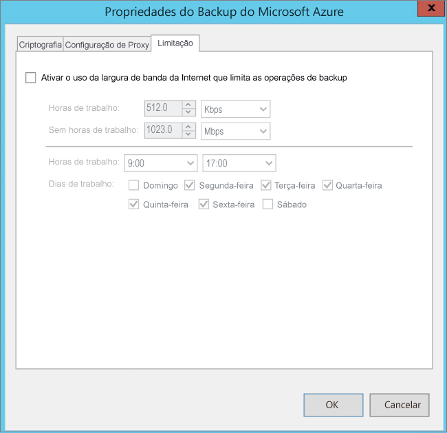

Você também pode usar o cmdlet [Set-OBMachineSetting](https://technet.microsoft.com/library/hh770409.aspx) para definir a limitação. Veja um exemplo:

    $mon = [System.DayOfWeek]::Monday
    $tue = [System.DayOfWeek]::Tuesday
    Set-OBMachineSetting -WorkDay $mon, $tue -StartWorkHour "9:00:00" -EndWorkHour "18:00:00" -WorkHourBandwidth  (512*1024) -NonWorkHourBandwidth (2048*1024)

**Set-OBMachineSetting -NoThrottle** indica que nenhuma limitação é necessária.

#### Influência da largura de banda de rede
O valor do registro **UploadThreadsPerVM** controla o número de threads usados para a transferência de dados (replicação inicial ou delta) de um disco. Um valor mais alto aumenta a largura de banda de rede usada para replicação. O valor do registro **DownloadThreadsPerVM** especifica o número de threads usados para a transferência de dados durante o failback.

1. No Registro, navegue até **HKEY_LOCAL_MACHINE\SOFTWARE\Microsoft\Windows Azure Backup\Replication**.

   * Modifique o valor **UploadThreadsPerVM** (ou crie a chave caso ela não exista) para controlar os threads usados para a replicação do disco.
   * Modifique o valor **DownloadThreadsPerVM** (ou crie a chave caso ela não exista) para controlar os threads usados para o tráfego de failback do Azure.
2. O valor padrão é 4. Em uma rede "sobreprovisionada", os valores padrão dessas chaves do registro precisam ser alterados. O máximo é 32. Monitore o tráfego para otimizar o valor.

## Próximas etapas

Depois que a replicação inicial for concluída e você tiver testado a implantação, você poderá invocar failovers conforme a necessidade. [Saiba mais](site-recovery-failover.md) sobre diferentes tipos de failovers e como executá-los.

