<properties 
	pageTitle="Configurar a proteção entre um site VMM local e o Azure" 
	description="O Azure Site Recovery coordena a replicação, o failover e a recuperação de máquinas virtuais Hyper-V localizadas em nuvens VMM locais para o Azure." 
	services="site-recovery" 
	documentationCenter="" 
	authors="raynew" 
	manager="jwhit" 
	editor="tysonn"/>

<tags 
	ms.service="site-recovery" 
	ms.workload="backup-recovery" 
	ms.tgt_pltfrm="na" 
	ms.devlang="na" 
	ms.topic="article" 
	ms.date="03/16/2015" 
	ms.author="raynew"/>

#  Configurar a proteção entre um site VMM local e o Azure

## Visão geral

A recuperação de Site do Azure colabora com sua estratégia de BCDR (continuidade de negócios e recuperação de desastre) gerenciando replicação, failover e recuperação de máquinas virtuais em vários cenários de implantação. Para obter uma lista completa de cenários de implantação, consulte [Visão geral do Azure Site Recovery](../hyper-v-recovery-manager-overview.md).

Este guia de cenários descreve como implantar a Recuperação de Site para orquestrar e automatizar a proteção para cargas de trabalho em execução em máquinas virtuais nos servidores host Hyper-V que estão localizados em nuvens privadas do VMM. Nesse cenário, máquinas virtuais são replicadas de um site VMM primário para o Azure usando a Réplica do Hyper-V.

O guia inclui os pré-requisitos para o cenário e mostra como configurar um cofre do Site Recovery, instalar o Provedor do Azure Site Recovery no servidor VMM de origem, registrar o servidor no cofre, adicionar uma conta de armazenamento do Azure, instalar o agente de Serviços de Recuperação do Azure nos servidores host Hyper-V, definir configurações de proteção para nuvens VMM que serão aplicadas a todas as máquinas virtuais protegidas e habilitar a proteção para essas máquinas virtuais. Conclua testando o failover para verificar se tudo está funcionando conforme o esperado.

Se tiver problemas ao configurar este cenário, poste suas perguntas no [Fórum de Serviços de Recuperação do Azure](http://go.microsoft.com/fwlink/?LinkId=313628).

## Antes de começar

Verifique se estes pré-requisitos estão em vigor:
### Pré-requisitos do Azure

- Você precisará de uma conta do [Microsoft Azure](http://azure.microsoft.com/). Se você não tiver uma, comece com uma [avaliação gratuita](http://aka.ms/try-azure). Além disso, você pode ler sobre [preços do Azure Site Recovery Manager](http://go.microsoft.com/fwlink/?LinkId=378268).
- Você precisará de uma conta de armazenamento do Azure para armazenar os dados replicados no Azure. A conta precisa estar com a replicação geográfica habilitada. Ela deve estar localizada na mesma região que o serviço de Recuperação de Site do Azure e ser associada à mesma assinatura. Para aprender mais sobre configuração do armazenamento do Azure, consulte [Introdução ao Armazenamento do Microsoft Azure](http://go.microsoft.com/fwlink/?LinkId=398704).
- Você precisará verificar se as máquinas virtuais que deseja proteger atendem aos requisitos do Azure. Consulte [Suporte a máquina virtual](https://msdn.microsoft.com/library/azure/dn469078.aspx#BKMK_E2A) para obter detalhes.

### Pré-requisitos do VMM
- Você precisará do servidor VMM em execução no System Center 2012 R2.
- Qualquer servidor VMM que contenha máquinas virtuais que você deseje proteger deverá estar executando o Provedor do Azure Site Recovery. Ele é instalado durante a implantação do Azure Site Recovery.
- Você precisará de pelo menos uma nuvem no servidor VMM que deseja proteger. A nuvem deve conter:
	- Um ou mais grupos de hosts do VMM
	- Um ou mais servidores host Hyper-V ou clusters em cada grupo de hosts.
	- Uma ou mais máquinas virtuais no servidor Hyper-V de origem. As máquinas virtuais devem ser de geração 1. 
- Saiba mais sobre como configurar nuvens VMM:
	- Leia mais sobre nuvens VMM privadas em [Novidades na nuvem privada com o System Center 2012 R2 VMM](http://go.microsoft.com/fwlink/?LinkId=324952) e em [VMM 2012 e as nuvens](http://go.microsoft.com/fwlink/?LinkId=324956). 
	- Saiba mais em [Configurando a malha de nuvem VMM](https://msdn.microsoft.com/library/azure/dn469075.aspx#BKMK_Fabric)
	- Depois que os elementos de malha de nuvem estiverem em vigor, veja como criar nuvens privadas em [Criando uma nuvem privada no VMM](http://go.microsoft.com/fwlink/?LinkId=324953) e [Passo a passo: criando nuvens privadas com o System Center 2012 SP1 VMM](http://go.microsoft.com/fwlink/?LinkId=324954).

### Pré-requisitos do Hyper-V

- Os servidores host Hyper-V devem estar executando pelo menos o Windows Server 2012 com a função Hyper-V e ter as últimas atualizações instaladas.
- Se você estiver executando o Hyper-V em um cluster, observe que o agente de cluster não será criado automaticamente se você tiver um cluster de baseados em endereços IP estáticos. Você precisará configurar o agente de cluster manualmente. Para obter instruções, consulte [Configurar o agente de réplica do Hyper-V](http://go.microsoft.com/fwlink/?LinkId=403937).
- Qualquer cluster ou servidor host Hyper-V para o qual você desejar gerenciar a proteção deverá ser incluído em uma nuvem VMM.

### Pré-requisitos de mapeamento de rede
Quando você proteger máquinas virtuais na rede do Azure mapeando mapas entre redes VM no servidor VMM de origem e nas redes do Azure destino para habilitar o seguinte: 

- Todos os computadores que forem submetidos a failover na mesma rede poderão se conectar entre si, independentemente do plano de recuperação em que estão.
- Além disso, se um gateway de rede for configurado na rede Azure de destino, as máquinas virtuais poderão se conectar a outras máquinas virtuais locais.
- Se você não configurar o mapeamento de rede, somente máquinas virtuais com failover no mesmo plano de recuperação poderão se conectar entre si após o failover no Azure.

Se desejar implantar o mapeamento de rede, você precisará do seguinte:

- As máquinas virtuais que você deseja proteger no servidor VMM de origem devem estar conectadas a uma rede VM. Essa rede deve ser vinculada a uma rede lógica que esteja associada à nuvem.
- Uma rede do Azure à qual as máquinas virtuais replicadas possam se conectar após o failover. Você selecionará esta rede no momento do failover. A rede deve estar na mesma região que sua assinatura do Azure Site Recovery. 
- Saiba mais sobre o mapeamento de rede:
	- [Configurando a rede lógica no VMM](http://go.microsoft.com/fwlink/?LinkId=386307)
	- [Configurando redes VM e gateways no VMM](http://go.microsoft.com/fwlink/?LinkId=386308)
	- [Configurar e monitorar redes virtuais no Azure](http://go.microsoft.com/fwlink/?LinkId=402555)

## Etapa 1: Criar um cofre de Recuperação de Site

1. Entre no [Portal de Gerenciamento](https://portal.azure.com) do servidor VMM que você deseja registrar.

2. Expanda os <b>Serviços de Dados</b>, expanda os <b>Serviços de Recuperação</b> e clique em <b>Cofre de Recuperação de Site</b>.

3. Clique em <b>Criar Novo</b> e, em seguida, clique em <b>Criação Rápida</b>.
	

4. Em <b>Nome</b>, digite um nome amigável para identificar o cofre.

5. Em <b>Região</b>, selecione a região geográfica para o cofre. As regiões geográficas disponíveis incluem Oeste da Europa, Sudeste da Ásia, Ásia Oriental, Norte da Europa, Oeste dos EUA, Leste dos EUA.
6. Clique em <b>Criar cofre</b>. 

	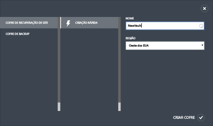

Verifique a barra de status para confirmar que o cofre foi criado com sucesso. O cofre será listado como <b>Ativo</b> na página de Serviços de Recuperação.

## Etapa 2: Gerar uma chave de registro do cofre
 
Gere uma chave de registro no cofre. Após baixar o Provedor do Azure Site Recovery e instalá-lo no servidor VMM, você usará essa chave para registrar o servidor VMM no cofre.

1. Na página <b>Serviços de Recuperação</b>, clique no cofre para abrir a página de Início Rápido. O Início Rápido pode também ser aberto a qualquer tempo usando o ícone.

	

2. Na lista suspensa, selecione **Entre um site do Hyper-V local e o Microsoft Azure**.
3. Em **Preparar Servidores VMM**, clique no arquivo **Gerar chave de registro**. O arquivo de chave é gerado automaticamente e é válido por cinco dias após ter sido gerado. Se não estiver acessando o portal do Azure por meio do servidor VMM, você precisará copiar esse arquivo para o servidor.

	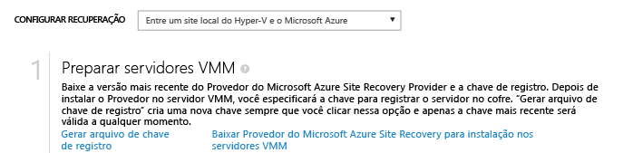

## Etapa 3: Instalar o Provedor de Recuperação do Site do Azure

4. Na página <b>Início Rápido</b>, em **Preparar servidores VMM**, clique <b>Baixar o Provedor de Recuperação de Site do Microsoft Azure para instalação nos servidores VMM</b> para obter a versão mais recente do arquivo de instalação do Provedor.

2. Execute esse arquivo no servidor VMM de origem. Se o VMM for implantado em um cluster e você estiver instalando o Provedor pela primeira vez, instale-o em um nó ativo e conclua a instalação para registrar o servidor VMM no cofre. Em seguida, instale o Provedor nos outros nós. Observe que, se estiver atualizando o Provedor você precisará fazer a atualização em todos os nós porque todos eles devem estar executando a mesma versão do Provedor.

3. Na **Verificação dos Pré-requisitos**, selecione para parar o serviço VMM para começar a configuração do Provedor. O serviço para e reiniciará automaticamente quando a configuração finaliza. Se estiver instalando em um cluster do VMM, você deverá parar a função de Cluster.

	

4. Em **Microsoft Update** você pode optar por atualizações. Com esta configuração de Provedor habilitada, a atualização será instalada de acordo com a política do Microsoft Update.

	

Após o Provedor ser instalado, continue com a configuração para registrar o servidor no cofre.

5. Em **Conexão de Internet**, especifique como o Provedor em execução no servidor VMM se conecta à Internet. Selecione <b>Usar configurações de proxy padrão do sistema</b> para usar as configurações de conexão com a Internet definidas no servidor.

	
	- Se quiser usar um proxy personalizado, você deverá configurá-lo antes de instalar o provedor. Quando você definir as configurações personalizadas de proxy, será executado um teste para verificar a conexão proxy.
	- Se usar um proxy personalizado ou se seu proxy padrão exigir autenticação, você precisará inserir os detalhes do proxy, incluindo a porta e o endereço do proxy.
	- Você deve isentar os seguintes endereços do roteamento por meio do proxy:
		- A URL para se conectar ao Azure Site Recovery: *.hypervrecoverymanager.windowsazure.com
		- *.accesscontrol.windows.net
		- *.backup.windowsazure.com
		- *.blob.core.windows.net 
		- *.store.core.windows.net 
	- Se for necessário permitir conexões de saída para um controlador de domínio do Azure, permita os endereços IP descritos em [Intervalos de IP do Data Center do Azure](http://go.microsoft.com/fwlink/?LinkId=511094) e permita os protocolos HTTP (80) e HTTPS (443). 
	- Se você usar um proxy personalizado, uma conta RunAs VMM (DRAProxyAccount) será criada automaticamente usando as credenciais de proxy especificadas. Configure o servidor proxy para que essa conta possa ser autenticada com êxito. As configurações da conta RunAs VMM podem ser modificadas no console do VMM. Para fazer isso, abra o espaço de trabalho Configurações, expanda Segurança, clique em contas Executar como e modifique a senha de DRAProxyAccount. Você precisará reiniciar o serviço VMM para que essa configuração entre em vigor.

6. Em **Chave de Registro**, selecione que você baixou do Azure Site Recovery e copiou para o servidor VMM.
7. Em **Nome do cofre**, verifique o nome do cofre para o qual o servidor será registrado.
8. Em **Nome do servidor**, especifique um nome amigável para identificar o servidor VMM no cofre. Em uma configuração de cluster, especifique o nome de função de cluster do VMM.

	
	

8. Na sincronização dos **Metadados de nuvem inicial**, selecione se você deseja sincronizar os metadados para todas as nuvens no servidor VMM com o cofre. Esta ação só precisa acontecer uma vez em cada servidor. Se você não quiser sincronizar todas as nuvens, você pode deixar essa configuração desmarcada e sincronizar cada nuvem individualmente nas propriedades da nuvem no console VMM.

9. Em **Criptografia de Dados**, você especifica um local para salvar um certificado SSL automaticamente gerado para criptografia de dados. Esse certificado é usado se você habilitar a criptografia de dados para uma nuvem protegida pelo Azure no portal de Recuperação de Site do Azure. Mantenha esse certificado protegido. Quando você executa um failover para o Azure, selecione-o para decodificar dados criptografados. 

	

8. Clique em <b>Registrar</b> para concluir o processo. Após o registro, os metadados do servidor VMM é recuperado pela Recuperação de Site do Azure. O servidor é exibido no final da guia <b>Recursos</b> da página **Servidores** no cofre.

## Etapa 4: Criar uma conta de Armazenamento do Azure

Se não tiver uma conta de armazenamento do Azure, clique em **Adicionar uma conta de armazenamento do Azure**. A conta deve ter a replicação geográfica habilitada. Ela deve estar localizada na mesma região que o serviço de Recuperação de Site do Azure e ser associada à mesma assinatura.

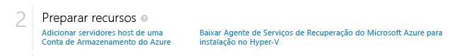

## Etapa 5: Instalar o Agente de Serviços de Recuperação do Azure

Instale o Agente de Serviços de Recuperação do Azure em cada servidor de host Hyper-V localizado nas nuvens VMM que você deseja proteger.

1. Na página Início rápido, clique em <b>Baixar o Agente de Serviços de Recuperação de Site do Azure e instalar nos hosts</b> para obter a versão mais recente do arquivo de instalação do agente.

	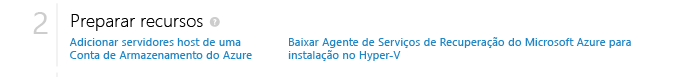

2. Execute o arquivo de instalação em cada servidor host Hyper-V localizado nas nuvens VMM que você deseja proteger.
3. Na página **Verificação de pré-requisitos**, clique em <b>Avançar</b>. Quaisquer pré-requisitos faltantes serão instalados automaticamente.

	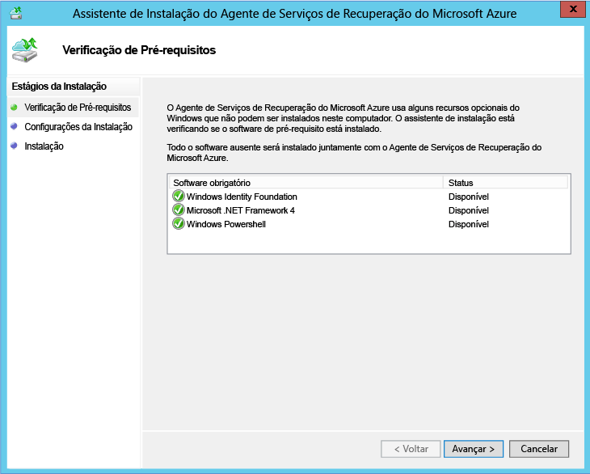

4. Na página **Configurações de Instalação**, especifique onde você deseja instalar o Agente e selecione a localização do cachê no qual os metadados de backup serão instalados. Em seguida, clique em <b>Instalar</b>.

## Etapa 6: Definir as configurações da proteção de nuvem

Depois que o servidor VMM estiver registrado, você poderá definir as configurações de proteção de nuvem. Você habilitou a opção **Sincronizar dados de nuvem com o cofre** ao instalar o Provedor, então todas as nuvens no servidor VMM aparecerão na guia <b>Itens Protegidos</b> no cofre.

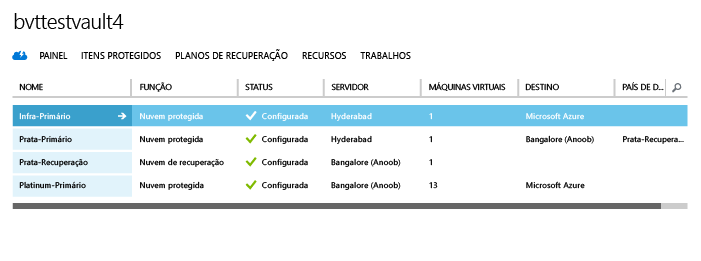

1. Na página de Início Rápido, clique em **Configurar a proteção para nuvens VMM**.
2. Na guia **Itens Protegidos**, clique na nuvem que você deseja configurar e vá até a guia **Configuração**.
3. Em <b>Destino</b>, selecione <b>Microsoft Azure</b>.
4. Em <b>Conta de Armazenamento</b>, selecione o armazenamento do Azure que você deseja utilizar para armazenar máquinas virtuais do Azure.
5. Defina <b>Criptografar dados armazenados</b> como <b>Desligado</b>. Essa configuração especifica que os dados podem ser criptografados e replicados entre o site local e o Azure.
6. Em <b>Copiar frequência</b>, deixe a configuração padrão. Esse valor especifica a frequência com que dados devem ser sincronizados entre os locais de origem e de destino.
7. Em <b>Manter pontos de recuperação para</b>, mantenha a configuração padrão. Com um valor padrão de zero apenas o ponto de recuperação mais recente para uma máquina virtual primária é armazenado em um servidor de host de réplica.
8. Em <b>Frequência dos instantâneos consistentes de aplicativo</b>, mantenha a configuração padrão. Esse valor especifica a frequência de criação de instantâneos. Os instantâneos usam o Serviço de cópias de sombra de volume (VSS) para garantir que os aplicativos estejam em um estado consistente quando o instantâneo for obtido.  Se você definir um valor, verifique se ele é menor do que o número dos pontos de recuperação adicionais que você configurar.
9. Em <b>Hora de início para replicação</b>, especifique quando a replicação inicial dos dados para o Azure deve começar. O fuso horário do servidor de host Hyper-V será usado. Recomendamos que você agende a replicação inicial fora dos horários de pico. 

	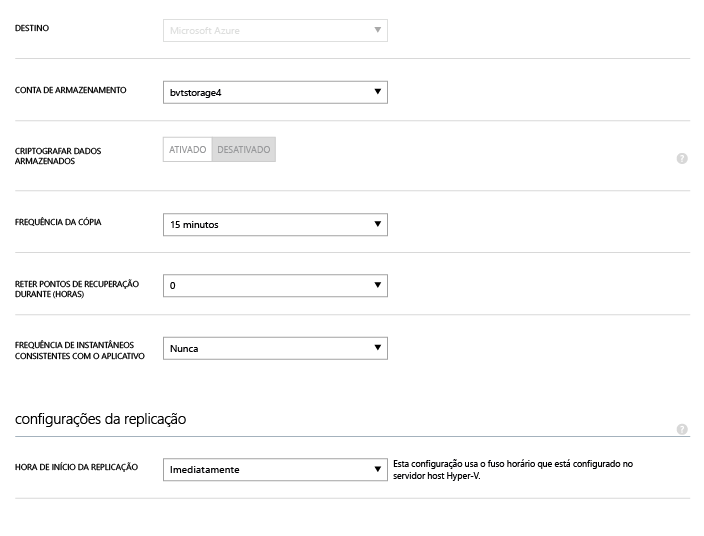

Depois de salvar as configurações, um trabalho será criado e pode ser monitorado na guia <b>Trabalhos</b>. Todos os servidores host Hyper-V na nuvem de origem do VMM serão configurados para replicação.

Após o salvamento, as configurações de nuvem podem ser modificadas na guia <b>Configurar</b>. Para modificar o local de destino ou armazenamento de destino, você deve remover a configuração de nuvem e reconfigurar a nuvem. Observe que, se você mudar a conta de armazenamento, a mudança só será aplicada para máquinas virtuais habilitadas para proteção, após a conta de armazenamento ter sido modificada. Máquinas virtuais existentes não são migradas para a nova conta de armazenamento.

## Etapa 7: Configurar o mapeamento de rede
Antes de começar o mapeamento de rede, verifique se as máquinas virtuais no servidor VMM de origem estão conectadas a uma rede VM. Essa rede VM de origem deve estar vinculada a uma rede lógica que esteja associada à nuvem protegida. Além disso, crie uma ou mais redes virtuais do Azure. Observe que várias redes VM podem ser mapeadas para uma única rede do Azure. 

1. Na página Início Rápido, clique em **Mapear redes**.
2. Na guia **Redes**, em **Local de origem**, selecione o servidor VMM de origem. Em **Local de destino**, selecione Azure.
3. Em redes de **Origem**, é exibida uma lista de redes VM associadas ao servidor VMM. Em redes de **Destino**, são exibidas as redes do Azure associadas à assinatura.
4. Selecione a rede VM de origem e clique em **Mapear**.
5. Na página **Selecionar uma Rede de Destino**, selecione a rede de destino do Azure que você deseja usar.
6. Clique na marca de seleção para concluir o processo de mapeamento.

	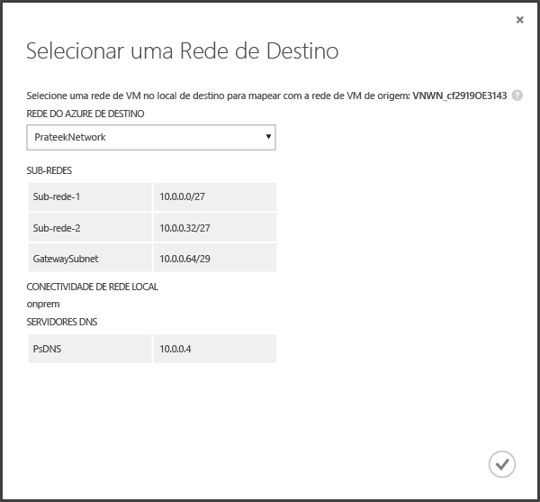

Depois que você salvar as configurações, um trabalho começará a acompanhar o progresso do mapeamento e poderá ser monitorado na guia Trabalhos. As máquinas virtuais de réplica existentes que corresponderem à rede VM de origem serão conectadas às redes do Azure de destino. As máquinas virtuais que estiverem conectadas à rede VM de origem serão conectadas à rede do Azure mapeada após a replicação. Se você modificar um mapeamento existente com uma nova rede, as máquinas virtuais de réplica serão conectadas usando as novas configurações.

Observe que, se a rede de destino tiver várias sub-redes, e uma dessas sub-redes tiver o mesmo nome que a sub-rede em que a máquina virtual de origem está localizada, a máquina virtual de réplica será conectada à sub-rede de destino após o failover. Se não houver uma sub-rede de destino com um nome correspondente, a máquina virtual será conectada à primeira sub-rede na rede. 

## Etapa 8: Habilitar a proteção para máquinas virtuais

Depois de redes, servidores e nuvens estarem configurados corretamente, você pode ativar a proteção para máquinas virtuais na nuvem. Observe o seguinte:

- As máquinas virtuais devem cumprir os requisitos do Azure. Consulte-os em <a href="http://go.microsoft.com/fwlink/?LinkId=402602">Pré-requisitos e suporte</a> na guia Planejamento.
- Para habilitar a proteção, o sistema operacional e as propriedades do disco do sistema operacional devem estar definidos para as máquinas virtuais. Ao criar uma máquina virtual no VMM usando um modelo de máquina virtual, é possível definir a propriedade. Você também pode definir essas propriedades para máquinas virtuais existentes nas guias **Geral** e **Configuração de Hardware** nas propriedades da máquina virtual. Se você não definir essas propriedades no VMM, poderá configurá-las no portal de Recuperação de Site do Azure.

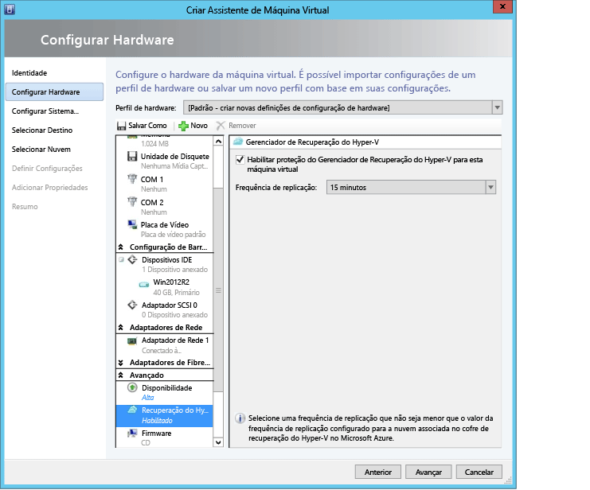

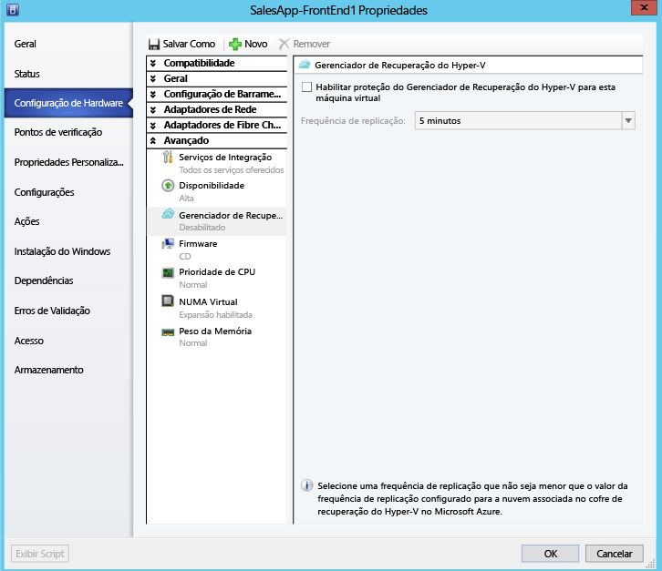

1. Para habilitar a proteção, na guia <b>Máquinas Virtuais</b>, na nuvem na qual a máquina virtual está localizada, clique em <b>Habilitar proteção</b> e, então, selecione <b>Adicionar máquinas virtuais</b>
2. Na lista de máquinas virtuais na nuvem, selecione uma que você quer proteger. 

	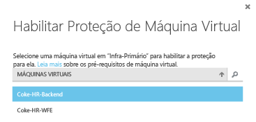

3. Verifique as propriedades da máquina virtual e modifique-as conforme o necessário.

	

Acompanhe o progresso da ação Habilitar Proteção na guia **Trabalhos**, incluindo a replicação inicial. Após o trabalho de Finalizar Proteção ser executado, a máquina virtual está pronta para failover. Após a proteção estar habilitada e as máquinas virtuais serem replicadas, você será capaz de visualizá-los no Azure.

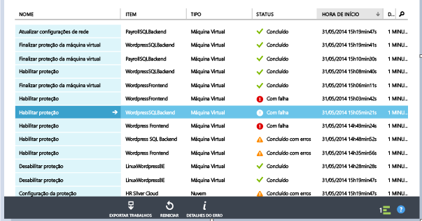

## Testar a implantação
Para testar sua implantação, você pode executar um failover de teste para uma única máquina virtual, ou criar um plano de recuperação consistente de várias máquinas virtuais e executar um failover de teste para o plano.  O failover de teste simula o mecanismo de failover e recuperação em uma rede isolada. Observe que:

- Se você quiser se conectar à máquina virtual no Azure usando a Área de trabalho remota após o failover, habilite a Conexão de Área de Trabalho Remota na máquina virtual antes de executar o teste de failover.
- Após o failover, você usará um endereço IP público para conectar-se à máquina virtual no Azure usando a Área de trabalho remota. Se você quiser fazer isso, verifique se não tem nenhuma política de domínio que o impeça de se conectar a uma máquina virtual usando um endereço público.

### Criar um plano de recuperação

1. Na guia **Planos de Recuperação**, adicione um novo plano. Especifique um nome, **VMM** em **Tipo de origem** e o servidor VMM de origem em **Origem**. O destino será o Azure.

	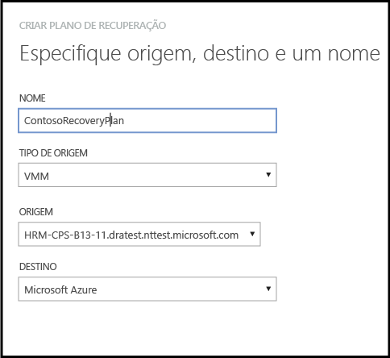

2. Na página **Selecionar Máquinas Virtuais**, selecione as máquinas virtuais para adicionar ao plano de recuperação. Essas máquinas virtuais são adicionadas ao grupo padrão do plano de recuperação, o Grupo 1. Foi testado um máximo de 100 máquinas virtuais em um único plano de recuperação.

	- Se você desejar verificar as propriedades das máquinas virtuais antes de adicioná-las ao plano, clique na máquina virtual na página Propriedades da nuvem na qual ela está localizada. Você também pode configurar as propriedades da máquina virtual no console do VMM.
	- Todas as máquinas virtuais que são exibidas foram habilitadas para a proteção. A lista inclui as máquinas virtuais que estão habilitadas para proteção com a replicação inicial concluída e as que estão habilitadas para proteção com a replicação inicial pendente. Somente as máquinas virtuais com replicação inicial concluída podem realizar failover como parte de um plano de recuperação. Portanto, verifique o status de replicação inicial das máquinas virtuais no plano antes de iniciar o failover do plano de recuperação. 
	

	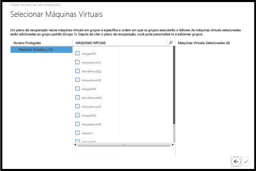

Depois que um plano de recuperação for criado, ele será mostrado na guia **Planos de Recuperação**.

### Execute um teste de failover

Há duas maneiras de executar um failover de teste no Azure.

- Failover de teste sem uma rede do Azure: esse tipo de failover de teste verifica se a máquina virtual é mostrada corretamente no Azure. A máquina virtual não será conectada a nenhuma rede do Azure após o failover.
- Failover de teste com uma rede do Azure: esse tipo de failover verifica se o ambiente de replicação inteiro é mostrado conforme o esperado e se as máquinas virtuais com failover serão conectadas à rede do Azure de destino especificada. Para a manipulação de sub-rede, para failover de teste, a sub-rede da máquina virtual de teste será determinada com base na sub-rede da máquina virtual de réplica. Isso é diferente da replicação normal quando a sub-rede de uma máquina virtual de réplica baseia-se na sub-rede da máquina virtual de origem.

Se você quiser executar um failover de teste para uma máquina virtual habilitada para proteção no Azure sem especificar uma rede de destino do Azure, não será necessário preparar nada. Para executar um teste de failover com um destino de rede do Azure, você precisará criar uma nova rede do Azure isolada da rede de produção do Azure (o comportamento padrão quando você cria uma nova rede no Azure) e configurar a infraestrutura para que a máquina virtual replicada funcione como esperado. Como exemplo:

Exemplo: Uma máquina virtual com Active Directory e DNS é replicada para o Azure usando o Azure Site Recovery. Para executar um failover de teste:

1. Faça um failover de teste da máquina virtual do Active Directory e da máquina virtual do DNS na mesma rede que você usará para o failover de teste real da máquina virtual local.
2. Anote os endereços IP que foram alocados para as máquinas virtuais do Active Directory e DNS com failover.
3. Na rede virtual do Azure que será usada para o failover, adicione os endereços IP como os endereços dos servidores DNS e do Active Directory.
4. Execute o failover de teste da máquina virtual local de origem, especificando a rede do Azure.
5. Após validar que a falha de teste funcionou conforme o esperado, marque o failover de teste como concluído para o plano de recuperação e marque o failover de teste como concluído para as máquinas virtuais do Active Directory e DNS.

Para executar um failover de teste, faça o seguinte:

1. Na guia **Planos de Recuperação**, selecione o plano e clique em **Failover de Teste**.
2. Na página **Confirmar Failover de Teste**, select **Nenhum** ou uma rede do Azure específica.  Observe que, se você selecionar Nenhum, o failover de teste verificará se a máquina virtual foi replicada corretamente para o Azure, mas não verificará sua configuração de rede de replicação.

	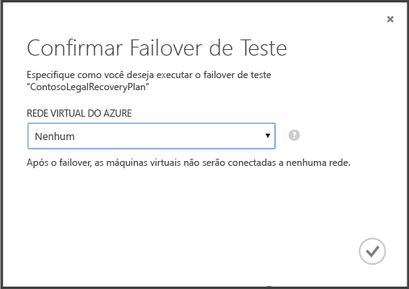

3. Se a criptografia de dados estiver habilitada para a nuvem, em **Chave de Criptografia**, selecione o certificado emitido durante a instalação do Provedor no servidor VMM, quando você ativou a opção para habilitar a criptografia de dados para uma nuvem.
4. Na guia **Trabalhos**, você pode acompanhar o progresso do failover. Você também deverá ver a réplica de teste de máquina virtual no portal do Azure. Se tiver configurado para máquinas virtuais de acesso a rede local, você pode iniciar uma conexão de área de trabalho remota para a máquina virtual.
5. Quando o failover atinge a fase **Teste completo** fase, clique em **Teste completo** para concluir o failover de teste. Você pode fazer uma busca detalhada na guia **Trabalho** para acompanhar o progresso e o status do failover e para realizar as ações necessárias.
6.  Após o failover estiver concluído, faça o seguinte:
	- Verifique se as máquinas virtuais foram iniciadas com êxito
	- Clique em **Observações** para gravar e salvar observações associadas com o teste de failover.
	- Clique em **Failover de teste concluído**. Limpe o ambiente de teste para desligar automaticamente a máquina virtual de teste e exclua o teste de rede do Azure.
5. Após o failover, você poderá ver a réplica de teste da máquina virtual no portal do Azure. Se tiver configurado para máquinas virtuais de acesso a rede local, você pode iniciar uma conexão de área de trabalho remota para a máquina virtual. Observe que:

- Se você quiser se conectar à máquina virtual no Azure usando a Área de trabalho remota após o failover, habilite a Conexão de Área de Trabalho Remota na máquina virtual antes de executar o teste de failover.
- Após o failover, você usará um endereço IP público para conectar-se à máquina virtual no Azure usando a Área de trabalho remota. Se você quiser fazer isso, verifique se não tem nenhuma política de domínio que o impeça de se conectar a uma máquina virtual usando um endereço público.

<h2>Monitorar atividade</h2>

Você pode usar a guia <b>Trabalhos</b> e <b>Painel</b> para exibir e monitorar os principais trabalhos executados pelo cofre de Recuperação de Site do Azure, incluindo a configuração da proteção para uma nuvem; habilitação e desabilitação da proteção para uma máquina virtual; execução de um failover (planejado, não planejado ou teste) e confirmação de um failover não planejado.

Na guia <b>Trabalhos</b> você exibe os trabalhos, realiza busca detalhada nos detalhes do trabalho e erros, executa consultas de trabalho para recuperar trabalhos que combinam com os critérios específicos, exporta trabalhos para o Excel e reinicia os trabalhos falhos.

No <b>Painel</b>, você pode baixar as últimas versões dos arquivos de instalação do Provedor e do Agente, obter informações de configuração para o cofre, consultar o número de máquinas virtuais que tem a proteção gerenciada pelo cofre, ver os trabalhos recentes, gerenciar o certificado do cofre e sincronizar novamente as máquinas virtuais.

Para obter mais informações sobre a interação com trabalhos e o painel, consulte o <a href="http://go.microsoft.com/fwlink/?LinkId=398534">Guia de Operações e Monitoramento</a>.

<h2>Próximas etapas</h2>
<UL>
<LI>Para planejar e implantar o Site Recovery do Azure em um ambiente de produção completo, consulte <a href="http://go.microsoft.com/fwlink/?LinkId=321294">Guia de planejamento para a Recuperação do Hyper-V</a> e <a href="http://go.microsoft.com/fwlink/?LinkId=321295">Guia de implantação do Azure Site Recovery</a>.</LI>

<LI>Para dúvidas, visite o <a href="http://go.microsoft.com/fwlink/?LinkId=313628">Fórum de serviços de recuperação do Windows Azure</a>.</LI> 
</UL>

<!--HONumber=49--> 