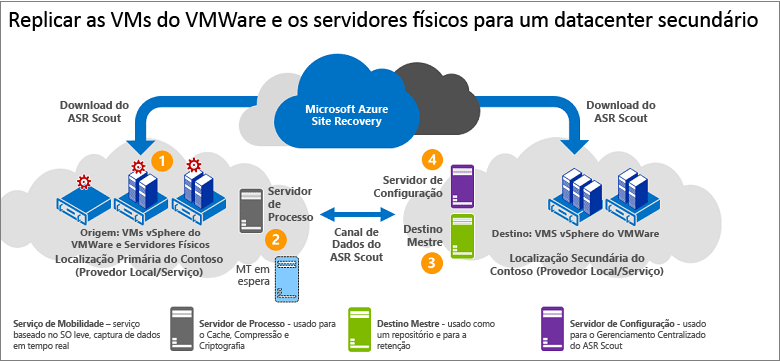

# Arquitetura para replicação do VMware/servidor físico para um site local secundário

Este artigo descreve a arquitetura e os processos utilizados ao fazer a recuperação de desastre, o failover e a recuperação de VMs (máquinas virtuais) do VMware ou servidores físicos do Windows/Linux para um site VMware secundário utilizando o [Azure Site Recovery](site-recovery-overview.md).

## Componentes de arquitetura

**Área** | **Componente** | **Detalhes**
--- | --- | ---
**As tabelas** | Implante este cenário usando o InMage Scout. | Para obter o InMage Scout, você precisa de uma assinatura do Azure.   Depois de criar um cofre de Serviços de Recuperação, baixe o InMage Scout e instale as atualizações mais recentes para configurar a implantação.
**Servidor de processo** | Localizado no site primário | Implante o servidor de processo para manipular o caching, a compactação e a otimização de dados.   Ele também trata da instalação por push do Agente Unificado nas máquinas que você deseja proteger.
**Servidor de configuração** | Localizado no site secundário | O servidor de configuração gerencia, configura e monitora sua implantação, usando o site de gerenciamento ou o console do vContinuum.
**Servidor vContinuum** | Opcional. Instalado no mesmo local que o servidor de configuração. | Ele fornece um console para o gerenciamento e monitoramento de seu ambiente protegido.
**Servidor de destino mestre** | Localizado no site secundário | O servidor de destino mestre armazena os dados replicados. Ele recebe os dados do servidor de processo, cria uma máquina de réplica no site secundário e mantém os pontos de retenção dos dados.   O número de servidores de destino mestre necessário depende do número de máquinas que você está protegendo.   Se você quiser realizar o failback no site primário, também precisará de um servidor de destino mestre nesse local. O Agente Unificado está instalado neste servidor.
**Servidor VMware ESX/ESXi e vCenter** |  VMs são hospedadas em hosts ESX/ESXi. Hosts são gerenciados com um servidor do vCenter | Você precisa de uma infraestrutura do VMware para replicar VMs VMware.
**VMs/servidores físicos** |  Agente Unificado instalado em VMs VMware ou em servidores físicos que você deseja replicar. | O agente atua como um provedor de comunicação entre todos os componentes.

## Processo de replicação

1. Configure os servidores de componente em cada site (configuração, processo, destino mestre) e instale o Agente Unificado nos computadores que você deseja replicar.
2. Após a replicação inicial, os agentes em cada computador enviam as alterações de replicação delta para o servidor de processo.
3. O servidor de processo otimiza os dados e os transfere para o servidor de destino mestre no site secundário. O servidor de configuração gerencia o processo de replicação.

**Figura 6: Replicação de VMware para VMware**

## Próximas etapas

[Configurar](vmware-physical-secondary-disaster-recovery.md) a recuperação de desastres das VMs do VMware e dos servidores físicos em um site secundário.
