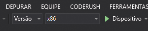

# Início rápido: Criar um aplicativo HoloLens Unity usando Âncoras Espaciais do Azure

Este Início Rápido aborda como criar um aplicativo HoloLens Unity usando [Âncoras Espaciais do Azure](../overview.md). As Âncoras Espaciais do Azure são um serviço de desenvolvedor multiplataforma para você criar experiências de realidade misturada usando objetos que persistem sua localização em todos os dispositivos ao longo do tempo. Quando terminar, você terá um aplicativo HoloLens criado com o Unity que pode salvar e fazer recall de uma âncora espacial.

Você aprenderá a:

> [!div class="checklist"]
> * Criar uma conta de Âncoras Espaciais
> * Preparar as configurações de build do Unity
> * Configurar o identificador e a chave de conta das Âncoras Espaciais
> * Exportar o projeto do Visual Studio do HoloLens
> * Implantar e executar em um dispositivo do HoloLens

[!INCLUDE [quickstarts-free-trial-note](../../../includes/quickstarts-free-trial-note.md)]

## Pré-requisitos

Para concluir este início rápido, certifique-se de que:

- Um computador Windows com <a href="https://unity3d.com/get-unity/download" target="_blank">Unity 2018.3+</a> e <a href="https://www.visualstudio.com/downloads/" target="_blank">Visual Studio 2017+</a> instalado com a carga de trabalho de **desenvolvimento da Plataforma Universal do Windows**.
- Um dispositivo do HoloLens com o [modo de desenvolvedor](https://docs.microsoft.com/windows/mixed-reality/using-visual-studio) habilitado.
- Seu aplicativo deve definir a funcionalidade **SpatialPerception** em **Configurações de Build**->**Configurações do Player**->**Configurações Publicação**->**Funcionalidade**.
- Seu aplicativo deve habilitar **Suporte para Realidade Virtual** com **SDK do Windows Mixed Reality** em **Configurações de Build**->**Configurações do Player**->**Configurações do XR**.

[!INCLUDE [Create Spatial Anchors resource](../../../includes/spatial-anchors-get-started-create-resource.md)]

## Abrir o projeto de exemplo no Unity

[!INCLUDE [Clone Sample Repo](../../../includes/spatial-anchors-clone-sample-repository.md)]

Abra o Unity e abra o projeto na pasta `Unity`.

Abra **Configurações de Build** selecionando **Arquivo** -> **Configurações de Build**.

Na seção **Plataforma**, selecione **Plataforma Universal do Windows**. Em seguida, mude o **Dispositivo de Destino** para **HoloLens**.

Selecione **Alternar Plataforma** para alterar a plataforma para a **Plataforma Universal do Windows**.

Feche a janela **Configurações de Build**.

## Configurar a chave e o identificador da conta

No painel **Projeto**, navegue para `Assets/AzureSpatialAnchorsPlugin/Examples` e abra o arquivo de cena `AzureSpatialAnchorsBasicDemo.unity`.

[!INCLUDE [Configure Unity Scene](../../../includes/spatial-anchors-unity-configure-scene.md)]

Salve a cena selecionando **Arquivo** -> **Salvar**.

## Exportar o projeto do Visual Studio do HoloLens

[!INCLUDE [Export Unity Project](../../../includes/spatial-anchors-unity-export-project-snip.md)]

Selecione **Build** para abrir uma caixa de diálogo. Em seguida, selecione uma pasta para exportar o projeto do Visual Studio do HoloLens.

Quando a exportação for concluída, será exibida uma pasta que contém o projeto do HoloLens exportado.

## Implantar o aplicativo HoloLens

Na pasta, clique duas vezes em `HelloAR U3D.sln` para abrir o projeto no Visual Studio.

Altere a **Configuração da Solução** para **Lançamento**, altere **Plataforma da Solução** para **x86** e selecione **Dispositivo** entre as opções de destino de implantação.

Ligue o dispositivo do HoloLens, entre nele e conecte-o ao computador usando um cabo USB.

Selecione **Depurar** > **Iniciar depuração** para implantar seu aplicativo e iniciar a depuração.

Siga as instruções no aplicativo para colocar uma âncora e fazer recall dela.

No Visual Studio, pare o aplicativo selecionando **Parar Depuração** ou pressionando **Shift + F5**.

[!INCLUDE [Clean-up section](../../../includes/clean-up-section-portal.md)]

[!INCLUDE [Next steps](../../../includes/spatial-anchors-quickstarts-nextsteps.md)]

> [!div class="nextstepaction"]
> [Tutorial: Compartilhar as Âncoras Espaciais nos dispositivos](../tutorials/tutorial-share-anchors-across-devices.md)
