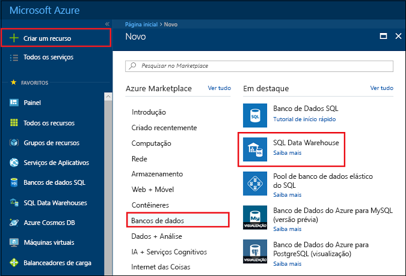
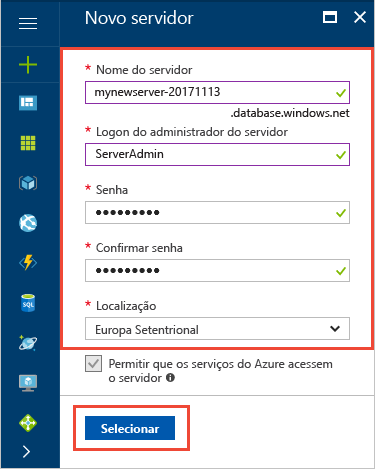
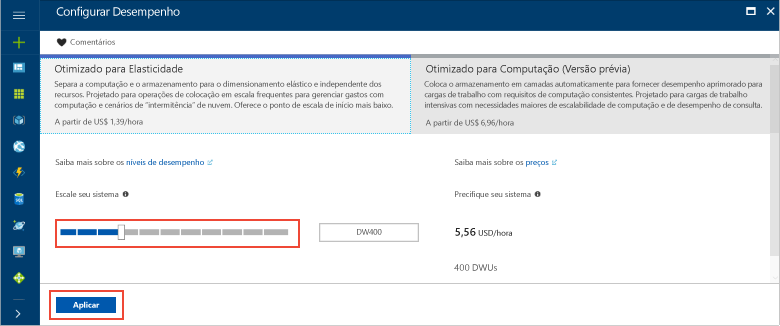
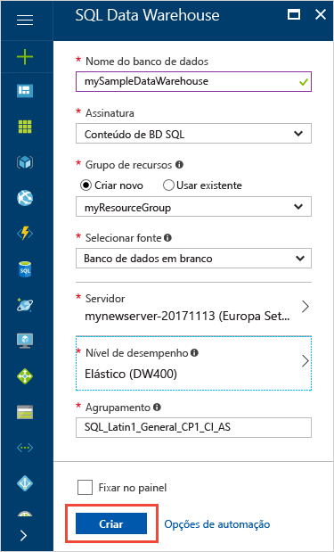
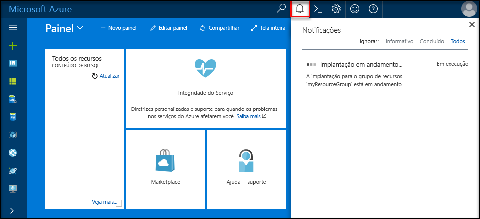
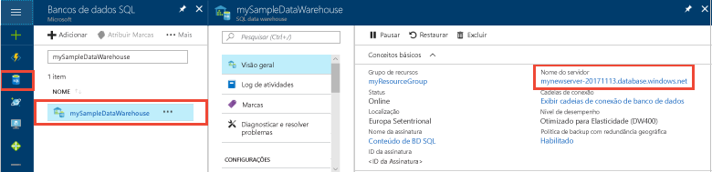
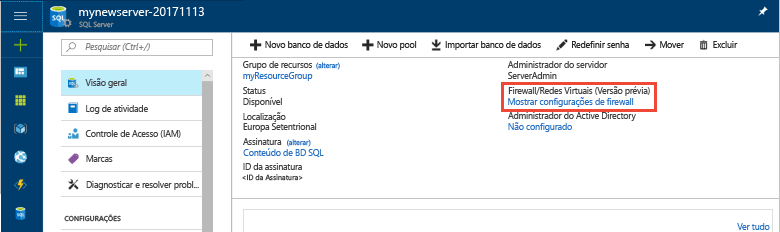
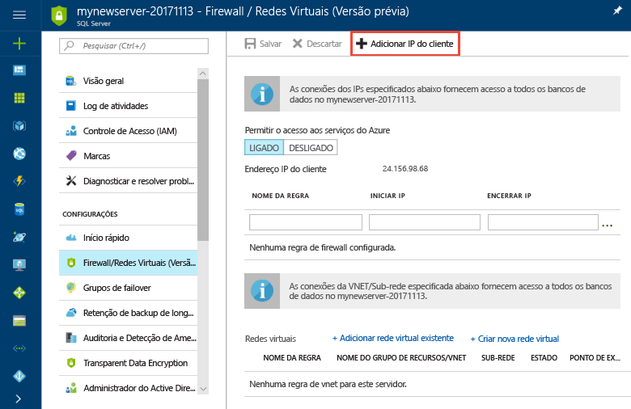
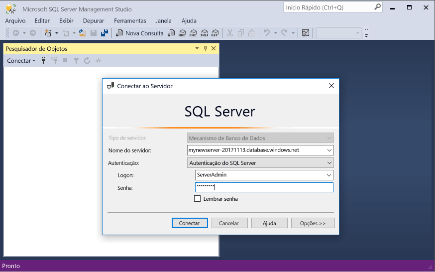

# <a name="tutorial-load-new-york-taxicab-data-to-azure-sql-data-warehouse"></a>Tutorial: Carregar dados dos táxis de Nova York para o SQL Data Warehouse do Azure

Este tutorial usa o PolyBase para carregar dados dos táxis de Nova York de um blob público do Azure para o SQL Data Warehouse do Azure. Este tutorial usa o [Portal do Azure](https://portal.azure.com) e o [SSMS](/sql/ssms/download-sql-server-management-studio-ssms) (SQL Server Management Studio) para: 

> [!div class="checklist"]
> * Criar um data warehouse no Portal do Azure
> * Configurar uma regra de firewall de nível de servidor no Portal do Azure
> * Conectar-se ao data warehouse com o SSMS
> * Criar um usuário designado para carregar dados
> * Criar tabelas externas para dados no armazenamento de blobs do Azure
> * Usar a instrução CTAS T-SQL para carregar dados para seu data warehouse
> * Exibir o andamento dos dados enquanto estão sendo carregados
> * Criar estatísticas sobre os dados recém-carregados

Se você não tiver uma assinatura do Azure, [crie uma conta gratuita](https://azure.microsoft.com/free/) antes de começar.

## <a name="before-you-begin"></a>Antes de começar

Antes de iniciar este tutorial, baixe e instale a versão mais recente do [SSMS](/sql/ssms/download-sql-server-management-studio-ssms) (SQL Server Management Studio).


## <a name="log-in-to-the-azure-portal"></a>Faça logon no Portal do Azure

Faça logon no [Portal do Azure](https://portal.azure.com/).

## <a name="create-a-blank-sql-data-warehouse"></a>Criar um SQL data warehouse em branco

Um SQL Data Warehouse do Azure é criado com um conjunto definido de [recursos de computação](memory-and-concurrency-limits.md). O banco de dados é criado dentro de um [grupo de recursos do Azure](../azure-resource-manager/resource-group-overview.md) e em um [servidor lógico SQL do Azure](../sql-database/sql-database-features.md). 

Siga estas etapas para criar um SQL data warehouse em branco. 

1. Clique em **Criar um recurso** no canto superior esquerdo do Portal do Azure.

2. Selecione **Bancos de dados** na página **Novo** e selecione **SQL Data Warehouse** em **Em destaque** na página **Novo**.

    

3. Preencha o formulário do SQL Data Warehouse com as seguintes informações:   

   | Configuração | Valor sugerido | DESCRIÇÃO | 
   | ------- | --------------- | ----------- | 
   | **Nome do banco de dados** | meuDataWarehouseDeExemplo | Para ver os nomes do banco de dados válidos, consulte [Identificadores do Banco de Dados](/sql/relational-databases/databases/database-identifiers). | 
   | **Assinatura** | Sua assinatura  | Para obter detalhes sobre suas assinaturas, consulte [Assinaturas](https://account.windowsazure.com/Subscriptions). |
   | **Grupo de recursos** | myResourceGroup | Para ver os nomes do grupo de recursos válidos, consulte [Regras e restrições de nomenclatura](https://docs.microsoft.com/azure/architecture/best-practices/naming-conventions). |
   | **Selecionar fonte** | Banco de dados em branco | Especifique para criar um banco de dados em branco. Observe que um data warehouse é um tipo de banco de dados.|

    

4. Clique em **Servidor** para criar e configurar um novo servidor para o novo banco de dados. Preencha o **formulário Novo servidor** com as seguintes informações: 

    | Configuração | Valor sugerido | DESCRIÇÃO | 
    | ------- | --------------- | ----------- |
    | **Nome do servidor** | Qualquer nome exclusivo globalmente | Para ver os nomes do servidor válidos, consulte [Regras e restrições de nomenclatura](https://docs.microsoft.com/azure/architecture/best-practices/naming-conventions). | 
    | **Logon de administrador do servidor** | Qualquer nome válido | Para ver os nomes de logon válidos, consulte [Identificadores do Banco de Dados](https://docs.microsoft.com/sql/relational-databases/databases/database-identifiers).|
    | **Senha** | Qualquer senha válida | Sua senha deve ter, pelo menos, oito caracteres e deve conter caracteres de três das seguintes categorias: caracteres com letras maiúsculas, letras minúsculas, números e caracteres não alfanuméricos. |
    | **Localidade** | Qualquer local válido | Para obter mais informações sobre as regiões, consulte [Regiões do Azure](https://azure.microsoft.com/regions/). |

    

5. Clique em **Selecionar**.

6. Clique em **Nível de desempenho** para especificar se o data warehouse é Gen1 ou Gen2 e o número de unidades do data warehouse. 

7. Para este tutorial, selecione **Gen2** do SQL Data Warehouse. O controle deslizante é definido como **DW1000c** por padrão.  Experimente movê-lo para cima e para baixo para ver como ele funciona. 

    

8. Clique em **Aplicar**.
9. Na página do SQL Data Warehouse, selecione uma **ordenação** para o banco de dados em branco. Neste tutorial, use o valor padrão. Para obter mais informações sobre ordenações, confira [Ordenações](/sql/t-sql/statements/collations)

11. Agora que você concluiu o formulário do Banco de Dados SQL, clique em **Criar** para provisionar o banco de dados. O provisionamento demora alguns minutos. 

    

12. Na barra de ferramentas, clique em **Notificações** para monitorar o processo de implantação.
    
     

## <a name="create-a-server-level-firewall-rule"></a>Criar uma regra de firewall no nível de servidor

O serviço do SQL Data Warehouse cria um firewall no nível do servidor que impede que os aplicativos e ferramentas externos conectem-se ao servidor ou a bancos de dados no servidor. Para habilitar a conectividade, é possível adicionar regras de firewall que habilitem a conectividade para endereços IP específicos.  Siga estas etapas para criar uma [regra de firewall de nível de servidor](../sql-database/sql-database-firewall-configure.md) para o endereço IP do seu cliente. 

> [!NOTE]
> O SQL Data Warehouse comunica-se pela porta 1433. Se você estiver tentando conectar-se de dentro de uma rede corporativa, o tráfego de saída pela porta 1433 talvez não seja permitido pelo firewall de sua rede. Se isto acontecer, você não poderá conectar o servidor do Banco de Dados SQL do Azure, a menos que o departamento de TI abra a porta 1433.
>

1. Depois da implantação ser concluída, clique em **Bancos de dados SQL** no menu à esquerda, depois, clique em **mySampleDatabase** na página **Bancos de dados SQL**. A página de visão geral de seu banco de dados é aberta, mostrando o nome do servidor totalmente qualificado (como **meunovoservidor-20180430.database.windows.net**) e fornece opções para configurações adicionais. 

2. Copie esse nome do servidor totalmente qualificado para se conectar ao servidor e a seus bancos de dados nos próximos guias de início rápido. Em seguida, clique no nome do servidor para abrir as configurações do servidor.

     

3. Clique no nome do servidor para abrir as configurações do servidor.

     

5. Clique em **Mostrar configurações de firewall**. A página **Configurações do firewall** do servidor do Banco de Dados SQL é aberta. 

     

4. Clique em **Adicionar IP do cliente** na barra de ferramentas para adicionar seu endereço IP atual a uma nova regra de firewall. Uma regra de firewall pode abrir a porta 1433 para um único endereço IP ou um intervalo de endereços IP.

5. Clique em **Salvar**. Uma regra de firewall no nível do servidor é criada para a porta de abertura 1433 de seu endereço IP atual no servidor lógico.

6. Clique em **OK**, em seguida, feche a página **Configurações do Firewall**.

Agora é possível conectar-se ao SQL Server e a seus data warehouses usando este endereço IP. A conexão funciona no SQL Server Management Studio ou em outra ferramenta de sua escolha. Quando você se conectar, use a conta ServerAdmin criada anteriormente.  

> [!IMPORTANT]
> Por padrão, o acesso através do firewall do Banco de Dados SQL está habilitado para todos os serviços do Azure. Clique em **DESLIGAR** nesta página e, em seguida, clique em **Salvar** para desabilitar o firewall para todos os serviços do Azure.

## <a name="get-the-fully-qualified-server-name"></a>Obter o nome do servidor totalmente qualificado

Obtenha o nome do servidor totalmente qualificado para seu SQL Server no Portal do Azure. Posteriormente, você usará o nome totalmente qualificado ao se conectar ao servidor.

1. Faça logon no [Portal do Azure](https://portal.azure.com/).
2. Selecione **SQL Data Warehouse** no menu à esquerda e clique em seu banco de dados na página **SQL Data Warehouse**. 
3. No painel **Essentials**, na página do Portal do Azure de seu banco de dados, localize e copie o **Nome do servidor**. Neste exemplo, o nome totalmente qualificado é meunovoservidor-20180430.database.windows.net. 

      

## <a name="connect-to-the-server-as-server-admin"></a>Conectar-se ao servidor como administrador do servidor

Esta seção usa o [SSMS](/sql/ssms/download-sql-server-management-studio-ssms) (SQL Server Management Studio) para estabelecer uma conexão com o SQL Server do Azure.

1. Abra o SQL Server Management Studio.

2. Na caixa de diálogo **Conectar ao Servidor**, insira as informações a seguir:

    | Configuração      | Valor sugerido | DESCRIÇÃO | 
    | ------------ | --------------- | ----------- | 
    | Tipo de servidor | Mecanismo de banco de dados | Esse valor é obrigatório |
    | Nome do servidor | O nome do servidor totalmente qualificado | O nome deve ser semelhante a este: **mynewserver-20180430.database.windows.net**. |
    | Authentication | Autenticação do SQL Server | A Autenticação do SQL é o único tipo de autenticação que configuramos neste tutorial. |
    | Logon | A conta do administrador do servidor | Esta é a conta que você especificou quando criou o servidor. |
    | Senha | A senha para sua conta do administrador do servidor | Esta é a senha que você especificou quando criou o servidor. |

    

4. Clique em **Conectar**. A janela Pesquisador de Objetos abre no SSMS. 

5. No Pesquisador de Objetos, expanda **Bancos de dados**. Em seguida, expanda **Bancos de dados do sistema** e **mestre** para exibir os objetos no banco de dados mestre.  Expanda **mySampleDatabase** para exibir os objetos no novo banco de dados.

     

## <a name="create-a-user-for-loading-data"></a>Criar um usuário para carregar dados

A conta do administrador do servidor é destinada a executar operações de gerenciamento, e não é adequada para executar consultas nos dados do usuário. O carregamento de dados é uma operação com uso intensivo de memória. Os máximos de memória são definidos de acordo com a Geração do SQL Data Warehouse que tiver provisionado, as [unidades de data warehouse](what-is-a-data-warehouse-unit-dwu-cdwu.md) e [classe de recurso](resource-classes-for-workload-management.md). 

É melhor criar um logon e um usuário dedicados para carregar dados. Em seguida, adicione o usuário carregado a uma [classe de recurso](resource-classes-for-workload-management.md) que permita uma alocação máxima de memória adequada.

Como você está, no momento, conectado como o administrador do servidor, é possível criar logons e usuários. Use estas etapas para criar um logon e um usuário chamado **LoaderRC20**. Em seguida, atribua o usuário à classe de recurso **staticrc20**. 

1.  No SSMS, clique com o botão direito do mouse em **mestre** para mostrar um menu suspenso e escolha **Nova consulta**. Uma nova janela de consulta é aberta.

    

2. Na janela de consulta, insira esses comandos T-SQL para criar um logon e um usuário chamado LoaderRC20, substituindo sua própria senha para 'a123STRONGpassword!'. 

    ```sql
    CREATE LOGIN LoaderRC20 WITH PASSWORD = 'a123STRONGpassword!';
    CREATE USER LoaderRC20 FOR LOGIN LoaderRC20;
    ```

3. Clique em **Executar**.

4. Clique com o botão direito do mouse em **mySampleDataWarehouse** e escolha **Nova consulta**. Uma nova janela de consulta é aberta.  

    
 
5. Insira os comandos T-SQL a seguir para criar um usuário de banco de dados chamado LoaderRC20 para o logon LoaderRC20. A segunda linha concede ao novo usuário permissões de CONTROLE sobre o novo data warehouse.  Essas permissões são semelhantes para tornar o usuário o proprietário do banco de dados. A terceira linha adiciona o novo usuário como um membro da [classe de recurso](resource-classes-for-workload-management.md) staticrc20.

    ```sql
    CREATE USER LoaderRC20 FOR LOGIN LoaderRC20;
    GRANT CONTROL ON DATABASE::[mySampleDataWarehouse] to LoaderRC20;
    EXEC sp_addrolemember 'staticrc20', 'LoaderRC20';
    ```

6. Clique em **Executar**.

## <a name="connect-to-the-server-as-the-loading-user"></a>Conectar-se ao servidor como o usuário carregado

A primeira etapa para carregar os dados é fazer logon como LoaderRC20.  

1. No Pesquisador de Objetos, clique no menu suspenso **Conectar** e selecione **Mecanismo de Banco de Dados**. A caixa de diálogo **Conectar-se ao Servidor** é exibida.

    

2. Insira o nome do servidor totalmente qualificado, e vez insira **LoaderRC20** como o Logon.  Insira sua senha para LoaderRC20.

3. Clique em **Conectar**.

4. Quando sua conexão estiver pronta, você verá duas conexões de servidor no Pesquisador de Objetos. Uma conexão como ServerAdmin e outra como MedRCLogin.

    

## <a name="create-external-tables-for-the-sample-data"></a>Criar tabelas externas para os dados de exemplo

Você está pronto para iniciar o processo de carregamento de dados em seu novo data warehouse. Este tutorial mostra como usar tabelas externas para carregar dados dos táxis de Nova York de um Azure Storage Blob. Para uma referência futura, para saber como obter os dados para o armazenamento de blobs do Azure ou carregá-los diretamente do seu código-fonte no SQL Data Warehouse, consulte a [visão geral do carregamento](sql-data-warehouse-overview-load.md).

Execute os seguintes scripts SQL especificam informações sobre os dados que deseja carregar. Essas informações incluem o local em que os dados estão localizados, o formato do conteúdo dos dados e a definição da tabela para os dados. 

1. Na seção anterior, você fez logon em seu data warehouse como LoaderRC20. No SSMS, clique com o botão direito do mouse em sua conexão LoaderRC20 e selecione **Nova consulta**.  Uma nova janela de consulta é exibida. 

    

2. Compare a janela de consulta com a imagem anterior.  Verifique se a nova janela de consulta está em execução como LoaderRC20 e está executando consultas no banco de dados MySampleDataWarehouse. Use essa janela de consulta para executar todas as etapas de carregamento.

3. Crie uma chave mestra para o banco de dados MySampleDataWarehouse. Você só precisa criar uma chave mestra uma vez por banco de dados. 

    ```sql
    CREATE MASTER KEY;
    ```

4. Execute a seguinte instrução [CREATE EXTERNAL DATA SOURCE](/sql/t-sql/statements/create-external-data-source-transact-sql) para definir o local do blob do Azure. Esse é o local dos dados de táxis externos.  Para executar um comando que você acrescentou à janela de consulta, realce os comandos que deseja executar e clique em **Executar**.

    ```sql
    CREATE EXTERNAL DATA SOURCE NYTPublic
    WITH
    (
        TYPE = Hadoop,
        LOCATION = 'wasbs://2013@nytaxiblob.blob.core.windows.net/'
    );
    ```

5. Execute a seguinte instrução T-SQL [CREATE EXTERNAL FILE FORMAT](/sql/t-sql/statements/create-external-file-format-transact-sql) para especificar opções e características de formatação para o arquivo de dados externo. Essa instrução especifica que os dados externos são armazenados como texto, e os valores são separados pelo caractere barra vertical ('|'). O arquivo externo é compactado com Gzip. 

    ```sql
    CREATE EXTERNAL FILE FORMAT uncompressedcsv
    WITH (
        FORMAT_TYPE = DELIMITEDTEXT,
        FORMAT_OPTIONS ( 
            FIELD_TERMINATOR = ',',
            STRING_DELIMITER = '',
            DATE_FORMAT = '',
            USE_TYPE_DEFAULT = False
        )
    );
    CREATE EXTERNAL FILE FORMAT compressedcsv
    WITH ( 
        FORMAT_TYPE = DELIMITEDTEXT,
        FORMAT_OPTIONS ( FIELD_TERMINATOR = '|',
            STRING_DELIMITER = '',
        DATE_FORMAT = '',
            USE_TYPE_DEFAULT = False
        ),
        DATA_COMPRESSION = 'org.apache.hadoop.io.compress.GzipCodec'
    );
    ```

6.  Execute a seguinte instrução [CREATE SCHEMA](/sql/t-sql/statements/create-schema-transact-sql) para criar um esquema para o formato de arquivo externo. O esquema fornece uma maneira de organizar as tabelas externas que você está prestes a criar.

    ```sql
    CREATE SCHEMA ext;
    ```

7. Crie as tabelas externas. As definições de tabela são armazenadas no SQL Data Warehouse, mas os dados de referência de tabela são armazenados no armazenamento de blobs do Azure. Execute os seguintes comandos T-SQL para criar várias tabelas externas que apontam para o blob do Azure definido anteriormente na nossa fonte de dados externa.

    ```sql
    CREATE EXTERNAL TABLE [ext].[Date] 
    (
        [DateID] int NOT NULL,
        [Date] datetime NULL,
        [DateBKey] char(10) COLLATE SQL_Latin1_General_CP1_CI_AS NULL,
        [DayOfMonth] varchar(2) COLLATE SQL_Latin1_General_CP1_CI_AS NULL,
        [DaySuffix] varchar(4) COLLATE SQL_Latin1_General_CP1_CI_AS NULL,
        [DayName] varchar(9) COLLATE SQL_Latin1_General_CP1_CI_AS NULL,
        [DayOfWeek] char(1) COLLATE SQL_Latin1_General_CP1_CI_AS NULL,
        [DayOfWeekInMonth] varchar(2) COLLATE SQL_Latin1_General_CP1_CI_AS NULL,
        [DayOfWeekInYear] varchar(2) COLLATE SQL_Latin1_General_CP1_CI_AS NULL,
        [DayOfQuarter] varchar(3) COLLATE SQL_Latin1_General_CP1_CI_AS NULL,
        [DayOfYear] varchar(3) COLLATE SQL_Latin1_General_CP1_CI_AS NULL,
        [WeekOfMonth] varchar(1) COLLATE SQL_Latin1_General_CP1_CI_AS NULL,
        [WeekOfQuarter] varchar(2) COLLATE SQL_Latin1_General_CP1_CI_AS NULL,
        [WeekOfYear] varchar(2) COLLATE SQL_Latin1_General_CP1_CI_AS NULL,
        [Month] varchar(2) COLLATE SQL_Latin1_General_CP1_CI_AS NULL,
        [MonthName] varchar(9) COLLATE SQL_Latin1_General_CP1_CI_AS NULL,
        [MonthOfQuarter] varchar(2) COLLATE SQL_Latin1_General_CP1_CI_AS NULL,
        [Quarter] char(1) COLLATE SQL_Latin1_General_CP1_CI_AS NULL,
        [QuarterName] varchar(9) COLLATE SQL_Latin1_General_CP1_CI_AS NULL,
        [Year] char(4) COLLATE SQL_Latin1_General_CP1_CI_AS NULL,
        [YearName] char(7) COLLATE SQL_Latin1_General_CP1_CI_AS NULL,
        [MonthYear] char(10) COLLATE SQL_Latin1_General_CP1_CI_AS NULL,
        [MMYYYY] char(6) COLLATE SQL_Latin1_General_CP1_CI_AS NULL,
        [FirstDayOfMonth] date NULL,
        [LastDayOfMonth] date NULL,
        [FirstDayOfQuarter] date NULL,
        [LastDayOfQuarter] date NULL,
        [FirstDayOfYear] date NULL,
        [LastDayOfYear] date NULL,
        [IsHolidayUSA] bit NULL,
        [IsWeekday] bit NULL,
        [HolidayUSA] varchar(50) COLLATE SQL_Latin1_General_CP1_CI_AS NULL
    )
    WITH
    (
        LOCATION = 'Date',
        DATA_SOURCE = NYTPublic,
        FILE_FORMAT = uncompressedcsv,
        REJECT_TYPE = value,
        REJECT_VALUE = 0
    ); 
    CREATE EXTERNAL TABLE [ext].[Geography]
    (
        [GeographyID] int NOT NULL,
        [ZipCodeBKey] varchar(10) COLLATE SQL_Latin1_General_CP1_CI_AS NOT NULL,
        [County] varchar(50) COLLATE SQL_Latin1_General_CP1_CI_AS NULL,
        [City] varchar(50) COLLATE SQL_Latin1_General_CP1_CI_AS NULL,
        [State] varchar(50) COLLATE SQL_Latin1_General_CP1_CI_AS NULL,
        [Country] varchar(50) COLLATE SQL_Latin1_General_CP1_CI_AS NULL,
        [ZipCode] varchar(50) COLLATE SQL_Latin1_General_CP1_CI_AS NULL
    )
    WITH
    (
        LOCATION = 'Geography',
        DATA_SOURCE = NYTPublic,
        FILE_FORMAT = uncompressedcsv,
        REJECT_TYPE = value,
        REJECT_VALUE = 0 
    );      
    CREATE EXTERNAL TABLE [ext].[HackneyLicense]
    (
        [HackneyLicenseID] int NOT NULL,
        [HackneyLicenseBKey] varchar(50) COLLATE SQL_Latin1_General_CP1_CI_AS NOT NULL,
        [HackneyLicenseCode] varchar(50) COLLATE SQL_Latin1_General_CP1_CI_AS NULL
    )
    WITH
    (
        LOCATION = 'HackneyLicense',
        DATA_SOURCE = NYTPublic,
        FILE_FORMAT = uncompressedcsv,
        REJECT_TYPE = value,
        REJECT_VALUE = 0
    );
    CREATE EXTERNAL TABLE [ext].[Medallion]
    (
        [MedallionID] int NOT NULL,
        [MedallionBKey] varchar(50) COLLATE SQL_Latin1_General_CP1_CI_AS NOT NULL,
        [MedallionCode] varchar(50) COLLATE SQL_Latin1_General_CP1_CI_AS NULL
    )
    WITH
    (
        LOCATION = 'Medallion',
        DATA_SOURCE = NYTPublic,
        FILE_FORMAT = uncompressedcsv,
        REJECT_TYPE = value,
        REJECT_VALUE = 0
    )
    ;  
    CREATE EXTERNAL TABLE [ext].[Time]
    (
        [TimeID] int NOT NULL,
        [TimeBKey] varchar(8) COLLATE SQL_Latin1_General_CP1_CI_AS NOT NULL,
        [HourNumber] tinyint NOT NULL,
        [MinuteNumber] tinyint NOT NULL,
        [SecondNumber] tinyint NOT NULL,
        [TimeInSecond] int NOT NULL,
        [HourlyBucket] varchar(15) COLLATE SQL_Latin1_General_CP1_CI_AS NOT NULL,
        [DayTimeBucketGroupKey] int NOT NULL,
        [DayTimeBucket] varchar(100) COLLATE SQL_Latin1_General_CP1_CI_AS NOT NULL
    )
    WITH
    (
        LOCATION = 'Time',
        DATA_SOURCE = NYTPublic,
        FILE_FORMAT = uncompressedcsv,
        REJECT_TYPE = value,
        REJECT_VALUE = 0
    );
    CREATE EXTERNAL TABLE [ext].[Trip]
    (
        [DateID] int NOT NULL,
        [MedallionID] int NOT NULL,
        [HackneyLicenseID] int NOT NULL,
        [PickupTimeID] int NOT NULL,
        [DropoffTimeID] int NOT NULL,
        [PickupGeographyID] int NULL,
        [DropoffGeographyID] int NULL,
        [PickupLatitude] float NULL,
        [PickupLongitude] float NULL,
        [PickupLatLong] varchar(50) COLLATE SQL_Latin1_General_CP1_CI_AS NULL,
        [DropoffLatitude] float NULL,
        [DropoffLongitude] float NULL,
        [DropoffLatLong] varchar(50) COLLATE SQL_Latin1_General_CP1_CI_AS NULL,
        [PassengerCount] int NULL,
        [TripDurationSeconds] int NULL,
        [TripDistanceMiles] float NULL,
        [PaymentType] varchar(50) COLLATE SQL_Latin1_General_CP1_CI_AS NULL,
        [FareAmount] money NULL,
        [SurchargeAmount] money NULL,
        [TaxAmount] money NULL,
        [TipAmount] money NULL,
        [TollsAmount] money NULL,
        [TotalAmount] money NULL
    )
    WITH
    (
        LOCATION = 'Trip2013',
        DATA_SOURCE = NYTPublic,
        FILE_FORMAT = compressedcsv,
        REJECT_TYPE = value,
        REJECT_VALUE = 0
    );
    CREATE EXTERNAL TABLE [ext].[Weather]
    (
        [DateID] int NOT NULL,
        [GeographyID] int NOT NULL,
        [PrecipitationInches] float NOT NULL,
        [AvgTemperatureFahrenheit] float NOT NULL
    )
    WITH
    (
        LOCATION = 'Weather',
        DATA_SOURCE = NYTPublic,
        FILE_FORMAT = uncompressedcsv,
        REJECT_TYPE = value,
        REJECT_VALUE = 0
    )
    ;
    ```

8. No Pesquisador de Objetos, expanda mySampleDataWarehouse para ver a lista de tabelas externas que você acabou de criar.

    

## <a name="load-the-data-into-your-data-warehouse"></a>Carregar os dados em seu data warehouse

Esta seção usa as tabelas externas que você acabou de definir para carregar os dados de exemplo do Azure Storage Blob para o SQL Data Warehouse.  

> [!NOTE]
> Este tutorial carrega os dados diretamente na tabela final. Em um ambiente de produção, você normalmente usará CREATE TABLE AS SELECT para carregar em uma tabela de preparo. Enquanto os dados estão na tabela de preparo, você pode executar todas as transformações necessárias. Para acrescentar os dados na tabela de preparo a uma tabela de produção, você pode usar a instrução INSERT...SELECT. Para saber mais, confira [Inserindo dados em uma tabela de produção](guidance-for-loading-data.md#inserting-data-into-a-production-table).
> 

O script usa a instrução T-SQL [CTAS (CREATE TABLE AS SELECT)](/sql/t-sql/statements/create-table-as-select-azure-sql-data-warehouse) para carregar os dados do Azure Storage Blob para novas tabelas no data warehouse. A CTAS cria uma nova tabela com base nos resultados de uma instrução select. A nova tabela tem as mesmas colunas e tipos de dados que os resultados da instrução select. Quando a instrução select seleciona de uma tabela externa, o SQL Data Warehouse importa os dados para uma tabela relacional no data warehouse. 

1. Execute o seguinte script para carregar os dados para novas tabelas no data warehouse.

    ```sql
    CREATE TABLE [dbo].[Date]
    WITH
    ( 
        DISTRIBUTION = ROUND_ROBIN,
        CLUSTERED COLUMNSTORE INDEX
    )
    AS SELECT * FROM [ext].[Date]
    OPTION (LABEL = 'CTAS : Load [dbo].[Date]')
    ;
    CREATE TABLE [dbo].[Geography]
    WITH
    ( 
        DISTRIBUTION = ROUND_ROBIN,
        CLUSTERED COLUMNSTORE INDEX
    )
    AS
    SELECT * FROM [ext].[Geography]
    OPTION (LABEL = 'CTAS : Load [dbo].[Geography]')
    ;
    CREATE TABLE [dbo].[HackneyLicense]
    WITH
    ( 
        DISTRIBUTION = ROUND_ROBIN,
        CLUSTERED COLUMNSTORE INDEX
    )
    AS SELECT * FROM [ext].[HackneyLicense]
    OPTION (LABEL = 'CTAS : Load [dbo].[HackneyLicense]')
    ;
    CREATE TABLE [dbo].[Medallion]
    WITH
    (
        DISTRIBUTION = ROUND_ROBIN,
        CLUSTERED COLUMNSTORE INDEX
    )
    AS SELECT * FROM [ext].[Medallion]
    OPTION (LABEL = 'CTAS : Load [dbo].[Medallion]')
    ;
    CREATE TABLE [dbo].[Time]
    WITH
    (
        DISTRIBUTION = ROUND_ROBIN,
        CLUSTERED COLUMNSTORE INDEX
    )
    AS SELECT * FROM [ext].[Time]
    OPTION (LABEL = 'CTAS : Load [dbo].[Time]')
    ;
    CREATE TABLE [dbo].[Weather]
    WITH
    ( 
        DISTRIBUTION = ROUND_ROBIN,
        CLUSTERED COLUMNSTORE INDEX
    )
    AS SELECT * FROM [ext].[Weather]
    OPTION (LABEL = 'CTAS : Load [dbo].[Weather]')
    ;
    CREATE TABLE [dbo].[Trip]
    WITH
    (
        DISTRIBUTION = ROUND_ROBIN,
        CLUSTERED COLUMNSTORE INDEX
    )
    AS SELECT * FROM [ext].[Trip]
    OPTION (LABEL = 'CTAS : Load [dbo].[Trip]')
    ;
    ```

2. Exiba os dados enquanto eles são carregados. Você está carregando vários GBs de dados e compactando-os em índices columnstore de cluster de alto desempenho. Execute a consulta a seguir que usa DMVs (exibições de gerenciamento dinâmico) para mostrar o status do carregamento. Após iniciar a consulta, pegue um café e alguns biscoitos enquanto o SQL Data Warehouse faz o trabalho pesado.

    ```sql
    SELECT
        r.command,
        s.request_id,
        r.status,
        count(distinct input_name) as nbr_files,
        sum(s.bytes_processed)/1024/1024/1024.0 as gb_processed
    FROM 
        sys.dm_pdw_exec_requests r
        INNER JOIN sys.dm_pdw_dms_external_work s
        ON r.request_id = s.request_id
    WHERE
        r.[label] = 'CTAS : Load [dbo].[Date]' OR
        r.[label] = 'CTAS : Load [dbo].[Geography]' OR
        r.[label] = 'CTAS : Load [dbo].[HackneyLicense]' OR
        r.[label] = 'CTAS : Load [dbo].[Medallion]' OR
        r.[label] = 'CTAS : Load [dbo].[Time]' OR
        r.[label] = 'CTAS : Load [dbo].[Weather]' OR
        r.[label] = 'CTAS : Load [dbo].[Trip]'
    GROUP BY
        r.command,
        s.request_id,
        r.status
    ORDER BY
        nbr_files desc, 
        gb_processed desc;
    ```

3. Exiba todas as consultas do sistema.

    ```sql
    SELECT * FROM sys.dm_pdw_exec_requests;
    ```

4. Veja os dados carregados sem problemas no seu data warehouse.

    


## <a name="clean-up-resources"></a>Limpar recursos

Você está sendo cobrado por recursos de computação e por dados que você carregou em seu data warehouse. Eles são cobrados separadamente. 

- Se desejar manter os dados no armazenamento, será possível pausar a computação quando você não estiver usando o data warehouse. Ao pausar a computação, você será cobrado apenas pelo armazenamento de dados e poderá retomar a computação quando estiver pronto para trabalhar com os dados.
- Se desejar remover encargos futuros, será possível excluir o data warehouse. 

Siga estas etapas para limpar os recursos conforme desejado.

1. Faça logon no [Portal do Azure](https://portal.azure.com) e clique no seu data warehouse.

    

2. Para pausar a computação, clique no botão **Pausar**. Quando o data warehouse for pausado, você verá um botão **Iniciar**.  Para retomar a computação, clique **Iniciar**.

3. Para remover o data warehouse para você não ser cobrado pela computação ou pelo armazenamento, clique em **Excluir**.

4. Para remover o SQL Server criado, clique em **meunovoservidor-20180430.database.windows.net** na imagem anterior e, em seguida, clique em **Excluir**.  Tenha cuidado com isso, uma vez que a exclusão do servidor excluirá todos os bancos de dados atribuídos a ele.

5. Para remover o grupo de recursos, clique em **meuGrupoDeRecursos** e, em seguida, clique em **Excluir grupo de recursos**.

## <a name="next-steps"></a>Próximas etapas 
Neste tutorial, você aprendeu como criar um data warehouse e um usuário para carregar dados. Você criou tabelas externas para definir a estrutura dos dados armazenados no Azure Storage Blob e depois usou a instrução CREATE TABLE AS SELECT do PolyBase para carregar dados em seu data warehouse. 

Você fez essas coisas:
> [!div class="checklist"]
> * Criou um data warehouse no Portal do Azure
> * Configurar uma regra de firewall de nível de servidor no Portal do Azure
> * Conectou-se ao data warehouse com o SSMS
> * Criou um usuário designado para carregar dados
> * Criou tabelas externas para dados no Azure Storage Blob
> * Usou a instrução T-SQL CTAS para carregar dados em seu data warehouse
> * Exibiu o andamento dos dados enquanto eles estão sendo carregados
> * Criou estatísticas sobre os dados recém-carregados

Passe para a visão geral de migração para saber como migrar um banco de dados existente para o SQL Data Warehouse.

> [!div class="nextstepaction"]
>[Saiba como migrar um banco de dados existente para o SQL Data Warehouse](sql-data-warehouse-overview-migrate.md)
