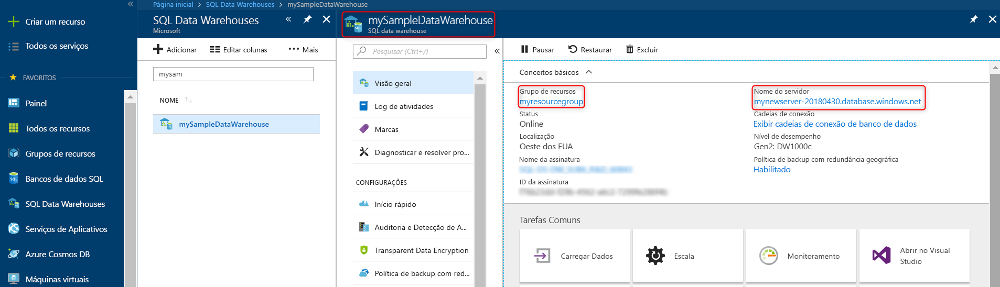

# <a name="quickstart-pause-and-resume-compute-for-an-azure-sql-data-warehouse-in-powershell"></a>Início Rápido: Pausar e retomar computação para um SQL Data Warehouse do Azure no PowerShell
Use o PowerShell para pausar a computação para um Azure SQL Data Warehouse economizar custos. Retomar computação quando você estiver pronto para usar o Data Warehouse.

Se você não tiver uma assinatura do Azure, crie uma conta [gratuita](https://azure.microsoft.com/free/) antes de começar.

Este tutorial requer o módulo do Azure PowerShell, versão 5.1.1 ou posterior. Execute ` Get-Module -ListAvailable AzureRM` descobrir a versão que você tem atualmente. Se você precisa instalar ou atualizar, confira [Instalar o módulo do Azure PowerShell](/powershell/azure/install-azurerm-ps.md). 

## <a name="before-you-begin"></a>Antes de começar

Este guia de início rápido pressupõe que você já tem um SQL Data Warehouse que você pode pausar e retomar. Se você precisar criar um, você pode usar [Criar e Conectar - portal](create-data-warehouse-portal.md) para criar um Data Warehouse chamado **mySampleDataWarehouse**. 

## <a name="log-in-to-azure"></a>Fazer logon no Azure

Faça logon em sua assinatura do Azure usando o comando [Add-AzureRmAccount](/powershell/module/azurerm.profile/add-azurermaccount) e siga as instruções na tela.

```powershell
Add-AzureRmAccount
```

Para ver qual assinatura que você está usando, execute [Get-AzureRmSubscription](/powershell/module/azurerm.profile/get-azurermsubscription).

```powershell
Get-AzureRmSubscription
```

Se você precisar usar uma assinatura diferente do padrão, execute [AzureRmSubscription selecione](/powershell/module/azurerm.profile/select-azurermsubscription).

```powershell
Select-AzureRmSubscription -SubscriptionName "MySubscription"
```

## <a name="look-up-data-warehouse-information"></a>Pesquisar informações de Data Warehouse

Localize o nome do banco de dados, o nome do servidor e o grupo de recursos para o Data Warehouse que você planeja pausar e continuar. 

Siga estas etapas para localizar informações de local de seu Data Warehouse.

1. Entre no [portal do Azure](https://portal.azure.com/).
2. Clique em **Bancos de Dados SQL** na página esquerda do portal do Azure.
3. Selecione **mySampleDataWarehouse** da página **Bancos de Dados SQL**. Isso abre o Data Warehouse. 

    

4. Anote o nome do Data Warehouse que será usado como o nome do banco de dados. Anote também o nome do servidor e o grupo de recursos. Você os usará nos comandos pausar e continuar.
5. Se o servidor for foo.database.windows.net, use somente a primeira parte como o nome do servidor nos cmdlets do PowerShell. Na imagem anterior, o nome completo do servidor é newserver-20171113.database.windows.net. Usaremos **newserver-20171113** como o nome do servidor no cmdlet do PowerShell.

## <a name="pause-compute"></a>Pausar computação
Para economizar custos, é possível pausar e retomar os recursos de computação sob demanda. Por exemplo, se você não usar banco de dados durante a noite e nos finais de semana, você poderá pausá-lo durante esses períodos e retomá-lo durante o dia. Você não será cobrado por recursos de computação enquanto o banco de dados estiver em pausa. No entanto, você continuará sendo cobrado pelo armazenamento. 

Para pausar um banco de dados, use o cmdlet [Suspend-AzureRmSqlDatabase](/powershell/module/azurerm.sql/suspend-azurermsqldatabase.md). O exemplo a seguir faz uma pausa em um Data Warehouse denominado **mySampleDataWarehouse** hospedado em um servidor chamado **newserver-20171113**. O servidor está em um grupo de recursos do Azure chamado **myResourceGroup**.


```Powershell
Suspend-AzureRmSqlDatabase –ResourceGroupName "myResourceGroup" `
–ServerName "newserver-20171113" –DatabaseName "mySampleDataWarehouse"
```

Uma variação, o próximo exemplo recupera o banco de dados para o objeto $database. Ele redireciona o objeto para [Suspend-AzureRmSqlDatabase](/powershell/module/azurerm.sql/suspend-azurermsqldatabase). Os resultados são armazenados no objeto resultDatabase. O comando final mostra os resultados.

```Powershell
$database = Get-AzureRmSqlDatabase –ResourceGroupName "myResourceGroup" `
–ServerName "newserver-20171113" –DatabaseName "mySampleDataWarehouse"
$resultDatabase = $database | Suspend-AzureRmSqlDatabase
$resultDatabase
```


## <a name="resume-compute"></a>Retomar a computação
Para iniciar um banco de dados, use o cmdlet [Resume-AzureRmSqlDatabase](/powershell/module/azurerm.sql/resume-azurermsqldatabase). O exemplo a seguir inicia um banco de dados chamado mySampleDataWarehouse hospedado em um servidor chamado newserver-20171113. O servidor está em um grupo de recursos do Azure chamado myResourceGroup.

```Powershell
Resume-AzureRmSqlDatabase –ResourceGroupName "myResourceGroup" `
–ServerName "newserver-20171113" -DatabaseName "mySampleDataWarehouse"
```

Uma variação, o próximo exemplo recupera o banco de dados para o objeto $database. Ele redireciona o objeto para [Resume-AzureRmSqlDatabase](/powershell/module/azurerm.sql/resume-azurermsqldatabase.md) e armazena os resultados em $resultDatabase. O comando final mostra os resultados.

```Powershell
$database = Get-AzureRmSqlDatabase –ResourceGroupName "ResourceGroup1" `
–ServerName "Server01" –DatabaseName "Database02"
$resultDatabase = $database | Resume-AzureRmSqlDatabase
$resultDatabase
```

## <a name="clean-up-resources"></a>Limpar recursos

Você está sendo cobrado por unidades de data warehouse e pelos dados armazenados em seu data warehouse. Esses recursos de computação e armazenamento são cobrados separadamente. 

- Se você quiser manter os dados no armazenamento, pause a computação.
- Se desejar remover encargos futuros, será possível excluir o data warehouse. 

Siga estas etapas para limpar os recursos conforme desejado.

1. Faça logon no [portal do Azure](https://portal.azure.com) e clique no seu Data Warehouse.

    

1. Para pausar a computação, clique no botão **Pausar**. Quando o data warehouse for pausado, você verá um botão **Iniciar**.  Para retomar a computação, clique **Iniciar**.

2. Para remover o data warehouse para você não ser cobrado pela computação ou pelo armazenamento, clique em **Excluir**.

3. Para remover o SQL Server criado, clique em **meunovoservidor-20171113.database.windows.net** e, em seguida, clique em **Excluir**.  Tenha cuidado com essa exclusão, uma vez que a exclusão do servidor também exclui todos os bancos de dados atribuídos ao servidor.

4. Para remover o grupo de recursos, clique em **meuGrupoDeRecursos** e, em seguida, clique em **Excluir grupo de recursos**.


## <a name="next-steps"></a>Próximas etapas
Você agora pausou e retomou a computação para o Data Warehouse. Para saber mais sobre o SQL Data Warehouse do Azure, prossiga para o tutorial de carregamento de dados.

> [!div class="nextstepaction"]
>[Carregar dados no SQL Data Warehouse](load-data-from-azure-blob-storage-using-polybase.md)