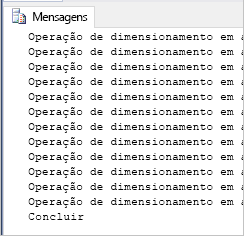

# <a name="quickstart-scale-compute-in-azure-sql-data-warehouse-using-t-sql"></a>Início Rápido: dimensionar a computação no SQL Data Warehouse do Azure usando T-SQL

Dimensione a computação no SQL Data Warehouse do Azure usando T-SQL e SSMS (SQL Server Management Studio). [Escale horizontalmente a computação](sql-data-warehouse-manage-compute-overview.md) para melhorar o desempenho ou reduza a escala da computação para economizar custos. 

Se você não tiver uma assinatura do Azure, crie uma conta [gratuita](https://azure.microsoft.com/free/) antes de começar.

## <a name="before-you-begin"></a>Antes de começar

Baixe e instale a versão mais recente do [SQL Server Management Studio](/sql/ssms/download-sql-server-management-studio-ssms) (SSMS).
 
## <a name="create-a-data-warehouse"></a>Criar um data warehouse

Use o [Início Rápido: Criar e conectar – portal](create-data-warehouse-portal.md) para criar um data warehouse com o nome **mySampleDataWarehouse**. Conclua o início rápido para garantir que você tenha uma regra de firewall e seja capaz de se conectar ao data warehouse através do SQL Server Management Studio.

## <a name="connect-to-the-server-as-server-admin"></a>Conectar-se ao servidor como administrador do servidor

Esta seção usa o [SSMS](/sql/ssms/download-sql-server-management-studio-ssms) (SQL Server Management Studio) para estabelecer uma conexão com o SQL Server do Azure.

1. Abra o SQL Server Management Studio.

2. Na caixa de diálogo **Conectar ao Servidor**, insira as informações a seguir:

   | Configuração       | Valor sugerido | DESCRIÇÃO | 
   | ------------ | ------------------ | ------------------------------------------------- | 
   | Tipo de servidor | Mecanismo de banco de dados | Esse valor é obrigatório |
   | Nome do servidor | O nome do servidor totalmente qualificado | Veja um exemplo: **meunovoservidor-20171113.database.windows.net**. |
   | Autenticação | Autenticação do SQL Server | A Autenticação do SQL é o único tipo de autenticação configurado neste tutorial. |
   | Logon | A conta do administrador do servidor | A conta que você especificou quando criou o servidor. |
   | Senha | A senha para sua conta do administrador do servidor | Esta é a senha que você especificou quando criou o servidor. |

    

4. Clique em **Conectar**. A janela Pesquisador de Objetos abre no SSMS. 

5. No Pesquisador de Objetos, expanda **Bancos de dados**. Em seguida, expanda **meuBancoDeDadosDeExemplo** para exibir os objetos no novo banco de dados.

     

## <a name="view-service-objective"></a>Exibir objetivo de serviço
A configuração do objetivo de serviço contém o número de unidades de data warehouse para o data warehouse. 

Para exibir as unidades de data warehouse atuais do seu data warehouse:

1. Na conexão para **mynewserver-20171113.database.windows.net**, expanda **Bancos de Dados do Sistema**.
2. Clique com o botão direito do mouse em **mestre** e selecione **Nova Consulta**. Uma nova janela de consulta é aberta.
3. Execute a seguinte consulta para selecionar da exibição de gerenciamento dinâmico sys.database_service_objectives. 

    ```sql
    SELECT
        db.name [Database]
    ,   ds.edition [Edition]
    ,   ds.service_objective [Service Objective]
    FROM
        sys.database_service_objectives ds
    JOIN
        sys.databases db ON ds.database_id = db.database_id
    WHERE 
        db.name = 'mySampleDataWarehouse'
    ```

4. Os resultados a seguir mostram que **mySampleDataWarehouse** tem um objetivo de serviço de DW400. 

    


## <a name="scale-compute"></a>Computação de escala
No SQL Data Warehouse, você pode aumentar ou diminuir os recursos de computação ao ajustar as unidades de data warehouse. O [Criar e conectar – portal](create-data-warehouse-portal.md) criou o **mySampleDataWarehouse** e o inicializou com 400 DWUs. As seguintes etapas ajustam as DWUs do **mySampleDataWarehouse**.

Para alterar unidades de data warehouse:

1. Clique com o botão direito do mouse em **mestre** e selecione **Nova Consulta**.
2. Use a instrução [ALTER DATABASE](/sql/t-sql/statements/alter-database-azure-sql-database) do T-SQL para modificar o objetivo de serviço. Execute a consulta a seguir para alterar o objetivo de serviço para DW300. 

    ```Sql
    ALTER DATABASE mySampleDataWarehouse
    MODIFY (SERVICE_OBJECTIVE = 'DW300')
    ;
    ```

## <a name="monitor-scale-change-request"></a>Monitorar solicitação de alteração do dimensionamento
Para ver o progresso da solicitação de alteração anterior, use a sintaxe T-SQL `WAITFORDELAY` para sondar o DVM (modo de exibição de gerenciamento dinâmico) de sys.dm_operation_status.

Para sondar o status de alteração do objeto de serviço:

1. Clique com o botão direito do mouse em **mestre** e selecione **Nova Consulta**.
2. Execute a consulta a seguir para sondar o DMV de sys.DM operation_status.

    ```sql
    WHILE 
    (
        SELECT TOP 1 state_desc
        FROM sys.dm_operation_status
        WHERE 
            1=1
            AND resource_type_desc = 'Database'
            AND major_resource_id = 'MySampleDataWarehouse'
            AND operation = 'ALTER DATABASE'
        ORDER BY
            start_time DESC
    ) = 'IN_PROGRESS'
    BEGIN
        RAISERROR('Scale operation in progress',0,0) WITH NOWAIT;
        WAITFOR DELAY '00:00:05';
    END
    PRINT 'Complete';
    ```
3. A saída resultante mostra um log de sondagem do status.

    

## <a name="check-data-warehouse-state"></a>Verifique o estado do data warehouse

Quando um data warehouse é pausado, você não pode se conectar a ele com T-SQL. Para ver o estado atual do data warehouse, você pode usar um cmdlet do PowerShell. Para obter um exemplo, consulte [Verificar o estado do data warehouse - Powershell](quickstart-scale-compute-powershell.md#check-data-warehouse-state). 

## <a name="check-operation-status"></a>Verificar o status da operação

Para retornar informações sobre as diversas operações de gerenciamento em seu SQL Data Warehouse, execute a seguinte consulta no DMV [sys.dm_operation_status](/sql/relational-databases/system-dynamic-management-views/sys-dm-operation-status-azure-sql-database). Por exemplo, ela retornará a operação e o estado da operação, que será IN_PROGRESS ou COMPLETED.

```sql
SELECT *
FROM
    sys.dm_operation_status
WHERE
    resource_type_desc = 'Database'
AND 
    major_resource_id = 'MySampleDataWarehouse'
```


## <a name="next-steps"></a>Próximas etapas
Agora você sabe como dimensionar a computação para seu data warehouse. Para saber mais sobre o SQL Data Warehouse do Azure, prossiga para o tutorial de carregamento de dados.

> [!div class="nextstepaction"]
>[Carregar dados no SQL Data Warehouse](load-data-from-azure-blob-storage-using-polybase.md)
