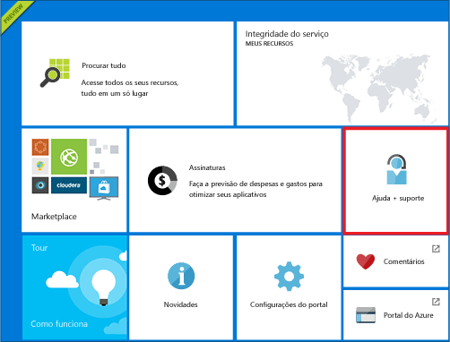
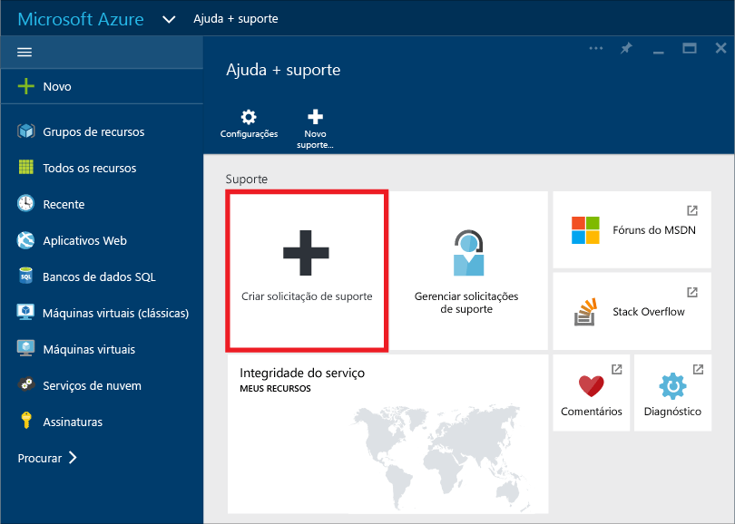
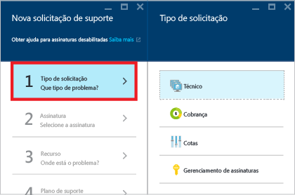
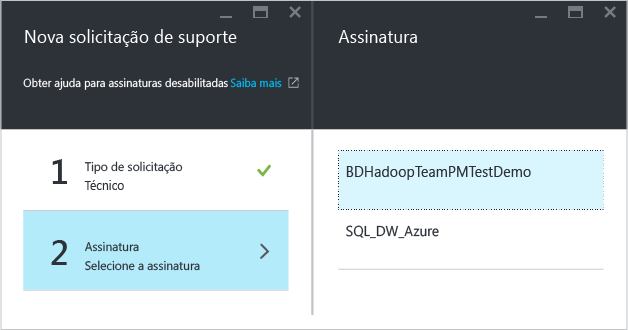
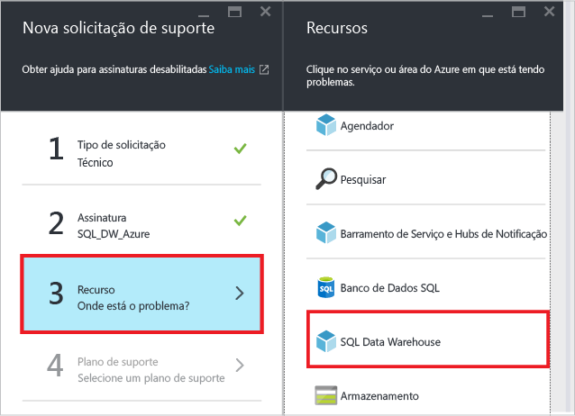
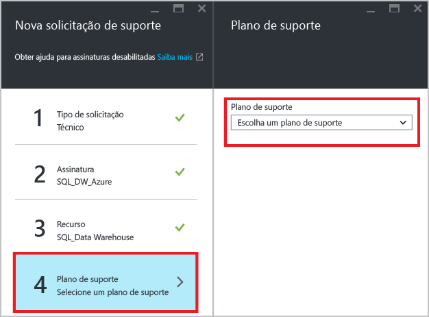
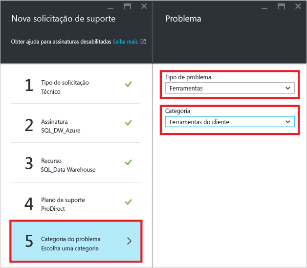
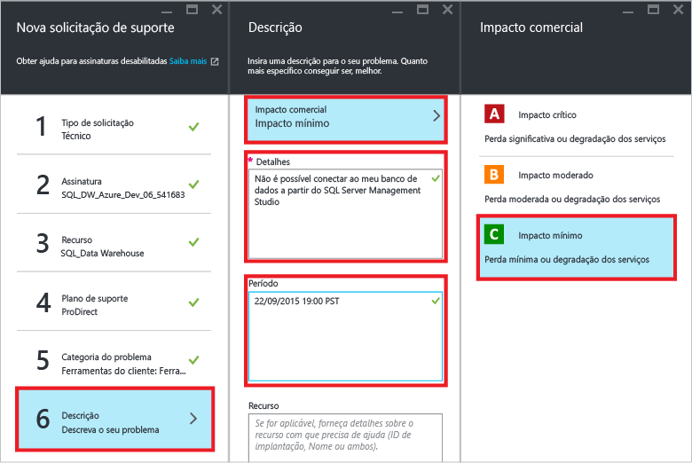
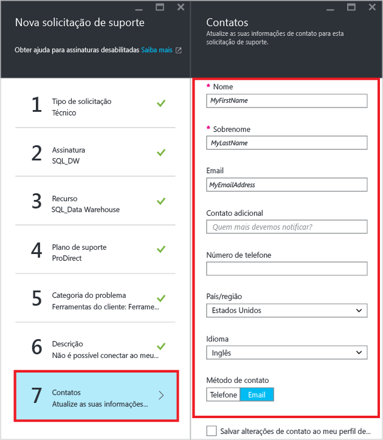
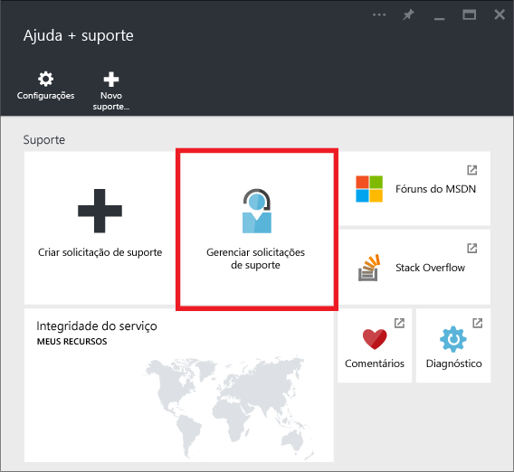

<properties
    pageTitle="Criar um tíquete de suporte para o SQL Data Warehouse | Microsoft Azure"
    description="Como criar um tíquete de suporte no Azure SQL Data Warehouse."
    services="sql-data-warehouse"
    documentationCenter="NA"
    authors="sahaj08"
    manager="barbkess"
    editor=""/>

<tags
    ms.service="sql-data-warehouse"
    ms.devlang="NA"
    ms.topic="get-started-article"
    ms.tgt_pltfrm="NA"
    ms.workload="data-services"
    ms.date="10/20/2015"
    ms.author="sahaj08"/>

# Criar um tíquete de suporte para o SQL Data Warehouse
 Este artigo mostra como criar um tíquete de suporte para o SQL Data Warehouse.

## Como criar um tíquete de suporte

1. Abra o [Portal do Azure][]. 
2. Na tela Inicial, clique no bloco **Ajuda + suporte**.

    

3. Na folha Ajuda + Suporte, clique em **Criar solicitação de suporte**.

    

4. Selecione o **Tipo de Solicitação**.

    

5. Selecione a **Assinatura** que hospeda o banco de dados com o problema que você está relatando.

    

6. Selecione **SQL Data Warehouse** como o Recurso.

    

7. Selecione seu **Plano de suporte**.

    - O suporte para questões de cobrança e gerenciamento de assinatura está disponível em todos os níveis de suporte.
    - O suporte para questões de reparo é fornecido por meio do suporte Developer, Standard, Pro Direct ou Premier. As questões que exigem reparos são problemas vivenciados pelo cliente ao usar o Azure, em que se espera que o problema tenha sido causado pela Microsoft.
    - Os serviços de consultores e mentores para o desenvolvedor estão disponíveis nos níveis de suporte Premier e Professional Direct.
    - Leia mais sobre o suporte do Azure, incluindo o escopo, os tempos de resposta, os preços etc. em [Planos de suporte do Azure][].

    

    Se tiver um plano de suporte Premier, você também poderá relatar problemas relacionados ao SQL Data Warehouse no [Portal online Microsoft Premier][].

8. Selecione o **Tipo de Problema** e a **Categoria**.

    

9. Descreva o problema e escolha o nível de impacto nos negócios.

    

10. Suas **informações de contato** para esse tíquete de suporte serão preenchidas previamente. Atualize-as se necessário.

    

11. Clique em **Criar** para enviar a solicitação de suporte.

## Próximas etapas
Depois que você enviar a solicitação de suporte, a equipe de suporte do Azure entrará em contato com você. Para verificar o status e os detalhes da solicitação, clique em **Gerenciar solicitações de suporte** no painel.

Além disso, você pode se conectar com a comunidade do SQL Data Warehouse usando a marca azure-sqldw no [Stack Overflow][] ou no [Fórum do MSDN do Azure SQL Data Warehouse][].

<!-- External links -->

[Portal do Azure]: https://portal.azure.com/
[Planos de suporte do Azure]: http://azure.microsoft.com/support/plans/?WT.mc_id=Support_Plan_510979/
[Portal online Microsoft Premier]: https://premier.microsoft.com/
[Stack Overflow]: http://stackoverflow.com/questions/tagged/azure-sqldw/
[Fórum do MSDN do Azure SQL Data Warehouse]: https://social.msdn.microsoft.com/Forums/home?forum=AzureSQLDataWarehouse/

<!---HONumber=Oct15_HO4-->