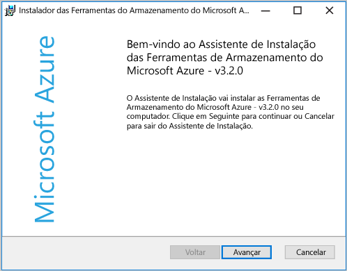
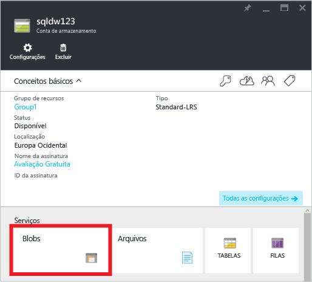
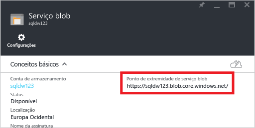
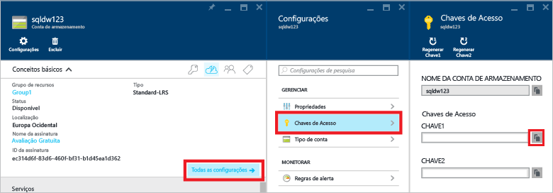
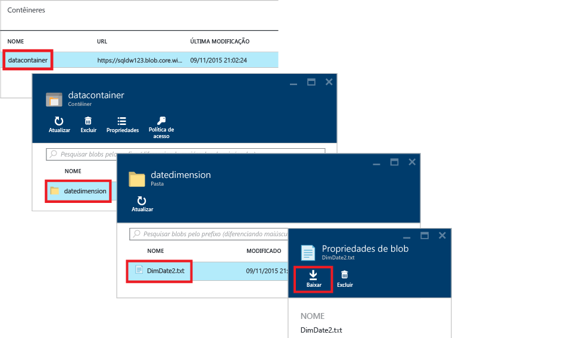
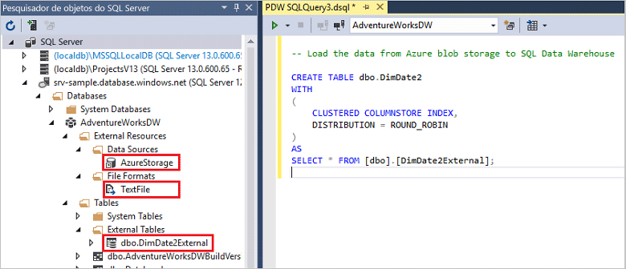

<properties
   pageTitle="Tutorial do PolyBase no SQL Data Warehouse | Microsoft Azure"
   description="Saiba o que é o PolyBase e como usá-lo em cenários de data warehouse."
   services="sql-data-warehouse"
   documentationCenter="NA"
   authors="ckarst"
   manager="barbkess"
   editor=""/>

<tags
   ms.service="sql-data-warehouse"
   ms.devlang="NA"
   ms.topic="get-started-article"
   ms.tgt_pltfrm="NA"
   ms.workload="data-services"
   ms.date="06/30/2016"
   ms.author="cakarst;barbkess;sonyama"/>


# Carregar dados com o PolyBase no SQL Data Warehouse

> [AZURE.SELECTOR]
- [Fábrica de dados](sql-data-warehouse-get-started-load-with-azure-data-factory.md)
- [PolyBase](sql-data-warehouse-get-started-load-with-polybase.md)
- [BCP](sql-data-warehouse-load-with-bcp.md)

Este tutorial mostra como carregar dados no SQL Data Warehouse usando o AzCopy e o PolyBase. Quando terminar, você saberá como:

- Usar o AzCopy para copiar dados para o armazenamento de blobs do Azure
- Criar objetos de banco de dados para definir os dados
- Executar uma consulta T-SQL para carregar os dados

>[AZURE.VIDEO loading-data-with-polybase-in-azure-sql-data-warehouse]

## Pré-requisitos

Para acompanhar este tutorial, você precisará de

- Um banco de dados do SQL Data Warehouse.
- Uma conta de armazenamento do Azure do tipo Padrão-LRS (Armazenamento com Redundância Local Padrão), Padrão-GRS (Armazenamento com Redundância Geográfica Padrão) ou Padrão-RAGRS (Armazenamento de Redundância Geográfica com Acesso de Leitura Padrão).
- Utilitário de linha de comando AzCopy. Baixe e instale a [versão mais recente do AzCopy][], instalado com as Ferramentas do Armazenamento do Microsoft Azure.

    


## Etapa 1: Adicionar dados de exemplo ao armazenamento de blobs do Azure

Para carregar dados, precisamos colocar alguns dados de exemplo em um armazenamento de blobs do Azure. Nesta etapa, preencheremos um blob do Armazenamento do Azure com dados de exemplo. Posteriormente, usaremos o PolyBase para carregar esses dados de exemplo no seu banco de dados do SQL Data Warehouse.

### R. Preparar um arquivo de texto de exemplo

Para preparar um arquivo de texto de exemplo:

1. Abra o Bloco de Notas e copie as linhas de dados a seguir em um novo arquivo. Salve-o no diretório temporário local como %temp%\\DimDate2.txt.

```
20150301,1,3
20150501,2,4
20151001,4,2
20150201,1,3
20151201,4,2
20150801,3,1
20150601,2,4
20151101,4,2
20150401,2,4
20150701,3,1
20150901,3,1
20150101,1,3
```

### B. Localizar o ponto de extremidade do serviço blob

Para localizar o ponto de extremidade do serviço blob:

1. No portal do Azure, selecione **Procurar** > **Contas de Armazenamento**.
2. Clique na conta de armazenamento que você deseja usar.
3. Na folha da conta de Armazenamento, clique em Blobs

    

1. Salve a URL do ponto de extremidade do serviço blob para mais tarde.

    

### C. Encontrar a chave de armazenamento do Azure

Para encontrar a chave de armazenamento do Azure:

1. No Portal do Azure, selecione **Procurar** > **Contas de Armazenamento**.
2. Clique na conta de armazenamento que você deseja usar.
3. Selecione **Todas as configurações** > **Chaves de acesso**.
4. Clique na caixa de cópia para copiar uma das suas chaves de acesso para a área de transferência.

    

### D. Copiar o arquivo de exemplo para o armazenamento de blobs do Azure

Para copiar seus dados para o armazenamento de blobs do Azure:

1. Abra um prompt de comando e altere os diretórios para o diretório de instalação do AzCopy. Esse comando muda para o diretório de instalação padrão em um cliente do Windows de 64 bits.

    ```
    cd /d "%ProgramFiles(x86)%\Microsoft SDKs\Azure\AzCopy"
    ```

1. Execute o comando a seguir para carregar o arquivo. Especifique a URL de ponto de extremidade do serviço Blob para <URL de ponto de extremidade de serviço Blob> e sua chave de conta de armazenamento do Azure para <azure\_storage\_account\_key>.

    ```
    .\AzCopy.exe /Source:C:\Temp\ /Dest:<blob service endpoint URL> /datacontainer/datedimension/ /DestKey:<azure_storage_account_key> /Pattern:DimDate2.txt
    ```

Confira também [Introdução ao utilitário de linha de comando AzCopy][].

### E. Explorar o contêiner de armazenamento de blobs

Para ver o arquivo carregado no armazenamento de blobs:

1. Volte para a folha do serviço Blob.
2. Em Contêineres, clique duas vezes em **datacontainer**.
3. Para explorar o caminho para os dados, clique na pasta **datedimension** e você verá o arquivo **DimDate2.txt** carregado.
4. Para exibir as propriedades, clique em **DimDate2.txt**.
5. Observe que, na folha de propriedades do Blob, você pode baixar ou excluir o arquivo.

    


## Etapa 2: Criar uma tabela externa para os dados de exemplo

Nesta seção, criamos uma tabela externa que define os dados de exemplo.

O PolyBase usa tabelas externas para acessar dados no Armazenamento de Blobs do Azure. Uma vez que os dados não são armazenados no SQL Data Warehouse, o PolyBase lida com a autenticação de dados externos usando uma credencial com escopo do banco de dados.

O exemplo nesta etapa usa essas instruções Transact-SQL para criar uma tabela externa.

- [Criar Chave Mestra (Transact-SQL)][] para criptografar o segredo da credencial com escopo do banco de dados.
- [Criar Credencial com Escopo do Banco de Dados (Transact-SQL)][] para especificar as informações de autenticação de sua conta de armazenamento do Azure.
- [Criar Fonte de Dados Externa (Transact-SQL)][] para especificar o local de seu armazenamento de blobs do Azure.
- [Criar Formato de Arquivo Externo (Transact-SQL)][] para especificar o formato dos dados.
- [Criar Tabela Externa (Transact-SQL)][] para especificar a definição de tabela e o local dos dados.

Execute esta consulta no banco de dados do SQL Data Warehouse. Ela criará uma tabela externa chamada DimDate2External no esquema dbo que aponta para os dados de exemplo de DimDate2.txt no armazenamento de blobs do Azure.


```sql
-- A: Create a master key.
-- Only necessary if one does not already exist.
-- Required to encrypt the credential secret in the next step.

CREATE MASTER KEY;


-- B: Create a database scoped credential
-- IDENTITY: Provide any string, it is not used for authentication to Azure storage.
-- SECRET: Provide your Azure storage account key.


CREATE DATABASE SCOPED CREDENTIAL AzureStorageCredential
WITH
    IDENTITY = 'user',
    SECRET = '<azure_storage_account_key>'
;


-- C: Create an external data source
-- TYPE: HADOOP - PolyBase uses Hadoop APIs to access data in Azure blob storage.
-- LOCATION: Provide Azure storage account name and blob container name.
-- CREDENTIAL: Provide the credential created in the previous step.

CREATE EXTERNAL DATA SOURCE AzureStorage
WITH (
    TYPE = HADOOP,
    LOCATION = 'wasbs://<blob_container_name>@<azure_storage_account_name>.blob.core.windows.net',
    CREDENTIAL = AzureStorageCredential
);


-- D: Create an external file format
-- FORMAT_TYPE: Type of file format in Azure storage (supported: DELIMITEDTEXT, RCFILE, ORC, PARQUET).
-- FORMAT_OPTIONS: Specify field terminator, string delimiter, date format etc. for delimited text files.
-- Specify DATA_COMPRESSION method if data is compressed.

CREATE EXTERNAL FILE FORMAT TextFile
WITH (
    FORMAT_TYPE = DelimitedText,
    FORMAT_OPTIONS (FIELD_TERMINATOR = ',')
);


-- E: Create the external table
-- Specify column names and data types. This needs to match the data in the sample file.
-- LOCATION: Specify path to file or directory that contains the data (relative to the blob container).
-- To point to all files under the blob container, use LOCATION='.'

CREATE EXTERNAL TABLE dbo.DimDate2External (
    DateId INT NOT NULL,
    CalendarQuarter TINYINT NOT NULL,
    FiscalQuarter TINYINT NOT NULL
)
WITH (
    LOCATION='/datedimension/',
    DATA_SOURCE=AzureStorage,
    FILE_FORMAT=TextFile
);


-- Run a query on the external table

SELECT count(*) FROM dbo.DimDate2External;

```


No Pesquisador de Objetos do SQL Server no Visual Studio, você pode ver o formato de arquivo externo, a fonte de dados externa e a tabela DimDate2External.



## Etapa 3: carregar dados no SQL Data Warehouse

Depois de criar a tabela externa, você poderá carregar os dados em uma nova tabela ou inseri-los em uma tabela existente.

- Para carregar os dados em uma nova tabela, execute a instrução [CREATE TABLE AS SELECT (Transact-SQL)][]. A nova tabela terá as colunas nomeadas na consulta. Os tipos de dados das colunas corresponderão aos tipos de dados na definição da tabela externa.
- Para carregar os dados em uma tabela existente, use a instrução [INSERT...SELECT (Transact-SQL)][].

```sql
-- Load the data from Azure blob storage to SQL Data Warehouse

CREATE TABLE dbo.DimDate2
WITH
(   
    CLUSTERED COLUMNSTORE INDEX,
    DISTRIBUTION = ROUND_ROBIN
)
AS
SELECT * FROM [dbo].[DimDate2External];
```

## Etapa 4: criar estatísticas sobre os dados recém-carregados

O SQL Data Warehouse do Azure ainda não dá suporte a estatísticas de criação ou de atualização automática. Portanto, para obter um alto desempenho de consulta, é importante criar estatísticas em cada coluna de cada tabela após a primeira carga. Também é importante atualizar as estatísticas após alterações significativas nos dados.

Este exemplo cria estatísticas de coluna única na nova tabela DimDate2.

```sql
CREATE STATISTICS [DateId] on [DimDate2] ([DateId]);
CREATE STATISTICS [CalendarQuarter] on [DimDate2] ([CalendarQuarter]);
CREATE STATISTICS [FiscalQuarter] on [DimDate2] ([FiscalQuarter]);
```

Para saber mais, confira [Estatísticas][].


## Próximas etapas
Confira o [Guia do PolyBase][] para saber mais sobre como desenvolver uma solução que use o PolyBase.

<!--Image references-->


<!--Article references-->
[PolyBase in SQL Data Warehouse Tutorial]: ./sql-data-warehouse-get-started-load-with-polybase.md
[Load data with bcp]: ./sql-data-warehouse-load-with-bcp.md
[Estatísticas]: ./sql-data-warehouse-tables-statistics.md
[Guia do PolyBase]: ./sql-data-warehouse-load-polybase-guide.md
[Introdução ao utilitário de linha de comando AzCopy]: ../storage/storage-use-azcopy.md
[versão mais recente do AzCopy]: ../storage/storage-use-azcopy.md

<!--External references-->
[supported source/sink]: https://msdn.microsoft.com/library/dn894007.aspx
[copy activity]: https://msdn.microsoft.com/library/dn835035.aspx
[SQL Server destination adapter]: https://msdn.microsoft.com/library/ms141095.aspx
[SSIS]: https://msdn.microsoft.com/library/ms141026.aspx


[Criar Fonte de Dados Externa (Transact-SQL)]: https://msdn.microsoft.com/library/dn935022.aspx
[Criar Formato de Arquivo Externo (Transact-SQL)]: https://msdn.microsoft.com/library/dn935026.aspx
[Criar Tabela Externa (Transact-SQL)]: https://msdn.microsoft.com/library/dn935021.aspx

[DROP EXTERNAL DATA SOURCE (Transact-SQL)]: https://msdn.microsoft.com/library/mt146367.aspx
[DROP EXTERNAL FILE FORMAT (Transact-SQL)]: https://msdn.microsoft.com/library/mt146379.aspx
[DROP EXTERNAL TABLE (Transact-SQL)]: https://msdn.microsoft.com/library/mt130698.aspx

[CREATE TABLE AS SELECT (Transact-SQL)]: https://msdn.microsoft.com/library/mt204041.aspx
[INSERT...SELECT (Transact-SQL)]: https://msdn.microsoft.com/library/ms174335.aspx
[Criar Chave Mestra (Transact-SQL)]: https://msdn.microsoft.com/library/ms174382.aspx
[CREATE CREDENTIAL (Transact-SQL)]: https://msdn.microsoft.com/library/ms189522.aspx
[Criar Credencial com Escopo do Banco de Dados (Transact-SQL)]: https://msdn.microsoft.com/library/mt270260.aspx
[DROP CREDENTIAL (Transact-SQL)]: https://msdn.microsoft.com/library/ms189450.aspx

<!----HONumber=AcomDC_0907_2016-->