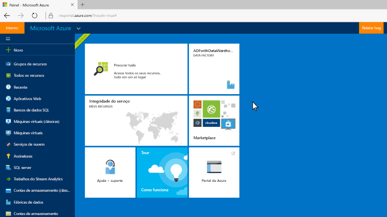
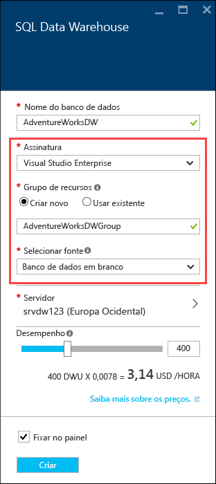

<properties
   pageTitle="Criar um SQL Data Warehouse no Portal do Azure | Microsoft Azure"
   description="Saiba como criar um Azure SQL Data Warehouse no Portal do Azure"
   services="sql-data-warehouse"
   documentationCenter="NA"
   authors="barbkess"
   manager="jhubbard"
   editor=""
   tags="azure-sql-data-warehouse"/>

<tags
   ms.service="sql-data-warehouse"
   ms.devlang="NA"
   ms.topic="get-started-article"
   ms.tgt_pltfrm="NA"
   ms.workload="data-services"
   ms.date="05/05/2016"
   ms.author="lodipalm;barbkess;sonyama"/>

# Criar um SQL Data Warehouse

> [AZURE.SELECTOR]
- [Portal do Azure](sql-data-warehouse-get-started-provision.md)
- [TSQL](sql-data-warehouse-get-started-create-database-tsql.md)
- [PowerShell](sql-data-warehouse-get-started-provision-powershell.md)

Neste tutorial, você usará o Portal do Azure para criar um SQL Data Warehouse que contém um exemplo de banco de dados AdventureWorksDW.

[AZURE.INCLUDE [free-trial-note](../../includes/free-trial-note.md)]

1. Entre no [Portal do Azure](https://portal.azure.com).

2. Clique em **+ Novo** > **Dados + Armazenamento** > **SQL Data Warehouse**.

    

3. Na folha **SQL Data Warehouse**, preencha as informações necessárias e, em seguida, pressione “Criar” para criar.

    

	- **Servidor**: recomendamos que você selecione seu servidor primeiro. Você pode selecionar um servidor existente ou [criar um novo](./sql-data-warehouse-get-started-new-server.md). 

	- **Nome do banco de dados**: o nome que será usado para referenciar o SQL Data Warehouse. Esse nome tem que ser exclusivo do servidor.
	
    - **Desempenho**: é recomendável começar com 400 DWUs. Você pode mover o controle deslizante para a esquerda ou direita para ajustar o desempenho de seu data warehouse, ou ampliar ou reduzir após a criação. Para saber mais sobre DWUs, consulte nossa documentação sobre [dimensionamento](./sql-data-warehouse-overview-scalability.md) ou nossa [página de preços](https://azure.microsoft.com/pt-BR/pricing/details/sql-data-warehouse/).

    - **Assinatura**: selecione a assinatura na qual esse SQL Data Warehouse será cobrado.

    - **Grupo de recurso**: grupos de recurso são contêineres projetados para ajudar você a gerenciar uma coleção de recursos do Azure. Saiba mais sobre [grupos de recursos](../azure-portal/resource-group-portal.md).

    - **Selecionar fonte**: clique em **Selecionar fonte** > **Exemplo**. Como há apenas um banco de dados de exemplo disponível no momento, quando você seleciona Exemplo, o Azure preenche automaticamente a opção **Selecionar exemplo** com AdventureWorksDW.

4. Clique em **Criar** para criar seu SQL Data Warehouse.

5. Aguarde alguns minutos e o SQL Data Warehouse estará pronto. Quando terminar, você deverá ser levado de volta ao [Portal do Azure](https://portal.azure.com). Você pode encontrar o SQL Data Warehouse em seu painel, relacionado sob seus Bancos de Dados SQL ou no grupo de recursos que você usou para criá-lo.

    

[AZURE.INCLUDE [Criar servidor do Banco de Dados SQL](../../includes/sql-database-create-new-server-firewall-portal.md)]

## Próximas etapas

Agora que você criou um SQL Data Warehouse, está pronto para [Conectar](./sql-data-warehouse-get-started-connect.md) e começar a consultar.

Para carregar dados no SQL Data Warehouse, veja a [visão geral de carregamento](./sql-data-warehouse-overview-load.md).

Se você estiver tentando migrar um banco de dados existente para o SQL Data Warehouse, confira a [Visão geral de migração](./sql-data-warehouse-overview-migrate.md) ou use o [Utilitário de migração](./sql-data-warehouse-migrate-migration-utility.md).

<!---HONumber=AcomDC_0511_2016-->