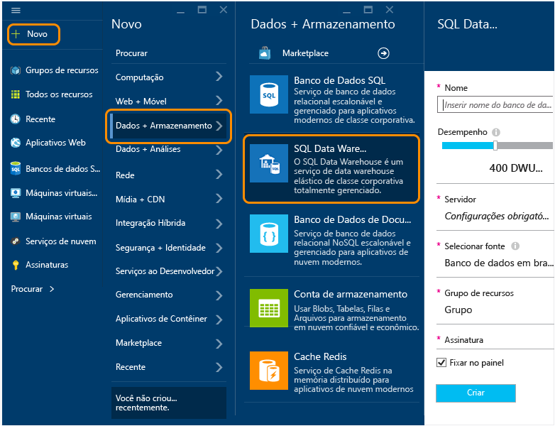

<properties
	pageTitle="Criar um banco de dados do SQL Data Warehouse no portal de visualização do Azure | Microsoft Azure"
	description="Saiba como criar um SQL Data Warehouse do Azure no portal de visualização do Azure"
	services="sql-data-warehouse"
	documentationCenter="NA"
	authors="lodipalm"
	manager="barbkess"
	editor=""
	tags="azure-sql-data-warehouse"/>
<tags
   ms.service="sql-data-warehouse"
   ms.devlang="NA"
   ms.topic="article"
   ms.tgt_pltfrm="NA"
   ms.workload="data-services"
   ms.date="09/29/2015"
   ms.author="lodipalm;barbkess"/>

# Criar um SQL Data Warehouse no portal de visualização do Azure#

Este tutorial mostra como é fácil criar um SQL Data Warehouse do Azure em apenas alguns minutos no portal de visualização do Azure.

Neste passo a passo, você:

- Crie um novo banco de dados do SQL Data Warehouse.
- Criará um servidor para o seu banco de dados
- Carregará o AdventureWorksDW no novo banco de dados.

[AZURE.INCLUDE [free-trial-note](../../includes/free-trial-note.md)]

## Conectará e localizará o SQL Data Warehouse

1. Entre no [portal de visualização](https://portal.azure.com).

2. No menu Hub, clique em **Novo** > **Dados + Armazenamento** > **SQL Data Warehouse**.

	

## Configurar configurações de desempenho e outras configurações básicas

No painel **SQL Data Warehouse**, preencha os campos a seguir. **Servidor** e **Fonte** são configurados nas próximas seções.

1. **Nome do banco de dados**: insira um nome para o seu banco de dados do SQL Data Warehouse.

2. **Desempenho**: é possível ajustar o desempenho com o qual sua instância será iniciada durante o provisionamento. Recomendamos começar com 400 DWU, já que isso permitirá ver mais dos benefícios do MPP oferecidos pelo SQL Data Warehouse.
     
    

    > [AZURE.NOTE]Medimos o desempenho em Unidades de Data Warehouse (DWUs). À medida que você aumenta as DWUs, o SQL Data Warehouse aumenta os recursos de computação disponíveis para suas operações de banco de dados do data warehouse.

	> [AZURE.NOTE]Você pode alterar de maneira rápida e fácil o nível de desempenho depois de criar o banco de dados. Por exemplo, se você não estiver usando o banco de dados, mova o controle deslizante para a esquerda para reduzir os custos. Ou aumentar o desempenho quando mais recursos forem necessários. Esse é o poder escalonável do SQL Data Warehouse.
	

2. **Grupo de recursos**. Mantenha os valores padrão. Os grupos de recursos são contêineres projetados para ajudá-lo a gerenciar uma coleção de recursos do Azure. Saiba mais sobre [grupos de recursos](../azure-portal/resource-group-portal.md).
3. **Assinatura**. Selecione a assinatura que será cobrada para este banco de dados.

## Configurar um servidor lógico

3. Clique em **Servidor** > **Criar um novo servidor**. Isso cria um servidor lógico ao qual seu banco de dados será associado. Se você já tiver um servidor V12 que deseja usar, escolha o servidor existente e vá para a próxima seção.

    

    >[AZURE.NOTE]No SQL Data Warehouse e no Banco de Dados SQL, um servidor fornece uma maneira consistente de configurar bancos de dados baseados em nuvem. No Azure, mesmo que um servidor esteja vinculado a um único data center, ele não é um hardware físico como uma instância local do SQL Server; ele faz parte do software do serviço. É por isso que o chamamos de um servidor lógico. É importante lembrar que, ao contrário do mundo real, as cargas de trabalho que executam bancos de dados e data warehouses no mesmo servidor não terão um impacto no desempenho entre si.

1. Na janela **Novo servidor**, preencha as informações solicitadas.

    Lembre-se de armazenar o nome do servidor, o nome do administrador e a senha em algum lugar. Você precisará dessas informações para fazer logon no servidor. - **Nome do Servidor**. Insira um nome para o servidor lógico. - **Nome do Administrador do Servidor**. Insira um nome de usuário para a conta do administrador do servidor. - **Senha**. Insira a senha do administrador do servidor. - **Local**. Escolha um local geográfico que esteja perto de você ou de seus outros recursos do Azure. Isso reduzirá a latência da rede, já que todos os bancos de dados e recursos que pertencem ao seu servidor lógico estarão fisicamente localizados na mesma região.

    

1. Clique em **OK** para salvar as definições de configuração de servidor.

## Carregar o banco de dados de exemplo

1. Escolha **Fonte** > **Exemplo** para inicializar o novo banco de dados com o banco de dados de exemplo AdventureWorksDW. 

    

## Concluir a criação do banco de dados

1. Clique em **Criar** para criar o banco de dados do SQL Data Warehouse. 

1. Agora, basta aguardar alguns minutos. Quando terminar, você verá seu banco de dados de exemplo em sua página inicial.

    

## Próximas etapas

Agora que você criou um banco de dados de exemplo para o SQL Data Warehouse, saiba como usar o SQL Data Warehouse neste próximo passo a passo.

- [Conectar e consultar](./sql-data-warehouse-get-started-connect-query.md).

	> [AZURE.NOTE]Queremos melhorar este artigo. Se você optar por responder "não" à pergunta "Este artigo foi útil?", inclua uma breve sugestão sobre como melhorar o artigo ou o que está faltando. Obrigado!

<!---HONumber=Oct15_HO1-->