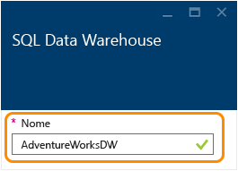
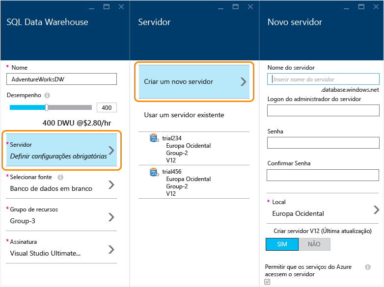
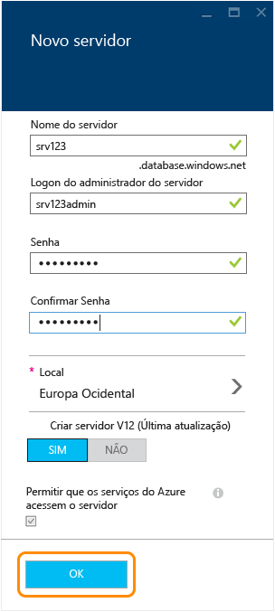
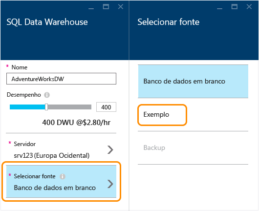
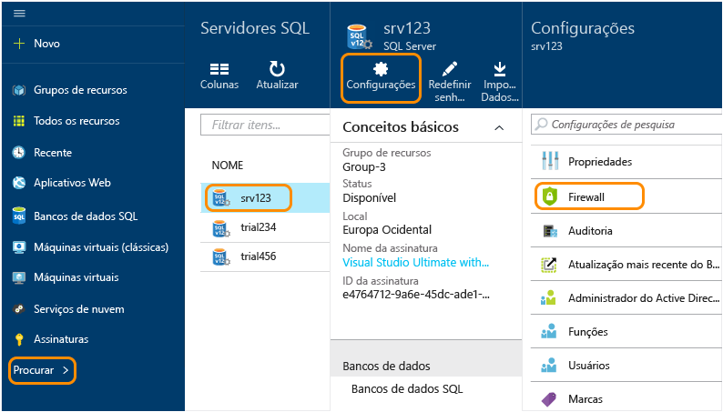
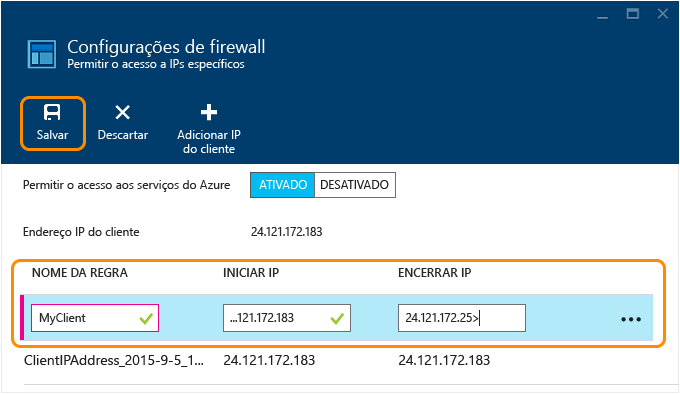

<properties
	pageTitle="Criar um banco de dados do SQL Data Warehouse no portal de visualização do Azure | Microsoft Azure"
	description="Saiba como criar um SQL Data Warehouse do Azure no portal de visualização do Azure"
	services="sql-data-warehouse"
	documentationCenter="NA"
	authors="barbkess"
	manager="jhubbard"
	editor=""
	tags="azure-sql-data-warehouse"/>
<tags
   ms.service="sql-data-warehouse"
   ms.devlang="NA"
   ms.topic="get-started-article"
   ms.tgt_pltfrm="NA"
   ms.workload="data-services"
   ms.date="10/01/2015"
   ms.author="lodipalm;barbkess"/>

# Criar um SQL Data Warehouse usando o portal de visualização do Azure#

> [AZURE.SELECTOR]
- [Azure Preview Portal](sql-data-warehouse-get-started-provision.md)
- [TSQL](sql-data-warehouse-get-started-create-TSQL.md)
- [PowerShell](sql-data-warehouse-get-started-create-powershell.md)

Este passo a passo mostra como criar um banco de dados do SQL Data Warehouse do Azure em apenas alguns minutos usando o portal de visualização do Azure.

Neste passo a passo, você:

- Crie um servidor que hospedará o banco de dados.
- Crie um banco de dados que contém dados de exemplo de AdventureWorksDW.

[AZURE.INCLUDE [free-trial-note](../../includes/free-trial-note.md)]

## Etapa 1: entrar e começar

1. Entre no [portal de visualização](https://portal.azure.com).

2. Clique em **Novo** > **Dados + Armazenamento** > **SQL Data Warehouse**.

	

1. Insira um nome para o banco de dados na folha do SQL Data Warehouse. Neste exemplo, nomeie o banco de dados como AdventureWorksDW.

    

## Etapa 2: configurar e criar um servidor
No Banco de Dados SQL e no SQL Data Warehouse, cada banco de dados é atribuído a um servidor, e cada servidor é atribuído a uma localização geográfica. O servidor é chamado de servidor SQL lógico.

> [AZURE.NOTE]Um servidor SQL lógico: >> + fornece uma maneira consistente de configurar vários bancos de dados na mesma localização geográfica. > + Não é hardware físico, como ocorre com um servidor local que hospeda um banco de dados. Faz parte do software de serviço. É por isso que o chamamos de *servidor lógico*. > + pode hospedar vários bancos de dados sem afetar o desempenho. > + usa um *s* minúsculo em seu nome. O **s**servidor SQL é um servidor lógico do Azure, enquanto o SQL **S**erver é um nome de produto.

1. Clique em **Servidor** > **Criar um novo servidor**. Não há cobrança para o servidor. Se você já tiver um servidor V12 que deseje usar, escolha o servidor existente e vá para a próxima seção. 

    

3. Preencha as informações do Novo servidor.
    
	- **Nome do Servidor**. Insira um nome para o servidor lógico.
	- **Nome do Administrador de servidor**. Insira um nome de usuário para a conta do administrador do servidor.
	- **Senha**. Insira a senha do administrador do servidor. 
	- **Local** Escolha uma localização geográfica para o servidor. Para reduzir o tempo de transferência de dados, é melhor colocar o servidor em uma localização geográfica próxima de outros recursos de dados que esse banco de dados acessará.
	- **Criar Servidor V12**. SIM é a única opção para o SQL Data Warehouse. 
	- **Permitir que os serviços do Azure acessem o servidor**. Essa opção é sempre marcada para o SQL Data Warehouse

    >[AZURE.NOTE]Lembre-se de armazenar o nome do servidor, o nome do administrador do servidor e a senha em algum lugar. Você precisará dessas informações para fazer logon no servidor.

1. Clique em **OK** para salvar as definições de configuração de servidor e retornar à folha do SQL Data Warehouse.

    

## Etapa 3: configurar e criar um banco de dados
Agora que selecionou o servidor, você está pronto para concluir a criação do banco de dados.
 
2. Na folha **SQL Data Warehouse**, preencha os campos restantes. 

    
    
    - **Desempenho**: é recomendável iniciar com 400 DWUs. Você pode mover o controle deslizante para a esquerda ou direita a fim de ajustar o nível de desempenho do banco de dados, agora e depois que o banco de dados for criado. 

        > [AZURE.NOTE]O desempenho é medido em DWUs (Unidades de Data Warehouse). À medida que você aumenta as DWUs, o SQL Data Warehouse aumenta os recursos de computação disponíveis para as operações de banco de dados. Ao executar a carga de trabalho, você poderá ver como as DWUs estão relacionadas ao desempenho da carga de trabalho.
        > 
        > Você pode alterar de maneira rápida e fácil o nível de desempenho depois de criar o banco de dados. Por exemplo, se você não estiver usando o banco de dados, mova o controle deslizante para a esquerda para reduzir os custos. Ou aumentar o desempenho quando mais recursos forem necessários. Esse é o poder escalonável do SQL Data Warehouse.

    - **Selecionar fonte**. Clique em **Selecionar fonte** > **Exemplo**. Como há apenas um banco de dados de exemplo disponível no momento, quando você seleciona Exemplo, o Azure preenche automaticamente a configuração **Selecionar exemplo** com AdventureWorksDW.
  
        

    - **Grupo de recursos**. Mantenha os valores padrão. Os grupos de recursos são contêineres projetados para ajudá-lo a gerenciar uma coleção de recursos do Azure. Saiba mais sobre [grupos de recursos](../azure-portal/resource-group-portal.md).
    
    - **Assinatura**. Selecione a assinatura que será cobrada para este banco de dados.

1. Clique em **Criar** para criar o banco de dados do SQL Data Warehouse.

1. Aguarde alguns minutos, e o banco de dados estará pronto. Quando terminar, você poderá ver o banco de dados no painel. Você agora deverá ser levado de volta para o [portal de visualização do Azure](https://portal.azure.com). Observe que seu banco de dados do SQL Data Warehouse foi adicionado à página.

    

## Etapa 4: configurar o acesso ao firewall do servidor para o IP do cliente
Para poder se conectar ao servidor usando seu endereço IP atual, você precisa adicionar o endereço IP do cliente às regras de firewall. Esta etapa mostra como fazer isso.

1. Clique em **Procurar** > **SQL Servers** > Escolher seu servidor > **Configurações** > **Firewall**.

    

4. Clique em **Adicionar IP do cliente** para que o Azure crie uma regra para esse endereço IP e depois clique em **Salvar**.

	

1. Crie uma regra de firewall com um intervalo de endereços IP. Você pode fazer isso agora ou mais tarde.

	>[AZURE.IMPORTANT]Seu endereço IP provavelmente será alterado periodicamente, e você não poderá acessar o seu servidor até que você crie uma nova regra de firewall. Você pode verificar seu endereço IP usando o [Bing](http://www.bing.com/search?q=my%20ip%20address) e depois adicionar um único endereço IP ou um intervalo de endereços IP. Veja [Como definir as configurações de firewall](../sql-database/sql-database-configure-firewall-settings.md) para obter mais detalhes.

    Para criar uma regra, digite um nome e o intervalo de endereços IP e clique em **Salvar**.

    

Agora que você configurou o firewall poderá fazer conexões da área de trabalho do banco de dados do Azure SQL Data Warehouse que você acabou de criar.

## Próximas etapas

Agora que você criou um banco de dados de exemplo para o SQL Data Warehouse, saiba como usar o SQL Data Warehouse em [Conectar e consultar](./sql-data-warehouse-get-started-connect-query.md).

>[AZURE.NOTE]Queremos melhorar este artigo. Se você optar por responder "não" à pergunta "Este artigo foi útil?", inclua uma breve sugestão sobre como melhorar o artigo ou o que está faltando. Obrigado!

<!---HONumber=Oct15_HO2-->