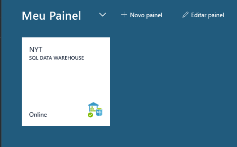
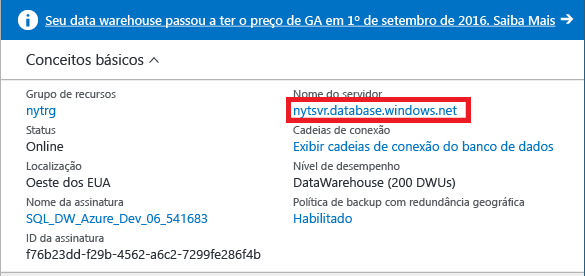
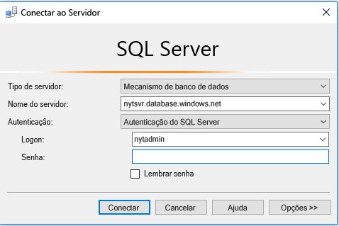
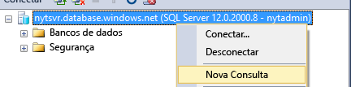
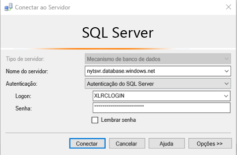
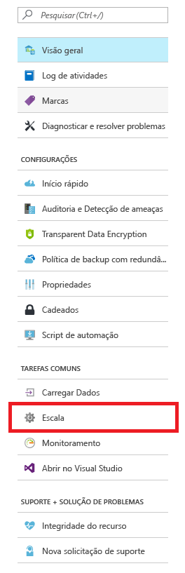
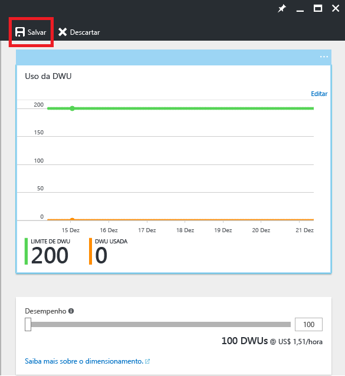

# <a name="get-started-with-sql-data-warehouse"></a>Introdução ao SQL Data Warehouse

Este tutorial mostra como provisionar e carregar dados no SQL Data Warehouse do Azure. Você também aprenderá as noções básicas sobre dimensionamento, pausa e ajuste. Quando terminar, você estará pronto para consultar e explorar seu data warehouse.

**Tempo estimado para conclusão:** este é um tutorial completo com código de exemplo que leva cerca de 30 minutos para concluir assim que os pré-requisitos são atendidos. 

## <a name="prerequisites"></a>Pré-requisitos

O tutorial pressupõe que você esteja familiarizado com os conceitos básicos do SQL Data Warehouse. Se você precisar de uma introdução, consulte [O que é SQL Data Warehouse?](sql-data-warehouse-overview-what-is.md) 

### <a name="sign-up-for-microsoft-azure"></a>Inscreva-se no Microsoft Azure
Se você ainda não tiver uma conta do Microsoft Azure, deverá inscrever-se em uma para usar este serviço. Se já tiver uma conta, você poderá ignorar esta etapa. 

1. Navegue até as páginas de conta [https://azure.microsoft.com/account/](https://azure.microsoft.com/account/)
2. Crie uma conta gratuita do Azure ou uma conta de compra.
3. Siga as instruções

### <a name="install-appropriate-sql-client-drivers-and-tools"></a>Instalar os devidos drivers e ferramentas do cliente SQL

A maioria das ferramentas do cliente SQL pode conectar o SQL Data Warehouse usando o JDBC, ODBC ou ADO.NET. Devido ao grande número de recursos do T-SQL que oferece suporte ao SQL Data Warehouse, alguns aplicativos cliente não são totalmente compatíveis com o SQL Data Warehouse.

Se você estiver executando um sistema operacional do Windows, recomendamos o uso do [Visual Studio] ou do [SQL Server Management Studio].

[!INCLUDE [Create a new logical server](../../includes/sql-data-warehouse-create-logical-server.md)] 

[!INCLUDE [SQL Database create server](../../includes/sql-database-create-new-server-firewall-portal.md)]

## <a name="create-a-sql-data-warehouse"></a>Criar um SQL Data Warehouse

Um SQL Data Warehouse é um tipo especial de banco de dados que foi projetado para o processamento extremamente paralelo. O banco de dados é distribuído entre vários nós e processa as consultas em paralelo. SQL Data Warehouse tem um nó de controle que coordena as atividades de todos os nós. Os próprios nós usam o Banco de Dados SQL para gerenciar seus dados.  

> [!NOTE]
> A criação de um SQL Data Warehouse pode resultar em um novo serviço faturável.  Para obter mais informações, confira [Preços do SQL Data Warehouse](https://azure.microsoft.com/pricing/details/sql-data-warehouse/).
>

### <a name="create-a-data-warehouse"></a>Criar um data warehouse

1. Faça logon no [Portal do Azure](https://portal.azure.com).
2. Clique em **Novo** > **Bancos de dados** > **SQL Data Warehouse**.

    
    

3. Preencher os detalhes da implantação

    **Nome do banco de dados**: escolha qualquer item que desejar. Se você tiver vários data warehouses, é recomendável que os nomes incluem detalhes, como a região e o ambiente, por exemplo, *mydw-westus-1-test*.

    **Assinatura:** sua assinatura do Azure

    **Grupo de Recursos**: crie um grupo de recursos ou use um grupo de recursos existente.
    > [!NOTE]
    > Grupos de recursos são úteis para a administração de recursos como controle de acesso de escopo e implantação de modelo. Leia mais sobre grupos de recursos do Azure e as práticas recomendadas [aqui](https://docs.microsoft.com/azure/azure-resource-manager/resource-group-overview#resource-groups)

    **Origem**: banco de dados em branco

    **Servidor**: selecione o servidor que você criou em [Pré-requisitos].

    **Agrupamento**: mantenha o agrupamento padrão SQL_Latin1_General_CP1_CI_AS.

    **Selecionar desempenho**: é recomendável iniciar com o 400DWU padrão.

4. Escolha **Fixar no painel**
    

5. Relaxe e aguarde o data warehouse implantar! É normal que esse processo leve vários minutos. O portal notifica você quando seu data warehouse está pronto para o uso. 

## <a name="connect-to-sql-data-warehouse"></a>Conectar ao SQL Data Warehouse

Este tutorial usa o SQL Server Management Studio (SSMS) para conectar o data warehouse. Você pode conectar o SQL Data Warehouse por meio desses conectores com suporte: ADO.NET, JDBC, ODBC e PHP. Lembre-se, a funcionalidade pode ser limitada para as ferramentas sem suporte pela Microsoft.


### <a name="get-connection-information"></a>Obter informações de conexão

Para conectar seu data warehouse, você precisa conectar-se por meio do SQL Server lógico criado em [Pré-requisitos].

1. Selecione o data warehouse no painel ou procure-o em seus recursos.

    

2. Localize o nome completo do SQL Server lógico.

    

3. Abra o SSMS e use o gerenciador de objetos para conectar este servidor usando as credenciais de administrador do servidor criadas em [Pré-requisitos]

    

Se tudo ocorrer corretamente, agora você deverá estar conectado ao SQL Server lógico. Como você conectado como o administrador do servidor, poderá conectar qualquer banco de dados hospedado pelo servidor, incluindo o banco de dados mestre. 

Há apenas uma conta do administrador do servidor e ela tem a maioria dos privilégios de qualquer usuário. Tenha cuidado para não permitir que muitas pessoas em sua organização saibam a senha do administrador. 

Você também pode ter uma conta do administrador do Azure Active Directory. Não fornecemos os detalhes aqui. Se você quiser saber mais sobre como usar a autenticação do Azure Active Directory, confira [Autenticação do Azure AD](https://docs.microsoft.com/azure/sql-database/sql-database-aad-authentication).

Em seguida, exploraremos a criação de logons e usuários adicionais.


## <a name="create-a-database-user"></a>Criar um usuário do banco de dados

Nesta etapa, você cria uma conta de usuário para acessar o data warehouse. Também mostramos como dar a esse usuário a capacidade de executar consultas com uma grande quantidade de memória e recursos de CPU.

### <a name="notes-about-resource-classes-for-allocating-resources-to-queries"></a>Observações sobre as classes de recursos para alocar recursos para as consultas

- Para manter seus dados seguros, não use o administrador do servidor para executar consultas em seus bancos de dados de produção. Ele tem a maioria dos privilégios de qualquer usuário e usá-lo para executar operações nos dados do usuário coloca seus dados em risco. Além disso, como o administrador do servidor deve realizar operações de gerenciamento, ele executa operações com apenas uma pequena alocação de memória e recursos de CPU. 

- O SQL Data Warehouse usa as funções do banco de dados predefinidas, denominadas classes de recursos, para alocar quantidades diferentes de memória, recursos de CPU e slots de simultaneidade para os usuários. Cada usuário pode pertencer a uma classe de recursos pequena, média, grande ou extragrande. Classe de recursos do usuário determina os recursos que o usuário tem para executar consultas e operações de carregamento.

- Para otimizar a compactação de dados, o usuário talvez precise usar alocações de recursos grandes ou extragrandes. Leia mais sobre classes de recursos [aqui](./sql-data-warehouse-develop-concurrency.md#resource-classes):

### <a name="create-an-account-that-can-control-a-database"></a>Criar uma conta que pode controlar um banco de dados

Como você está atualmente conectado como o administrador do servidor, tem permissões para criar logons e usuários.

1. Usando o SSMS ou outro cliente de consulta, abra uma nova consulta para o **mestre**.

    

    

2. Na janela de consulta, execute este comando T-SQL para criar um logon denominado MedRCLogin e um usuário denominado LoadingUser. Este logon pode conectar o SQL Server lógico.

    ```sql
    CREATE LOGIN MedRCLogin WITH PASSWORD = 'a123reallySTRONGpassword!';
    CREATE USER LoadingUser FOR LOGIN MedRCLogin;
    ```

3. Agora, consulte o *banco de dados do SQL Data Warehouse*, crie um usuário do banco de dados com base no logon criado para acessar e executar operações no banco de dados.

    ```sql
    CREATE USER LoadingUser FOR LOGIN MedRCLogin;
    ```

4. Dê ao usuário do banco de dados permissões de controle para o banco de dados denominado NYT. 

    ```sql
    GRANT CONTROL ON DATABASE::[NYT] to LoadingUser;
    ```
    > [!NOTE]
    > Se o nome do banco de dados contiver hifens, coloque-o entre colchetes! 
    >

### <a name="give-the-user-medium-resource-allocations"></a>Conceda ao usuário as alocações de recursos de mídia

1. Execute este comando T-SQL para torná-lo um membro da classe de recursos medium, que é denominada mediumrc. 

    ```sql
    EXEC sp_addrolemember 'mediumrc', 'LoadingUser';
    ```
    > [!NOTE]
    > Clique [aqui](sql-data-warehouse-develop-concurrency.md#resource-classes) para saber mais sobre simultaneidade e classes de recurso! 
    >

2. Conectar o servidor lógico com as novas credenciais

    


## <a name="load-data-from-azure-blob-storage"></a>Carregar dados do armazenamento de blob do Azure

Agora, você está pronto para carregar dados em seu data warehouse. Esta etapa mostra como carregar dados do táxi de Nova Iorque em um blob de armazenamento do Azure público. 

- Uma maneira comum de carregar dados no SQL Data Warehouse é primeiro mover os dados para o armazenamento de blobs do Azure, em seguida, carregá-los em seu data warehouse. Para facilitar entender como carregar, temos dados do táxi de Nova Iorque já hospedados em um blob de armazenamento do Azure público. 

- Para uma referência futura, para saber como obter os dados para o armazenamento de blobs do Azure ou carregá-los diretamente do seu código-fonte no SQL Data Warehouse, consulte a [visão geral do carregamento](sql-data-warehouse-overview-load.md).


### <a name="define-external-data"></a>Definir dados externos

1. Crie uma chave mestra. Você só precisa criar uma chave mestra uma vez por banco de dados. 

    ```sql
    CREATE MASTER KEY;
    ```

2. Defina o local do blob do Azure que contém os dados do táxi.  

    ```sql
    CREATE EXTERNAL DATA SOURCE NYTPublic
    WITH
    (
        TYPE = Hadoop,
        LOCATION = 'wasbs://2013@nytpublic.blob.core.windows.net/'
    );
    ```

3. Definir os formatos de arquivo externos

    O comando ```CREATE EXTERNAL FILE FORMAT``` é usado para especificar o formato dos arquivos que contêm os dados externos. Eles contêm texto separado por um ou mais caracteres denominados delimitadores. Para demonstrar, os dados do táxi são armazenados como dados descompactados e dados compactados em gzip.

    Execute estes comandos T-SQL para definir dois formatos diferentes: descompactado e compactado.

    ```sql
    CREATE EXTERNAL FILE FORMAT uncompressedcsv
    WITH (
        FORMAT_TYPE = DELIMITEDTEXT,
        FORMAT_OPTIONS ( 
            FIELD_TERMINATOR = ',',
            STRING_DELIMITER = '',
            DATE_FORMAT = '',
            USE_TYPE_DEFAULT = False
        )
    );

    CREATE EXTERNAL FILE FORMAT compressedcsv
    WITH ( 
        FORMAT_TYPE = DELIMITEDTEXT,
        FORMAT_OPTIONS ( FIELD_TERMINATOR = '|',
            STRING_DELIMITER = '',
        DATE_FORMAT = '',
            USE_TYPE_DEFAULT = False
        ),
        DATA_COMPRESSION = 'org.apache.hadoop.io.compress.GzipCodec'
    );
    ```

4.  Crie um esquema para o formato de arquivo externo. 

    ```sql
    CREATE SCHEMA ext;
    ```
5. Crie as tabelas externas. Essas tabelas fazem referência aos dados colocados no armazenamento de blobs do Azure. Execute os seguintes comandos T-SQL para criar várias tabelas externas que apontam para o blob do Azure definido anteriormente na nossa fonte de dados externa.

```sql
    CREATE EXTERNAL TABLE [ext].[Date] 
    (
        [DateID] int NOT NULL,
        [Date] datetime NULL,
        [DateBKey] char(10) COLLATE SQL_Latin1_General_CP1_CI_AS NULL,
        [DayOfMonth] varchar(2) COLLATE SQL_Latin1_General_CP1_CI_AS NULL,
        [DaySuffix] varchar(4) COLLATE SQL_Latin1_General_CP1_CI_AS NULL,
        [DayName] varchar(9) COLLATE SQL_Latin1_General_CP1_CI_AS NULL,
        [DayOfWeek] char(1) COLLATE SQL_Latin1_General_CP1_CI_AS NULL,
        [DayOfWeekInMonth] varchar(2) COLLATE SQL_Latin1_General_CP1_CI_AS NULL,
        [DayOfWeekInYear] varchar(2) COLLATE SQL_Latin1_General_CP1_CI_AS NULL,
        [DayOfQuarter] varchar(3) COLLATE SQL_Latin1_General_CP1_CI_AS NULL,
        [DayOfYear] varchar(3) COLLATE SQL_Latin1_General_CP1_CI_AS NULL,
        [WeekOfMonth] varchar(1) COLLATE SQL_Latin1_General_CP1_CI_AS NULL,
        [WeekOfQuarter] varchar(2) COLLATE SQL_Latin1_General_CP1_CI_AS NULL,
        [WeekOfYear] varchar(2) COLLATE SQL_Latin1_General_CP1_CI_AS NULL,
        [Month] varchar(2) COLLATE SQL_Latin1_General_CP1_CI_AS NULL,
        [MonthName] varchar(9) COLLATE SQL_Latin1_General_CP1_CI_AS NULL,
        [MonthOfQuarter] varchar(2) COLLATE SQL_Latin1_General_CP1_CI_AS NULL,
        [Quarter] char(1) COLLATE SQL_Latin1_General_CP1_CI_AS NULL,
        [QuarterName] varchar(9) COLLATE SQL_Latin1_General_CP1_CI_AS NULL,
        [Year] char(4) COLLATE SQL_Latin1_General_CP1_CI_AS NULL,
        [YearName] char(7) COLLATE SQL_Latin1_General_CP1_CI_AS NULL,
        [MonthYear] char(10) COLLATE SQL_Latin1_General_CP1_CI_AS NULL,
        [MMYYYY] char(6) COLLATE SQL_Latin1_General_CP1_CI_AS NULL,
        [FirstDayOfMonth] date NULL,
        [LastDayOfMonth] date NULL,
        [FirstDayOfQuarter] date NULL,
        [LastDayOfQuarter] date NULL,
        [FirstDayOfYear] date NULL,
        [LastDayOfYear] date NULL,
        [IsHolidayUSA] bit NULL,
        [IsWeekday] bit NULL,
        [HolidayUSA] varchar(50) COLLATE SQL_Latin1_General_CP1_CI_AS NULL
    )
    WITH
    (
        LOCATION = 'Date',
        DATA_SOURCE = NYTPublic,
        FILE_FORMAT = uncompressedcsv,
        REJECT_TYPE = value,
        REJECT_VALUE = 0
    );
    
    CREATE EXTERNAL TABLE [ext].[Geography]
    (
        [GeographyID] int NOT NULL,
        [ZipCodeBKey] varchar(10) COLLATE SQL_Latin1_General_CP1_CI_AS NOT NULL,
        [County] varchar(50) COLLATE SQL_Latin1_General_CP1_CI_AS NULL,
        [City] varchar(50) COLLATE SQL_Latin1_General_CP1_CI_AS NULL,
        [State] varchar(50) COLLATE SQL_Latin1_General_CP1_CI_AS NULL,
        [Country] varchar(50) COLLATE SQL_Latin1_General_CP1_CI_AS NULL,
        [ZipCode] varchar(50) COLLATE SQL_Latin1_General_CP1_CI_AS NULL
    )
    WITH
    (
        LOCATION = 'Geography',
        DATA_SOURCE = NYTPublic,
        FILE_FORMAT = uncompressedcsv,
        REJECT_TYPE = value,
        REJECT_VALUE = 0 
    );
        
    
    CREATE EXTERNAL TABLE [ext].[HackneyLicense]
    (
        [HackneyLicenseID] int NOT NULL,
        [HackneyLicenseBKey] varchar(50) COLLATE SQL_Latin1_General_CP1_CI_AS NOT NULL,
        [HackneyLicenseCode] varchar(50) COLLATE SQL_Latin1_General_CP1_CI_AS NULL
    )
    WITH
    (
        LOCATION = 'HackneyLicense',
        DATA_SOURCE = NYTPublic,
        FILE_FORMAT = uncompressedcsv,
        REJECT_TYPE = value,
        REJECT_VALUE = 0
    )
    ;
        
    
    CREATE EXTERNAL TABLE [ext].[Medallion]
    (
        [MedallionID] int NOT NULL,
        [MedallionBKey] varchar(50) COLLATE SQL_Latin1_General_CP1_CI_AS NOT NULL,
        [MedallionCode] varchar(50) COLLATE SQL_Latin1_General_CP1_CI_AS NULL
    )
    WITH
    (
        LOCATION = 'Medallion',
        DATA_SOURCE = NYTPublic,
        FILE_FORMAT = uncompressedcsv,
        REJECT_TYPE = value,
        REJECT_VALUE = 0
    )
    ;
        
    CREATE EXTERNAL TABLE [ext].[Time]
    (
        [TimeID] int NOT NULL,
        [TimeBKey] varchar(8) COLLATE SQL_Latin1_General_CP1_CI_AS NOT NULL,
        [HourNumber] tinyint NOT NULL,
        [MinuteNumber] tinyint NOT NULL,
        [SecondNumber] tinyint NOT NULL,
        [TimeInSecond] int NOT NULL,
        [HourlyBucket] varchar(15) COLLATE SQL_Latin1_General_CP1_CI_AS NOT NULL,
        [DayTimeBucketGroupKey] int NOT NULL,
        [DayTimeBucket] varchar(100) COLLATE SQL_Latin1_General_CP1_CI_AS NOT NULL
    )
    WITH
    (
        LOCATION = 'Time',
        DATA_SOURCE = NYTPublic,
        FILE_FORMAT = uncompressedcsv,
        REJECT_TYPE = value,
        REJECT_VALUE = 0
    )
    ;
    
    
    CREATE EXTERNAL TABLE [ext].[Trip]
    (
        [DateID] int NOT NULL,
        [MedallionID] int NOT NULL,
        [HackneyLicenseID] int NOT NULL,
        [PickupTimeID] int NOT NULL,
        [DropoffTimeID] int NOT NULL,
        [PickupGeographyID] int NULL,
        [DropoffGeographyID] int NULL,
        [PickupLatitude] float NULL,
        [PickupLongitude] float NULL,
        [PickupLatLong] varchar(50) COLLATE SQL_Latin1_General_CP1_CI_AS NULL,
        [DropoffLatitude] float NULL,
        [DropoffLongitude] float NULL,
        [DropoffLatLong] varchar(50) COLLATE SQL_Latin1_General_CP1_CI_AS NULL,
        [PassengerCount] int NULL,
        [TripDurationSeconds] int NULL,
        [TripDistanceMiles] float NULL,
        [PaymentType] varchar(50) COLLATE SQL_Latin1_General_CP1_CI_AS NULL,
        [FareAmount] money NULL,
        [SurchargeAmount] money NULL,
        [TaxAmount] money NULL,
        [TipAmount] money NULL,
        [TollsAmount] money NULL,
        [TotalAmount] money NULL
    )
    WITH
    (
        LOCATION = 'Trip2013',
        DATA_SOURCE = NYTPublic,
        FILE_FORMAT = compressedcsv,
        REJECT_TYPE = value,
        REJECT_VALUE = 0
    )
    ;
    
    CREATE EXTERNAL TABLE [ext].[Weather]
    (
        [DateID] int NOT NULL,
        [GeographyID] int NOT NULL,
        [PrecipitationInches] float NOT NULL,
        [AvgTemperatureFahrenheit] float NOT NULL
    )
    WITH
    (
        LOCATION = 'Weather2013',
        DATA_SOURCE = NYTPublic,
        FILE_FORMAT = uncompressedcsv,
        REJECT_TYPE = value,
        REJECT_VALUE = 0
    )
    ;
```

### <a name="import-the-data-from-azure-blob-storage"></a>Importe os dados do Armazenamento de Blobs do Azure.

O SQL Data Warehouse oferece suporte a uma instrução de chave chamada CREATE TABLE AS SELECT (CTAS). Essa instrução cria uma nova tabela com base nos resultados de uma instrução select. A nova tabela tem as mesmas colunas e tipos de dados que os resultados da instrução select.  Essa é uma forma elegante de importar dados do Armazenamento de Blobs do Azure no SQL Data Warehouse.

1. Execute este script para importar seus dados.

    ```sql
    CREATE TABLE [dbo].[Date]
    WITH
    ( 
        DISTRIBUTION = ROUND_ROBIN,
        CLUSTERED COLUMNSTORE INDEX
    )
    AS SELECT * FROM [ext].[Date]
    OPTION (LABEL = 'CTAS : Load [dbo].[Date]')
    ;
    
    CREATE TABLE [dbo].[Geography]
    WITH
    ( 
        DISTRIBUTION = ROUND_ROBIN,
        CLUSTERED COLUMNSTORE INDEX
    )
    AS
    SELECT * FROM [ext].[Geography]
    OPTION (LABEL = 'CTAS : Load [dbo].[Geography]')
    ;
    
    CREATE TABLE [dbo].[HackneyLicense]
    WITH
    ( 
        DISTRIBUTION = ROUND_ROBIN,
        CLUSTERED COLUMNSTORE INDEX
    )
    AS SELECT * FROM [ext].[HackneyLicense]
    OPTION (LABEL = 'CTAS : Load [dbo].[HackneyLicense]')
    ;
    
    CREATE TABLE [dbo].[Medallion]
    WITH
    (
        DISTRIBUTION = ROUND_ROBIN,
        CLUSTERED COLUMNSTORE INDEX
    )
    AS SELECT * FROM [ext].[Medallion]
    OPTION (LABEL = 'CTAS : Load [dbo].[Medallion]')
    ;
    
    CREATE TABLE [dbo].[Time]
    WITH
    (
        DISTRIBUTION = ROUND_ROBIN,
        CLUSTERED COLUMNSTORE INDEX
    )
    AS SELECT * FROM [ext].[Time]
    OPTION (LABEL = 'CTAS : Load [dbo].[Time]')
    ;
    
    CREATE TABLE [dbo].[Weather]
    WITH
    ( 
        DISTRIBUTION = ROUND_ROBIN,
        CLUSTERED COLUMNSTORE INDEX
    )
    AS SELECT * FROM [ext].[Weather]
    OPTION (LABEL = 'CTAS : Load [dbo].[Weather]')
    ;
    
    CREATE TABLE [dbo].[Trip]
    WITH
    (
        DISTRIBUTION = ROUND_ROBIN,
        CLUSTERED COLUMNSTORE INDEX
    )
    AS SELECT * FROM [ext].[Trip]
    OPTION (LABEL = 'CTAS : Load [dbo].[Trip]')
    ;
    ```

2. Exiba os dados enquanto eles são carregados.

   Você está carregando vários GBs de dados e compactando-os em índices columnstore de cluster de alto desempenho. Execute a consulta a seguir que usa DMVs (exibições de gerenciamento dinâmico) para mostrar o status do carregamento. Após iniciar a consulta, pegue um café e alguns biscoitos enquanto o SQL Data Warehouse faz o trabalho pesado.
    
    ```sql
    SELECT
        r.command,
        s.request_id,
        r.status,
        count(distinct input_name) as nbr_files,
        sum(s.bytes_processed)/1024/1024/1024 as gb_processed
    FROM 
        sys.dm_pdw_exec_requests r
        INNER JOIN sys.dm_pdw_dms_external_work s
        ON r.request_id = s.request_id
    WHERE
        r.[label] = 'CTAS : Load [dbo].[Date]' OR
        r.[label] = 'CTAS : Load [dbo].[Geography]' OR
        r.[label] = 'CTAS : Load [dbo].[HackneyLicense]' OR
        r.[label] = 'CTAS : Load [dbo].[Medallion]' OR
        r.[label] = 'CTAS : Load [dbo].[Time]' OR
        r.[label] = 'CTAS : Load [dbo].[Weather]' OR
        r.[label] = 'CTAS : Load [dbo].[Trip]'
    GROUP BY
        r.command,
        s.request_id,
        r.status
    ORDER BY
        nbr_files desc, 
        gb_processed desc;
    ```

3. Exiba todas as consultas do sistema.

    ```sql
    SELECT * FROM sys.dm_pdw_exec_requests;
    ```

4. Veja os dados carregados sem problemas no Azure SQL Data Warehouse.

    


## <a name="improve-query-performance"></a>Melhorar o desempenho da consulta

Há várias maneiras de melhorar o desempenho da consulta e atingir o desempenho de alta velocidade que o SQL Data Warehouse foi projetado para fornecer.  

### <a name="see-the-effect-of-scaling-on-query-performance"></a>Ver o efeito do dimensionamento no desempenho da consulta 

Uma maneira de melhorar o desempenho da consulta é dimensionar os recursos alterando o nível de serviço do DWU para o data warehouse. Cada nível de serviço custa mais, mas você pode reduzir ou pausar recursos a qualquer momento. 

Nesta etapa, você compara o desempenho em suas configurações diferentes de DWU.

Primeiro, vamos reduzir para 100 DWUs para lhe dar uma ideia de como a computação como um nó pode ser executada por conta própria.

1. Acesse o portal e selecione a instância do SQL Data Warehouse.

2. Selecione dimensionar na folha SQL Data Warehouse. 

    

3. Reduza a barra de desempenho para 100 DWU e clique em Salvar.

    

4. Aguarde a conclusão da operação de dimensionamento.

    > [!NOTE]
    > Não é possível executar consultas ao alterar a escala. O dimensionamento **elimina** suas consultas em execução no momento. Você poderá reiniciá-las quando a operação for concluída.
    >
    
5. Faça uma operação de verificação nos dados de viagem, selecionando os milhões de entradas principais para todas as colunas. Se está ansioso para continuar rapidamente, fique à vontade para selecionar menos linhas. Anote o tempo necessário para executar esta operação.

    ```sql
    SELECT TOP(1000000) * FROM dbo.[Trip]
    ```
6. Dimensione seu data warehouse de volta para 400 DWUs. Lembre-se de que cada 100 DWU adicionam outro nó de computação ao Azure SQL Data Warehouse.

7. Execute a consulta novamente! Você deve notar uma diferença significativa. 

    > [!NOTE]
    > Como a consulta retorna muitos dados, a disponibilidade de largura de banda do computador executando o SSMS pode ser um afunilamento de desempenho. Isso pode resultar em nenhuma melhoria de desempenho!

> [!NOTE]
> Como o SQL Data Warehouse usa processamento paralelo massivo. As consultas que examinam ou executam funções de análise em milhões de linhas experimentam o verdadeira poder do Azure SQL Data Warehouse.
>

### <a name="see-the-effect-of-statistics-on-query-performance"></a>Ver o efeito da estatísticas no desempenho da consulta

1. Executar uma consulta que une a tabela de Datas à tabela de Viagens

    ```sql
    SELECT TOP (1000000) 
        dt.[DayOfWeek],
        tr.[MedallionID],
        tr.[HackneyLicenseID],
        tr.[PickupTimeID],
        tr.[DropoffTimeID],
        tr.[PickupGeographyID],
        tr.[DropoffGeographyID],
        tr.[PickupLatitude],
        tr.[PickupLongitude],
        tr.[PickupLatLong],
        tr.[DropoffLatitude],
        tr.[DropoffLongitude],
        tr.[DropoffLatLong],
        tr.[PassengerCount],
        tr.[TripDurationSeconds],
        tr.[TripDistanceMiles],
        tr.[PaymentType],
        tr.[FareAmount],
        tr.[SurchargeAmount],
        tr.[TaxAmount],
        tr.[TipAmount],
        tr.[TollsAmount],
        tr.[TotalAmount]
    FROM [dbo].[Trip] as tr
        JOIN dbo.[Date] as dt
        ON  tr.DateID = dt.DateID
    ```

    Essa consulta demora um pouco porque o SQL Data Warehouse precisa movimentar os dados de forma aleatória antes de executar a junção. As junções não precisam movimentar os dados de forma aleatória se eles forem criados para juntar dados da mesma forma que foram distribuídos. Esse é um assunto mais profundo. 

2. Estatísticas fazem a diferença. 
3. Execute esta instrução para criar estatísticas em colunas de junção.

    ```sql
    CREATE STATISTICS [dbo.Date DateID stats] ON dbo.Date (DateID);
    CREATE STATISTICS [dbo.Trip DateID stats] ON dbo.Trip (DateID);
    ```

    > [!NOTE]
    > O SQL DW não gerencia automaticamente as estatísticas para você. As estatísticas são importantes para o desempenho da consulta, e é altamente recomendável criar e atualizar as estatísticas.
    > 
    > **Você obterá mais benefícios se tiver estatísticas em colunas envolvidas em junções, colunas usadas na cláusula WHERE e colunas encontradas em GROUP BY.**
    >

3. Execute novamente a consulta de Pré-requisitos e observe as diferenças de desempenho. Embora as diferenças no desempenho da consulta não sejam tão drásticas quanto o aumento, você deve observar uma aceleração. 

## <a name="next-steps"></a>Próximas etapas

Agora você está pronto para consultar e explorar. Confira nossas melhores práticas recomendadas ou dicas.

Se tiver terminado de explorar por hoje, pause a instância! Em produção, você pode obter uma enorme economia pausando e dimensionando para atender às suas necessidades de negócios.


## <a name="useful-readings"></a>Leituras úteis

[Gerenciamento de simultaneidade e carga de trabalho][]

[Práticas recomendadas para o Azure SQL Data Warehouse][]

[Consultar monitoramento][]

[Dez principais práticas recomendadas para a criação de um Data Warehouse relacional em grande escala][]

[Migrando dados para o Azure SQL Data Warehouse][]

[Gerenciamento de simultaneidade e carga de trabalho]: sql-data-warehouse-develop-concurrency.md#change-a-user-resource-class-example
[Práticas recomendadas para o Azure SQL Data Warehouse]: sql-data-warehouse-best-practices.md#hash-distribute-large-tables
[Consultar monitoramento]: sql-data-warehouse-manage-monitor.md
[Dez principais práticas recomendadas para a criação de um Data Warehouse relacional em grande escala]: https://blogs.msdn.microsoft.com/sqlcat/2013/09/16/top-10-best-practices-for-building-a-large-scale-relational-data-warehouse/
[Migrando dados para o Azure SQL Data Warehouse]: https://blogs.msdn.microsoft.com/sqlcat/2016/08/18/migrating-data-to-azure-sql-data-warehouse-in-practice/


[!INCLUDE [Additional Resources](../../includes/sql-data-warehouse-article-footer.md)]

<!-- Internal Links -->
[Pré-requisitos]: sql-data-warehouse-get-started-tutorial.md#prerequisites

<!--Other Web references-->
[Visual Studio]: https://www.visualstudio.com/
[SQL Server Management Studio]: https://msdn.microsoft.com/en-us/library/mt238290.aspx

