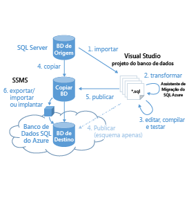

<properties 
   pageTitle="Migração para o banco de dados SQL do Azure" 
   description="Banco de Dados SQL do Microsoft Azure, implantação de banco de dados, migração de banco de dados, banco de dados de importação, exportação de banco de dados, assistente de migração" 
   services="sql-database" 
   documentationCenter="" 
   authors="pehteh" 
   manager="jeffreyg" 
   editor="monicar"/>

<tags
   ms.service="sql-database"
   ms.devlang="NA"
   ms.topic="article"
   ms.tgt_pltfrm="NA"
   ms.workload="data-management" 
   ms.date="04/15/2015"
   ms.author="pehteh"/>

# Visão geral
O banco de dados SQL Azure V12 oferece compatibilidade de mecanismo quase completa com o SQL Server 2014. Como tal, ele simplifica drasticamente a tarefa de migrar a maioria dos bancos de dados do SQL Server para o banco de dados SQL do Azure. A migração para vários bancos de dados é uma operação de movimentação simples que requer poucas alterações no esquema e pouca ou nenhuma reengenharia de aplicativos. E onde os bancos de dados precisam ser alterados, o escopo dessas alterações é mais restrito.

Por projeto, os recursos com escopo de servidor do SQL Server não são suportados pelo banco de dados SQL, de forma que os bancos de dados e aplicativos que dependem deles ainda precisarão de alguma reengenharia antes que possam ser migrados. Embora banco de dados SQL V12 melhore a compatibilidade com o SQL Server, a migração ainda precisa ser planejada e executada com cuidado, especialmente para bancos de dados maiores e mais complexos.

## Visão rápida
Há diferentes abordagens para a migração de um banco de dados do SQL Server para o Azure, cada uma usando uma ou mais ferramentas. Algumas abordagem são rápidas e fáceis, enquanto outras levam mais tempo para serem preparadas. Esteja ciente de que a migração de um banco de dados grande e complexo pode levar várias horas!

### Opção 1:
***Migração de um banco de dados compatível com o SQL Server Management Studio (SSMS)***

O banco de dados é implantado no banco de dados SQL do Azure usando o SSMS. O banco de dados pode ser implantado diretamente ou exportado para um BACPAC que é importado para criar um novo banco de dados SQL do Azure. Use quando o banco de dados de origem for totalmente compatível com o banco de dados SQL do Azure.

### Opção 2:
***Migração de um banco de dados quase compatível usando o SQL Azure Migration Wizard (SAMW)***

O banco de dados é processado usando o SQL Azure Migration Wizard para gerar um script de migração que contenha o esquema ou o esquema mais os dados em formato BCP. Use quando o esquema de banco de dados necessitar de atualização e as alterações puderem ser tratadas pelo assistente.

### Opção 3:
***Atualização do esquema de banco de dados offline usando o Visual Studio (VS) e o SAMW, e a implantação do SSMS***

O banco de dados de origem é importado para um projeto de banco de dados do Visual Studio para processamento offline. O SQL Azure Migration Wizard é então executado em todos os scripts do projeto para aplicar uma série de transformações e correções. O projeto é direcionado no banco de dados SQL V12 e compilado e todos os erros restantes são relatados. Esses erros são resolvidos manualmente usando a ferramenta do SQL Server no Visual Studio. Depois que o projeto for compilado com êxito, ele é publicado para uma cópia do banco de dados de origem. Esse banco de dados atualizado é implantado para banco de dados SQL do Azure usando a opção 1. Caso seja necessária a migração somente de esquema, o esquema pode publicar diretamente do Visual Studio diretamente para o banco de dados SQL do Azure. Use quando o esquema de banco de dados necessitar de mais alterações do que podem ser tratadas pelo SAMW sozinho.

## Decidir quais opções usar
- Se você prevê que um banco de dados pode ser migrado sem alteração, deve ser usada a opção 1, que é rápida e fácil. Se você não tiver certeza, inicie pela exportação de um BACPAC somente de esquema do banco de dados, conforme descrito na opção 1. Se a exportação tiver êxito sem erros, você pode usar a opção 1 para migrar o banco de dados com seus dados.  
- Se ocorrerem erros durante a exportação da opção 1, use o SQL Azure Migration Wizard (SAMW) para processar o banco de dados no modo somente de esquema, conforme descrito na opção 2. Se o SAMW não relatar nenhum erro, poderá ser usada a opção 2. 
- Se o SAMW relatar que o esquema precisa de trabalho adicional, a menos que ele precise apenas correções simples, é melhor usar a opção 3 e corrigir o esquema de banco de dados offline no Visual Studio usando uma combinação de SAMW e alterações de esquema aplicadas manualmente. Uma cópia do banco de dados de origem é atualizada in situ e, em seguida, é migrada para o Azure usando a opção 1.

## Ferramentas de migração
As ferramentas usadas incluem o SQL Server Management Studio (SSMS), a ferramenta do SQL Server no Visual Studio (VS, SSDT) e o SQL Azure Migration Wizard (SAMW), bem como o portal do Azure.

> Certifique-se de instalar as versões mais recentes das ferramentas de cliente, pois as versões anteriores não são compatíveis com o banco de dados SQL v12.

### SQL Server Management Studio (SSMS)
O SSMS pode ser usado para implantar um banco de dados compatível diretamente ao banco de dados SQL do Azure ou para exportar um backup lógico do banco de dados como um BACPAC, que pode ser importado, ainda usando o SSMS, para criar um novo banco de dados SQL do Azure.

Você deve usar a versão mais recente do SSMS (CU6 no SQL Server 2013 e superior) ou fazer o download da [versão mais recente](http://msdn.microsoft.com/evalcenter/dn434042.aspx) da ferramenta.

### SQL Azure Migration Wizard (SAMW)
O SAMW pode ser usado para analisar o esquema do banco de dados existente para compatibilidade com o banco de dados SQL do Azure e, em muitos casos, pode ser usado para gerar e implantar um script T-SQL que contenha o esquema e os dados. O assistente relatará erros durante a transformação caso encontre algum conteúdo de esquema que não seja possível transformar. Se isso ocorrer, o script gerado exigirá mais edições antes que possa ser implantado com êxito. O SAMW processará o corpo de funções ou os procedimentos armazenados que normalmente é excluído da validação executada pela ferramenta do SQL Server no Visual Studio (veja abaixo) para que possam ser encontrados problemas que, de outra forma, não poderiam ser relatados pela validação apenas no Visual Studio. Combinar o uso de SAMW com a ferramenta do SQL Server no Visual Studio pode reduzir significativamente a quantidade de trabalho necessário para migrar um esquema complexo.

Certifique-se de usar a versão mais recente do [SQL Azure Migration Wizard](http://sqlazuremw.codeplex.com/) do CodePlex.

### Ferramenta do SQL Server no Visual Studio (VS, SSDT)
A ferramenta do SQL Server no Visual Studio pode ser usada para criar e gerenciar um projeto de banco de dados que consiste em um conjunto de arquivos de T-SQL para cada objeto no esquema. O projeto pode ser importado de um banco de dados ou de um arquivo de script. Depois de criado, o projeto pode ser transferido para o banco de dados SQL do Azure v12 compilar o projeto e, em seguida, valida a compatibilidade do esquema. Clicar em um erro abre o arquivo de T-SQL correspondente, permitindo que ele seja editado e o erro corrigido. Depois que todos os erros são corrigidos, o projeto pode ser publicado diretamente para o banco de dados SQL a fim de criar um banco de dados vazio ou de volta para (cópia de) o banco de dados original do SQL Server para atualizar seu esquema, que permite que o banco de dados seja implantado com seus dados usando o SSMS acima.

Você deve usar a ferramenta mais recente de banco de dados do SQL Server do Visual Studio para a atualização mais recente para o banco de dados SQL do Azure V12. Verifique se que você tem o Visual Studio 2013 com atualização 4 instalado.

## Comparações
| Opção 1: | Opção 2: | Opção 3: |
| ------------ | ------------ | ------------ |
| Implantar um banco de dados compatível com banco de dados do SQL do Azure | Gerar um script de migração com alterações e executar no banco de dados SQL do Azure | Atualizar o banco de dados no local, em seguida, implantar o banco de dados SQL do Azure |
||  |  |
| Usa o SSMS | Usa SAMW | Usa SAMW, o VS, o SSMS |
|Processo simples, requer que esse esquema seja compatível. O esquema é migrado inalterado. | O script T-SQL gerado pelo SAMW inclui as alterações necessárias para garantir a compatibilidade. Alguns recursos sem suporte serão eliminados do esquema, a maioria é sinalizada como erro. | O esquema é importado para um projeto de banco de dados no Visual Studio e (opcionalmente) transformado com o SAMW. Outras atualizações são feitas usando a ferramenta do SQL Server no Visual Studio e o esquema final é usado para atualizar o banco de dados em situ. |
| Se estiver exportando um BACPAC, poderá optar por migrar somente de esquema. | É possível configurar o assistente para criar o script de esquema ou de esquema mais dados. | Somente é possível publicar o esquema diretamente no Azure no Visual Studio. O banco de dados é atualizado com todas as alterações necessárias in-situ para permitir que o esquema e os dados a sejam implantados/exportados. |
| Sempre implanta ou exporta o banco de dados inteiro. | É possível optar por excluir objetos específicos da migração. | Controle total dos objetos que estão incluídos na migração. |
| Não há provisão para alterar a saída se houver erros, o esquema de origem deve ser compatível. | Um único script gerado de forma monolítica pode ser complicado editar, se necessário. O script pode ser aberto e editado no SSMS ou no Visual Studio com a ferramenta de banco de dados do SQL Server. Todos os erros devem ser corrigidos antes que o script seja implantado no banco de dados SQL do Azure.| Recursos completos da ferramenta do SQL Server no Visual Studio disponíveis. O esquema é alterado offline. |
| A validação do aplicativo ocorre no Azure. Deve ser mínima, já que o esquema é migrado sem alterações. | A validação do aplicativo ocorre no Azure após a migração. O script gerado também pode ser instalado no local para validação inicial do aplicativo. | A validação de aplicativos pode ser feita no SQL Server antes que o banco de dados seja implantado no Azure. |
| Ferramenta Microsoft com suporte. | Ferramenta com suporte da comunidade baixada do CodePlex. | Ferramentas com suporte da Microsoft com o uso opcional de ferramenta com suporte da comunidade baixadas do CodePlex. |
| Processo em uma ou duas etapas configurado de maneira simples e fácil. | A transformação e a geração de esquema, bem como sua implantação na nuvem são organizadas de um único assistente fácil de usar. | Processo mais complexo com várias etapas (mais simples se for apenas a implantação do esquema). |

<!---HONumber=58--> 