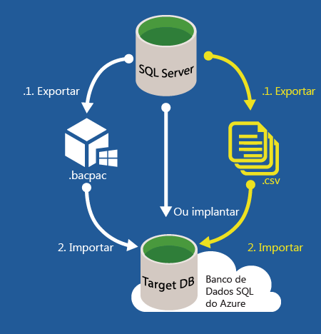

<properties
   pageTitle="Migração de banco de dados do SQL Server para o Banco de Dados SQL | Microsoft Azure"
   description="Saiba mais sobre a migração de banco de dados do SQL Server local para o Banco de Dados SQL do Azure na nuvem. Use ferramentas de migração do banco de dados para testar a compatibilidade antes da migração do banco de dados."
   keywords="migração de banco de dados, migração de banco de dados do sql server, ferramentas de migração de banco de dados, migrar banco de dados, migrar banco de dados sql"
   services="sql-database"
   documentationCenter=""
   authors="carlrabeler"
   manager="jhubbard"
   editor=""/>

<tags
   ms.service="sql-database"
   ms.devlang="NA"
   ms.topic="article"
   ms.tgt_pltfrm="NA"
   ms.workload="sqldb-migrate"
   ms.date="06/07/2016"
   ms.author="carlrab"/>

# Migração de banco de dados do SQL Server para o Banco de Dados SQL na nuvem

Neste artigo, você aprenderá a migrar um banco de dados local do SQL Server 2005 ou posterior para o Banco de Dados SQL do Azure. Nesse processo de migração de banco de dados, você migra o esquema e os dados do banco de dados SQL Server em seu ambiente atual para o Banco de Dados SQL, desde que o banco de dados existente passe nos testes de compatibilidade. Com o [Banco de Dados SQL V12](sql-database-v12-whats-new.md), existem bem poucos problemas de compatibilidade restantes, a não ser de operações entre banco de dados e no nível de servidor. Os bancos de dados e os aplicativos que dependem de [funções com suporte parcial ou sem suporte](sql-database-transact-sql-information.md) precisarão de alguma reengenharia que corrija essas incompatibilidades para que o banco de dados SQL Server possa ser migrado.

Para migrar, estas são as etapas que serão executadas:

- **Teste de compatibilidade**: primeiramente, você deve validar a compatibilidade do banco de dados com o [Banco de Dados SQL V12](sql-database-v12-whats-new.md). 
- **Corrigir problemas de compatibilidade, se houver**: se a validação falhar, você deverá corrigir os erros de validação.  
- **Executar a migração**: assim que o banco de dados for compatível, você poderá usar um ou vários métodos para executar a migração. 

O SQL Server fornece vários métodos para realizar cada uma dessas tarefas. Este artigo fornecerá uma visão geral dos métodos disponíveis para cada tarefa. O diagrama a seguir ilustra as etapas e os métodos.

  
  
 > [AZURE.NOTE] Para migrar um banco de dados não SQL Server, incluindo Microsoft Access, Sybase, MySQL Oracle e DB2 para o Banco de Dados SQL do Azure, confira [SQL Server Migration Assistant](http://blogs.msdn.com/b/ssma/).

## Ferramentas de migração de banco de dados testam a compatibilidade do banco de dados do SQL Server com o Banco de Dados SQL

Para testar os problemas de compatibilidade do Banco de Dados SQL antes de iniciar o processo de migração de banco de dados, use um dos seguintes métodos:

> [AZURE.SELECTOR]
- [SSDT](sql-database-cloud-migrate-fix-compatibility-issues-ssdt.md)
- [SqlPackage](sql-database-cloud-migrate-determine-compatibility-sqlpackage.md)
- [SSMS](sql-database-cloud-migrate-determine-compatibility-ssms.md)
- [Supervisor de Atualização](http://www.microsoft.com/download/details.aspx?id=48119)
- [SAMW](sql-database-cloud-migrate-fix-compatibility-issues.md)

- ["SSDT" (SQL Server Data Tools para Visual Studio)](sql-database-cloud-migrate-fix-compatibility-issues-ssdt.md): o SSDT usa as regras de compatibilidade mais recentes para detectar incompatibilidades do Banco de Dados SQL V12. Se forem detectadas incompatibilidades, você poderá corrigir os problemas detectados diretamente nessa ferramenta. Esse é o método atualmente recomendado para testar e corrigir problemas de compatibilidade do Banco de Dados SQL V12. 
- [SqlPackage](sql-database-cloud-migrate-determine-compatibility-sqlpackage.md): SqlPackage é um utilitário de prompt de comando que será testado e, se encontrado, vai gerar um relatório contendo os problemas de compatibilidade detectados. Ao usar essa ferramenta, garanta que a versão mais recente seja usada para que as regras de compatibilidade mais recentes sejam aplicadas. Se forem detectados erros, você deverá usar outra ferramenta para corrigir os problemas de compatibilidade detectados – o SSDT é recomendado.  
- [O assistente Exportar Aplicativo da Camada de Dados no SQL Server Management Studio](sql-database-cloud-migrate-determine-compatibility-ssms.md): esse assistente vai detectar e relatar erros na tela. Se nenhum erro for detectado, você poderá continuar e concluir a migração para o Banco de Dados SQL. Se forem detectados erros, você deverá usar outra ferramenta para corrigir os problemas de compatibilidade detectados – o SSDT é recomendado.
- [A preview do Supervisor de Atualização do Microsoft SQL Server 2016](http://www.microsoft.com/download/details.aspx?id=48119): essa ferramenta por si só, que atualmente está em preview, vai detectar e gerar um relatório de incompatibilidades do Banco de Dados SQL V12. Essa ferramenta ainda não tem as regras de compatibilidade mais recentes. Se nenhum erro for detectado, você poderá continuar e concluir a migração para o Banco de Dados SQL. Se forem detectados erros, você deverá usar outra ferramenta para corrigir os problemas de compatibilidade detectados – o SSDT é recomendado. 
- ["SAMW" (SQL Azure Migration Wizard)](sql-database-cloud-migrate-fix-compatibility-issues.md): o SAMW é uma ferramenta codeplex que usa as regras de compatibilidade do Banco de Dados SQL V11 do Azure para detectar incompatibilidades do Banco de Dados SQL V12 do Azure. Se incompatibilidades forem detectadas, alguns problemas poderão ser corrigidos diretamente nessa ferramenta. Essa ferramenta pode encontrar incompatibilidades que não precisam ser corrigidas, mas foi a primeira ferramenta de assistência de migração do Banco de Dados SQL do Azure disponibilizada e há muito suporte para ela na comunidade do SQL Server. Além disso, essa ferramenta pode concluir a migração nela mesma. 

## Corrigir problemas de compatibilidade de migração do banco de dados

Se forem detectados problemas de compatibilidade, você deve corrigi-los antes de continuar com a migração do banco de dados do SQL Server. Há uma grande variedade de problemas de compatibilidade que você pode encontrar, o que dependerá da versão do SQL Server no banco de dados de origem e da complexidade do banco de dados que você estiver migrando. Quanto mais antiga a versão do SQL Server para seu banco de dados origem, mais incompatibilidades potenciais você encontrará. Use os recursos a seguir, além de uma pesquisa direcionada na Internet, usando o mecanismo de pesquisa de sua preferência:

- [Recursos de banco de dados do SQL Server sem suporte no Banco de Dados SQL do Azure](sql-database-transact-sql-information.md)
- [Discontinued Database Engine Functionality in SQL Server 2016](https://msdn.microsoft.com/library/ms144262%28v=sql.130%29)
- [Discontinued Database Engine Functionality in SQL Server 2014](https://msdn.microsoft.com/library/ms144262%28v=sql.120%29)
- [Discontinued Database Engine Functionality in SQL Server 2012](https://msdn.microsoft.com/library/ms144262%28v=sql.110%29)
- [Discontinued Database Engine Functionality in SQL Server 2008 R2](https://msdn.microsoft.com/library/ms144262%28v=sql.105%29)
- [Discontinued Database Engine Functionality in SQL Server 2005](https://msdn.microsoft.com/library/ms144262%28v=sql.90%29)

Além de pesquisar na Internet e usar esses recursos, outros recursos bons para identificar como corrigir um problema de incompatibilidade da melhor forma possível são os [fóruns da comunidade do MSDN SQL Server](https://social.msdn.microsoft.com/Forums/sqlserver/home?category=sqlserver) ou o [StackOverflow](http://stackoverflow.com/).

Use uma das ferramentas de migração de banco de dados a seguir para corrigir os problemas detectados:

> [AZURE.SELECTOR]
- [SSDT](sql-database-cloud-migrate-fix-compatibility-issues-ssdt.md)
- [SSMS](sql-database-cloud-migrate-fix-compatibility-issues-ssms.md)
- [SAMW](sql-database-cloud-migrate-fix-compatibility-issues.md)

- Use o ["SSDT" (SQL Server Data Tools para Visual Studio)](sql-database-cloud-migrate-fix-compatibility-issues-ssdt.md): para usar o SSDT, importe o esquema de banco de dados no "SSDT", crie o projeto para uma implantação do Banco de Dados SQL V12, corrija todos os problemas de compatibilidade detectados no SSDT e sincronize as alterações de volta no banco de dados de origem (ou em uma cópia do banco de dados de origem). Esse é o método atualmente recomendado para testar e corrigir problemas de compatibilidade do Banco de Dados SQL V12. Siga o link para [ver detalhadamente como usar o SSDT](sql-database-cloud-migrate-fix-compatibility-issues-ssdt.md).
- Use o ["SSMS" (SQL Server Management Studio)](sql-database-cloud-migrate-fix-compatibility-issues-ssms.md): para usar o SSMS, execute os comandos do Transact-SQL para corrigir os erros detectados usando outra ferramenta. Esse método é basicamente para que usuários avançados modifiquem o esquema de banco de dados diretamente no banco de dados de origem. 
- Use o ["SAMW" (SQL Azure Migration Wizard)](sql-database-cloud-migrate-fix-compatibility-issues.md): para usar o SAMW, gere um script do Transact-SQL no banco de dados de origem que é então transformado pelo assistente, sempre que possível, para tornar o esquema compatível com o Banco de Dados SQL V12. Ao concluir, o SAMW pode se conectar ao Banco de Dados SQL V12 para executar o script. Essa ferramenta também analisará arquivos de rastreamento para determinar problemas de compatibilidade. O script pode ser gerado apenas com esquemas ou pode incluir dados no formato BCP.

## Migrar um banco de dados SQL Server compatível para o Banco de Dados SQL

Para migrar um banco de dados do SQL Server compatível, a Microsoft fornece vários métodos de migração para vários cenários. O método escolhido depende da sua tolerância para tempo de inatividade, do tamanho e da complexidade do seu banco de dados SQL Server, bem como da conectividade com a nuvem do Microsoft Azure.

> [AZURE.SELECTOR]
- [Assistente de Migração do SSMS](sql-database-cloud-migrate-compatible-using-ssms-migration-wizard.md)
- [Exportar para um arquivo BACPAC](sql-database-cloud-migrate-compatible-export-bacpac-ssms.md)
- [Importar de um arquivo BACPAC](sql-database-cloud-migrate-compatible-import-bacpac-ssms.md)
- [Replicação Transacional](sql-database-cloud-migrate-compatible-using-transactional-replication.md)

Para escolher o método de migração, a primeira pergunta a ser feita é se você pode arcar com a retirada do banco de dados da produção durante a migração. Migrar um banco de dados enquanto transações ativas estão ocorrendo pode resultar em inconsistências e na possível corrupção do banco de dados. Há vários métodos para fechar um banco de dados para novas sessões, desde desabilitar a conectividade do cliente até criar um [instantâneo do banco de dados](https://msdn.microsoft.com/library/ms175876.aspx).

Para migrar com tempo de inatividade mínimo, use a [replicação de transação do SQL Server](sql-database-cloud-migrate-compatible-using-transactional-replication.md) se seu banco de dados atender aos requisitos de replicação transacional. Se for possível suportar algum tempo de inatividade ou se você estiver executando um teste de migração de um banco de dados de produção para migração posterior, leve em consideração um dos três métodos a seguir:

- [Assistente de Migração do SSMS](sql-database-cloud-migrate-compatible-using-ssms-migration-wizard.md): no caso de bancos de dados pequenos a médios, a migração de um banco de dados SQL Server 2005 ou posterior compatível é tão simples quanto executar o [Assistente para Implantar Banco de Dados no Banco de Dados do Microsoft Azure](sql-database-cloud-migrate-compatible-using-ssms-migration-wizard.md) no SQL Server Management Studio.
- [Exportar para arquivo BACPAC](sql-database-cloud-migrate-compatible-export-bacpac-ssms.md) e [Importar do arquivo BACPAC](sql-database-cloud-migrate-compatible-import-bacpac-ssms.md): se você tiver desafios de conectividade (nenhuma conectividade, largura de banda baixa ou problemas de tempo limite) e bancos de dados de médios a grandes, use um arquivo [BACPAC](https://msdn.microsoft.com/library/ee210546.aspx#Anchor_4). Com esse método, você exporta o esquema e os dados do SQL Server para um arquivo BACPAC e, em seguida, importa o arquivo BACPAC no Banco de Dados SQL usando o Assistente para Exportar Aplicativo da Camada de Dados no SQL Server Management Studio ou o utilitário de prompt de comando [SqlPackage](https://msdn.microsoft.com/library/hh550080.aspx).
- Usar o BACPAC e o BCP juntos: use um arquivo [BACPAC](https://msdn.microsoft.com/library/ee210546.aspx#Anchor_4) e o [BCP](https://msdn.microsoft.com/library/ms162802.aspx) para bancos de dados muito grandes, a fim de alcançar maior paralelização para aumento de desempenho, ainda que com maior complexidade. Com esse método, migre o esquema e os dados separadamente.
 - [Exportar o esquema somente para um arquivo BACPAC](sql-database-cloud-migrate-compatible-export-bacpac-ssms.md).
 - [Importar o esquema somente do arquivo BACPAC](sql-database-cloud-migrate-compatible-import-bacpac-ssms.md) no Banco de Dados SQL.
 - Usar o [BCP](https://msdn.microsoft.com/library/ms162802.aspx) para extrair os dados em arquivos simples e, em seguida, [carregar paralelamente](https://technet.microsoft.com/library/dd425070.aspx) esses arquivos no Banco de Dados SQL.

	 

## Próximas etapas

- [A Preview do Supervisor de Atualização Microsoft SQL Server 2016](http://www.microsoft.com/download/details.aspx?id=48119)
- [Versão mais recente do SSDT](https://msdn.microsoft.com/library/mt204009.aspx)
- [Versão mais recente do SQL Server Management Studio](https://msdn.microsoft.com/library/mt238290.aspx)

##Recursos adicionais

- [Banco de Dados SQL V12](sql-database-v12-whats-new.md) [Funções com suporte parcial ou ausente no Transact-SQL](sql-database-transact-sql-information.md)
- [Migrar bancos de dados não SQL Server usando o Assistente de Migração do SQL Server](http://blogs.msdn.com/b/ssma/)

<!---HONumber=AcomDC_0615_2016-->