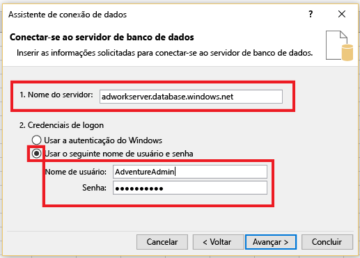
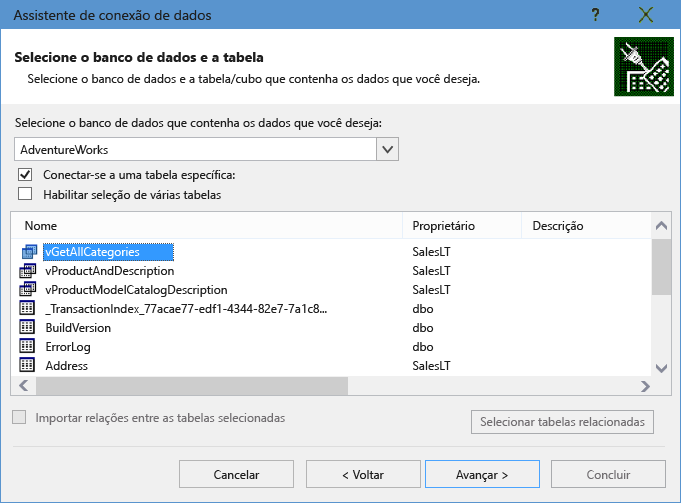
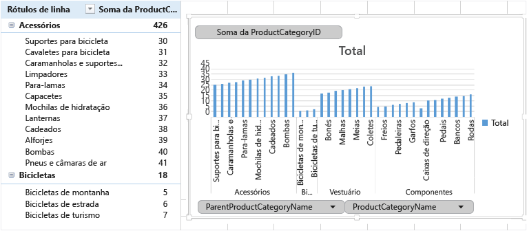

# Conectar o Excel a um banco de dados individual no Banco de Dados SQL do Azure e criar um relatório

Conectar o Excel a um banco de dados individual no Banco de Dados SQL do Azure e importar dados e criar tabelas e gráficos com base nos valores do banco de dados. Neste tutorial, você irá configurar a conexão entre o Excel e uma tabela do banco de dados, salvar o arquivo que armazena os dados e as informações de conexão para o Excel, em seguida, criar um gráfico dinâmico a partir dos valores do banco de dados.

Você precisará de um banco de dados individual antes de começar. Se ainda não tem um, confira [Criar um banco de dados individual](sql-database-single-database-get-started.md) e [Criar um firewall de IP no nível do servidor](sql-database-server-level-firewall-rule.md) para obter um banco de dados individual com dados de exemplo funcionando em alguns minutos.

Neste artigo, você importará dados de exemplo do artigo para o Excel, mas poderá seguir etapas semelhantes em seus próprios dados.

Você também precisará de uma cópia do Excel. Este artigo usa o [Microsoft Excel 2016](https://products.office.com/).

## Conectar o Excel a um banco de dados SQL e carregar dados

1. Para conectar o Excel ao banco de dados SQL, abra o Excel e crie uma nova pasta de trabalho ou abra uma pasta do Excel existente.
2. Na barra de menus na parte superior da página, selecione a guia **Dados**, selecione **Obter dados**, selecione do Azure e, em seguida, selecione **do Banco de Dados SQL do Azure**. 

   

   O Assistente de conexão de dados é aberto.
3. Na caixa de diálogo **Conectar ao servidor do banco de dados**, digite o **Nome do servidor** do Banco de Dados SQL que você deseja conectar no formato <*nomeservidor*>**.database.windows.net**. Por exemplo, **msftestserver.database.windows.net**. Opcionalmente, insira o nome de seu banco de dados. Selecione **OK** para abrir a janela de credenciais. 

   

4. Na caixa de diálogo **Banco de Dados do SQL Server**, selecione **Banco de Dados** à esquerda e, em seguida, insira seu **nome de usuário** e **senha** para o servidor do Banco de Dados SQL ao qual você deseja se conectar. Selecione **Conectar** para abrir o **Navegador**. 

   

   > [!TIP]
   > Dependendo do seu ambiente de rede, você não poderá conectar ou poderá perder a conexão se o servidor do Banco de Dados SQL não permitir o tráfego a partir de seu endereço IP do cliente. Vá para o [portal do Azure](https://portal.azure.com/), clique em servidores SQL, clique no servidor, no firewall em configurações e adicione o endereço IP do cliente. Consulte [Como definir as configurações de firewall](sql-database-configure-firewall-settings.md) para obter mais detalhes.

5. No **Navegador**, selecione o banco de dados que você deseja trabalhar na lista, selecione as tabelas ou exibições com o qual você deseja trabalhar (escolhemos **vGetAllCategories**) e, em seguida, selecione **Carregar** para mover os dados do banco de dados para sua planilha do Excel.

    

## Importar os dados para o Excel e criar um gráfico dinâmico

Agora que a conexão foi estabelecida, você tem várias opções diferentes quanto à forma de carregar os dados. Por exemplo, as etapas a seguir criam um gráfico dinâmico baseado nos dados encontrados no Banco de Dados SQL. 

1. Siga as etapas na seção anterior, mas desta vez, em vez de selecionar **Carregar**, selecione **Carregar para** da lista suspensa **Carregar**.
2. Em seguida, selecione o modo como deseja exibir estes dados na pasta de trabalho. Escolhemos **Gráfico Dinâmico**. Você também pode optar por criar uma **Nova planilha** ou **Adicionar dados a um Modelo de Dados**. Para obter mais informações sobre os Modelos de Dados, consulte [Criar um modelo de dados no Excel](https://support.office.com/article/Create-a-Data-Model-in-Excel-87E7A54C-87DC-488E-9410-5C75DBCB0F7B). 

    

    Agora, a planilha tem uma tabela dinâmica vazia e um gráfico.
3. Em **Campos da Tabela Dinâmica**, selecione todas as caixas de seleção para os campos que você deseja exibir.

    

> [!TIP]
> Se você quiser se conectar a outras pastas de trabalho do Excel e planilhas para o banco de dados, selecione a guia **Dados** e selecione **Fontes recentes** para iniciar a caixa de diálogo **Fontes recentes**. A partir daí, escolha a conexão que você criou da lista e, em seguida, clique em **Abrir**.
> 

## Criar uma conexão permanente usando um arquivo .odc

Para salvar os detalhes de conexão permanentemente, você pode criar um arquivo .odc e tornar essa conexão uma opção selecionável na caixa de diálogo **Conexões existentes**. 

1. Na barra de menus na parte superior da página, selecione a guia **Dados** e, em seguida, selecione **Conexões existentes** para iniciar a caixa de diálogo **Conexões existentes**. 
   1. Selecione **Procurar mais** para abrir a caixa de diálogo **Selecionar fonte de dados**.   
   2. Selecione o arquivo **+NewSqlServerConnection.odc** e, em seguida, selecione **Abrir** para abrir o **Assistente para conexão de dados**.

      

2. Em **Assistente para conexão de dados**, digite seu nome do servidor e suas credenciais do Banco de Dados SQL. Selecione **Avançar**. 
   1. Selecione o banco de dados que contém os dados na lista suspensa. 
   2. Selecione a tabela ou exibição que você está interessado. Escolhemos vGetAllCategories.
   3. Selecione **Avançar**. 

       

3. Selecione o local do arquivo, o **Nome de arquivo**e o **Nome amigável** na próxima tela do Assistente de Conexão de dados. Também é possível salvar a senha no arquivo, embora isso pode expor seus dados para acesso não desejado. Selecione **Concluir** quando estiver pronto. 

    

4. Selecione como você deseja importar os dados. Escolhemos a fazer uma Tabela dinâmica. Você também pode modificar as propriedades de conexão selecionando **Propriedades**. Selecione **OK** quando estiver pronto. Se você não escolheu salvar a senha com o arquivo, você será solicitado a digitar suas credenciais. 

    

5. Verifique se sua nova conexão foi salvo, expandindo a guia **Dados** e selecionando **Conexões existentes**. 

    

## Próximas etapas

* Saiba como [Conectar o Banco de Dados SQL com o SQL Server Management Studio](sql-database-connect-query-ssms.md) para ter uma consulta e análise avançadas.
* Saiba mais sobre os benefícios dos [pools elásticos](sql-database-elastic-pool.md).
* Saiba como [criar um aplicativo Web que se conecta ao Banco de Dados SQL em back-end](../app-service/app-service-web-tutorial-dotnet-sqldatabase.md).
