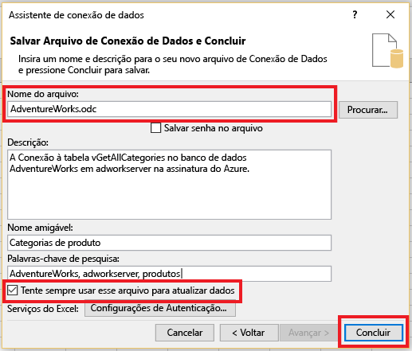
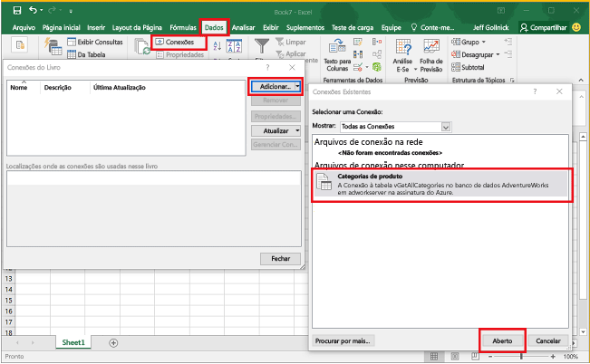

# Conectar o Excel a um Banco de Dados SQL do Azure e criar um relatório

Saiba como conectar o Excel a um banco de dados SQL na nuvem para poder importar dados e criar tabelas e gráficos com base nos valores no banco de dados. Neste tutorial, você irá configurar a conexão entre o Excel e uma tabela do banco de dados, salvar o arquivo que armazena os dados e as informações de conexão para o Excel, em seguida, criar um gráfico dinâmico a partir dos valores do banco de dados.

Você precisará de um banco de dados SQL no Azure antes de começar. Se você não tiver um, consulte [Criar seu primeiro banco de dados SQL](sql-database-get-started.md) para obter um banco de dados com dados de exemplo em funcionamento em alguns minutos. Neste artigo, você importará dados de exemplo para o Excel a partir do outro artigo, mas poderá seguir etapas semelhantes em seus próprios dados.

Você também precisará de uma cópia do Excel. Este artigo usa o [Microsoft Excel 2016](https://products.office.com/en-US/).

## Conectar o Excel a um banco de dados SQL e criar um arquivo odc
1. Para conectar o Excel ao banco de dados SQL, abra o Excel e crie uma nova pasta de trabalho ou abra uma pasta do Excel existente.
2. Na barra de menus na parte superior da página, clique em **Dados**, clique em **De Outras Fontes** e, em seguida, clique em **Do SQL Server**.
   
   
   
   O Assistente de conexão de dados é aberto.
3. Na caixa de diálogo **Conectar ao servidor do banco de dados**, digite o **Nome do servidor** do Banco de Dados SQL que você deseja conectar no formato <*nomeservidor*>**.database.windows.net**. Por exemplo, **adworkserver.database.windows.net**.
4. Em **Credenciais de logon**, clique em **Usar o seguinte Nome de Usuário e Senha**, digite o **Nome de Usuário** e a **Senha** que você configurou para o servidor do Banco de Dados SQL ao criá-lo, em seguida, clique em **Avançar**.
   
   
   
   > [!TIP]
   > Dependendo do seu ambiente de rede, você não poderá conectar ou poderá perder a conexão se o servidor do Banco de Dados SQL não permitir o tráfego a partir de seu endereço IP do cliente. Vá para o [portal do Azure](https://portal.azure.com/), clique em servidores SQL, clique no servidor, no firewall em configurações e adicione o endereço IP do cliente. Consulte [Como definir as configurações de firewall](sql-database-configure-firewall-settings.md) para obter mais detalhes.
   > 
   > 
5. Na caixa de diálogo **Selecionar Banco de Dados e Tabela**, selecione o banco de dados com o qual você deseja trabalhar na lista, em seguida, clique nas tabelas ou exibições com as quais deseja trabalhar (escolhemos **vGetAllCategories**), em seguida, clique em **Avançar**.
   
    
   
    A caixa de diálogo **Salvar Arquivo de Conexão de Dados e Concluir** é aberta, em que você fornece informações sobre o arquivo de conexão de banco de dados do Office (*.odc) que o Excel usa. Você pode deixar os padrões ou personalizar suas seleções.
6. Você pode deixar os padrões, mas observe o **Nome de Arquivo** em particular. Uma **Descrição**, **Nome Amigável** e **Palavras-Chave de Pesquisa** ajudam você e outros usuários a lembrarem o que está sendo conectado e a encontrarem a conexão. Clique em **Sempre tentar usar este arquivo para atualizar os dados** se você quiser as informações de conexão armazenadas no arquivo odc para que ele possa ser atualizado quando você se conectar e, em seguida, clique em **Concluir**.
   
    
   
    A caixa de diálogo **Importar dados** é exibida.

## Importar os dados para o Excel e criar um gráfico dinâmico
Agora que você estabeleceu a conexão e criou o arquivo com dados e informações de conexão, está pronto para importar os dados.

1. Na caixa de diálogo **Importar Dados**, clique na opção desejada para apresentar os dados na planilha, em seguida, clique em **OK**. Escolhemos **Gráfico Dinâmico**. Você também pode optar por criar uma **Nova planilha** ou **Adicionar dados a um Modelo de Dados**. Para obter mais informações sobre os Modelos de Dados, consulte [Criar um modelo de dados no Excel](https://support.office.com/article/Create-a-Data-Model-in-Excel-87E7A54C-87DC-488E-9410-5C75DBCB0F7B). Clique em **Propriedades** para explorar as informações sobre o arquivo odc que você criou na etapa anterior e escolha as opções para atualizar os dados.
   
    
   
    Agora, a planilha tem uma tabela dinâmica vazia e um gráfico.
2. Em **Campos da Tabela Dinâmica**, selecione todas as caixas de seleção para os campos que você deseja exibir.
   
    

> [!TIP]
> Se você quiser conectar outras pastas de trabalho do Excel e planilhas ao banco de dados, clique em **Dados**, **Conexões**, **Adicionar**, escolha a conexão que você criou na lista, em seguida, clique em **Abrir**.
> 
> 
> 

## Próximas etapas
* Saiba como [Conectar o Banco de Dados SQL com o SQL Server Management Studio](sql-database-connect-query-ssms.md) para ter uma consulta e análise avançadas.
* Saiba mais sobre os benefícios dos [pools elásticos](sql-database-elastic-pool.md).
* Saiba como [criar um aplicativo Web que se conecta ao Banco de Dados SQL em back-end](../app-service-web/web-sites-dotnet-deploy-aspnet-mvc-app-membership-oauth-sql-database.md).

