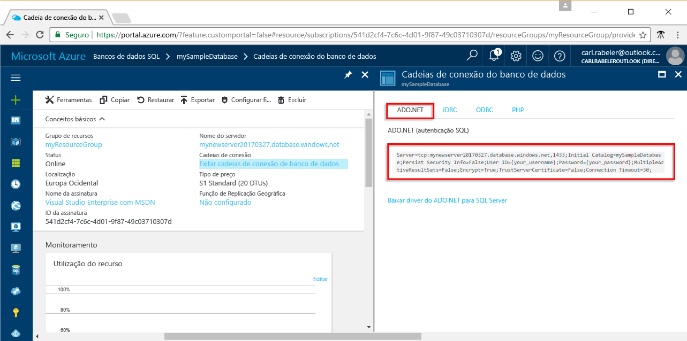

# <a name="use-net-core-c-to-query-an-azure-sql-database"></a>Usar o .NET Core (C#) para consultar um banco de dados SQL do Azure

Este tutorial de início rápido demonstra como usar o [.NET Core](https://www.microsoft.com/net/) no Windows/Linux/macOS para criar um programa C# para se conectar a um banco de dados SQL do Azure e usar instruções Transact-SQL para consultar dados.

## <a name="prerequisites"></a>Pré-requisitos

Para concluir este tutorial de início rápido, tenha o seguinte:

- Um banco de dados SQL do Azure. Este início rápido usa os recursos criados em um destes inícios rápidos: 

   - [Criar Banco de dados - Portal](sql-database-get-started-portal.md)
   - [Criar Banco de dados - CLI](sql-database-get-started-cli.md)
   - [Criar Banco de dados - PowerShell](sql-database-get-started-powershell.md)

- Uma [regra de firewall no nível de servidor](sql-database-get-started-portal.md#create-a-server-level-firewall-rule) para o endereço IP público do computador usado neste tutorial de início rápido.
- Você instalou [.NET Core para o sistema operacional](https://www.microsoft.com/net/core). 

## <a name="sql-server-connection-information"></a>Informações de conexão do servidor SQL

Obtenha as informações de conexão necessárias para se conectar ao Banco de Dados SQL do Azure. Você precisará do nome totalmente qualificado do servidor, nome do banco de dados e informações de logon nos próximos procedimentos.

1. Faça logon no [Portal do Azure](https://portal.azure.com/).
2. Selecione **Bancos de Dados SQL** no menu à esquerda e clique em seu banco de dados na página **Bancos de Dados SQL**. 
3. Na página **Visão geral** do banco de dados, examine o nome totalmente qualificado do servidor, como mostrado na imagem a seguir. Você pode passar o mouse sobre o nome do servidor para abrir a opção **Clique para copiar**. 

    

4. Se você esquecer as informações de logon para o servidor do Banco de Dados SQL do Azure, navegue até a página do servidor do Banco de Dados SQL para exibir o nome de administrador do servidor. Você pode redefinir a senha, se necessário.

5. Clique em **Mostrar cadeias de conexão de banco de dados**.

6. Examine a cadeia de conexão completa do **ADO.NET**.

    

> [!IMPORTANT]
> Você deve ter uma regra de firewall em vigor para o endereço IP público do computador em que você executa este tutorial. Se você estiver em um computador diferente ou se tiver um endereço IP público diferente, crie uma [regra de firewall no nível de servidor usando o portal do Azure](sql-database-get-started-portal.md#create-a-server-level-firewall-rule). 
>
  
## <a name="create-a-new-net-project"></a>Criar um novo projeto .NET

1. Abra um prompt de comando e crie uma pasta chamada *sqltest*. Navegue até a pasta que você criou e execute o seguinte comando:

    ```
    dotnet new console
    ```

2. Abra ***sqltest.csproj*** com seu editor de texto favorito e adicione System.Data.SqlClient como uma dependência usando o seguinte código:

    ```xml
    <ItemGroup>
        <PackageReference Include="System.Data.SqlClient" Version="4.3.0" />
    </ItemGroup>
    ```

## <a name="insert-code-to-query-sql-database"></a>Inserir código para consultar o banco de dados SQL

1. Em seu ambiente de desenvolvimento ou editor de texto favorito, abra **Program.cs**

2. Substitua o conteúdo pelo código a seguir e adicione os valores apropriados para seu servidor, banco de dados, usuário e senha.

```csharp
using System;
using System.Data.SqlClient;
using System.Text;

namespace sqltest
{
    class Program
    {
        static void Main(string[] args)
        {
            try 
            { 
                SqlConnectionStringBuilder builder = new SqlConnectionStringBuilder();
                builder.DataSource = "your_server.database.windows.net"; 
                builder.UserID = "your_user";            
                builder.Password = "your_password";     
                builder.InitialCatalog = "your_database";

                using (SqlConnection connection = new SqlConnection(builder.ConnectionString))
                {
                    Console.WriteLine("\nQuery data example:");
                    Console.WriteLine("=========================================\n");
                    
                    connection.Open();       
                    StringBuilder sb = new StringBuilder();
                    sb.Append("SELECT TOP 20 pc.Name as CategoryName, p.name as ProductName ");
                    sb.Append("FROM [SalesLT].[ProductCategory] pc ");
                    sb.Append("JOIN [SalesLT].[Product] p ");
                    sb.Append("ON pc.productcategoryid = p.productcategoryid;");
                    String sql = sb.ToString();

                    using (SqlCommand command = new SqlCommand(sql, connection))
                    {
                        using (SqlDataReader reader = command.ExecuteReader())
                        {
                            while (reader.Read())
                            {
                                Console.WriteLine("{0} {1}", reader.GetString(0), reader.GetString(1));
                            }
                        }
                    }                    
                }
            }
            catch (SqlException e)
            {
                Console.WriteLine(e.ToString());
            }
            Console.ReadLine();
        }
    }
}
```

## <a name="run-the-code"></a>Executar o código

1. No prompt de comando, execute estes comandos:

   ```csharp
   dotnet restore
   dotnet run
   ```

2. Verifique se as 20 linhas superiores são retornadas e, em seguida, feche a janela do aplicativo.


## <a name="next-steps"></a>Próximas etapas

- [Introdução ao .NET Core no Windows/Linux/macOS usando a linha de comando](/dotnet/core/tutorials/using-with-xplat-cli.md).
- Saiba como [conectar-se e consultar um banco de dados SQL do Azure usando o .NET framework e o Visual Studio](sql-database-connect-query-dotnet-visual-studio.md).  
- Saiba como [Projetar seu primeiro banco de dados SQL do Azure usando o SSMS](sql-database-design-first-database.md) ou [Projetar seu primeiro banco de dados SQL do Azure usando o .NET](sql-database-design-first-database-csharp.md).
- Para saber mais sobre o .NET, veja a [documentação do .NET](https://docs.microsoft.com/dotnet/).

