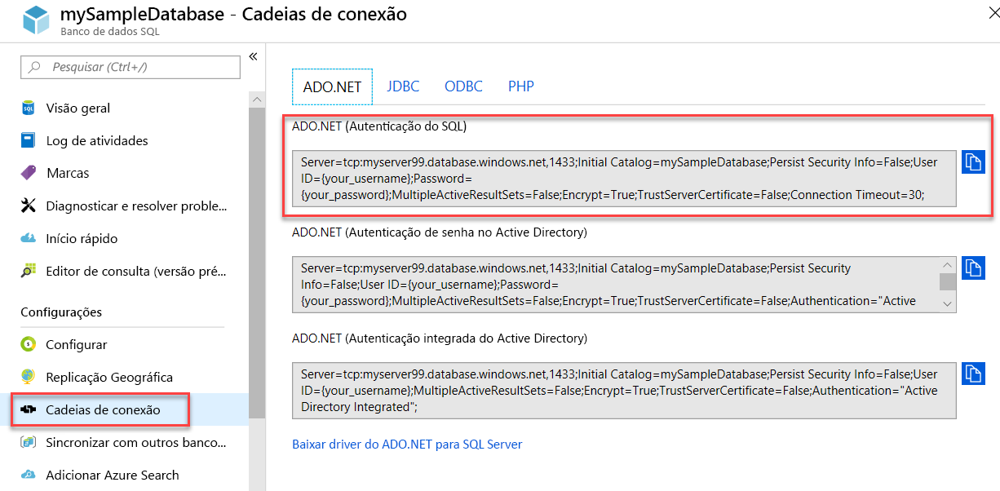

# <a name="quickstart-use-net-core-c-to-query-an-azure-sql-database"></a>Início Rápido: Usar o .NET Core (C#) para consultar um banco de dados SQL do Azure

Neste início rápido, você usará o [.NET Core](https://www.microsoft.com/net/) e o código C# para conectar-se a um Banco de Dados SQL do Azure. Em seguida, você executará uma instrução Transact-SQL para consultar dados.

## <a name="prerequisites"></a>Pré-requisitos

Para este tutorial, é necessário:

- Um banco de dados SQL do Azure. Você pode usar um destes guias de início rápido para criar e, em seguida, configurar um banco de dados no Banco de Dados SQL do Azure:

  || Banco de dados individual | Instância gerenciada |
  |:--- |:--- |:---|
  | Criar| [Portal](sql-database-single-database-get-started.md) | [Portal](sql-database-managed-instance-get-started.md) |
  || [CLI](scripts/sql-database-create-and-configure-database-cli.md) | [CLI](https://medium.com/azure-sqldb-managed-instance/working-with-sql-managed-instance-using-azure-cli-611795fe0b44) |
  || [PowerShell](scripts/sql-database-create-and-configure-database-powershell.md) | [PowerShell](scripts/sql-database-create-configure-managed-instance-powershell.md) |
  | Configurar | [Regra de firewall de IP no nível do servidor](sql-database-server-level-firewall-rule.md)| [Conectividade de uma VM](sql-database-managed-instance-configure-vm.md)|
  |||[Conectividade do local](sql-database-managed-instance-configure-p2s.md)
  |Carregar dados|Adventure Works carregado por guia de início rápido|[Restaurar o Wide World Importers](sql-database-managed-instance-get-started-restore.md)
  |||Restaurar ou importar o Adventure Works por meio do arquivo [BACPAC](sql-database-import.md) do [GitHub](https://github.com/Microsoft/sql-server-samples/tree/master/samples/databases/adventure-works)|
  |||

  > [!IMPORTANT]
  > Os scripts deste artigo são escritos para usar o banco de dados do Adventure Works. Com uma instância gerenciada, você deve importar o banco de dados do Adventure Works para um banco de dados de instância ou modificar os scripts deste artigo para usar o banco de dados da Wide World Importers.

- [.NET Core para seu sistema operacional](https://www.microsoft.com/net/core) instalado.

> [!NOTE]
> Este início rápido usa o banco de dados *mySampleDatabase*. Se você quiser usar um banco de dados diferente, precisará alterar as referências de banco de dados e modificar a consultar `SELECT` no código C#.

## <a name="get-sql-server-connection-information"></a>Obter informações de conexão do SQL Server

Obtenha as informações de conexão necessárias para se conectar ao Banco de Dados SQL do Azure. Você precisará do nome totalmente qualificado do servidor ou do host, do nome do banco de dados e das informações de logon nos próximos procedimentos.

1. Entre no [Portal do Azure](https://portal.azure.com/).

2. Navegue até a página **bancos de dados SQL** ou **instâncias gerenciadas do SQL**.

3. Na página **Visão geral**, examine o nome do servidor totalmente qualificado próximo ao **Nome do servidor** para um banco de dados individual ou o nome do servidor totalmente qualificado próximo ao **Host** para instância gerenciada. Para copiar o nome do servidor ou o nome do host, passe o mouse sobre ele e selecione o ícone **Copiar**.

## <a name="get-adonet-connection-information-optional"></a>Obter informações de conexão do ADO.NET (opcional)

1. Navegue até a página **mySampleDatabase** e, em **Configurações**, selecione **Cadeias de conexão**.

2. Examine a cadeia de conexão completa do **ADO.NET**.

    

3. Copie a cadeia de conexão **ADO.NET** se pretender usá-la.
  
## <a name="create-a-new-net-core-project"></a>Criar um novo projeto do .NET Core

1. Abra um prompt de comando e crie uma pasta chamada **sqltest**. Navegue até essa pasta e execute este comando.

    ```cmd
    dotnet new console
    ```
    Esse comando cria os arquivos de projeto do aplicativo, incluindo um arquivo de código C# inicial (**Program.cs**), um arquivo de configuração XML (**sqltest.csproj**) e os binários necessários.

2. Em um editor de texto, abra **sqltest.csproj** e cole o seguinte XML entre as marcas `<Project>`. Esse XML adiciona `System.Data.SqlClient` como uma dependência.

    ```xml
    <ItemGroup>
        <PackageReference Include="System.Data.SqlClient" Version="4.6.0" />
    </ItemGroup>
    ```

## <a name="insert-code-to-query-sql-database"></a>Inserir código para consultar o banco de dados SQL

1. Em um editor de texto, abra **Program.cs**.

2. Substitua o conteúdo pelo código a seguir e adicione os valores apropriados para seu servidor, banco de dados, nome de usuário e senha.

> [!NOTE]
> Para usar uma cadeia de conexão do ADO.NET, substitua as 4 linhas no código de configuração de servidor, banco de dados, nome de usuário e senha pela linha abaixo. Na cadeia de caracteres, defina seu nome de usuário e senha.
>
>    `builder.ConnectionString="<your_ado_net_connection_string>";`

```csharp
using System;
using System.Data.SqlClient;
using System.Text;

namespace sqltest
{
    class Program
    {
        static void Main(string[] args)
        {
            try 
            { 
                SqlConnectionStringBuilder builder = new SqlConnectionStringBuilder();

                builder.DataSource = "<your_server.database.windows.net>"; 
                builder.UserID = "<your_username>";            
                builder.Password = "<your_password>";     
                builder.InitialCatalog = "<your_database>";
         
                using (SqlConnection connection = new SqlConnection(builder.ConnectionString))
                {
                    Console.WriteLine("\nQuery data example:");
                    Console.WriteLine("=========================================\n");
                    
                    connection.Open();       
                    StringBuilder sb = new StringBuilder();
                    sb.Append("SELECT TOP 20 pc.Name as CategoryName, p.name as ProductName ");
                    sb.Append("FROM [SalesLT].[ProductCategory] pc ");
                    sb.Append("JOIN [SalesLT].[Product] p ");
                    sb.Append("ON pc.productcategoryid = p.productcategoryid;");
                    String sql = sb.ToString();

                    using (SqlCommand command = new SqlCommand(sql, connection))
                    {
                        using (SqlDataReader reader = command.ExecuteReader())
                        {
                            while (reader.Read())
                            {
                                Console.WriteLine("{0} {1}", reader.GetString(0), reader.GetString(1));
                            }
                        }
                    }                    
                }
            }
            catch (SqlException e)
            {
                Console.WriteLine(e.ToString());
            }
            Console.WriteLine("\nDone. Press enter.");
            Console.ReadLine(); 
        }
    }
}
```

## <a name="run-the-code"></a>Executar o código

1. No prompt, execute os comandos a seguir.

   ```cmd
   dotnet restore
   dotnet run
   ```

2. Verifique se as primeiras 20 linhas são retornadas.

   ```text
   Query data example:
   =========================================

   Road Frames HL Road Frame - Black, 58
   Road Frames HL Road Frame - Red, 58
   Helmets Sport-100 Helmet, Red
   Helmets Sport-100 Helmet, Black
   Socks Mountain Bike Socks, M
   Socks Mountain Bike Socks, L
   Helmets Sport-100 Helmet, Blue
   Caps AWC Logo Cap
   Jerseys Long-Sleeve Logo Jersey, S
   Jerseys Long-Sleeve Logo Jersey, M
   Jerseys Long-Sleeve Logo Jersey, L
   Jerseys Long-Sleeve Logo Jersey, XL
   Road Frames HL Road Frame - Red, 62
   Road Frames HL Road Frame - Red, 44
   Road Frames HL Road Frame - Red, 48
   Road Frames HL Road Frame - Red, 52
   Road Frames HL Road Frame - Red, 56
   Road Frames LL Road Frame - Black, 58
   Road Frames LL Road Frame - Black, 60
   Road Frames LL Road Frame - Black, 62

   Done. Press enter.
   ```
3. Pressione **Enter** para fechar a janela do aplicativo.

## <a name="next-steps"></a>Próximas etapas

- [Introdução ao .NET Core no Windows/Linux/macOS usando a linha de comando](/dotnet/core/tutorials/using-with-xplat-cli).
- Saiba como [conectar-se e consultar um Banco de Dados SQL do Azure usando o .NET Framework e o Visual Studio](sql-database-connect-query-dotnet-visual-studio.md).  
- Saiba como [Projetar seu primeiro Banco de Dados SQL do Azure usando o SSMS](sql-database-design-first-database.md) ou [Projetar um Banco de Dados SQL do Azure e conectar-se com o C# e o ADO.NET](sql-database-design-first-database-csharp.md).
- Para saber mais sobre o .NET, veja a [documentação do .NET](https://docs.microsoft.com/dotnet/).
