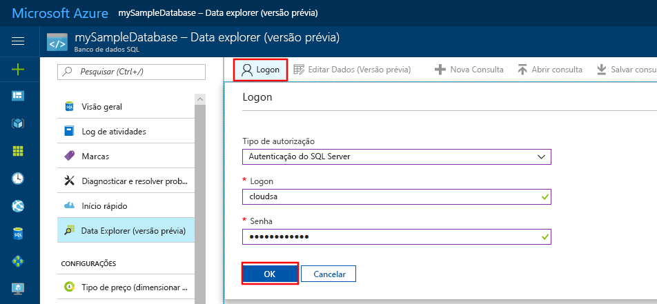
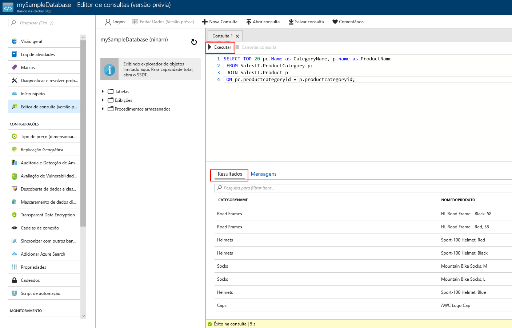

# <a name="azure-portal-use-the-sql-query-editor-to-connect-and-query-data"></a>Portal do Azure: usar o Editor de consultas SQL para se conectar e consultar dados

O Editor de consultas SQL é uma ferramenta de consulta no navegador que fornece uma maneira eficiente e leve para executar consultas SQL em seu Banco de dados SQL do Azure ou SQL Data Warehouse do Azure sem sair do portal do Azure. Este guia rápido demonstra como usar o Editor de consultas para se conectar a um banco de dados SQL e depois usar instruções do Transact-SQL para consultar, inserir, atualizar e excluir dados no banco de dados. 

## <a name="prerequisites"></a>Pré-requisitos

Este início rápido usa como ponto de partida os recursos criados em um destes inícios rápidos:

- [Criar Banco de dados - Portal](sql-database-get-started-portal.md)
- [Criar Banco de dados - CLI](sql-database-get-started-cli.md)
- [Criar Banco de dados - PowerShell](sql-database-get-started-powershell.md)


## <a name="log-in-to-the-azure-portal"></a>Faça logon no Portal do Azure

Faça logon no [Portal do Azure](https://portal.azure.com/).


## <a name="connect-using-sql-authentication"></a>Conectar-se usando Autenticação SQL
> [!NOTE]
> Verifique se a opção “Permitir acesso aos serviços do Azure” está definida como “Ativada” nas configurações de firewall do seu SQL Server. Essa opção dá ao Editor de consultas SQL o acesso aos seus bancos de dados e data warehouses.

1. Clique em **bancos de dados SQL** no menu esquerdo e clique no banco de dados que deseja consultar.

2. Na página do banco de dados SQL do seu banco de dados, clique em **Ferramentas** na barra de ferramentas. A página Ferramentas é aberta.

    

3. Clique em **Editor de consultas (visualização)**, clique na caixa de seleção **Visualizar termos** e clique em **OK**. A página do Editor de consulta é aberta.

4. Clique em **Login** e, quando receber solicitação, selecione **Autenticação do SQL Server** e forneça o logon de administrador do servidor e a senha fornecida ao criar o banco de dados.

     

5. Clique em **OK para fazer logon**.


## <a name="connect-using-azure-ad"></a>Conecte-se usando o Azure Active Directory

Configurar um administrador do Active Directory permite que você use uma única identidade de logon para o portal do Azure e seu banco de dados SQL. Siga as etapas abaixo para configurar um administrador do Active Directory para o SQL Server que você criou.

> [!NOTE]
> Contas de email (por exemplo, outlook.com, hotmail.com, live.com, gmail.com, yahoo.com) ainda não contam com suporte como administradoras de Active Directory. Verifique se escolheu um usuário que foi originalmente criado ou federado no Azure Active Directory.

1. Selecione **SQL Servers** no menu à esquerda e selecione seu SQL Server na lista de servidores.

2. Selecione a configuração **Administrador do Active Directory** no menu de configurações do SQL Server.

3. Na folha do Administrador do Active Directory, clique no comando **Definir administrador** e selecione o usuário ou grupo que será o administrador do Active Directory.

     

4. Na parte superior da folha do Administrador do Active Directory, clique no comando **Salvar** para definir o administrador do Active Directory.

Navegue até o banco de dados do SQL que deseja consultar, clique no **comando Ferramentas** na barra de ferramentas e selecione a opção **Editor de consultas (versão prévia)**. A página do Editor de consultas se abre e conecta você automaticamente ao banco de dados.


## <a name="run-query-using-query-editor"></a>Execute a consulta usando o Editor de consultas

Depois de autenticado, digite a consulta a seguir no painel do Editor de consulta para consultar os 20 principais produtos por categoria.

```sql
 SELECT TOP 20 pc.Name as CategoryName, p.name as ProductName
 FROM SalesLT.ProductCategory pc
 JOIN SalesLT.Product p
 ON pc.productcategoryid = p.productcategoryid;
```

Clique em **Executar** e reveja os resultados da consulta no painel **Resultados**.



## <a name="insert-data-using-query-editor"></a>Inserir dados usando o Editor de consulta

Use o código a seguir para inserir um novo produto na tabela SalesLT.Product usando a instrução [INSERT](https://msdn.microsoft.com/library/ms174335.aspx) do Transact-SQL.

1. Na janela de consulta, substitua a consulta anterior pela seguinte consulta:

   ```sql
   INSERT INTO [SalesLT].[Product]
           ( [Name]
           , [ProductNumber]
           , [Color]
           , [ProductCategoryID]
           , [StandardCost]
           , [ListPrice]
           , [SellStartDate]
           )
     VALUES
           ('myNewProduct'
           ,123456789
           ,'NewColor'
           ,1
           ,100
           ,100
           ,GETDATE() );
   ```

2. Na barra de ferramentas, clique em **Executar** para inserir uma nova linha na tabela do Produto.

## <a name="update-data-using-query-editor"></a>Atualizar dados usando o Editor de consulta

Use o código a seguir para atualizar o novo produto que você adicionou anteriormente usando a instrução [UPDATE](https://msdn.microsoft.com/library/ms177523.aspx) do Transact-SQL.

1. Na janela de consulta, substitua a consulta anterior pela seguinte consulta:

   ```sql
   UPDATE [SalesLT].[Product]
   SET [ListPrice] = 125
   WHERE Name = 'myNewProduct';
   ```

2. Na barra de ferramentas, clique em **Executar** para atualizar a linha especificada na tabela do Produto.

## <a name="delete-data-using-query-editor"></a>Excluir dados usando o Editor de consulta

Use o código a seguir para excluir o novo produto que você adicionou anteriormente usando a instrução [DELETE](https://msdn.microsoft.com/library/ms189835.aspx) do Transact-SQL.

1. Na janela de consulta, substitua a consulta anterior pela seguinte consulta:

   ```sql
   DELETE FROM [SalesLT].[Product]
   WHERE Name = 'myNewProduct';
   ```

2. Na barra de ferramentas, clique em **Executar** para excluir a linha especificada na tabela do Produto.


## <a name="query-editor-considerations"></a>Considerações sobre o Editor de consultas

Há algumas coisas que se deve saber ao trabalhar com o Editor de consultas enquanto ele permanece em estado de versão prévia:

1. Verifique se a opção "Permitir acesso aos serviços do Azure" nas configurações do firewall do Azure SQL Server foi definida como "Ativada". Essa opção dá ao Editor de consultas SQL o acesso aos seus bancos de dados e data warehouses SQL.

2. O logon no Administrador do Azure Active Directory não funciona com contas que têm a autenticação de dois fatores habilitada. 

3. Contas de email (por exemplo, outlook.com, hotmail.com, live.com, gmail.com, yahoo.com) ainda não contam com suporte como administradoras de Active Directory. Verifique se escolheu um usuário que foi originalmente criado ou federado no Azure Active Directory

4. Consultas de tipos de dados espaciais ainda não têm suporte no Editor de consultas. Consultar colunas espaciais resultará em um erro de 'System.IO.FileNotFoundException'.

5. Não há suporte para IntelliSense para tabelas e exibições de banco de dados. No entanto, o editor oferece suporte de preenchimento automático nos nomes que já foram digitados. 

6. Pressionar a tecla F5 atualiza a página do Editor de consultas e faz perder a consulta que está sendo trabalhada. Use o botão Executar na barra de ferramentas para executar consultas.


## <a name="next-steps"></a>Próximas etapas

- Para saber mais sobre o Transact-SQL com suporte em bancos de dados SQL do Azure, confira [Diferenças do Transact-SQL no banco de dados SQL](sql-database-transact-sql-information.md).
