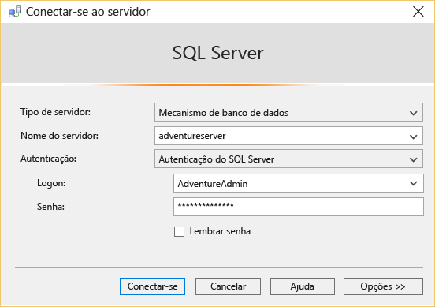

<properties
	pageTitle="Conectar-se ao banco de dados SQL usando SSMS | Microsoft Azure"
	description="Saiba como se conectar a um banco de dados SQL do Azure usando o SQL Server Management Studio (SSMS). Em seguida, execute uma consulta de exemplo usando o Transact-SQL (T-SQL)."
	metaCanonical=""
	keywords="conectar-se ao banco de dados sql, sql server management studio"
	services="sql-database"
	documentationCenter=""
	authors="stevestein"
	manager="jeffreyg"
	editor="" />

<tags
	ms.service="sql-database"
	ms.workload="data-management"
	ms.tgt_pltfrm="na"
	ms.devlang="na"
	ms.topic="get-started-article"
	ms.date="10/09/2015"
	ms.author="sstein" />

# Conectar-se ao Banco de Dados SQL com o SQL Server Management Studio e executar um exemplo de consulta T-SQL

> [AZURE.SELECTOR]
- [C#](sql-database-connect-query.md)
- [SSMS](sql-database-connect-query-ssms.md)
- [Excel](sql-database-connect-excel.md)

Este artigo mostra como conectar-se a um banco de dados SQL do Azure usando o SQL Server Management Studio (SSMS) e executar uma consulta simples usando instruções Transact-SQL.

Em primeiro lugar, você precisará de um banco de dados SQL no Azure. Você pode criar um rapidamente com as instruções em [Introdução ao Banco de Dados SQL do Microsoft Azure](sql-database-get-started.md). Os exemplos aqui são baseados no banco de dados de exemplo AdventureWorks, que você cria nesse artigo, mas as mesmas etapas se aplicam a qualquer banco de dados SQL, até a execução da consulta.

## Instalar e iniciar o SQL Server Management Studio (SSMS)

Ao trabalhar com o Banco de Dados SQL, você deverá usar a versão mais recente do SSMS. Consulte [Baixar SQL Server Management Studio](https://msdn.microsoft.com/library/mt238290.aspx) para obtê-lo. Com a versão mais recente, o SSMS notifica você automaticamente quando a atualização mais recente estiver disponível.

## Iniciar o SSMS e se conectar ao servidor de banco de dados SQL

1. Digite "Microsoft SQL Server Management Studio" na caixa de pesquisa do Windows e clique no aplicativo de área de trabalho para iniciar o SSMS.
2. Na caixa de diálogo **Conectar ao Servidor**, na caixa **Nome do servidor**, digite o nome do servidor que hospeda o banco de dados SQL no formato *&lt;nomedoservidor >*.**database.windows.net**.
3. Escolha **Autenticação do SQL Server** na lista **Autenticação**.
4. Digite o **Logon** e a **Senha** que você configurou ao criar o servidor e clique em **Conectar** para se conectar ao Banco de Dados SQL.

	

### Se a conexão ao Banco de Dados SQL falhar

O motivo mais comum das falhas de conexão são os erros no nome do servidor, nome de usuário ou senha, bem como o fato de o servidor não permitir conexões por motivos de segurança. Verifique se as configurações de firewall do servidor permitem conexões do endereço IP do seu computador local e o endereço IP usado pelo cliente do SSMS. Às vezes, eles são diferentes.

Se a conexão falhar devido a configurações de firewall, a versão mais recente do SSMS criará a regra de firewall para você depois de perguntar se pode fazer isso. Para obtê-la, consulte [Baixar SSMS](https://msdn.microsoft.com/library/mt238290.aspx). Se você estiver usando uma versão anterior, o endereço IP será informado em uma mensagem de erro e você precisará adicionar esse endereço IP à regra de firewall do servidor. Para saber mais, consulte [Como definir configurações de firewall (Banco de Dados SQL do Azure)](sql-database-configure-firewall-settings.md).

## Executar consultas de exemplo

Depois de se conectar ao Banco de Dados SQL, você poderá executar uma consulta de exemplo. Se você não tiver criado o banco de dados usando o exemplo da AdventureWorks em [Introdução ao Banco de Dados SQL do Microsoft Azure](sql-database-get-started.md), essa consulta não funcionará. Vá direto para as Próximas Etapas para saber mais.

1. No **Pesquisador de Objetos**, navegue até o banco de dados **AdventureWorks**.
2. Clique com o botão direito do mouse no banco de dados e selecione **Nova Consulta**.

	

3. Na janela de consulta, copie e cole o código a seguir.

		SELECT
		CustomerId
		,Title
		,FirstName
		,LastName
		,CompanyName
		FROM SalesLT.Customer;

4. Clique no botão **Executar**. A captura de tela a seguir mostra uma consulta bem-sucedida.

	

## Próximas etapas

Você pode usar instruções T-SQL para criar e gerenciar bancos de dados no Azure da mesma forma que faz no SQL Server. Se você já sabe como usar o T-SQL com o SQL Server, consulte [Informações de Transact-SQL de Banco de Dados SQL do Azure](sql-database-transact-sql-information.md) para obter um resumo das diferenças.

Se não tiver experiência com o T-SQL, consulte [Tutorial: Escrevendo instruções Transact-SQL](https://msdn.microsoft.com/library/ms365303.aspx) e a [Referência do Transact-SQL (mecanismo de banco de dados)](https://msdn.microsoft.com/library/bb510741.aspx).

<!---HONumber=Nov15_HO4-->