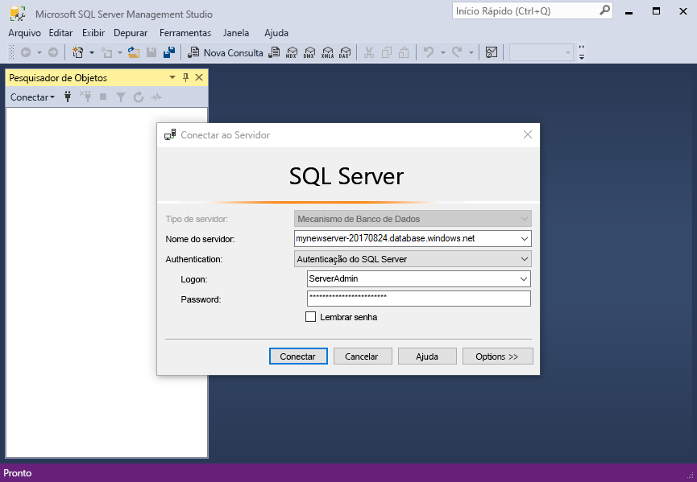
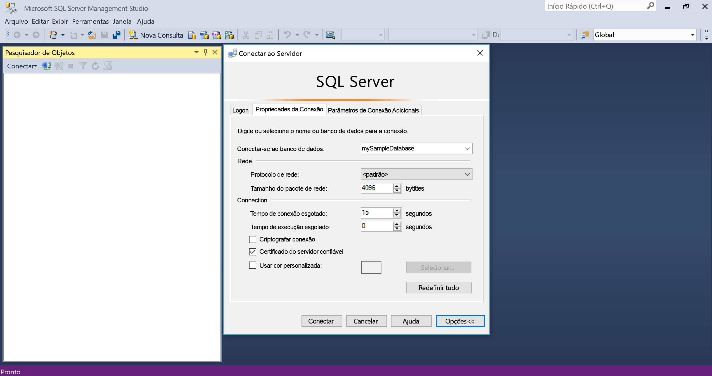
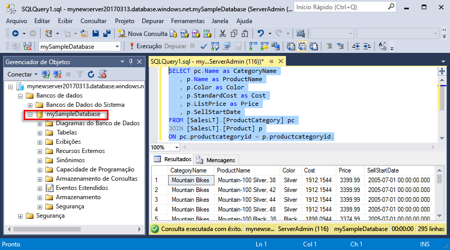
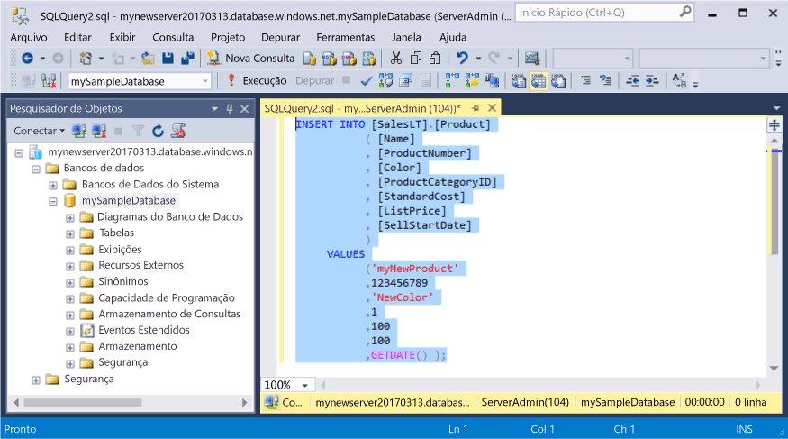
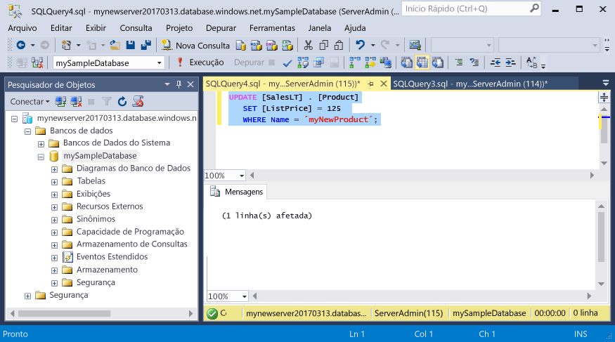
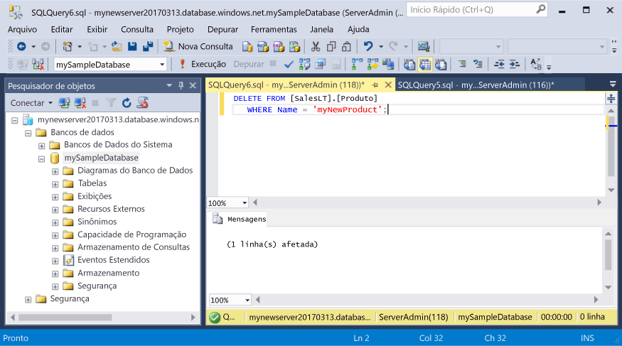

# <a name="azure-sql-database-use-sql-server-management-studio-to-connect-and-query-data"></a>Banco de Dados SQL do Azure: Use o SQL Server Management Studio para conectar e consultar dados

[SQL Server Management Studio](https://msdn.microsoft.com/library/ms174173.aspx) (SSMS) é um ambiente integrado para gerenciar qualquer infraestrutura do SQL, do SQL Server para o Banco de Dados SQL do Microsoft Windows. Este guia rápido demonstra como usar o SSMS para conectar um banco de dados SQL do Azure, em seguida, usar instruções Transact-SQL para consultar, inserir, atualizar e excluir os dados no banco de dados. 

## <a name="prerequisites"></a>Pré-requisitos

Este início rápido usa como ponto de partida os recursos criados em um destes inícios rápidos:

- [Criar Banco de dados - Portal](sql-database-get-started-portal.md)
- [Criar Banco de dados - CLI](sql-database-get-started-cli.md)
- [Criar Banco de dados - PowerShell](sql-database-get-started-powershell.md)

Antes de começar, verifique se você instalou a versão mais recente do [SSMS](https://msdn.microsoft.com/library/mt238290.aspx). 

## <a name="get-connection-information"></a>Obter informações de conexão

Obtenha as informações de conexão necessárias para se conectar ao Banco de Dados SQL do Azure. Você precisará do nome totalmente qualificado do servidor, nome do banco de dados e informações de logon nos próximos procedimentos.

1. Faça logon no [Portal do Azure](https://portal.azure.com/).
2. Selecione **Bancos de Dados SQL** no menu à esquerda e clique em seu banco de dados na página **Bancos de Dados SQL**. 
3. Na página **Visão geral** do banco de dados, analise o nome totalmente qualificado do servidor, como mostrado na imagem abaixo. Você pode passar o mouse sobre o nome do servidor para abrir a opção **Clique para copiar**.

    

4. Se você esqueceu as informações de logon para o servidor do Banco de Dados SQL do Azure, navegue até a página do servidor do Banco de Dados SQL para exibir o nome de administrador do servidor e, se necessário, redefinir a senha. 

## <a name="connect-to-your-database"></a>Conectar-se ao seu banco de dados

Use o SQL Server Management Studio para estabelecer uma conexão com seu servidor de Banco de Dados SQL do Azure. 

> [!IMPORTANT]
> Um servidor lógico do Banco de Dados SQL do Azure escuta na porta 1433. Se você estiver tentando conectar um servidor lógico do Banco de Dados SQL do Azure de dentro de um firewall corporativo, essa porta deverá estar aberta no firewall corporativo para que você possa conectar-se com êxito.
>

1. Abra o SQL Server Management Studio.

2. Na caixa de diálogo **Conectar ao Servidor**, insira as informações a seguir:

   | Configuração       | Valor sugerido | Descrição | 
   | ------------ | ------------------ | ------------------------------------------------- | 
   | **Tipo de servidor** | Mecanismo de banco de dados | Esse valor é obrigatório. |
   | **Nome do servidor** | O nome do servidor totalmente qualificado | O nome deve ser semelhante como: **mynewserver20170313.database.windows.net**. |
   | **Autenticação** | Autenticação do SQL Server | A Autenticação do SQL é o único tipo de autenticação que configuramos neste tutorial. |
   | **Logon** | A conta do administrador do servidor | Esta é a conta que você especificou quando criou o servidor. |
   | **Senha** | A senha para sua conta do administrador do servidor | Esta é a senha que você especificou quando criou o servidor. |

     

3. Clique em **Opções** na caixa de diálogo **Conectar servidor**. Na seção **Conectar ao banco de dados**, digite **mySampleDatabase** para conectar-se a este banco de dados.

     

4. Clique em **Conectar**. A janela Pesquisador de Objetos abre no SSMS. 

     

5. No Pesquisador de Objetos, expanda **Bancos de Dados** e expanda **mySampleDatabase** para exibir os objetos no banco de dados de exemplo.

## <a name="query-data"></a>Consultar dados

Use o seguinte código para consultar os 20 principais produtos por categoria usando a instrução [SELECT](https://msdn.microsoft.com/library/ms189499.aspx) do Transact-SQL.

1. No Pesquisador de Objetos, clique com o botão direito em **mySampleDatabase** e clique em **Nova Consulta**. Uma janela de consulta em branco conectada ao seu banco de dados é aberta.
2. Na janela de consulta, insira a seguinte consulta:

   ```sql
   SELECT pc.Name as CategoryName, p.name as ProductName
   FROM [SalesLT].[ProductCategory] pc
   JOIN [SalesLT].[Product] p
   ON pc.productcategoryid = p.productcategoryid;
   ```

3. Na barra de ferramentas, clique em **Executar** para recuperar dados das tabelas Product e ProductCategory.

    

## <a name="insert-data"></a>Inserir dados

Use o código a seguir para inserir um novo produto na tabela SalesLT.Product usando a instrução [INSERT](https://msdn.microsoft.com/library/ms174335.aspx) do Transact-SQL.

1. Na janela de consulta, substitua a consulta anterior pela seguinte consulta:

   ```sql
   INSERT INTO [SalesLT].[Product]
           ( [Name]
           , [ProductNumber]
           , [Color]
           , [ProductCategoryID]
           , [StandardCost]
           , [ListPrice]
           , [SellStartDate]
           )
     VALUES
           ('myNewProduct'
           ,123456789
           ,'NewColor'
           ,1
           ,100
           ,100
           ,GETDATE() );
   ```

2. Na barra de ferramentas, clique em **Executar** para inserir uma nova linha na tabela Product.

    

## <a name="update-data"></a>Atualizar dados

Use o código a seguir para atualizar o novo produto que você adicionou anteriormente usando a instrução [UPDATE](https://msdn.microsoft.com/library/ms177523.aspx) do Transact-SQL.

1. Na janela de consulta, substitua a consulta anterior pela seguinte consulta:

   ```sql
   UPDATE [SalesLT].[Product]
   SET [ListPrice] = 125
   WHERE Name = 'myNewProduct';
   ```

2. Na barra de ferramentas, clique em **Executar** para atualizar a linha especificada na tabela Product.

    

## <a name="delete-data"></a>Excluir dados

Use o código a seguir para excluir o novo produto que você adicionou anteriormente usando a instrução [DELETE](https://msdn.microsoft.com/library/ms189835.aspx) do Transact-SQL.

1. Na janela de consulta, substitua a consulta anterior pela seguinte consulta:

   ```sql
   DELETE FROM [SalesLT].[Product]
   WHERE Name = 'myNewProduct';
   ```

2. Na barra de ferramentas, clique em **Executar** para excluir a linha especificada na tabela Product.

    

## <a name="next-steps"></a>Próximas etapas

- Para saber mais sobre o SSMS, consulte [Usar o SQL Server Management Studio](https://msdn.microsoft.com/library/ms174173.aspx).
- Para conectar e consultar usando o Visual Studio Code, veja [Conectar e consultar com o Visual Studio Code](sql-database-connect-query-vscode.md).
- Para conectar e consultar usando o .NET, veja [Conectar e consultar com o .NET](sql-database-connect-query-dotnet.md).
- Para conectar e consultar usando o PHP, veja [Conectar e consultar com o PHP](sql-database-connect-query-php.md).
- Para conectar e consultar usando o Node.js, veja [Conectar e consultar com o Node.js](sql-database-connect-query-nodejs.md).
- Para conectar e consultar usando o Java, veja [Conectar e consultar com o Java](sql-database-connect-query-java.md).
- Para conectar e consultar usando o Python, veja [Conectar e consultar com o Python](sql-database-connect-query-python.md).
- Para conectar e consultar usando o Ruby, veja [Conectar e consultar com o Ruby](sql-database-connect-query-ruby.md).

