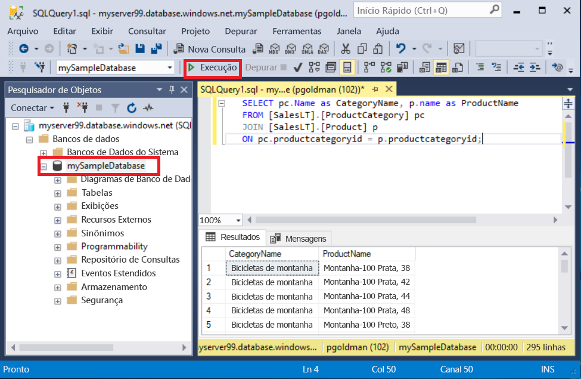

# <a name="quickstart-use-sql-server-management-studio-to-connect-and-query-an-azure-sql-database"></a>Início Rápido: Usar o SQL Server Management Studio para conectar e consultar um Banco de Dados SQL do Azure

Neste início rápido, você usará o [SSMS][ssms-install-latest-84g] (SQL Server Management Studio) para conectar-se a um Banco de Dados SQL do Azure. Em seguida, você executará instruções Transact-SQL para consultar, inserir, atualizar e excluir dados. Você pode usar o SSMS para gerenciar qualquer infraestrutura SQL, desde o SQL Server até o Banco de Dados SQL para Microsoft Windows.  

## <a name="prerequisites"></a>Pré-requisitos

- Um banco de dados SQL do Azure. Você pode usar um destes guias de início rápido para criar e, em seguida, configurar um banco de dados no Banco de Dados SQL do Azure:

  || Banco de dados individual | Instância gerenciada |
  |:--- |:--- |:---|
  | Criar| [Portal](sql-database-single-database-get-started.md) | [Portal](sql-database-managed-instance-get-started.md) |
  || [CLI](scripts/sql-database-create-and-configure-database-cli.md) | [CLI](https://medium.com/azure-sqldb-managed-instance/working-with-sql-managed-instance-using-azure-cli-611795fe0b44) |
  || [PowerShell](scripts/sql-database-create-and-configure-database-powershell.md) | [PowerShell](scripts/sql-database-create-configure-managed-instance-powershell.md) |
  | Configurar | [Regra de firewall de IP no nível do servidor](sql-database-server-level-firewall-rule.md)| [Conectividade de uma VM](sql-database-managed-instance-configure-vm.md)|
  |||[Conectividade do local](sql-database-managed-instance-configure-p2s.md)
  |Carregar dados|Adventure Works carregado por guia de início rápido|[Restaurar o Wide World Importers](sql-database-managed-instance-get-started-restore.md)
  |||Restaurar ou importar o Adventure Works por meio do arquivo [BACPAC](sql-database-import.md) do [GitHub](https://github.com/Microsoft/sql-server-samples/tree/master/samples/databases/adventure-works)|
  |||

  > [!IMPORTANT]
  > Os scripts deste artigo são escritos para usar o banco de dados do Adventure Works. Com uma instância gerenciada, você deve importar o banco de dados do Adventure Works para uma instância de banco de dados ou modificar os scripts deste artigo para usar o banco de dados da Wide World Importers.

## <a name="install-the-latest-ssms"></a>Instalar o SSMS mais recente

Antes de começar, verifique se você instalou a versão mais recente do [SSMS][ssms-install-latest-84g]. 

## <a name="get-sql-server-connection-information"></a>Obter informações de conexão do SQL Server

Obtenha as informações de conexão necessárias para se conectar ao Banco de Dados SQL do Azure. Você precisará do nome totalmente qualificado do servidor ou do host, do nome do banco de dados e das informações de logon nos próximos procedimentos.

1. Entre no [Portal do Azure](https://portal.azure.com/).

2. Navegue até a página **bancos de dados SQL** ou **instâncias gerenciadas do SQL**.

3. Na página **Visão geral**, examine o nome do servidor totalmente qualificado próximo ao **Nome do servidor** para um banco de dados individual ou o nome do servidor totalmente qualificado próximo ao **Host** para instância gerenciada. Para copiar o nome do servidor ou o nome do host, passe o mouse sobre ele e selecione o ícone **Copiar**.

## <a name="connect-to-your-database"></a>Conectar-se ao seu banco de dados

No SMSS, conecte-se ao servidor do Banco de Dados SQL do Azure. 

> [!IMPORTANT]
> Um servidor do Banco de Dados SQL do Azure escuta na porta 1433. Para se conectar a um servidor do Banco de Dados SQL do Azure por trás de um firewall corporativo, essa porta do firewall deve estar aberta.
>

1. Abra o SSMS. A caixa de diálogo **Conectar-se ao Servidor** é exibida.

2. Insira as seguintes informações:

   | Configuração      | Valor sugerido    | DESCRIÇÃO | 
   | ------------ | ------------------ | ----------- | 
   | **Tipo de servidor** | Mecanismo de banco de dados | Valor obrigatório. |
   | **Nome do servidor** | O nome do servidor totalmente qualificado | Algo como: **mynewserver20170313.database.windows.net**. |
   | **Autenticação** | Autenticação do SQL Server | Este tutorial usa a Autenticação do SQL. |
   | **Logon** | ID de usuário da conta do administrador do servidor | A ID de usuário da conta do administrador do servidor usada para criar o servidor. |
   | **Senha** | Senha da conta do administrador do servidor | A senha da conta do administrador do servidor usada para criar o servidor. |
   ||||

     

3. Selecione **Opções** na caixa de diálogo **Conectar-se ao servidor**. No menu suspenso **Conectar-se ao banco de dados**, selecione **mySampleDatabase**.

     

4. Selecione **Conectar**. A janela Pesquisador de Objetos se abre. 

5. Para exibir objetos do banco de dados, expanda **Bancos de Dados** e, em seguida, expanda **mySampleDatabase**.

     

## <a name="query-data"></a>Consultar dados

Execute esse código Transact-SQL [SELECT](https://msdn.microsoft.com/library/ms189499.aspx) para consultar os 20 principais produtos por categoria.

1. No Pesquisador de Objetos, clique com o botão direito do mouse em **mySampleDatabase** e selecione **Nova Consulta**. Abre uma nova janela de consulta conectada ao banco de dados.

2. Na janela de consultas, cole esta consulta SQL.

   ```sql
   SELECT pc.Name as CategoryName, p.name as ProductName
   FROM [SalesLT].[ProductCategory] pc
   JOIN [SalesLT].[Product] p
   ON pc.productcategoryid = p.productcategoryid;
   ```

3. Na barra de ferramentas, selecione **Executar** para recuperar dados das tabelas `Product` e `ProductCategory`.

    

## <a name="insert-data"></a>Inserir dados

Execute esse código Transact-SQL [INSERT](https://msdn.microsoft.com/library/ms174335.aspx) para criar um produto na tabela `SalesLT.Product`.

1. Substitua a consulta anterior por esta.

   ```sql
   INSERT INTO [SalesLT].[Product]
           ( [Name]
           , [ProductNumber]
           , [Color]
           , [ProductCategoryID]
           , [StandardCost]
           , [ListPrice]
           , [SellStartDate] )
     VALUES
           ('myNewProduct'
           ,123456789
           ,'NewColor'
           ,1
           ,100
           ,100
           ,GETDATE() );
   ```

2. Selecione **Executar** para inserir uma nova linha na tabela `Product`. O painel **Mensagens** é exibido **(1 linha afetada)**.

## <a name="view-the-result"></a>Exibir o resultado

1. Substitua a consulta anterior por esta.

   ```sql
   SELECT * FROM [SalesLT].[Product] 
   WHERE Name='myNewProduct' 
   ```
   
2. Selecione **Executar**. O seguinte resultado aparecerá. 

   

 
## <a name="update-data"></a>Atualizar dados

Execute este código Transact-SQL [UPDATE](https://msdn.microsoft.com/library/ms177523.aspx) para modificar seu novo produto.

1. Substitua a consulta anterior por esta.

   ```sql
   UPDATE [SalesLT].[Product]
   SET [ListPrice] = 125
   WHERE Name = 'myNewProduct';
   ```

2. Selecione **Executar** para atualizar a linha especificada na tabela `Product`. O painel **Mensagens** é exibido **(1 linha afetada)**.

## <a name="delete-data"></a>Excluir dados

Execute esse código Transact-SQL [DELETE](https://msdn.microsoft.com/library/ms189835.aspx) para remover o novo produto.

1. Substitua a consulta anterior por esta.

   ```sql
   DELETE FROM [SalesLT].[Product]
   WHERE Name = 'myNewProduct';
   ```

2. Selecione **Executar** para excluir a linha especificada na tabela `Product`. O painel **Mensagens** é exibido **(1 linha afetada)**.

## <a name="next-steps"></a>Próximas etapas

- Para saber mais sobre o SSMS, confira [SQL Server Management Studio](https://msdn.microsoft.com/library/ms174173.aspx).
- Para se conectar e consultar usando o Portal do Azure, consulte [Conectar e consultar com o editor de consultas do SQL do Portal do Azure](sql-database-connect-query-portal.md).
- Para conectar e consultar usando o Visual Studio Code, veja [Conectar e consultar com o Visual Studio Code](sql-database-connect-query-vscode.md).
- Para conectar e consultar usando o .NET, veja [Conectar e consultar com o .NET](sql-database-connect-query-dotnet.md).
- Para conectar e consultar usando o PHP, veja [Conectar e consultar com o PHP](sql-database-connect-query-php.md).
- Para conectar e consultar usando o Node.js, veja [Conectar e consultar com o Node.js](sql-database-connect-query-nodejs.md).
- Para conectar e consultar usando o Java, veja [Conectar e consultar com o Java](sql-database-connect-query-java.md).
- Para conectar e consultar usando o Python, veja [Conectar e consultar com o Python](sql-database-connect-query-python.md).
- Para conectar e consultar usando o Ruby, veja [Conectar e consultar com o Ruby](sql-database-connect-query-ruby.md).


<!-- Article link references. -->

[ssms-install-latest-84g]: https://docs.microsoft.com/sql/ssms/sql-server-management-studio-ssms

