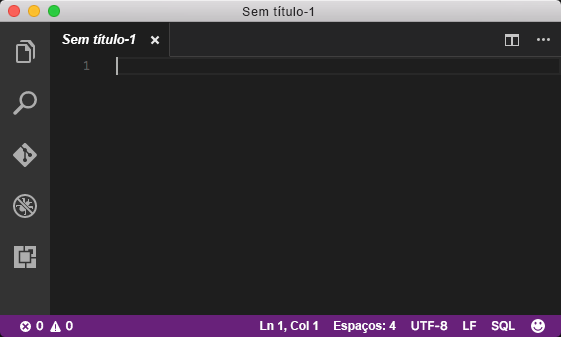
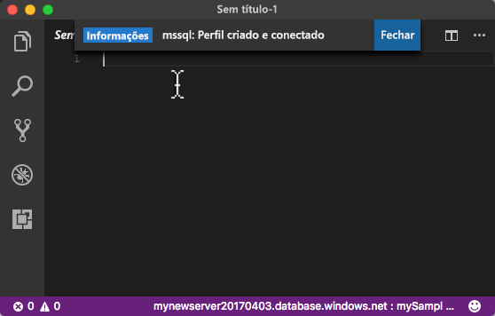
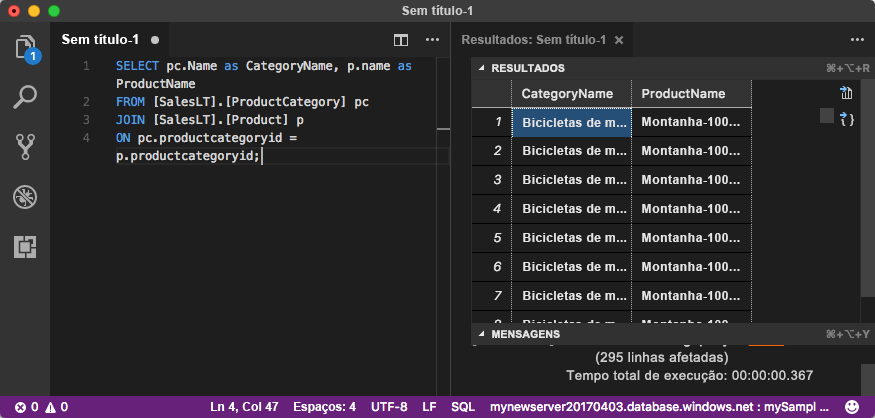

# <a name="azure-sql-database-use-visual-studio-code-to-connect-and-query-data"></a>Banco de Dados SQL do Azure: Use Visual Studio Code para se conectar e consultar dados

[Visual Studio Code](https://code.visualstudio.com/docs) é um editor de código gráfico para Linux, macOS e Windows que oferece suporte a extensões. Use o Visual Studio Code com a [extensão mssql](https://aka.ms/mssql-marketplace) para conectar e consultar um Banco de Dados SQL do Azure. Este início rápido detalha o uso do Visual Studio Code para se conectar a um banco de dados SQL do Azure e, depois, executar instruções de consulta, inserção, atualização e exclusão.

Este início rápido usa como ponto de partida os recursos criados em um destes inícios rápidos:

- [Criar Banco de dados - Portal](sql-database-get-started-portal.md)
- [Criar Banco de dados - CLI](sql-database-get-started-cli.md)

Antes de começar, verifique se você instalou a versão mais recente do [Visual Studio Code](https://code.visualstudio.com/Download) e carregou a [extensão mssql](https://aka.ms/mssql-marketplace). Para obter orientações de instalação para a extensão mssql, consulte [Instalar o VS Code](https://docs.microsoft.com/sql/linux/sql-server-linux-develop-use-vscode#install-vs-code). 

## <a name="get-connection-information"></a>Obter informações de conexão

Obtenha o nome de servidor totalmente qualificado para o servidor de Banco de Dados SQL do Azure no Portal do Azure. Use o nome do servidor totalmente qualificado para se conectar ao servidor usando o Visual Studio Code.

1. Faça logon no [Portal do Azure](https://portal.azure.com/).
2. Selecione **Bancos de Dados SQL** no menu à esquerda e clique em seu banco de dados na página **Bancos de Dados SQL**. 
3. No painel **Essentials**, na página do Portal do Azure de seu banco de dados, localize e copie o **Nome do servidor** para usar posteriormente neste inicio rápido.

    

## <a name="set-language-mode-to-sql"></a>Definir o modo de linguagem para SQL

Defina o modo de linguagem como **SQL** no Visual Studio Code para permitir comandos mssql e T-SQL IntelliSense.

1. Abra uma nova janela do Visual Studio Code. 

2. Pressione **CTRL + K,M**, digite **SQL** e pressione **ENTER** para definir o modo de linguagem como SQL. 



## <a name="connect-to-the-server"></a>Conectar ao servidor

Use o Visual Studio Code para estabelecer uma conexão com seu servidor de Banco de Dados SQL do Azure.

1. No VS Code, pressione **CTRL + SHIFT + P** (ou **F1**) para abrir a Paleta de Comandos.

2. Digite **sqlcon** e pressione **ENTER**.

3. Clique em **Sim** para definir a linguagem como **SQL**.

4. Pressione **ENTER** para selecionar **Criar Perfil de Conexão**. Isso cria um perfil de conexão para a instância do SQL Server.

5. Siga os prompts para especificar as propriedades de conexão para o novo perfil de conexão. Depois de especificar cada valor, pressione **ENTER** para continuar. 

   A tabela a seguir descreve as propriedades do Perfil de Conexão.

   | Configuração | Descrição |
   |-----|-----|
   | **Nome do servidor** | Insira seu nome do servidor totalmente qualificado, como **mynewserver20170313.database.windows.net** |
   | **Nome do banco de dados** | Insira o nome do banco de dados, como **mySampleDatabase** |
   | **Autenticação** | Selecione Logon do SQL |
   | **Nome de usuário** | Insira a conta do administrador do servidor |
   | **Senha (Logon do SQL)** | Insira a senha para sua conta do administrador do servidor | 
   | **Salvar a Senha?** | Selecione **Sim** ou **Não** |
   | **[Opcional] Insira um nome para este perfil** | Insira um nome de perfil de conexão, como **mySampleDatabase**. 

6. Pressione a tecla **ESC** para fechar a mensagem de informações que informa que o perfil foi criado e está conectado.

7. Verifique se sua conexão na barra de status.

   

## <a name="query-data"></a>Consultar dados

Use a instrução [SELECT](https://msdn.microsoft.com/library/ms189499.aspx) de Transact-SQL para consultar dados no Banco de Dados SQL do Azure.

1. Na janela **Editor**, insira a seguinte consulta na janela de consulta vazia:

   ```sql
   SELECT pc.Name as CategoryName, p.name as ProductName
   FROM [SalesLT].[ProductCategory] pc
   JOIN [SalesLT].[Product] p
   ON pc.productcategoryid = p.productcategoryid;
   ```

3. Pressione **CTRL + SHIFT + E** para recuperar dados das tabelas Product e ProductCategory.

    

## <a name="insert-data"></a>Inserir dados

Use a instrução [INSERT](https://msdn.microsoft.com/library/ms174335.aspx) de Transact-SQL para inserir dados no Banco de Dados SQL do Azure.

1. Na janela **Editor**, exclua a consulta anterior e insira a seguinte consulta:

   ```sql
   INSERT INTO [SalesLT].[Product]
           ( [Name]
           , [ProductNumber]
           , [Color]
           , [ProductCategoryID]
           , [StandardCost]
           , [ListPrice]
           , [SellStartDate]
           )
     VALUES
           ('myNewProduct'
           ,123456789
           ,'NewColor'
           ,1
           ,100
           ,100
           ,GETDATE() );
   ```

3. Pressione **CTRL + SHIFT + E** para inserir uma nova linha na tabela Product.

## <a name="update-data"></a>Atualizar dados

Use a instrução [UPDATE](https://msdn.microsoft.com/library/ms177523.aspx) de Transact-SQL para atualizar dados no Banco de Dados SQL do Azure.

1.  Na janela **Editor**, exclua a consulta anterior e insira a seguinte consulta:

   ```sql
   UPDATE [SalesLT].[Product]
   SET [ListPrice] = 125
   WHERE Name = 'myNewProduct';
   ```

3. Pressione **CTRL + SHIFT + E** para atualizar a linha especificada na tabela Product.

## <a name="delete-data"></a>Excluir dados

Use a instrução [ELETE](https://msdn.microsoft.com/library/ms189835.aspx) de Transact-SQL para excluir dados no Banco de Dados SQL do Azure.

1. Na janela **Editor**, exclua a consulta anterior e insira a seguinte consulta:

   ```sql
   DELETE FROM [SalesLT].[Product]
   WHERE Name = 'myNewProduct';
   ```

3. Pressione **CTRL + SHIFT + E** para excluir a linha especificada na tabela Product.

## <a name="next-steps"></a>Próximas etapas

- Para saber mais sobre o Visual Studio Code, consulte [Visual Studio Code](https://code.visualstudio.com/docs)
- Para saber mais sobre como consultar e editar dados usando o SQL Server Management Studio, consulte [SSMS](https://msdn.microsoft.com/library/ms174173.aspx).

