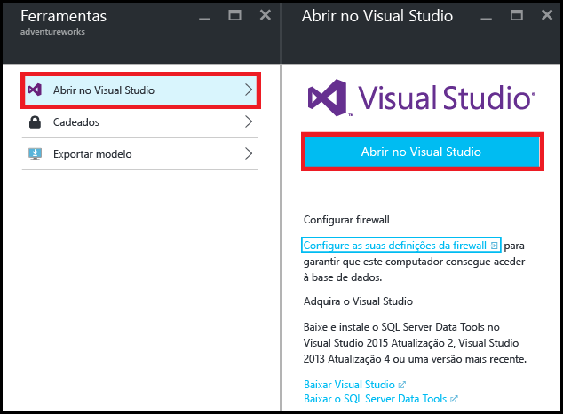
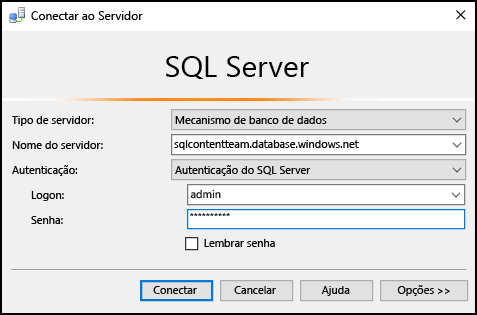
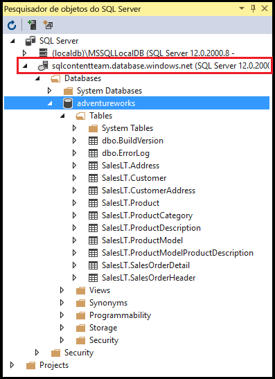
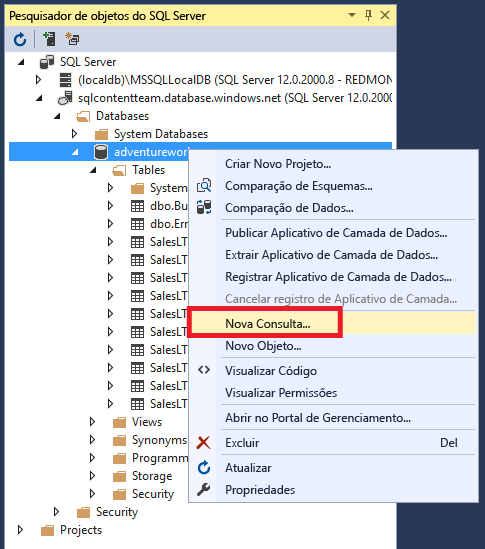
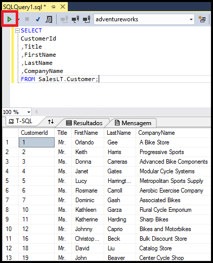

# Conectar-se ao Banco de Dados SQL com o Visual Studio
> [!div class="op_single_selector"]
> * [Visual Studio](sql-database-connect-query.md)
> * [SSMS](sql-database-connect-query-ssms.md)
> * [Excel](sql-database-connect-excel.md)
> 
> 

Saiba como se conectar a um Banco de Dados Azure SQL no Visual Studio.

## Pré-requisitos
Para se conectar ao Banco de Dados SQL usando o Visual Studio, você deverá ter:

* Um banco de dados SQL a ser conectado. Este artigo usa o banco de dados de exemplo da **AdventureWorks**. Para obter o banco de dados de exemplo da AdventureWorks, veja [Criar o banco de dados de demonstração](sql-database-get-started.md).
* Visual Studio 2013 - atualização 4 (ou posterior). A Microsoft agora oferece a Comunidade do Visual Studio *gratuitamente*.
  
  * [Comunidade do Visual Studio, download](http://www.visualstudio.com/products/visual-studio-community-vs)
  * [Mais opções para o Visual Studio gratuito](http://www.visualstudio.com/products/free-developer-offers-vs.aspx)

## Abrir o Visual Studio do portal do Azure
1. Faça logon no [Portal do Azure](https://portal.azure.com/).
2. Clique em **Mais Serviços** > **Bancos de dados SQL**
3. Abra a folha do banco de dados **AdventureWorks** ao localizar e clicar no banco de dados *AdventureWorks*.
4. Clique no botão **Ferramentas** na parte superior da folha do banco de dados:
   
    
5. Clique em **Abrir no Visual Studio** (se você precisar do Visual Studio, clique no link de download):
   
    
6. O Visual Studio abre com a janela **Conectar ao Servidor** já definida para se conectar ao servidor e ao banco de dados selecionados no portal. (Clique em **Opções** para verificar se a conexão está definida para o banco de dados correto). Digite sua senha de administrador do servidor e clique em **Conectar**.

    

1. Se você não tiver uma regra de firewall configurada para o endereço IP do seu computador, obterá uma mensagem *Não é possível conectar*. Para criar uma regra de firewall, veja [Configurar uma regra de firewall no nível de servidor do Banco de Dados SQL do Azure](sql-database-configure-firewall-settings.md).
2. Depois de se conectar com êxito, a janela **SQL Server Object Explorer** será aberta com uma conexão ao banco de dados.
   
    

## Executar uma consulta de exemplo
Agora que estamos conectados ao banco de dados, as etapas a seguir mostram como executar uma consulta simples:

1. Clique com o botão direito do mouse no banco de dados e selecione **Nova consulta**.
   
    
2. Na janela de consulta, copie e cole o código a seguir.
   
        SELECT
        CustomerId
        ,Title
        ,FirstName
        ,LastName
        ,CompanyName
        FROM SalesLT.Customer;
3. Clique no botão **Executar** para executar a consulta:
   
    

## Próximas etapas
* Abrir bancos de dados SQL no Visual Studio usa o SQL Server Data Tools. Para obter mais detalhes, veja [SQL Server Data Tools](https://msdn.microsoft.com/library/hh272686.aspx).
* Para se conectar a um banco de dados SQL usando o código, veja [Conectar-se ao banco de dados SQL usando .NET (C#)](sql-database-develop-dotnet-simple.md).

<!----HONumber=AcomDC_0824_2016-->