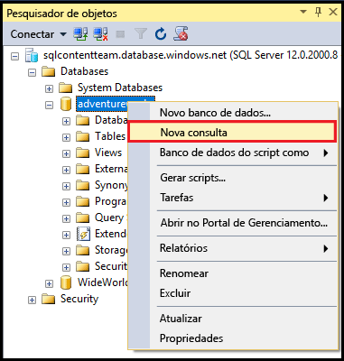
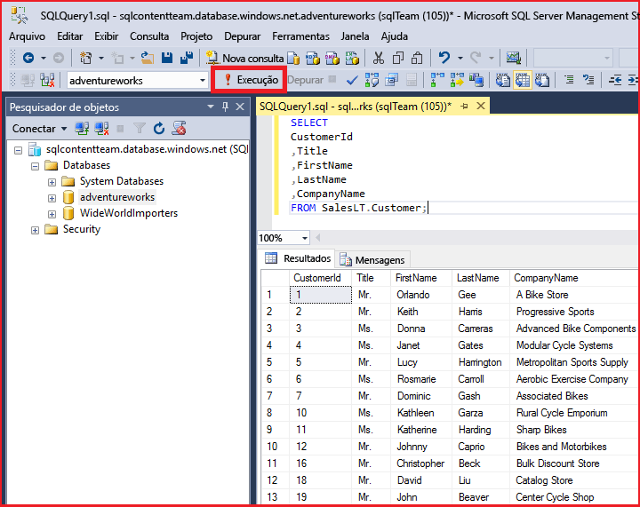

<properties
	pageTitle="Conectar-se ao Banco de Dados SQL com uma consulta C# | Microsoft Azure"
	description="Escreva um programa em C# para consultar um Banco de Dados SQL e se conectar a ele Informações sobre endereços IP, cadeias de conexão, logon seguro e Visual Studio gratuito."
	services="sql-database"
	keywords="consulta de banco de dados c#, consulta c#, conectar-se ao banco de dados, SQL C#"
	documentationCenter=""
	authors="MightyPen"
	manager="jhubbard"
	editor=""/>

<tags
	ms.service="sql-database"
	ms.workload="data-management"
	ms.tgt_pltfrm="na"
	ms.devlang="dotnet"
	ms.topic="get-started-article"
	ms.date="08/17/2016"
	ms.author="annemill"/>

# Conectar-se ao Banco de Dados SQL com o Visual Studio

> [AZURE.SELECTOR]
- [Visual Studio](sql-database-connect-query.md)
- [SSMS](sql-database-connect-query-ssms.md)
- [Excel](sql-database-connect-excel.md)

Saiba como se conectar a um Banco de Dados Azure SQL no Visual Studio.

## Pré-requisitos

Para se conectar ao Banco de Dados SQL usando o Visual Studio, você deverá ter:

- Uma conta e uma assinatura do Azure. Você pode se [inscrever em uma avaliação gratuita](https://azure.microsoft.com/pricing/free-trial/).

- Um banco de dados de demonstração **AdventureWorksLT** no serviço Banco de Dados SQL do Azure.
 - [Crie o banco de dados de demonstração](sql-database-get-started.md) em minutos.

- Visual Studio 2013 - atualização 4 (ou posterior). A Microsoft agora oferece a Comunidade do Visual Studio *gratuitamente*.
 - [Comunidade do Visual Studio, download](http://www.visualstudio.com/products/visual-studio-community-vs)
 - [Mais opções para o Visual Studio gratuito](http://www.visualstudio.com/products/free-developer-offers-vs.aspx)
 - Ou veja como a próxima [etapa](#InstallVSForFree) deste tópico descreve como o [Portal do Azure](https://portal.azure.com/) orienta você pela instalação do Visual Studio.

&nbsp;

## Etapa 1: Instalar a Comunidade do Visual Studio gratuitamente

Caso seja necessário instalar o Visual Studio, você poderá:

- Instalar a Comunidade do Visual Studio gratuitamente ao usar seu navegador para acessar as páginas da Web do produto Visual Studio que ofereçam downloads gratuitos e outras opções ou
- Permita que o [Portal do Azure](https://portal.azure.com/) oriente você na página de download, que será descrita a seguir.

### Visual Studio por meio do Portal do Azure

1. Faça logon por meio do [Portal do Azure](https://portal.azure.com/), http://portal.azure.com/.

2. Clique em **PROCURAR* TUDO** > **Bancos de dados SQL**. Será aberta uma folha para a pesquisa de bancos de dados.

3. Na caixa de texto de filtro próxima à parte superior, comece a digitar o nome do seu banco de dados **AdventureWorksLT**.

4. Quando a linha do banco de dados for exibida no servidor, clique na linha. Será aberta uma folha para seu banco de dados.

5. Para sua conveniência, clique no controle de minimização em cada uma das folhas anteriores.

6. Clique no botão **Abrir no Visual Studio** próximo à parte superior da folha de seu banco de dados. Será aberta uma nova folha do Visual Studio, com links para locais de instalação do Visual Studio.

	![Botão Abrir no Visual Studio][20-OpenInVisualStudioButton]

7. Clique no link **Comunidade (gratuita)** ou em um link semelhante. Uma nova página da Web é adicionada.

8. Use os links na nova página da Web para instalar o Visual Studio.

9. Depois que o Visual Studio estiver instalado, na folha **Abrir no Visual Studio**, clique no botão **Abrir no Visual Studio**. O Visual Studio abre.

10. O Visual Studio solicitará que você preencha os campos de cadeia de conexão em um diálogo.
 - Escolha **Autenticação do SQL Server**, e não **Autenticação do Windows**.
 - Lembre-se de especificar o banco de dados **AdventureWorksLT** (**Opções** > **Propriedades de Conexão** na caixa de diálogo).

11. No **Pesquisador de Objetos do SQL Server**, expanda o nó do seu banco de dados.

## Etapa 2: executar consultas de exemplo

Depois que se conectar ao servidor lógico, você pode se conectar a um banco de dados e executar uma consulta de exemplo.

1. Em **Pesquisador de Objetos**, navegue até um banco de dados no servidor ao qual você tem permissão, como o exemplo de banco de dados **AdventureWorks**.
2. Clique com o botão direito do mouse no banco de dados e selecione **Nova consulta**.

	

3. Na janela de consulta, copie e cole o código a seguir.

		SELECT
		CustomerId
		,Title
		,FirstName
		,LastName
		,CompanyName
		FROM SalesLT.Customer;

4. Clique no botão **Executar**. A captura de tela a seguir mostra uma consulta bem-sucedida.

	

## Próximas etapas

[Conectar-se ao Banco de Dados SQL usando .NET (C#)](sql-database-develop-dotnet-simple.md)

<!-- Image references. -->

[20-OpenInVisualStudioButton]: ./media/sql-database-connect-query/connqry-free-vs-e.png

<!---HONumber=AcomDC_0817_2016-->