# <a name="azure-ad-authentication-access-and-database-level-firewall-rules"></a>Autenticação, acesso e regras de firewall de nível de banco de dados do Azure AD
Neste tutorial, você aprenderá como usar o SQL Server Management Studio para trabalhar com a autenticação, os logons, os usuários e as funções de banco de dados do Azure Active Directory que concedem acesso e permissões para servidores e bases de dados do Banco de Dados SQL do Azure. Você aprenderá a:

- Exibir permissões de usuário no banco de dados mestre e nos bancos de dados de usuário
- Criar logons e usuários com base na autenticação do Azure Active Directory
- Conceder permissões de todo o servidor e banco de dados específicos a usuários
- Fazer logon em um banco de dados de usuário como um usuário não administrador
- Criar regras de firewall de nível de banco de dados para os usuários do banco de dados
- Criar regras de firewall de nível de servidor para os administradores do servidor

**Tempo estimado**: este tutorial levará cerca de 45 minutos para ser concluído (supondo que você já tenha atendido aos pré-requisitos).

## <a name="prerequisites"></a>Pré-requisitos

* **Uma conta do Azure**. Você precisa de uma conta do Azure. Você pode [abrir uma conta gratuita do Azure](https://azure.microsoft.com/free/) ou [Ativar os benefícios de assinante do Visual Studio](https://azure.microsoft.com/pricing/member-offers/msdn-benefits/). 

* **O Azure cria permissões**. Você deve ser capaz de se conectar ao portal do Azure usando uma conta que seja membro da função de colaborador ou proprietário da assinatura. Para obter mais informações sobre o controle de acesso baseado em função (RBAC), confira [Introdução ao gerenciamento de acesso no Portal do Azure](../active-directory/role-based-access-control-what-is.md).

* **SQL Server Management Studio**. Você pode baixar e instalar a versão mais recente do SSMS (SQL Server Management Studio) em [Baixar o SQL Server Management Studio](https://msdn.microsoft.com/library/mt238290.aspx). Sempre use a versão mais recente do SSMS ao se conectar ao Banco de Dados SQL do Azure, já que sempre há o lançamento de novos recursos.

* **Servidor e bancos de dados base** para instalar e configurar um servidor e os dois bancos de dados usados neste tutorial, clique no botão **Implantar no Azure**. Clicar no botão abre a folha **Implantar de um modelo**; crie um novo grupo de recursos e forneça a **Senha de Logon de Administrador** para o novo servidor que será criado:

   [](https://portal.azure.com/#create/Microsoft.Template/uri/https%3A%2F%2Fsqldbtutorial.blob.core.windows.net%2Ftemplates%2Fsqldbgetstarted.json)

   > [!NOTE]
   > A conclusão do tutorial relacionado para a autenticação do SQL Server, [Autenticação, logons e contas de usuário, funções de banco de dados, permissões, regras de firewall de nível de servidor e regras de firewall de nível de banco de dados do SQL](sql-database-control-access-sql-authentication-get-started.md), é opcional. No entanto, há conceitos abordados nesse tutorial que não são repetidos aqui. Os procedimentos neste tutorial, relacionados a firewalls de nível de servidor e de banco de dados, não são necessários se você concluiu este tutorial relacionado nos mesmos computadores (com os mesmos endereços IP) e, por esse motivo, estão marcados como opcionais. Além disso, as capturas de tela neste tutorial pressupõem que você tenha concluído este tutorial relacionado. 
   >

* Você criou e populou um Azure Active Directory. Para obter mais informações, consulte [Integrando suas identidades locais no Azure Active Directory](../active-directory/active-directory-aadconnect.md), [Adicionar seu próprio nome de domínio ao Azure AD](../active-directory/active-directory-add-domain.md), [O Microsoft Azure agora dá suporte à federação com o Windows Server Active Directory](https://azure.microsoft.com/blog/2012/11/28/windows-azure-now-supports-federation-with-windows-server-active-directory/), [Administrando seu diretório do Azure AD](https://msdn.microsoft.com/library/azure/hh967611.aspx), [Gerenciar o Azure AD usando o Windows PowerShell](https://msdn.microsoft.com/library/azure/jj151815.aspx) e [Portas e protocolos necessários para a identidade híbrida](../active-directory/active-directory-aadconnect-ports.md).

> [!NOTE]
> Este tutorial ajuda você a aprender o conteúdo destes tópicos de aprendizado: [Acesso e controle de banco de dados SQL](sql-database-control-access.md), [Logons, usuários e funções de banco de dados](sql-database-manage-logins.md), [Entidades](https://msdn.microsoft.com/library/ms181127.aspx), [Funções de banco de dados](https://msdn.microsoft.com/library/ms189121.aspx), [Regras de firewall de banco de dados SQL](sql-database-firewall-configure.md) e [Autenticação do Azure Active Directory](sql-database-aad-authentication.md). 
>  

## <a name="sign-in-to-the-azure-portal-using-your-azure-account"></a>Entrar no portal do Azure usando sua conta do Azure
Usando a [assinatura existente](https://account.windowsazure.com/Home/Index), siga estas etapas para se conectar ao portal do Azure.

1. Abra seu navegador preferido e conecte-se ao [portal do Azure](https://portal.azure.com/).
2. Entre no [Portal do Azure](https://portal.azure.com/).
3. Na página **Entrar** , forneça as credenciais da sua assinatura.
   
   


<a name="create-logical-server-bk"></a>

## <a name="provision-an-azure-active-directory-admin-for-your-sql-logical-server"></a>Provisionar um administrador do Azure Active Directory para seu servidor lógico do SQL

Nesta seção do tutorial, você exibe informações sobre a configuração de segurança de seu servidor lógico no portal do Azure.

1. Abra a folha **SQL Server** do servidor lógico e exiba as informações na página **Visão geral**. Observe que não foi configurado um administrador do Azure Active Directory.

   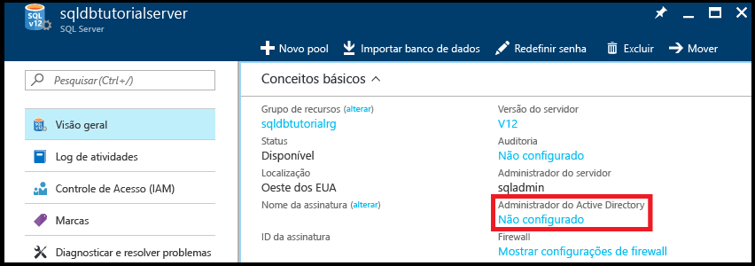

2. Clique em **Não configurado** no painel **Conceitos básicos** para abrir a folha **Administrador do Active Directory**.

   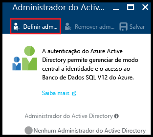

3. Clique em **Definir administrador** para abrir a folha **Adicionar administrador** e selecione uma conta de usuário ou grupo do Active Directory como o administrador do Active Directory para o servidor.

   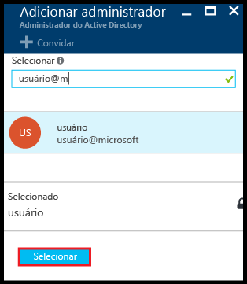

4. Clique em **Selecionar** e em **Salvar**.

   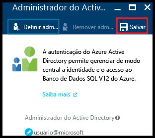

> [!NOTE]
> Para examinar as informações de conexão desse servidor, vá para [Gerenciar servidores](sql-database-manage-servers-portal.md). Para esta série de tutoriais, o nome totalmente qualificado do servidor é 'sqldbtutorialserver.database.windows.net'.
>

## <a name="connect-to-sql-server-using-sql-server-management-studio-ssms"></a>Conectar-se ao SQL server usando o SSMS (SQL Server Management Studio)

1. Se você ainda não o fez, baixe e instale a versão mais recente do SSMS em [Baixar o SQL Server Management Studio](https://msdn.microsoft.com/library/mt238290.aspx). Para se manter atualizado, a versão mais recente do SSMS avisará você quando houver uma nova versão disponível para download.

2. Depois de instalar, digite **Microsoft SQL Server Management Studio** na caixa de pesquisa do Windows e clique em **Enter** para abrir o SSMS.

   

3. Na caixa de diálogo **Conectar ao Servidor**, selecione um dos métodos de autenticação do Active Directory e forneça as informações de autenticação apropriadas. Para obter informações sobre como escolher um método, confira [Autenticação do Azure Active Directory](sql-database-aad-authentication.md) e [Suporte do SSMS para o Azure AD MFA](sql-database-ssms-mfa-authentication.md).

   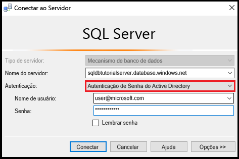

4. Insira as informações necessárias para se conectar ao SQL Server usando a Autenticação do SQL Server e a conta do administrador do servidor.

5. Clique em **Conectar**.

   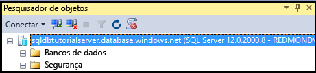

## <a name="view-the-server-admin-account-and-its-permissions"></a>Exibir a conta do administrador de servidor e suas permissões 
Nesta seção do tutorial, você exibe informações sobre a conta do administrador de servidor e suas permissões no banco de dados mestre e nos bancos de dados de usuário.

1. No Pesquisador de Objetos, expanda **Bancos de dados**, expanda **Bancos de dados do sistema**, expanda **Mestre**, expanda **Segurança** e expanda **Usuários**. Observe que uma conta de usuário foi criada no banco de dados mestre para o administrador do Active Directory. Observe também que não foi criado um logon para a conta de usuário administrador do Active Directory.

   

   > [!NOTE]
   > Para obter informações sobre as outras contas de usuário exibidas, confira [Entidades](https://msdn.microsoft.com/library/ms181127.aspx).
   >

2. No Pesquisador de Objetos, clique com o botão direito do mouse em **mestre** e clique em **Nova Consulta** para abrir uma janela de consulta conectada ao banco de dados mestre.
3. Na janela de consulta, execute a consulta a seguir para retornar informações sobre o usuário que executa a consulta. Observe que user@microsoft.com é retornado para a conta de usuário que executa essa consulta (vemos um resultado diferente ao consultar um banco de dados de usuário mais adiante neste procedimento).

   ```
   SELECT USER;
   ```

   

4. Na janela de consulta, execute a consulta a seguir para retornar informações sobre as permissões de usuário administrador do Active Directory. Observe que o usuário administrador do Active Directory tem permissões para se conectar ao banco de dados mestre, criar logons e usuários, selecionar as informações da tabela sys.sql_logins e adicionar usuários às funções de banco de dados dbmanager e dbcreator. Essas permissões são adicionais às permissões concedidas à função pública da qual todos os usuários herdam permissões (como permissões para selecionar as informações de determinadas tabelas). Para obter mais informações, confira [Permissões](https://msdn.microsoft.com/library/ms191291.aspx).

   ```
   SELECT prm.permission_name
      , prm.class_desc
      , prm.state_desc
      , p2.name as 'Database role'
      , p3.name as 'Additional database role' 
   FROM sys.database_principals p
   JOIN sys.database_permissions prm
      ON p.principal_id = prm.grantee_principal_id
      LEFT JOIN sys.database_principals p2
      ON prm.major_id = p2.principal_id
      LEFT JOIN sys.database_role_members r
      ON p.principal_id = r.member_principal_id
      LEFT JOIN sys.database_principals p3
      ON r.role_principal_id = p3.principal_id
   WHERE p.name = 'user@microsoft.com';
   ```

   

6. No Pesquisador de Objetos, expanda **blankdb**, expanda **Segurança** e expanda **Usuários**. Observe que não há uma conta de usuário chamada user@microsoft.com neste banco de dados.

   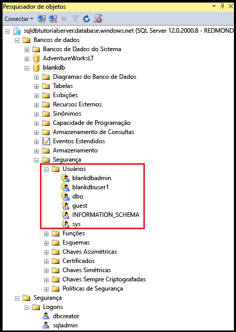

7. No Pesquisador de Objetos, clique com o botão direito do mouse em **blankdb** e clique em **Nova Consulta**.

8. Na janela de consulta, execute a consulta a seguir para retornar informações sobre o usuário que executa a consulta. Observe que dbo é retornado para a conta de usuário que executa essa consulta (por padrão, o logon de administrador de Servidor é mapeado para a conta de usuário dbo em cada banco de dados de usuário).

   ```
   SELECT USER;
   ```

   

9. Na janela de consulta, execute a consulta a seguir para retornar informações sobre as permissões do usuário dbo. Observe que dbo é membro da função pública e também é membro da função de banco de dados fixa db_owner. Confira [Funções de nível de banco de dados](https://msdn.microsoft.com/library/ms189121.aspx) para obter mais informações.

   ```
   SELECT prm.permission_name
      , prm.class_desc
      , prm.state_desc
      , p2.name as 'Database role'
      , p3.name as 'Additional database role' 
   FROM sys.database_principals AS p
   JOIN sys.database_permissions AS prm
      ON p.principal_id = prm.grantee_principal_id
      LEFT JOIN sys.database_principals AS p2
      ON prm.major_id = p2.principal_id
      LEFT JOIN sys.database_role_members r
      ON p.principal_id = r.member_principal_id
      LEFT JOIN sys.database_principals AS p3
      ON r.role_principal_id = p3.principal_id
   WHERE p.name = 'dbo';
   ```

   

10. Opcionalmente, repita as três etapas anteriores para o banco de dados de usuário AdventureWorksLT.

## <a name="create-a-new-user-in-the-adventureworkslt-database-with-select-permissions"></a>Criar um novo usuário no banco de dados AdventureWorksLT com permissões SELECT

Nesta seção do tutorial, você cria uma conta de usuário no banco de dados AdventureWorksLT com base em um UPN de um usuário do Azure AD ou nome de exibição de um grupo do Azure AD, testa as permissões desse usuário como membro da função pública, concede a ele permissões SELECT e testa as permissões desse usuário novamente.

> [!NOTE]
> Os usuários de nível de banco de dados ([usuários contidos](https://msdn.microsoft.com/library/ff929188.aspx)) aumentam a portabilidade do banco de dados, um recurso que exploramos em tutoriais posteriores.
>

1. No Pesquisador de Objetos, clique com o botão direito do mouse em **AdventureWorksLT** e clique em **Nova Consulta** para abrir uma janela de consulta conectada ao banco de dados AdventureWorksLT.
2. Execute a instrução a seguir para criar uma conta de usuário no banco de dados AdventureWorksLT para um usuário no domínio Microsoft chamado aaduser1.

   ```
   CREATE USER [aaduser1@microsoft.com]
   FROM EXTERNAL PROVIDER;
   ```
   

3. Na janela de consulta, execute a consulta a seguir para retornar informações sobre as permissões de user1. Observe que as únicas permissões que user1 tem são as permissões herdadas da função pública.

   ```
   SELECT prm.permission_name
      , prm.class_desc
      , prm.state_desc
      , p2.name as 'Database role'
      , p3.name as 'Additional database role' 
   FROM sys.database_principals AS p
   JOIN sys.database_permissions AS prm
      ON p.principal_id = prm.grantee_principal_id
      LEFT JOIN sys.database_principals AS p2
      ON prm.major_id = p2.principal_id
      LEFT JOIN sys.database_role_members r
      ON p.principal_id = r.member_principal_id
      LEFT JOIN sys.database_principals AS p3
      ON r.role_principal_id = p3.principal_id
   WHERE p.name = 'aaduser1@microsoft.com';
   ```

   

4. Execute as consultas a seguir para tentar consultar uma tabela no banco de dados AdventureWorksLT como user1.

   ```
   EXECUTE AS USER = 'aaduser1@microsoft.com';  
   SELECT * FROM [SalesLT].[ProductCategory];
   REVERT;
   ```

   

5. Execute a instrução a seguir para conceder permissões SELECT na tabela ProductCategory no esquema SalesLT a user1.

   ```
   GRANT SELECT ON OBJECT::[SalesLT].[ProductCategory] to [aaduser1@microsoft.com];
   ```

   

6. Execute as consultas a seguir para tentar consultar uma tabela no banco de dados AdventureWorksLT como user1.

   ```
   EXECUTE AS USER = 'aaduser1@microsoft.com';  
   SELECT * FROM [SalesLT].[ProductCategory];
   REVERT;
   ```

   

## <a name="create-a-database-level-firewall-rule-for-adventureworkslt-database-users"></a>Criar uma regra de firewall no nível de banco de dados para os usuários do banco de dados AdventureWorksLT

> [!NOTE]
> Você não precisa concluir este procedimento se concluiu o procedimento equivalente no tutorial relacionado da autenticação do SQL Server, [Autenticação e autorização do SQL](sql-database-control-access-sql-authentication-get-started.md), e está aprendendo usando o mesmo computador com o mesmo endereço IP.
>

Nesta seção do tutorial, você tenta fazer logon usando a nova conta de usuário de um computador com um endereço IP diferente, criar uma regra de firewall no nível de banco de dados como o administrador do servidor e fazer logon com êxito usando a nova regra de firewall no nível de banco de dados. 

> [!NOTE]
> [Regras de firewall de nível de banco de dados](sql-database-firewall-configure.md) aumentam a portabilidade do banco de dados, um recurso que exploramos em tutoriais posteriores.
>

1. Em outro computador para o qual você ainda não criou uma regra de firewall de nível de servidor, abra o SQL Server Management Studio.

   > [!IMPORTANT]
   > Sempre use a versão mais recente do SSMS em [Baixar o SQL Server Management Studio](https://msdn.microsoft.com/library/mt238290.aspx). 
   >

2. Na janela **Conectar ao Servidor**, insira as informações de autenticação e o nome do servidor para conectar-se usando a autenticação do SQL Server com a conta aaduser1@microsoft.com. 
    
   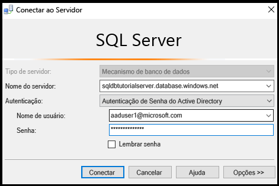

3. Clique em **Opções** para especificar o banco de dados ao qual você deseja se conectar e digite **AdventureWorksLT** na caixa suspensa **Conectar-se ao Banco de Dados** na guia **Propriedades de Conexão**.
   
   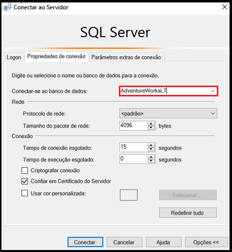

4. Clique em **Conectar**. Será exibida uma caixa de diálogo informando que o computador do qual você está tentando se conectar ao banco de dados SQL não tem acesso de habilitação de regra de firewall ao banco de dados. A caixa de diálogo que você recebe tem duas variações, de acordo com as etapas que você executou anteriormente com firewalls, mas normalmente você obtém a primeira caixa de diálogo exibida.

   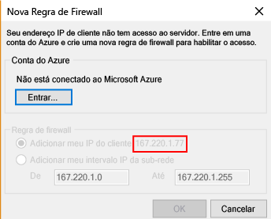

   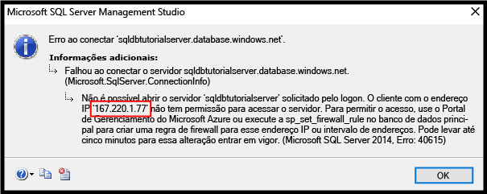

   > [!NOTE]
   > As versões mais recentes do SSMS incluem a funcionalidade para permitir que colaboradores e proprietários de assinatura entrem no Microsoft Azure e criem uma regra de firewall de nível de servidor.
   > 

4. Copie o endereço IP do cliente da caixa de diálogo para uso na etapa 7.
5. Clique em **Cancelar**, mas não feche a caixa de diálogo **Conectar ao Servidor**.
6. Alterne para um computador para o qual você já criou uma regra de firewall de nível de servidor e conecte-se ao servidor usando a conta do administrador de Servidor.
7. Em uma nova janela de consulta conectada ao banco de dados AdventureWorksLT como Administrador do Servidor, execute a seguinte instrução para criar um firewall de nível de banco de dados executando [sp_set_database_firewall_rule](https://msdn.microsoft.com/library/dn270010.aspx) com o endereço IP da etapa 4:

   ```
   EXEC sp_set_database_firewall_rule @name = N'AdventureWorksLTFirewallRule', 
     @start_ip_address = 'x.x.x.x', @end_ip_address = 'x.x.x.x';
   ```

   

8. Alterne computadores novamente e clique em **Conectar** na caixa de diálogo **Conectar ao servidor** para se conectar ao AdventureWorksLT como aaduser1. 

9. No Pesquisador de Objetos, expanda **Bancos de dados**, expanda **AdventureWorksLT**e expanda **Tabelas**. Observe que user1 só tem permissão para exibir uma única tabela, a tabela **SalesLT.ProductCategory**. 

10. No Pesquisador de Objetos, clique com o botão direito do mouse em **SalesLT.ProductCategory** e clique em **Selecionar 1000 Linhas Superiores**.   

## <a name="next-steps"></a>Próximas etapas
- Para obter uma visão geral de acesso e controle no Banco de Dados SQL, confira [Acesso e controle de Banco de Dados SQL](sql-database-control-access.md).
- Para obter uma visão geral de logons, usuários e funções de banco de dados no Banco de Dados SQL, confira [Logons, usuários e funções de banco de dados](sql-database-manage-logins.md).
- Para obter mais informações sobre objetos de banco de dados, confira [Entidades](https://msdn.microsoft.com/library/ms181127.aspx).
- Para obter mais informações sobre as funções de banco de dados, confira [Funções de banco de dados](https://msdn.microsoft.com/library/ms189121.aspx).
- Para obter mais informações sobre as regras de firewall no Banco de Dados SQL, confira [Regras de firewall de Banco de Dados SQL](sql-database-firewall-configure.md).


