# <a name="sql-server-authentication-access-and-database-level-firewall-rules"></a>Autenticação do SQL Server, acesso, e regras de firewall de nível de banco de dados

Nesse tutorial, aprenderá como usar o SQL Server Management Studio para trabalhar com a autenticação do SQL Server, logons, usuários e funções do banco de dados que concedem acesso e permissões aos servidores e bancos de dados SQL do Azure. Depois de concluir este tutorial, você saberá como:

- Crie logons e usuários com base na autenticação do SQL Server
- Adicionar usuários a funções e conceder permissões a funções
- Use o T-SQL para criar uma regra de firewall no nível de servidor e uma no nível de banco de dados 
- Conectar-se como um usuário para um banco de dados usando o SSMS
- Exibir permissões de usuário no banco de dados mestre e nos bancos de dados de usuário

**Tempo estimado**: este tutorial levará cerca de 45 minutos para ser concluído (supondo que você já tenha atendido aos pré-requisitos).

> [!NOTE]
> Este tutorial ajuda você a aprender sobre o conteúdo destes tópicos: [Acesso e controle de banco de dados SQL](sql-database-control-access.md), [Logons, usuários e funções de banco de dados](sql-database-manage-logins.md), [Entidades](https://msdn.microsoft.com/library/ms181127.aspx), [Funções de banco de dados](https://msdn.microsoft.com/library/ms189121.aspx) e [Regras de firewall de banco de dados SQL](sql-database-firewall-configure.md). Para obter um tutorial sobre a autenticação do Azure Active Directory, confira [Introdução à autenticação com o Azure AD](sql-database-control-access-aad-authentication-get-started.md).
>  

## <a name="prerequisites"></a>Pré-requisitos

* **Uma conta do Azure**. Você precisa de uma conta do Azure. Você pode [abrir uma conta gratuita do Azure](https://azure.microsoft.com/free/) ou [Ativar os benefícios de assinante do Visual Studio](https://azure.microsoft.com/pricing/member-offers/msdn-benefits/). 

* **O Azure cria permissões**. Você deve ser capaz de se conectar ao portal do Azure usando uma conta que seja membro da função de colaborador ou proprietário da assinatura. Para obter mais informações sobre o controle de acesso baseado em função (RBAC), confira [Introdução ao gerenciamento de acesso no Portal do Azure](../active-directory/role-based-access-control-what-is.md).

* **SQL Server Management Studio**. Você pode baixar e instalar a versão mais recente do SSMS (SQL Server Management Studio) em [Baixar o SQL Server Management Studio](https://msdn.microsoft.com/library/mt238290.aspx). Sempre use a versão mais recente do SSMS ao se conectar ao Banco de Dados SQL do Azure, já que sempre há o lançamento de novos recursos.

* **Servidor e bancos de dados base** para instalar e configurar um servidor e os dois bancos de dados usados neste tutorial, clique no botão **Implantar no Azure**. Clicar no botão abre a folha **Implantar de um modelo**; crie um novo grupo de recursos e forneça a **Senha de Logon de Administrador** para o novo servidor que será criado:

   [](https://portal.azure.com/#create/Microsoft.Template/uri/https%3A%2F%2Fsqldbtutorial.blob.core.windows.net%2Ftemplates%2Fsqldbgetstarted.json)


## <a name="sign-in-to-the-azure-portal-using-your-azure-account"></a>Entrar no portal do Azure usando sua conta do Azure
As etapas neste procedimento mostram como se conectar ao portal do Azure usando sua conta do Azure] (https://account.windowsazure.com/Home/Index).

1. Abra seu navegador preferido e conecte-se ao [portal do Azure](https://portal.azure.com/).
2. Entre no [Portal do Azure](https://portal.azure.com/).
3. Na página **Entrar** , forneça as credenciais da sua assinatura.

## <a name="view-logical-server-security-information-in-the-azure-portal"></a>Exibir informações de segurança do servidor lógico no portal do Azure

As etapas deste procedimento mostram como exibir informações sobre a configuração de segurança de seu servidor lógico no portal do Azure.

1. Abra a folha **SQL Server** do servidor e exiba as informações na página **Visão geral**.

   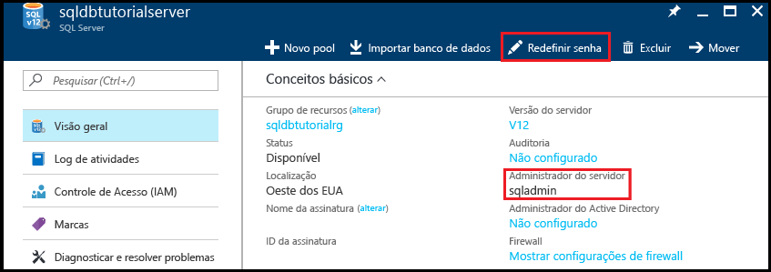

2. Anote o nome do servidor admin no seu servidor lógico. 

3. Se não lembrar a senha, clique em **Redefinir senha** para definir uma nova senha.

4. Se você precisar obter as informações de conexão para esse servidor, clique em **Propriedades**.

## <a name="view-server-admin-permissions-using-ssms"></a>Exibir permissões de administração do servidor usando o SSMS

As etapas deste procedimento mostram como exibir informações sobre a conta do administrador de servidor e suas permissões no banco de dados mestre e nos bancos de dados de usuário.

1. Abra o SQL Server Management Studio e conecte-se ao seu servidor como o administrador do servidor usando a autenticação do SQL Server e a conta do administrador do servidor.

   

2. Clique em **Conectar**.

   

3. No Pesquisador de objetos, expanda **segurança**e, em seguida, expanda **logons** para exibir os logons existentes para o servidor - o logon único em um novo servidor é o logon para conta do administrador do servidor.

   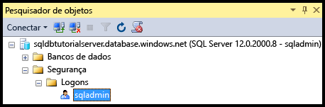

4. No Pesquisador de objetos, expanda **bancos de dados**, expanda **bancos de dados do sistema**, expanda **mestre**, expanda **segurança**e, em seguida, expanda **usuários** para exibir a conta de usuário que foi criada para o logon de admin do servidor neste banco de dados.

   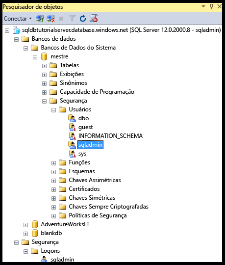

   > [!NOTE]
   > Para saber mais sobre as outras contas de usuário exibidas no nó Usuários, confira [Entidades](https://msdn.microsoft.com/library/ms181127.aspx).
   >

5. No Pesquisador de Objetos, clique com o botão direito do mouse em **mestre** e clique em **Nova Consulta** para abrir uma janela de consulta conectada ao banco de dados mestre.
6. Na janela de consulta, execute a consulta a seguir para retornar informações sobre o usuário que executa a consulta. 

   ```
   SELECT USER;
   ```

   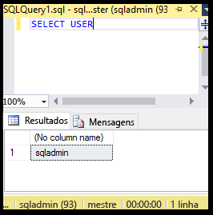

7. Na janela de consulta, execute a consulta a seguir para retornar informações sobre as permissões do usuário sqladmin no banco de dados **mestre**. 

   ```
   SELECT prm.permission_name
      , prm.class_desc
      , prm.state_desc
      , p2.name as 'Database role'
      , p3.name as 'Additional database role' 
   FROM sys.database_principals p
   JOIN sys.database_permissions prm
      ON p.principal_id = prm.grantee_principal_id
      LEFT JOIN sys.database_principals p2
      ON prm.major_id = p2.principal_id
      LEFT JOIN sys.database_role_members r
      ON p.principal_id = r.member_principal_id
      LEFT JOIN sys.database_principals p3
      ON r.role_principal_id = p3.principal_id
   WHERE p.name = 'sqladmin';
   ```

   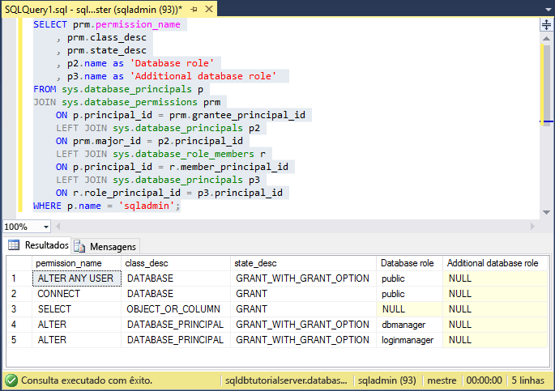

   >[!NOTE]
   > O administrador do servidor tem permissões para se conectar ao banco de dados mestre, criar logons e usuários, selecionar as informações da tabela sys.sql_logins e adicionar usuários às funções de banco de dados dbmanager e dbcreator. Essas permissões são adicionais às permissões concedidas à função pública da qual todos os usuários herdam permissões (como permissões para selecionar as informações de determinadas tabelas). Para obter mais informações, confira [Permissões](https://msdn.microsoft.com/library/ms191291.aspx).
   >

8. No Pesquisador de Objetos, expanda **blankdb**, expanda **Segurança** e expanda **Usuários** para exibir a conta de usuário que foi criada para o logon de admin do servidor neste banco de dados (e em cada banco de dados do usuário).

   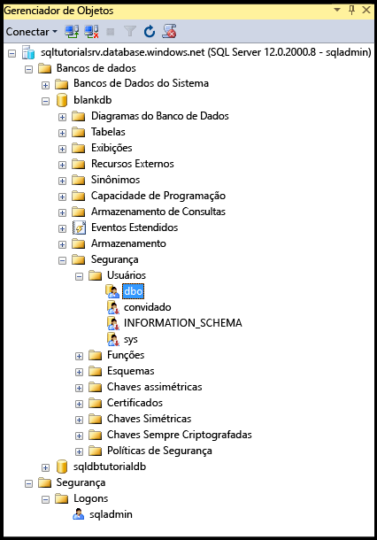

9. No Pesquisador de Objetos, clique com o botão direito do mouse em **blankdb** e clique em **Nova Consulta**.

10. Na janela de consulta, execute a consulta a seguir para retornar informações sobre o usuário que executa a consulta.

   ```
   SELECT USER;
   ```

   

11. Na janela de consulta, execute a consulta a seguir para retornar informações sobre as permissões do usuário dbo. 

   ```
   SELECT prm.permission_name
      , prm.class_desc
      , prm.state_desc
      , p2.name as 'Database role'
      , p3.name as 'Additional database role' 
   FROM sys.database_principals AS p
   JOIN sys.database_permissions AS prm
      ON p.principal_id = prm.grantee_principal_id
      LEFT JOIN sys.database_principals AS p2
      ON prm.major_id = p2.principal_id
      LEFT JOIN sys.database_role_members r
      ON p.principal_id = r.member_principal_id
      LEFT JOIN sys.database_principals AS p3
      ON r.role_principal_id = p3.principal_id
   WHERE p.name = 'dbo';
   ```

   

   > [!NOTE]
   > O usuário dbo é membro da função pública e também é membro da função de banco de dados fixa db_owner. Confira [Funções de nível de banco de dados](https://msdn.microsoft.com/library/ms189121.aspx) para obter mais informações.
   >

## <a name="create-a-new-user-with-select-permissions"></a>Criar um novo usuário com permissões SELECT

As etapas neste procedimento mostram como criar um usuário de banco de dados, testar as permissões padrão de um novo usuário (por meio da função pública), conceder a um usuário **selecione** permissões e exibir esses permissões modificadas.

> [!NOTE]
> Os usuários de nível de banco de dados também são chamados [usuários independentes](https://msdn.microsoft.com/library/ff929188.aspx) e aumentar a portabilidade do banco de dados. Para saber mais sobre as vantagens de portabilidade, veja [Configurar e gerenciar a segurança do Banco de Dados SQL do Azure para restauração geográfica ou o failover para um servidor secundário](sql-database-geo-replication-security-config.md).
>

1. No Pesquisador de Objetos, clique com o botão direito do mouse em **sqldbtutorialdb** e clique em **Nova Consulta**.
2. Execute a seguinte instrução nesta janela de consulta para criar um usuário chamado **user1** no banco de dados sqldbtutorialdb.

   ```
   CREATE USER user1
   WITH PASSWORD = 'p@ssw0rd';
   ```
   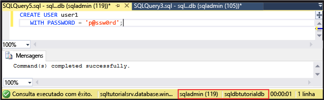

3. Na janela de consulta, execute a consulta a seguir para retornar informações sobre as permissões de user1.

   ```
   SELECT prm.permission_name
      , prm.class_desc
      , prm.state_desc
      , p2.name as 'Database role'
      , p3.name as 'Additional database role' 
   FROM sys.database_principals AS p
   JOIN sys.database_permissions AS prm
      ON p.principal_id = prm.grantee_principal_id
      LEFT JOIN sys.database_principals AS p2
      ON prm.major_id = p2.principal_id
      LEFT JOIN sys.database_role_members r
      ON p.principal_id = r.member_principal_id
      LEFT JOIN sys.database_principals AS p3
      ON r.role_principal_id = p3.principal_id
   WHERE p.name = 'user1';
   ```

   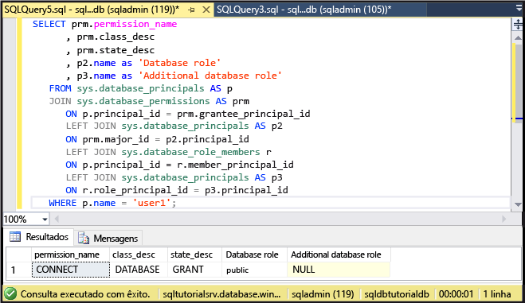

   > [!NOTE]
   > Um novo usuário em um banco de dados só tem as permissões herdadas da função pública.
   >

4. Execute as seguintes consultas usando a instrução **EXECUTE AS USER** para tentar consultar a tabela SalesLT.ProductCategory no banco de dados sqldbtutorialdb como **user1** somente com as permissões herdadas da função pública.

   ```
   EXECUTE AS USER = 'user1';  
   SELECT * FROM [SalesLT].[ProductCategory];
   REVERT;
   ```

   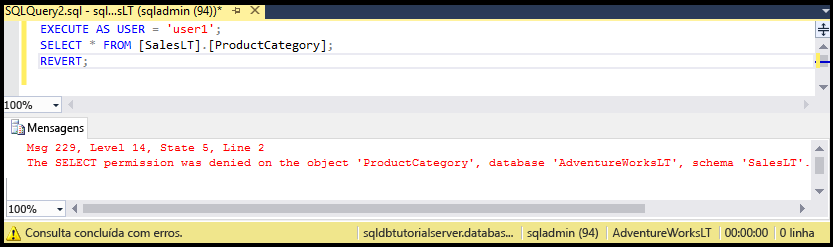

   > [!NOTE]
   > Por padrão, a função pública concede **selecione** permissões em objetos de usuário.
   >

5. Execute a instrução a seguir para conceder permissões **SELECT** na tabela SalesLT.ProductCategory a **user1**.

   ```
   GRANT SELECT ON OBJECT::[SalesLT].[ProductCategory] to user1;
   ```

   

6. Execute as seguintes consultas para consultar com êxito a tabela SalesLT.ProductCategory no banco de dados sqldbtutorialdb como **user1**.

   ```
   EXECUTE AS USER = 'user1';  
   SELECT * FROM [SalesLT].[ProductCategory];
   REVERT;
   ```

   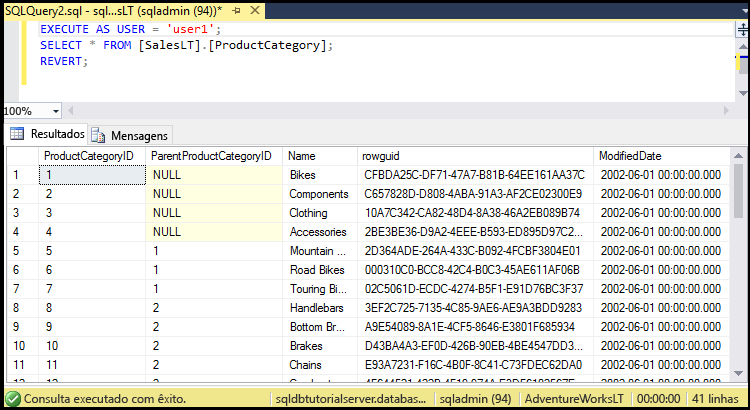

## <a name="create-a-database-level-firewall-rule-using-t-sql"></a>Criar uma regra de firewall de nível de banco de dados usando T-SQL

As etapas neste procedimento mostram como criar uma regra de firewall no nível de banco de dados usando o procedimento armazenado do sistema [sp_set_database_firewall_rule](https://msdn.microsoft.com/library/dn270010.aspx). Uma regra de firewall de nível de banco de dados permite que um administrador de servidor para permitir que os usuários através do firewall do banco de dados SQL somente para bancos de dados específicos.

> [!NOTE]
> As [regras de firewall no nível de banco de dados](sql-database-firewall-configure.md) aumentam a portabilidade do banco de dados. Para saber mais sobre as vantagens de portabilidade, veja [Configurar e gerenciar a segurança do Banco de Dados SQL do Azure para restauração geográfica ou o failover para um servidor secundário](sql-database-geo-replication-security-config.md).
>

> [!IMPORTANT]
> Para testar uma regra de firewall de nível de banco de dados, conecte-se de outro computador (ou exclua a regra de firewall no nível de servidor no portal do Azure).
>

1. Abra o SQL Server Management Studio em um computador para o qual você não tenha uma regra de firewall no nível de servidor.

2. Na janela **Conectar ao Servidor**, insira as informações de autenticação e o nome do servidor para conectar-se usando a autenticação do SQL Server com a conta **user1**. 
    
   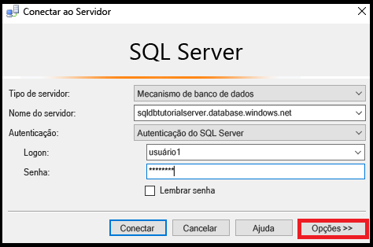

3. Clique em **Opções**, na caixa de diálogo **Conectar ao servidor**, para especificar o banco de dados ao qual você deseja se conectar e digite **sqldbtutorialdb** na caixa suspensa **Conectar-se ao Banco de Dados** na guia **Propriedades da Conexão**.
   
   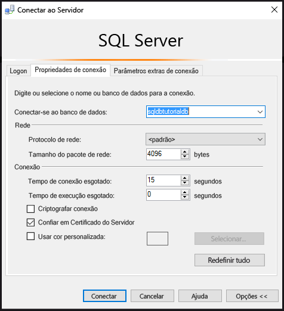

4. Clique em **Conectar**. 

   Será exibida uma caixa de diálogo informando que o computador do qual você está tentando se conectar ao banco de dados SQL não tem acesso de habilitação de regra de firewall ao banco de dados. 

   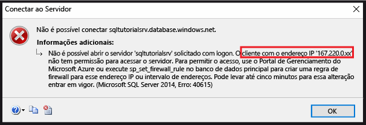


5. Copie o endereço IP do cliente da caixa de diálogo para usá-lo na etapa 8.
6. Clique em **OK** para fechar a caixa de diálogo de erro, mas não feche a caixa de diálogo **Conectar ao Servidor**.
7. Alterne para um computador para o qual você já tenha criado uma regra de firewall no nível de servidor. 
8. Conecte-se ao banco de dados sqldbtutorialdb no SSMS como administrador do servidor e execute a seguinte instrução para criar um firewall de nível de banco de dados usando o endereço IP (ou o intervalo de endereços) da etapa 5.  

   ```
   EXEC sp_set_database_firewall_rule @name = N'sqldbtutorialdbFirewallRule', 
     @start_ip_address = 'x.x.x.x', @end_ip_address = 'x.x.x.x';
   ```

   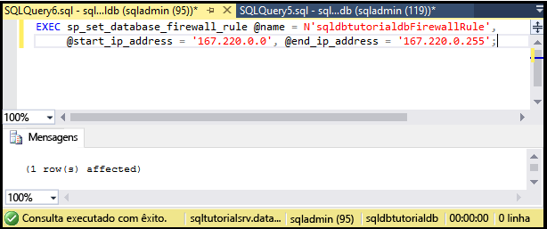

9. Alterne computadores novamente e clique em **Conectar** na caixa de diálogo **Conectar ao servidor** para se conectar ao sqldbtutorialdb como user1. 

   > [!NOTE]
   > Depois de criar a regra de firewall de nível de banco de dados, pode levar até 5 minutos para se tornar ativa.
   >

10. Depois de se conectar com êxito, expanda **bancos de dados** no Pesquisador de objetos. Observe que **user1** pode exibir apenas o **sqldbtutorialdb** banco de dados.

   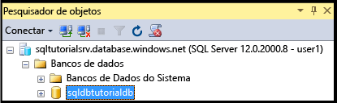

11. Expanda **sqldbtutorialdb**e, em seguida, expanda **tabelas**. Observe que user1 só tem permissão para exibir uma única tabela, a tabela **SalesLT.ProductCategory**. 

   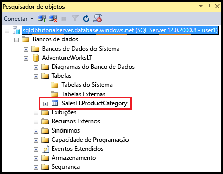

## <a name="create-a-new-user-as-dbowner-and-a-database-level-firewall-rule"></a>Criar um novo usuário como db_owner e uma regra de firewall de nível de banco de dados

As etapas neste procedimento mostram como criar um usuário em outro banco de dados com permissões de função de banco de dados db_owner e criar um firewall de nível de banco de dados para esse outro banco de dados. Esse novo usuário com **db_owner** associação de função só poderá se conectar e gerenciar esse banco de dados.

1. Alterne para o computador com uma conexão ao Banco de Dados SQL usando a conta do administrador de servidor.
2. Abra uma janela de consulta conectada ao banco de dados **blankdb** e execute a instrução a seguir para criar um usuário chamado blankdbadmin no banco de dados blankdb.

   ```
   CREATE USER blankdbadmin
   WITH PASSWORD = 'p@ssw0rd';
   ```

3. Na janela de consulta, execute a instrução a seguir para adicionar o usuário blankdbadmin à função db_owner do banco de dados. Agora este usuário pode executar todas as ações necessárias para gerenciar o banco de dados blankdb.

   ```
   ALTER ROLE db_owner ADD MEMBER blankdbadmin; 
   ```

4. Na mesma janela de consulta, execute a instrução a seguir para criar um firewall de nível de banco de dados executando [sp_set_database_firewall_rule](https://msdn.microsoft.com/library/dn270010.aspx) com o endereço IP da etapa 4 do procedimento anterior (ou um intervalo de endereços IP para os usuários deste banco de dados):

   ```
   EXEC sp_set_database_firewall_rule @name = N'blankdbFirewallRule', 
     @start_ip_address = 'x.x.x.x', @end_ip_address = 'x.x.x.x';
   ```

5. Alterne computadores (para um para o qual você tenha criado uma regra de firewall de nível de banco de dados) e conecte-se ao banco de dados blankdb usando a conta de usuário blankdbadmin.
6. Abra uma janela de consulta ao banco de dados blankdb e execute a instrução a seguir para criar um usuário chamado blankdbuser1 no banco de dados blankdb.

   ```
   CREATE USER blankdbuser1
   WITH PASSWORD = 'p@ssw0rd';
   ```
 
7. Conforme necessário para o ambiente de aprendizado, crie uma regra adicional de firewall no nível de banco de dados para este usuário. No entanto, se você criou a regra de firewall de nível de banco de dados usando um intervalo de endereços IP, isso não pode ser necessário.

## <a name="grant-dbmanager-permissions-and-create-a-server-level-firewall-rule"></a>Conceder permissões a dbmanager e criar uma regra de firewall no nível de servidor

As etapas deste procedimento mostram como criar um logon e um usuário no banco de dados mestre com permissões para criar e gerenciar bancos de dados do novo usuário. As etapas também mostram como criar uma regra adicional de firewall no nível de servidor usando Transact-SQL com [sp_set_firewall_rule](https://msdn.microsoft.com/library/dn270017.aspx). 

> [!IMPORTANT]
>A primeira regra de firewall no nível de servidor sempre deve ser criada no Azure (no portal do Azure, usando o PowerShell ou a API REST).
>

> [!IMPORTANT]
> É necessário criar logons no banco de dados mestre e criar uma conta de usuário de um logon para o administrador de servidor para delegar as permissões create database para outro usuário. No entanto, a criação de logons e, em seguida, criar usuários de logons diminui a portabilidade do seu ambiente.
>

1. Alterne para o computador com uma conexão ao Banco de Dados SQL usando a conta do administrador de servidor.
2. Abra uma janela de consulta conectada ao mestre de banco de dados e execute a instrução a seguir para criar um logon chamado dbcreator no banco de dados mestre.

   ```
   CREATE LOGIN dbcreator
   WITH PASSWORD = 'p@ssw0rd';
   ```

3. Na mesma janela de consulta, 

   ```
   CREATE USER dbcreator
   FROM LOGIN dbcreator;
   ```

3. Na janela de consulta, execute a consulta a seguir para adicionar o usuário dbcreator à função de banco de dados dbmanager. Agora este usuário pode criar e gerenciar bancos de dados criados pelo usuário.

   ```
   ALTER ROLE dbmanager ADD MEMBER dbcreator; 
   ```

4. Na janela de consulta, execute a consulta a seguir para criar um firewall no nível de servidor ao executar [sp_set_firewall_rule](https://msdn.microsoft.com/library/dn270017.aspx) com um endereço IP apropriado para o ambiente:

   ```
   EXEC sp_set_firewall_rule @name = N'dbcreatorFirewallRule', 
     @start_ip_address = 'x.x.x.x', @end_ip_address = 'x.x.x.x';
   ```

5. Alterne computadores (para um para o qual você tenha criado uma regra de firewall de nível de servidor) e conecte-se ao banco de dados mestre usando a conta de usuário dbcreator.
6. Abra uma janela de consulta ao banco de dados mestre e execute a consulta a seguir para criar um banco de dados denominado foo.

   ```
   CREATE DATABASE FOO (EDITION = 'basic');
   ```
 7. Opcionalmente, exclua este banco de dados para economizar dinheiro usando a seguinte instrução:

   ```
   DROP DATABASE FOO;
   ```

## <a name="complete-script"></a>Script completo

Para criar logons e usuários, adicioná-los a funções, conceder a eles permissões, criar regras de firewall de nível de banco de dados e criar regras de firewall de nível de servidor, execute as instruções a seguir em bancos de dados apropriados no servidor.

### <a name="master-database"></a>banco de dados mestre
Execute essas instruções no banco de dados mestre usando a conta do administrador de servidor, adicionando os endereços IP ou o intervalo apropriados.

```
CREATE LOGIN dbcreator WITH PASSWORD = 'p@ssw0rd';
CREATE USER dbcreator FROM LOGIN dbcreator;
ALTER ROLE dbmanager ADD MEMBER dbcreator;
EXEC sp_set_firewall_rule @name = N'dbcreatorFirewallRule', 
     @start_ip_address = 'x.x.x.x', @end_ip_address = 'x.x.x.x';
```

### <a name="sqldbtutorialdb-database"></a>sqldbtutorialdb database
Execute essas instruções no banco de dados sqldbtutorialdb usando a conta do administrador de servidor, adicionando os endereços IP ou o intervalo apropriados.

```
CREATE USER user1 WITH PASSWORD = 'p@ssw0rd';
GRANT SELECT ON OBJECT::[SalesLT].[ProductCategory] to user1;
EXEC sp_set_database_firewall_rule @name = N'sqldbtutorialdbFirewallRule', 
     @start_ip_address = 'x.x.x.x', @end_ip_address = 'x.x.x.x';
```

### <a name="blankdb-database"></a>banco de dados blankdb
Execute essas instruções no banco de dados blankdb usando a conta do administrador de servidor, adicionando os endereços IP ou o intervalo apropriados.

```
CREATE USER blankdbadmin
   WITH PASSWORD = 'p@ssw0rd';
ALTER ROLE db_owner ADD MEMBER blankdbadmin;
EXEC sp_set_database_firewall_rule @name = N'blankdbFirewallRule', 
     @start_ip_address = 'x.x.x.x', @end_ip_address = 'x.x.x.x';
CREATE USER blankdbuser1
   WITH PASSWORD = 'p@ssw0rd';
```

## <a name="next-steps"></a>Próximas etapas
- Para obter uma visão geral de acesso e controle no Banco de Dados SQL, confira [Acesso e controle de Banco de Dados SQL](sql-database-control-access.md).
- Para obter uma visão geral de logons, usuários e funções de banco de dados no Banco de Dados SQL, confira [Logons, usuários e funções de banco de dados](sql-database-manage-logins.md).
- Para obter mais informações sobre objetos de banco de dados, confira [Entidades](https://msdn.microsoft.com/library/ms181127.aspx).
- Para obter mais informações sobre as funções de banco de dados, confira [Funções de banco de dados](https://msdn.microsoft.com/library/ms189121.aspx).
- Para obter mais informações sobre as regras de firewall no Banco de Dados SQL, confira [Regras de firewall de Banco de Dados SQL](sql-database-firewall-configure.md).
- Para obter um tutorial sobre como usar a autenticação do Azure Active Directory, consulte [Autenticação e autorização do Azure AD](sql-database-control-access-aad-authentication-get-started.md).


