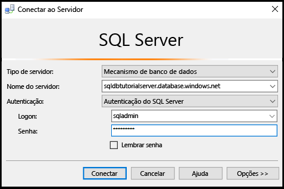
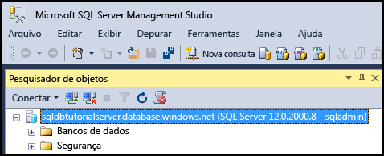
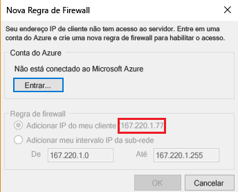
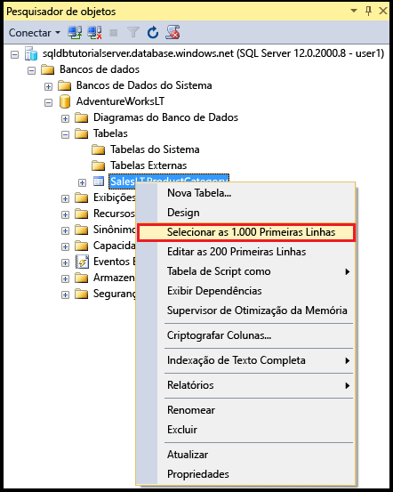
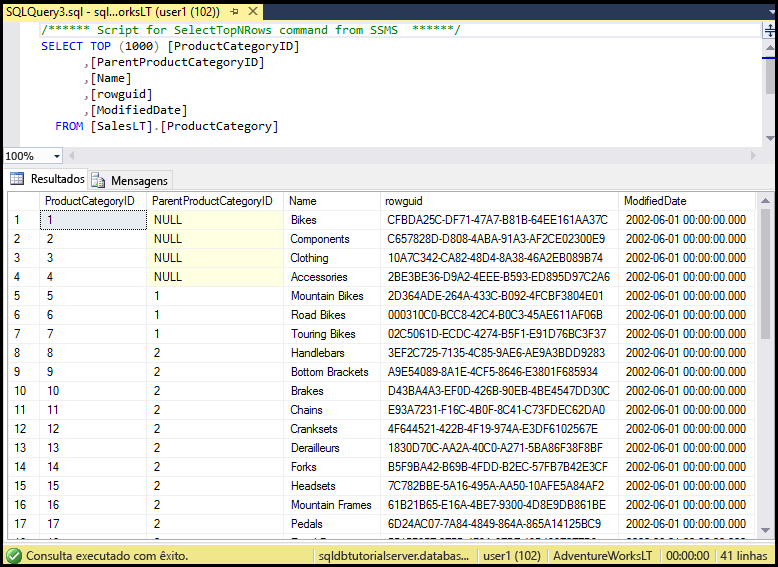

# <a name="sql-database-tutorial-sql-server-authentication-logins-and-user-accounts-database-roles-permissions-server-level-firewall-rules-and-database-level-firewall-rules"></a>Tutorial do Banco de Dados SQL: autenticação do SQL Server, logons e contas de usuário, funções de banco de dados, permissões, regras de firewall no nível de servidor e regras de firewall no nível de banco de dados
Neste tutorial de introdução, você aprenderá como usar o SQL Server Management Studio para trabalhar com autenticação do SQL Server, logons, usuários e funções de banco de dados que concedem acesso e permissões para servidores de banco de dados SQL e bancos de dados. Você aprenderá a:

- Exibir permissões de usuário no banco de dados mestre e nos bancos de dados de usuário
- Crie logons e usuários com base na autenticação do SQL Server
- Conceder permissões de todo o servidor e banco de dados específicos a usuários
- Fazer logon em um banco de dados de usuário como um usuário não administrador
- Criar regras de firewall de nível de banco de dados para os usuários do banco de dados
- Criar regras de firewall de nível de servidor para os administradores do servidor

**Tempo estimado**: este tutorial levará cerca de 45 minutos para ser concluído (supondo que você já tenha atendido aos pré-requisitos).

## <a name="prerequisites"></a>Pré-requisitos

* Você precisa de uma conta do Azure. Você pode [abrir uma conta gratuita do Azure](/pricing/free-trial/?WT.mc_id=A261C142F) ou [Ativar os benefícios de assinante do Visual Studio](/pricing/member-offers/msdn-benefits-details/?WT.mc_id=A261C142F). 

* Você deve ser capaz de se conectar ao portal do Azure usando uma conta que seja membro da função de colaborador ou proprietário da assinatura. Para obter mais informações sobre o controle de acesso baseado em função (RBAC), confira [Introdução ao gerenciamento de acesso no Portal do Azure](../active-directory/role-based-access-control-what-is.md).

* Você concluiu a [Introdução aos servidores do Banco de Dados SQL do Azure, bancos de dados e regras de firewall usando o portal do Azure e o SQL Server Management Studio](sql-database-get-started.md) ou a versão equivalente do [PowerShell](sql-database-get-started-powershell.md) deste tutorial. Caso contrário, conclua este tutorial de pré-requisito ou execute o script do PowerShell no fim da [versão do PowerShell](sql-database-get-started-powershell.md) deste tutorial antes de continuar.

> [!NOTE]
> Este tutorial ajuda você a aprender sobre o conteúdo destes tópicos de aprendizado: [Acesso e controle de banco de dados SQL](sql-database-control-access.md), [Logons, usuários e funções de banco de dados](sql-database-manage-logins.md), [Entidades](https://msdn.microsoft.com/library/ms181127.aspx), [Funções de banco de dados](https://msdn.microsoft.com/library/ms189121.aspx) e [Regras de firewall de banco de dados SQL](sql-database-firewall-configure.md).
>  

## <a name="sign-in-to-the-azure-portal-using-your-azure-account"></a>Entrar no portal do Azure usando sua conta do Azure
Usando a [assinatura existente](https://account.windowsazure.com/Home/Index), siga estas etapas para se conectar ao portal do Azure.

1. Abra seu navegador preferido e conecte-se ao [portal do Azure](https://portal.azure.com/).
2. Entre no [Portal do Azure](https://portal.azure.com/).
3. Na página **Entrar** , forneça as credenciais da sua assinatura.
   
   


<a name="create-logical-server-bk"></a>

## <a name="view-information-about-the-security-configuration-for-your-logical-server"></a>Exibir informações sobre a configuração de segurança de seu servidor lógico

Nesta seção do tutorial, você exibe informações sobre a configuração de segurança de seu servidor lógico no portal do Azure.

1. Abra a folha **SQL Server** do servidor lógico e exiba as informações na página **Visão geral**.

   

2. Anote o nome da conta do administrador do servidor para o servidor lógico. Se não lembrar a senha, clique em **Redefinir senha** para definir uma nova senha.

> [!NOTE]
> Para examinar as informações de conexão desse servidor, acesse [Exibir ou atualizar as configurações do servidor](sql-database-view-update-server-settings.md). Para esta série de tutoriais, o nome totalmente qualificado do servidor é 'sqldbtutorialserver.database.windows.net'.
>

## <a name="connect-to-sql-server-using-sql-server-management-studio-ssms"></a>Conectar-se ao SQL server usando o SSMS (SQL Server Management Studio)

1. Se você ainda não o fez, baixe e instale a versão mais recente do SSMS em [Baixar o SQL Server Management Studio](https://msdn.microsoft.com/library/mt238290.aspx). Para se manter atualizado, a versão mais recente do SSMS avisará você quando houver uma nova versão disponível para download.

2. Depois de instalar, digite **Microsoft SQL Server Management Studio** na caixa de pesquisa do Windows e clique em **Enter** para abrir o SSMS.

   

3. Na caixa de diálogo **Conectar ao Servidor**, insira as informações necessárias para se conectar ao SQL server usando a Autenticação do SQL Server e a conta do administrador de Servidor.

   

4. Clique em **Conectar**.

   

## <a name="view-the-server-admin-account-and-its-permissions"></a>Exibir a conta do administrador de servidor e suas permissões 
Nesta seção do tutorial, você exibe informações sobre a conta do administrador de servidor e suas permissões no banco de dados mestre e nos bancos de dados de usuário.

1. No Pesquisador de Objetos, expanda **Segurança** e expanda **Logons** para exibir os logons existentes para o servidor de Banco de Dados SQL. Observe que é exibido um logon para a conta do administrador do servidor especificada durante o provisionamento: logon sqladmin para esta série de tutoriais.

   

2. No Pesquisador de Objetos, expanda **Bancos de dados**, expanda **Bancos de dados do sistema**, expanda **Mestre**, expanda **Segurança** e expanda **Usuários**. Observe que uma conta de usuário foi criada no banco de dados mestre para o logon de administrador de servidor, com o mesmo nome que a conta de usuário do logon (os nomes não precisam ser correspondentes, mas essa é uma prática recomendada para evitar confusão).

   

   > [!NOTE]
   > Para obter informações sobre as outras contas de usuário exibidas, confira [Entidades](https://msdn.microsoft.com/library/ms181127.aspx).
   >

3. No Pesquisador de Objetos, clique com o botão direito do mouse em **mestre** e clique em **Nova Consulta** para abrir uma janela de consulta conectada ao banco de dados mestre.
4. Na janela de consulta, execute a consulta a seguir para retornar informações sobre o usuário que executa a consulta. Observe que sqladmin é retornado para a conta de usuário que executa essa consulta (vemos um resultado diferente ao consultar um banco de dados de usuário mais adiante neste procedimento).

   ```
   SELECT USER;
   ```

   

5. Na janela de consulta, execute a consulta a seguir para retornar informações sobre as permissões do usuário sqladmin. Observe que sqladmin tem permissões para se conectar ao banco de dados mestre, criar logons e usuários, selecionar as informações da tabela sys.sql_logins e adicionar usuários às funções de banco de dados dbmanager e dbcreator. Essas permissões são adicionais às permissões concedidas à função pública da qual todos os usuários herdam permissões (como permissões para selecionar as informações de determinadas tabelas). Para obter mais informações, confira [Permissões](https://msdn.microsoft.com/library/ms191291.aspx).

   ```
   SELECT prm.permission_name
      , prm.class_desc
      , prm.state_desc
      , p2.name as 'Database role'
      , p3.name as 'Additional database role' 
   FROM sys.database_principals p
   JOIN sys.database_permissions prm
      ON p.principal_id = prm.grantee_principal_id
      LEFT JOIN sys.database_principals p2
      ON prm.major_id = p2.principal_id
      LEFT JOIN sys.database_role_members r
      ON p.principal_id = r.member_principal_id
      LEFT JOIN sys.database_principals p3
      ON r.role_principal_id = p3.principal_id
   WHERE p.name = 'sqladmin';
   ```

   

6. No Pesquisador de Objetos, expanda **blankdb**, expanda **Segurança** e expanda **Usuários**. Observe que não há uma conta de usuário chamada sqladmin neste banco de dados.

   

7. No Pesquisador de Objetos, clique com o botão direito do mouse em **blankdb** e clique em **Nova Consulta**.

8. Na janela de consulta, execute a consulta a seguir para retornar informações sobre o usuário que executa a consulta. Observe que dbo é retornado para a conta de usuário que executa essa consulta (por padrão, o logon de administrador de Servidor é mapeado para a conta de usuário dbo em cada banco de dados de usuário).

   ```
   SELECT USER;
   ```

   

9. Na janela de consulta, execute a consulta a seguir para retornar informações sobre as permissões do usuário dbo. Observe que dbo é membro da função pública e também é membro da função de banco de dados fixa db_owner. Confira [Funções de nível de banco de dados](https://msdn.microsoft.com/library/ms189121.aspx) para obter mais informações.

   ```
   SELECT prm.permission_name
      , prm.class_desc
      , prm.state_desc
      , p2.name as 'Database role'
      , p3.name as 'Additional database role' 
   FROM sys.database_principals AS p
   JOIN sys.database_permissions AS prm
      ON p.principal_id = prm.grantee_principal_id
      LEFT JOIN sys.database_principals AS p2
      ON prm.major_id = p2.principal_id
      LEFT JOIN sys.database_role_members r
      ON p.principal_id = r.member_principal_id
      LEFT JOIN sys.database_principals AS p3
      ON r.role_principal_id = p3.principal_id
   WHERE p.name = 'dbo';
   ```

   

10. Opcionalmente, repita as três etapas anteriores para o banco de dados de usuário AdventureWorksLT.

## <a name="create-a-new-user-in-the-adventureworkslt-database-with-select-permissions"></a>Criar um novo usuário no banco de dados AdventureWorksLT com permissões SELECT

Nesta seção do tutorial, você cria uma conta de usuário no banco de dados AdventureWorksLT, testa as permissões desse usuário como membro da função pública, concede a ele permissões SELECT e testa novamente as permissões desse usuário.

> [!NOTE]
> Os usuários de nível de banco de dados ([usuários contidos](https://msdn.microsoft.com/library/ff929188.aspx)) aumentam a portabilidade do banco de dados, um recurso que exploramos em tutoriais posteriores.
>

1. No Pesquisador de Objetos, clique com o botão direito do mouse em **AdventureWorksLT** e clique em **Nova Consulta** para abrir uma janela de consulta conectada ao banco de dados AdventureWorksLT.
2. Execute a instrução a seguir para criar um usuário chamado user1 no banco de dados AdventureWorksLT.

   ```
   CREATE USER user1
   WITH PASSWORD = 'p@ssw0rd';
   ```
   

3. Na janela de consulta, execute a consulta a seguir para retornar informações sobre as permissões de user1. Observe que as únicas permissões que user1 tem são as permissões herdadas da função pública.

   ```
   SELECT prm.permission_name
      , prm.class_desc
      , prm.state_desc
      , p2.name as 'Database role'
      , p3.name as 'Additional database role' 
   FROM sys.database_principals AS p
   JOIN sys.database_permissions AS prm
      ON p.principal_id = prm.grantee_principal_id
      LEFT JOIN sys.database_principals AS p2
      ON prm.major_id = p2.principal_id
      LEFT JOIN sys.database_role_members r
      ON p.principal_id = r.member_principal_id
      LEFT JOIN sys.database_principals AS p3
      ON r.role_principal_id = p3.principal_id
   WHERE p.name = 'user1';
   ```

   

4. Execute as consultas a seguir para tentar consultar uma tabela no banco de dados AdventureWorksLT como user1.

   ```
   EXECUTE AS USER = 'user1';  
   SELECT * FROM [SalesLT].[ProductCategory];
   REVERT;
   ```

   

5. Execute a instrução a seguir para conceder permissões SELECT na tabela ProductCategory no esquema SalesLT a user1.

   ```
   GRANT SELECT ON OBJECT::[SalesLT].[ProductCategory] to user1;
   ```

   

6. Execute as consultas a seguir para tentar consultar uma tabela no banco de dados AdventureWorksLT como user1.

   ```
   EXECUTE AS USER = 'user1';  
   SELECT * FROM [SalesLT].[ProductCategory];
   REVERT;
   ```

   

## <a name="create-a-database-level-firewall-rule-for-an-adventureworkslt-database-user"></a>Criar uma regra de firewall no nível de banco de dados para um usuário do banco de dados AdventureWorksLT

Nesta seção do tutorial, você tenta fazer logon em um computador com um endereço IP diferente, criar uma regra de firewall no nível de banco de dados como o administrador do servidor e fazer logon usando a nova regra de firewall no nível de banco de dados. 

> [!NOTE]
> [Regras de firewall de nível de banco de dados](sql-database-firewall-configure.md) aumentam a portabilidade do banco de dados, um recurso que exploramos em tutoriais posteriores.
>

1. Em outro computador para o qual você ainda não criou uma regra de firewall de nível de servidor, abra o SQL Server Management Studio.

   > [!IMPORTANT]
   > Sempre use a versão mais recente do SSMS em [Baixar o SQL Server Management Studio](https://msdn.microsoft.com/library/mt238290.aspx). 
   >

2. Na janela **Conectar ao Servidor**, insira as informações de autenticação e o nome do servidor para conectar-se usando a autenticação do SQL Server com a conta user1. 
    
   

3. Clique em **Opções** para especificar o banco de dados ao qual você deseja se conectar e digite **AdventureWorksLT** na caixa suspensa **Conectar-se ao Banco de Dados** na guia **Propriedades de Conexão**.
   
   

4. Clique em **Conectar**. Será exibida uma caixa de diálogo informando que o computador do qual você está tentando se conectar ao banco de dados SQL não tem acesso de habilitação de regra de firewall ao banco de dados. A caixa de diálogo que você recebe tem duas variações, de acordo com as etapas que você executou anteriormente com firewalls, mas normalmente você obtém a primeira caixa de diálogo exibida.

   

   

   > [!NOTE]
   > As versões mais recentes do SSMS incluem a funcionalidade para permitir que colaboradores e proprietários de assinatura entrem no Microsoft Azure e criem uma regra de firewall de nível de servidor.
   > 

4. Copie o endereço IP do cliente da caixa de diálogo para uso na etapa 7.
5. Clique em **Cancelar**, mas não feche a caixa de diálogo **Conectar ao Servidor**.
6. Alterne para um computador para o qual você já criou uma regra de firewall de nível de servidor e conecte-se ao servidor usando a conta do administrador de Servidor.
7. Em uma nova janela de consulta conectada ao banco de dados AdventureWorksLT como Administrador do Servidor, execute a seguinte instrução para criar um firewall de nível de banco de dados executando [sp_set_database_firewall_rule](https://msdn.microsoft.com/library/dn270010.aspx) com o endereço IP da etapa 4:

   ```
   EXEC sp_set_database_firewall_rule @name = N'AdventureWorksLTFirewallRule', 
     @start_ip_address = 'x.x.x.x', @end_ip_address = 'x.x.x.x';
   ```

   

8. Alterne computadores novamente e clique em **Conectar** na caixa de diálogo **Conectar ao servidor** para se conectar ao AdventureWorksLT como user1. 

   

9. No Pesquisador de Objetos, expanda **Bancos de dados**, expanda **AdventureWorksLT**e expanda **Tabelas**. Observe que user1 só tem permissão para exibir uma única tabela, a tabela **SalesLT.ProductCategory**. 

   

10. No Pesquisador de Objetos, clique com o botão direito do mouse em **SalesLT.ProductCategory** e clique em **Selecionar 1000 Linhas Superiores**.   

   

   

## <a name="create-a-new-user-in-the-blankdb-database-with-dbowner-database-role-permissions-and-a-database-level-firewall-rule"></a>Criar um novo usuário no banco de dados blankdb com permissões de função de banco de dados db_owner e uma regra de firewall de nível de banco de dados

Nesta seção do tutorial, você cria um usuário no banco de dados blankdb com permissões de função de banco de dados db_owner e cria um firewall de nível de banco de dados para esse banco de dados usando a conta do administrador do servidor. 

1. Alterne para o computador com uma conexão de banco de dados SQL usando a conta do administrador de Servidor.
2. Abra uma janela de consulta conectada ao banco de dados blankdb e execute a instrução a seguir para criar um usuário chamado blankdbadmin no banco de dados blankdb.

   ```
   CREATE USER blankdbadmin
   WITH PASSWORD = 'p@ssw0rd';
   ```

3. Na janela de consulta, execute a instrução a seguir para adicionar o usuário blankdbadmin à função db_owner do banco de dados. Agora este usuário pode executar todas as ações necessárias para gerenciar o banco de dados blankdb.

   ```
   ALTER ROLE db_owner ADD MEMBER blankdbadmin; 
   ```

4. Na mesma janela de consulta, execute a instrução a seguir para criar um firewall de nível de banco de dados executando [sp_set_database_firewall_rule](https://msdn.microsoft.com/library/dn270010.aspx) com o endereço IP da etapa 4 do procedimento anterior (ou um intervalo de endereços IP para os usuários deste banco de dados):

   ```
   EXEC sp_set_database_firewall_rule @name = N'blankdbFirewallRule', 
     @start_ip_address = 'x.x.x.x', @end_ip_address = 'x.x.x.x';
   ```

5. Alterne computadores (para um para o qual você tenha criado uma regra de firewall de nível de banco de dados) e conecte-se ao banco de dados blankdb usando a conta de usuário blankdbadmin.
6. Abra uma janela de consulta ao banco de dados blankdb e execute a instrução a seguir para criar um usuário chamado blankdbuser1 no banco de dados blankdb.

   ```
   CREATE USER blankdbuser1
   WITH PASSWORD = 'p@ssw0rd';
   ```
 
7. Conforme necessário para o ambiente de aprendizado, crie uma regra adicional de firewall no nível de banco de dados para este usuário. 

## <a name="create-a-new-login-and-user-in-the-master-database-with-dbmanager-permissions-and-create-a-server-level-firewall-rule"></a>Crie um novo logon e um usuário no banco de dados mestre com permissões dbmanager e crie uma regra de firewall de nível de servidor

Nesta seção do tutorial, você cria um logon e um usuário no banco de dados mestre com permissões para criar e gerenciar bancos de dados do novo usuário. Você também cria uma regra de firewall de nível de servidor adicional usando Transact-SQL com [sp_set_firewall_rule](https://msdn.microsoft.com/library/dn270017.aspx).

> [!NOTE]
> É necessário criar logons no banco de dados mestre e criar uma conta de usuário de um logon para o titular da conta do administrador de Servidor para delegar as permissões create database para outro usuário. No entanto, a criação de logons e usuários de logons diminui a portabilidade do ambiente (exploramos as consequências disso em tutoriais posteriores), incluindo como prever e manipular como parte do planejamento de recuperação de desastre.
>

1. Alterne para o computador com uma conexão de banco de dados SQL usando a conta do administrador de Servidor.
2. Abra uma janela de consulta conectada ao mestre de banco de dados e execute a instrução a seguir para criar um logon chamado dbcreator no banco de dados mestre.

   ```
   CREATE LOGIN dbcreator
   WITH PASSWORD = 'p@ssw0rd';
   ```

3. Na mesma janela de consulta, 

   ```
   CREATE USER dbcreator
   FROM LOGIN dbcreator;
   ```

3. Na janela de consulta, execute a consulta a seguir para adicionar o usuário dbcreator à função de banco de dados dbmanager. Agora este usuário pode criar e gerenciar bancos de dados criados pelo usuário.

   ```
   ALTER ROLE dbmanager ADD MEMBER dbcreator; 
   ```

4. Na janela de consulta, execute a consulta a seguir para criar um firewall de nível de servidor executando [sp_set_database_firewall_rule](https://msdn.microsoft.com/library/dn270010.aspx) com um endereço IP apropriado para o ambiente:

   ```
   EXEC sp_set_firewall_rule @name = N'dbcreatorFirewallRule', 
     @start_ip_address = 'x.x.x.x', @end_ip_address = 'x.x.x.x';
   ```

5. Alterne computadores (para um para o qual você tenha criado uma regra de firewall de nível de servidor) e conecte-se ao banco de dados mestre usando a conta de usuário dbcreator.
6. Abra uma janela de consulta ao banco de dados mestre e execute a consulta a seguir para criar um banco de dados denominado foo.

   ```
   CREATE DATABASE FOO (EDITION = 'basic');
   ```
 7. Opcionalmente, exclua este banco de dados para economizar dinheiro usando a seguinte instrução:

   ```
   DROP DATABASE FOO;
   ```

## <a name="complete-script"></a>Script completo

Para criar logons e usuários, adicioná-los a funções, conceder a eles permissões, criar regras de firewall de nível de banco de dados e criar regras de firewall de nível de servidor, execute as instruções a seguir em bancos de dados apropriados no servidor.

### <a name="master-database"></a>banco de dados mestre
Execute essas instruções no banco de dados mestre usando a conta do administrador de servidor, adicionando os endereços IP ou o intervalo apropriado.

```
CREATE LOGIN dbcreator WITH PASSWORD = 'p@ssw0rd';
CREATE USER dbcreator FROM LOGIN dbcreator;
ALTER ROLE dbmanager ADD MEMBER dbcreator;
EXEC sp_set_firewall_rule @name = N'dbcreatorFirewallRule', 
     @start_ip_address = 'x.x.x.x', @end_ip_address = 'x.x.x.x';
```

### <a name="adventureworkslt-database"></a>Banco de dados AdventureWorksLT
Execute essas instruções no banco de dados AdventureWorksLT usando a conta do administrador de servidor, adicionando os endereços IP ou o intervalo apropriado.

```
CREATE USER user1 WITH PASSWORD = 'p@ssw0rd';
GRANT SELECT ON OBJECT::[SalesLT].[ProductCategory] to user1;
EXEC sp_set_database_firewall_rule @name = N'AdventureWorksLTFirewallRule', 
     @start_ip_address = 'x.x.x.x', @end_ip_address = 'x.x.x.x';
```

### <a name="blankdb-database"></a>banco de dados blankdb
Execute essas instruções no banco de dados blankdb usando a conta do administrador de servidor, adicionando os endereços IP ou o intervalo apropriado.

```
CREATE USER blankdbadmin
   WITH PASSWORD = 'p@ssw0rd';
ALTER ROLE db_owner ADD MEMBER blankdbadmin;
EXEC sp_set_database_firewall_rule @name = N'blankdbFirewallRule', 
     @start_ip_address = 'x.x.x.x', @end_ip_address = 'x.x.x.x';
CREATE USER blankdbuser1
   WITH PASSWORD = 'p@ssw0rd';
```

## <a name="next-steps"></a>Próximas etapas
- Para obter uma visão geral de acesso e controle no banco de dados SQL, confira [Acesso e controle de banco de dados SQL](sql-database-control-access.md).
- Para obter uma visão geral de logons, usuários e funções de banco de dados no banco de dados SQL, confira [Logons, usuários e funções de banco de dados](sql-database-manage-logins.md).
- Para obter mais informações sobre objetos de banco de dados, confira [Entidades](https://msdn.microsoft.com/library/ms181127.aspx).
- Para obter mais informações sobre as funções de banco de dados, confira [Funções de banco de dados](https://msdn.microsoft.com/library/ms189121.aspx).
- Para obter mais informações sobre as regras de firewall no banco de dados SQL, confira [Regras de firewall de banco de dados SQL](sql-database-firewall-configure.md).
- Para obter um tutorial sobre como usar a autenticação do Azure Active Directory, veja [Tutorial do Banco de Dados SQL: autenticação do AAD, logons e contas de usuário, funções de banco de dados, permissões, regras de firewall no nível de servidor e regras de firewall no nível de banco de dados](sql-database-control-access-sql-authentication-get-started.md).


<!--HONumber=Jan17_HO3-->


