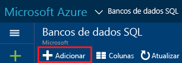

# <a name="create-an-azure-sql-database"></a>Criar um banco de dados SQL do Azure

Você pode criar um Banco de Dados SQL do Azure usando o [Portal do Azure](https://portal.azure.com/), o PowerShell, o Transact-SQL, a API REST ou a C#. 

## <a name="create-an-azure-sql-database-using-the-azure-portal"></a>Criar um Banco de Dados SQL do Azure usando o Portal do Azure

1. Abra a folha **Banco de Dados SQL** no [Portal do Azure](https://portal.azure.com/). 

    
2. Na folha dos Bancos de dados SQL, clique em **Adicionar**.

    

> [!TIP]
> Para ver um tutorial de introdução ao uso do Portal do Azure e ao uso do SQL Server Management Studio, veja [Introdução aos servidores do Banco de Dados SQL do Azure, aos bancos de dados e às regras de firewall usando o Portal do Azure e o SQL Server Management Studio](sql-database-get-started.md).
>

## <a name="create-an-azure-sql-database-using-powershell"></a>Criar um Banco de Dados SQL do Azure usando o PowerShell

Para criar um banco de dados SQL, use o cmdlet [New-AzureRmSqlDatabase](https://docs.microsoft.com/powershell/resourcemanager/azurerm.sql/v2.3.0/new-azurermsqldatabase). O grupo de recursos e o servidor precisam já existir em sua assinatura. 

```
$resourceGroupName = "resourcegroup1"
$sqlServerName = "server1"

$databaseName = "database1"
$databaseEdition = "Standard"
$databaseServiceLevel = "S0"

$currentDatabase = New-AzureRmSqlDatabase -ResourceGroupName $resourceGroupName `
 -ServerName $sqlServerName -DatabaseName $databaseName `
 -Edition $databaseEdition -RequestedServiceObjectiveName $databaseServiceLevel
```
> [!TIP]
> Para obter um script de exemplo, veja [Criar um script do PowerShell do banco de dados SQL](sql-database-get-started-powershell.md).
>

## <a name="create-an-azure-sql-database-using-transact-sql-in-sql-server-management-studio"></a>Criar um Banco de Dados SQL do Azure usando o Transact-SQL no SQL Server Management Studio

Para criar um Banco de Dados SQL usando o Transact-SQL no SQL Server Management Studio:

1. Usando o SQL Server Management Studio, conecte-se com o servidor de Banco de Dados do Azure usando o logon da entidade de segurança no nível do servidor ou um logon que seja membro da função **dbmanager**. Para obter mais informações sobre logons, consulte [Gerenciar logons](sql-database-manage-logins.md).
2. Em Pesquisador de Objetos, abra o nó Bancos de Dados, expanda a pasta **Bancos de Dados do Sistema**, clique com o botão direito do mouse em **mestre** e, em seguida, clique em **Nova Consulta**.
3. Use a instrução **CREATE DATABASE** para criar um banco de dados. Para saber mais, confira [CREATE DATABASE (Banco de dados SQL)](https://msdn.microsoft.com/library/dn268335.aspx). A instrução a seguir cria um banco de dados chamado **myTestDB** e especifica que se trata de um banco de dados da Standard S0 Edition com um tamanho padrão máximo de 250 GB.
  
      CREATE DATABASE myTestDB    (EDITION='Standard',     SERVICE_OBJECTIVE='S0');

4. Clique em **Execute** para executar a consulta.
5. No Pesquisador de Objetos, clique com botão direito do mouse no nó Bancos de Dados e clique em **Atualizar** para exibir o novo banco de dados no Pesquisador de Objetos. 

> [!TIP]
> Para ver um tutorial de introdução ao uso do Portal do Azure e ao uso do SQL Server Management Studio, veja [Introdução aos servidores do Banco de Dados SQL do Azure, aos bancos de dados e às regras de firewall usando o Portal do Azure e o SQL Server Management Studio](sql-database-get-started.md).
>

## <a name="additional-resources"></a>Recursos adicionais
* Para obter uma visão geral das ferramentas de gerenciamento, consulte [Visão geral das ferramentas de gerenciamento](sql-database-manage-overview.md).
* Para saber como realizar tarefas de gerenciamento usando o Portal do Azure, consulte [Gerenciar Bancos de Dados SQL do Azure usando o Portal do Azure](sql-database-manage-portal.md).
* Para saber como realizar tarefas de gerenciamento usando o PowerShell, consulte [Gerenciar Bancos de Dados SQL do Azure usando o PowerShell](sql-database-manage-powershell.md).
* Para saber como realizar tarefas de gerenciamento usando o SQL Server Management Studio, consulte [SQL Server Management Studio](sql-database-manage-azure-ssms.md).
* Para obter informações sobre o serviço do Banco de Dados SQL, consulte [O que é o Banco de Dados SQL](sql-database-technical-overview.md). 
* Para obter informações sobre os servidores de Banco de Dados do Azure e recursos de banco de dados, confira [Recursos](sql-database-features.md).


<!--HONumber=Dec16_HO3-->


