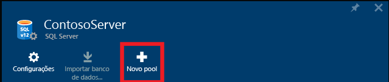
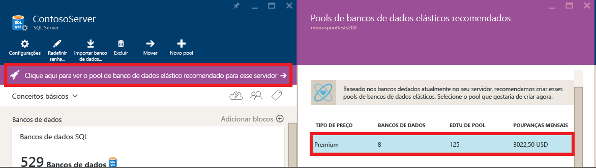
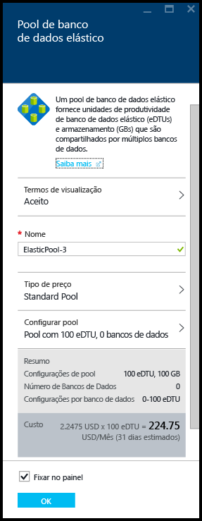
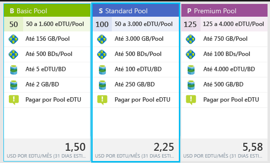
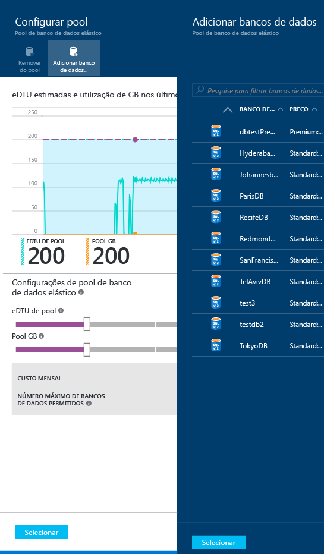
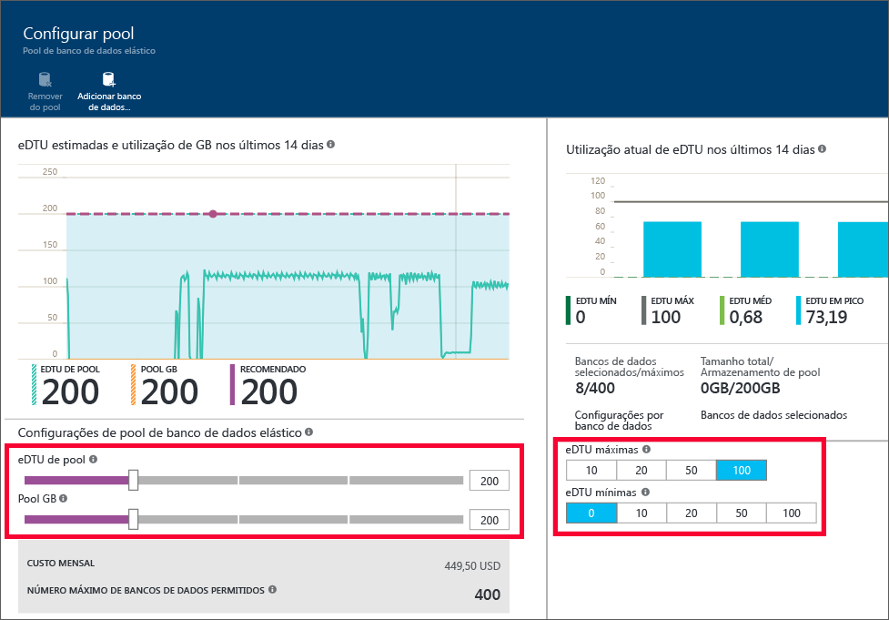

<properties
	pageTitle="Criar um novo pool elástico com o portal do Azure | Microsoft Azure"
	description="Como adicionar um pool de banco de dados elástico escalonável à sua configuração do banco de dados SQL para facilitar a administração e o compartilhamento de recursos entre vários bancos de dados."
	keywords="banco de dados escalonável, configuração do banco de dados"
	services="sql-database"
	documentationCenter=""
	authors="ninarn"
	manager="jhubbard"
	editor=""/>

<tags
	ms.service="sql-database"
	ms.devlang="NA"
	ms.date="07/20/2016"
	ms.author="ninarn"
	ms.workload="data-management"
	ms.topic="get-started-article"
	ms.tgt_pltfrm="NA"/>

# Criar um Pool de Banco de Dados Elástico com o portal do Azure

> [AZURE.SELECTOR]
- [Portal do Azure](sql-database-elastic-pool-create-portal.md)
- [PowerShell](sql-database-elastic-pool-create-powershell.md)
- [C#](sql-database-elastic-pool-create-csharp.md)

Este artigo mostra como criar um [pool de banco de dados elástico](sql-database-elastic-pool.md) escalonável com o [Portal do Azure](https://portal.azure.com/). Há duas maneiras de criar um pool. É possível fazer isso do zero, se você souber a configuração de pool que deseja, ou começar com uma recomendação do serviço. O Banco de Dados SQL possui inteligência interna que recomenda uma configuração de pool, caso ela seja mais econômica com base na telemetria de uso anterior de seus bancos de dados.

Você pode adicionar vários pools a um servidor, mas não pode adicionar bancos de dados de servidores diferentes ao mesmo pool. Para criar um pool, você precisa de pelo menos um banco de dados em um servidor V12. Se você não tiver um, consulte [Criar seu primeiro banco de dados SQL do Azure](sql-database-get-started.md). Você pode criar um pool com apenas um banco de dados, mas os pools são econômicos apenas quando há vários bancos de dados. Consulte [Considerações de preço e desempenho para um pool de banco de dados elástico](sql-database-elastic-pool-guidance.md).

> [AZURE.NOTE] Os pools só estão disponíveis com os servidores V12 do Banco de Dados SQL. Se você tiver bancos de dados em um servidor V11, poderá [Usar um script do PowerShell para identificá-los como candidatos a um pool](sql-database-elastic-pool-database-assessment-powershell.md) em um servidor V12 e, em seguida, [Usar o PowerShell para atualizar para V12 e criar um pool](sql-database-upgrade-server-powershell.md) em uma única etapa.

## Etapa 1: criar um novo pool

Este artigo mostra como criar um novo pool de uma folha de **servidor** existente no portal, que é a maneira mais fácil de mover os bancos de dados existentes para um pool.

> [AZURE.NOTE] Caso você tenha um servidor ou não, também poderá criar um novo pool desde a folha **Pools elásticos SQL** (abaixo da lista no lado esquerdo do portal, clique em **Procurar** **>** **Pools elásticos SQL**). Clicar em **+Adicionar** na folha **Pools elásticos SQL** fornece etapas para criar um novo servidor durante o fluxo de trabalho de provisionamento do pool.

1. No [portal do Azure](http://portal.azure.com/), abaixo da lista no lado esquerdo, clique em **Procurar** **>** **Servidores SQL** e clique no servidor que contém os bancos de dados que você deseja adicionar a um pool.
2. Clique em **Novo pool**.

    

    **-OU-**

    Talvez você veja uma mensagem informando que há pools de banco de dados elástico recomendados para o servidor (somente V12). Clique na mensagem para ver os pools recomendados com base na telemetria de uso histórico do banco de dados e clique na camada para ver mais detalhes e personalizar o pool. Confira [Entender as recomendações de pool](#understand-pool-recommendations) mais adiante neste tópico para saber como a recomendação é feita.

    

    A folha **Pool de Banco de Dados Elástico** aparece e é onde você irá configurar o pool. Se você tiver clicado em **Novo pool** na etapa anterior, o portal escolherá um **Pool standard** em **Tipo de preço**, um **Nome** exclusivo para o pool e uma configuração padrão para o pool. Se você escolheu um pool recomendado, a camada e a configuração recomendadas do pool já terão sido escolhidas, mas você ainda poderá alterá-las.

    

3. Especifique um nome para o pool elástico ou deixe o padrão.

## Etapa 2: escolher um tipo de preço

O tipo de preço do pool determina os recursos disponíveis para os bancos de dados elásticos no pool, o número máximo de eDTUs (MÁX DE eDTUs) e o armazenamento (GBs) disponível para cada banco de dados. Para obter detalhes, consulte Camadas de serviço.

Para alterar o tipo de preço do pool, clique em **Tipo de preço**, clique no tipo desejado e em **Selecionar**.

> [AZURE.IMPORTANT] Depois de escolher o tipo de preço e confirmar suas alterações clicando em **OK** na última etapa, não será possível alterar o tipo de preço do pool. Para alterar a camada de preços para um pool elástico existente, crie um novo pool elástico na camada de preços desejada e migre os bancos de dados elásticos para esse novo pool.

## Etapa 3: configurar o pool

Depois de definir o tipo de preço, clique em Configurar pool, onde você adicionará bancos de dados, definirá eDTUs e armazenamento do pool (GBs do pool) e onde você definirá os eDTUs mínimo e máximo para os bancos de dados elásticos no pool.

1. Clique em **Configurar pool**
2. Selecione os bancos de dados que você deseja adicionar ao pool. Esta etapa é opcional durante a criação do pool. É possível adicionar bancos de dados após a criação do pool. Para adicionar bancos de dados, clique em **Adicionar banco de dados**, clique nos bancos de dados que você deseja adicionar e clique no botão **Selecionar**.

    

    Se os bancos de dados nos quais você está trabalhando tiverem telemetria de uso histórico suficiente, o gráfico **Uso estimado de eDTU e GB** e o gráfico de barras **Uso real de eDTU** serão atualizados para ajudá-lo a tomar decisões de configuração. Além disso, o serviço pode fornecer uma mensagem de recomendação para ajudá-lo a planejar o tamanho do pool. Veja [Recomendações dinâmicas](#dynamic-recommendations).

3. Use os controles na página **Configurar pool** para explorar as configurações e configurar o pool. Confira [Limites dos pools elásticos](sql-database-elastic-pool.md#edtu-and-storage-limits-for-elastic-pools-and-elastic-databases) para saber mais sobre os limites de cada camada de serviço, e confira as [Considerações de preço e desempenho dos Pools de Banco de Dados Elástico](sql-database-elastic-pool-guidance.md) para obter uma orientação detalhada sobre o tamanho correto de um pool. Para obter mais detalhes sobre as configurações do pool, veja [Propriedades do pool de banco de dados elástico](sql-database-elastic-pool.md#elastic-database-pool-properties).

	

4. Clique em **Selecionar** na folha **Configurar Pool** depois de alterar as configurações.
5. Clique em **OK** para criar o pool.

## Entender as recomendações de pool

O serviço do Banco de Dados SQL avalia o histórico de uso e recomenda um ou mais pools quando essa alternativa for mais econômica do que usar bancos de dados individuais. Cada recomendação é configurada com um subconjunto exclusivo de bancos de dados do servidor que melhor se enquadram no pool.

A recomendação de pool inclui:

- Um tipo de preço para o pool (Basic, Standard ou Premium)
- Os **eDTUs do POOL** apropriados (também chamados de Máx. de eDTUs por pool)
- O **MÁX. DE eDTU** e o **MÍN. DE eDTU** por banco de dados
- A lista dos bancos de dados recomendados para o pool

O serviço leva em consideração os últimos 30 dias de telemetria ao recomendar os pools. Para que um banco de dados seja considerado como candidato para um pool de banco de dados elástico, ele deve existir há pelo menos 7 dias. Bancos de dados que já estão em um pool de banco de dados elástico não são considerados candidatos para as recomendações de pool de banco de dados elástico.

O serviço avalia os recursos necessários e o custo-benefício de mover os bancos de dados individuais em cada camada de serviço para os pools na mesma camada. Por exemplo, todos os bancos de dados padrão em um servidor são avaliados para sua adaptação em um pool elástico Standard. Isso significa que o serviço não faz recomendações entre camadas diferentes, como mover um banco de dados Standard para um pool Premium.

### Recomendações dinâmicas

Depois de adicionar os bancos de dados ao pool, as recomendações serão dinamicamente geradas com base no uso histórico dos bancos de dados selecionados. Essas recomendações serão mostradas no gráfico de uso de GB e de eDTU, bem como em uma faixa de recomendação na parte superior da folha **Configurar pool**. Essas recomendações devem ajudar na criação de um pool otimizado para bancos de dados específicos.

## Recursos adicionais

- [Gerenciar um pool elástico do Banco de Dados SQL com o portal](sql-database-elastic-pool-manage-portal.md)
- [Gerenciar um pool elástico do Banco de Dados SQL com o PowerShell](sql-database-elastic-pool-manage-powershell.md)
- [Gerenciar um pool elástico do Banco de Dados SQL com o C#](sql-database-elastic-pool-manage-csharp.md)
- [Escalando horizontalmente com o Banco de Dados SQL do Azure](sql-database-elastic-scale-introduction.md)

<!---HONumber=AcomDC_0727_2016-->