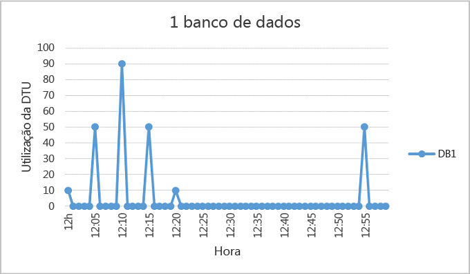
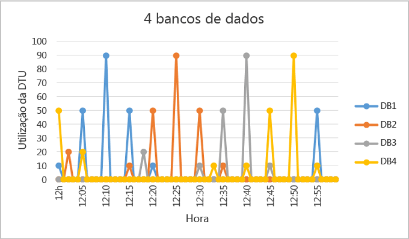
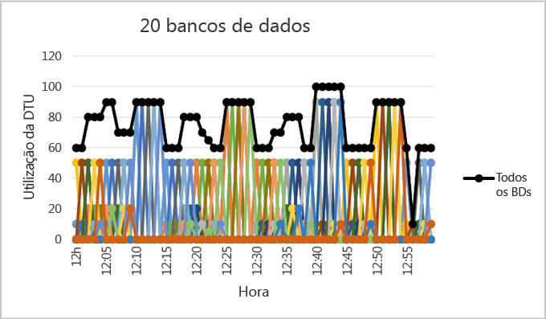

<properties
	pageTitle="Quando um Pool de Banco de Dados Elástico deve ser usado?"
	description="Um pool de bancos de dados elástico é um conjunto de recursos disponíveis compartilhados por um grupo de bancos de dados elásticos. Este documento fornece diretrizes para ajudar a avaliar a adequação do uso de um pool de banco de dados elástico para um grupo de bancos de dados."
	services="sql-database"
	documentationCenter=""
	authors="stevestein"
	manager="jhubbard"
	editor=""/>

<tags
	ms.service="sql-database"
	ms.devlang="NA"
	ms.date="08/08/2016"
	ms.author="sstein"
	ms.workload="data-management"
	ms.topic="article"
	ms.tgt_pltfrm="NA"/>

# Quando um Pool de Banco de Dados Elástico deve ser usado?
Avalie se usar um Pool de Banco de Dados Elástico é econômico com base em padrões de uso do banco de dados e diferenças de preços entre um Pool de Banco de Dados Elástico e os bancos de dados individuais. Diretrizes adicionais também são fornecidas para ajudar a determinar o tamanho do pool atual necessário para um conjunto existente de Bancos de Dados SQL.

- Para ter uma visão geral dos pools, consulte [Pools banco de dados elástico do Banco de Dados SQL](sql-database-elastic-pool.md).

> [AZURE.NOTE] Os pools elásticos estão disponíveis para o público geral (GA) em todas as regiões do Azure, exceto no Centro-Norte dos EUA e na Índia Ocidental, onde atualmente estão no modo de visualização. GA de pools elásticos nessas regiões serão fornecidos assim que possível.

## Pools de banco de dados elástico

Desenvolvedores de SaaS compilam aplicativos com base em camadas de dados de grande escala compostas por vários bancos de dados. Um padrão de aplicativo comum é provisionar um banco de dados individual para cada cliente. Mas diferentes clientes geralmente têm padrões de uso variados e imprevisíveis, e é difícil prever os requisitos de recursos de cada usuário de banco de dados individual. Assim, o desenvolvedor pode provisionar excessivamente os recursos causando despesas consideráveis para garantir uma taxa de transferência e tempos de resposta favoráveis para todos os bancos de dados. Ou então, o desenvolvedor pode gastar menos com o risco de oferecer uma experiência de baixo desempenho para seus clientes. Para saber mais sobre os padrões de design para aplicativos SaaS usando pools Elásticos, confira [Design Patterns for Multi-tenant SaaS Applications with Azure SQL Database](sql-database-design-patterns-multi-tenancy-saas-applications.md) (Padrões de Design para aplicativos de SaaS multilocatários com o Banco de Dados SQL).

Os pools elásticos no Banco de Dados SQL do Azure permitem que desenvolvedores de SaaS otimizem o desempenho de preço para um grupo de bancos de dados dentro de um orçamento prescrito oferecendo elasticidade de desempenho para cada banco de dados. Os pools permitem ao desenvolvedor comprar eDTUs (Unidades de Transação de Banco de Dados elástico) para um pool compartilhado por vários bancos de dados para acomodar períodos de uso imprevisíveis em bancos de dados individuais. O requisito de eDTU para um pool é determinado pela utilização de agregação de seus bancos de dados. A quantidade de eDTUs disponíveis para o pool é controlado pelo orçamento do desenvolvedor. Pools facilitam a tarefa de desenvolvedores ponderarem sobre o impacto do orçamento no desempenho e vice-versa para o pool. O desenvolvedor simplesmente adiciona bancos de dados ao pool, define as eDTUs mínima e máxima para os bancos de dados e define a eDTU do pool com base no seu orçamento. Um desenvolvedor pode usar pools para aumentar seu serviço com perfeição desde uma startup lean até uma empresa madura em escala cada vez maior.
## Quando considerar um pool

Pools também são indicados para um grande número de bancos de dados com padrões de utilização específicos. Para um determinado banco de dados, esse padrão é caracterizado por baixa utilização média com picos de utilização relativamente pouco frequentes.

Quanto mais bancos de dados você conseguir adicionar a um pool, maior será a sua economia. Dependendo de seu padrão de utilização do aplicativo, é possível ver economias com apenas dois bancos de dados S3.

As seções a seguir ajudam a compreender como avaliar se sua coleção específica de bancos de dados se beneficiará de estar em um pool. Os exemplos usam pools Standard, mas os mesmos princípios também se aplicam aos pools Basic e Premium.

### Avaliar os padrões de utilização do banco de dados

A figura a seguir mostra um exemplo de um banco de dados que passa muito tempo ocioso, mas também apresenta picos de atividade periodicamente. Este é um padrão de utilização bastante adequado para um pool:

   

Para o período de cinco minutos ilustrado acima, DB1 apresenta picos de até 90 DTUs, mas seu uso geral médio é inferior a cinco DTUs. Um nível de desempenho S3 é necessário para executar essa carga de trabalho em um banco de dados individual, mas isso deixa a maioria dos recursos não utilizados durante períodos de baixa atividade.

Um pool permite que essas DTUs não utilizadas sejam compartilhadas entre vários bancos de dados, reduzindo a quantidade total de DTUs necessárias e os custos gerais.

Considerando ainda o exemplo anterior, suponha que há outros bancos de dados com padrões de utilização semelhantes ao do DB1. Nas próximas duas figuras abaixo, a utilização de quatro e 20 bancos de dados é disposta no mesmo gráfico para ilustrar como sua utilização não se sobrepõe ao longo do tempo:

   

   

A utilização de DTU agregada em todos os 20 bancos de dados é ilustrada pela linha preta na figura acima. Ela mostra que a utilização de DTU agregada nunca excede 100 DTUs e indica que os 20 bancos de dados podem compartilhar 100 eDTUs durante esse período de tempo. Isso resulta em uma redução de 20x em DTUs e em uma redução de 13x no preço quando comparado à colocação de cada um dos bancos de dados nos níveis de desempenho S3 para bancos de dados individuais.

Este exemplo é ideal pelas seguintes razões:

- Há grandes diferenças entre o pico de utilização e a utilização média por banco de dados.
- O pico de utilização de cada banco de dados ocorre em diferentes momentos.
- eDTUs são compartilhados entre vários bancos de dados.

O preço de um pool é uma função das eDTUs do pool. Embora o preço unitário de eDTU para um pool seja 1,5x maior que o preço unitário de DTU para um banco de dados individual, **as eDTUs do pool podem ser compartilhadas por vários bancos de dados e, portanto, em muitos casos, menos eDTUs são necessárias no total**. Essas distinções no preço e compartilhamento de eDTU são a base do potencial de economia que os pools podem oferecer.

As seguintes regras básicas relacionadas à contagem e utilização de banco de dados ajudam a garantir que um pool ofereça um custo reduzido em comparação ao uso de níveis de desempenho de bancos de dados individuais.

### Número mínimo de bancos de dados

Se a soma das DTUs dos níveis de desempenho para bancos de dados individuais for maior que 1,5x as eDTUs necessárias para o pool, um pool elástico será mais econômico. Para ver os tamanhos disponíveis, consulte [Limites de eDTU e armazenamento para pools de banco de dados elásticos e bancos de dados elásticos](sql-database-elastic-pool.md#edtu-and-storage-limits-for-elastic-pools-and-elastic-databases).

***Exemplo***  pelo menos dois bancos de dados S3 ou 15 bancos de dados S0 são necessários para um pool de 100 eDTUs ser mais econômico do que o uso de níveis de desempenho para bancos de dados individuais.

### Número máximo de banco de dados em pico simultaneamente

Ao compartilhar eDTUs, nem todos os bancos de dados em um pool podem usar as eDTUs simultaneamente até o limite disponível ao usar níveis de desempenho de bancos de dados individuais. Quanto menos bancos de dados em pico simultaneamente, menor poderá ser o eDTU do pool e mais econômico ainda ele se torna. Em geral, no máximo 2/3 (ou 67%) dos bancos de dados no pool deve atingir o pico simultaneamente de seus limites de eDTU.

***Exemplo***  para reduzir os custos de três bancos de dados S3 em um pool com 200 eDTUs, no máximo dois desses bancos de dados podem atingir simultaneamente o pico em sua utilização. Caso contrário, se mais de dois desses quatro bancos de dados S3 entrarem em pico simultaneamente, o pool precisará ser dimensionado para mais de 200 eDTUs. E se o pool for redimensionado para mais de 200 eDTUs, mais bancos de dados S3 precisarão ser adicionados ao pool para manter os custos menores do que os níveis de desempenho de bancos de dados individuais.

Observe que esse exemplo não considera a utilização de outros bancos de dados no pool. Se todos os bancos de dados tiverem uma certa utilização em um determinado momento, menos de 2/3 (ou 67%) dos bancos de dados pode atingir o pico simultaneamente.

### Utilização de DTU por banco de dados

Uma grande diferença entre o máximo e média de utilização de um banco de dados indica longos períodos de baixa utilização e curtos períodos de alta utilização. Esse padrão de utilização é ideal para compartilhar recursos entre bancos de dados. Um banco de dados deve ser considerado para um pool quando seu pico de utilização for aproximadamente 1,5 vez maior que sua utilização média.

***Exemplo***  um banco de dados S3 com picos de 100 DTUs e que usa em média 67 DTUs, ou menos, é um bom candidato para o compartilhamento de eDTUs em um pool. Outra opção de bom candidato para um pool elástico seria um banco de dados S1 com pico de 20 DTUs e média de uso de 13 DTUs ou menos.

## Dimensionar um pool elástico

O melhor tamanho de um pool depende das eDTUs e recursos de armazenamento agregados necessários para todos os bancos de dados no pool. Isso inclui determinar a maior das quantidades a seguir:

* DTUs máximo utilizadas por todos os bancos de dados no pool.
* Bytes de armazenamento máximo utilizados por todos os bancos de dados no pool.

Para ver os tamanhos disponíveis, consulte [Limites de eDTU e armazenamento para pools de banco de dados elásticos e bancos de dados elásticos](sql-database-elastic-pool.md#edtu-and-storage-limits-for-elastic-pools-and-elastic-databases).

O Banco de Dados SQL avalia automaticamente a utilização histórica de recursos dos bancos de dados em um servidor de Banco de Dados SQL existente e recomenda a configuração de pool apropriada no portal do Azure. Além das recomendações, uma experiência interna calcula o uso de eDTU para um grupo personalizado de bancos de dados no servidor. Isso permite que você faça uma análise "e se" interativamente adicionando bancos de dados ao pool e removendo-os para obter a análise de uso de recursos e conselhos de dimensionamento antes de confirmar as alterações. Para obter instruções, confira [Monitorar, gerenciar e dimensionar um pool elástico](sql-database-elastic-pool-manage-portal.md).

Para avaliações mais flexíveis de uso de recursos que permitem estimativas de dimensionamento ad hoc para servidores anteriores ao V12, bem como estimativas de dimensionamento de bancos de dados em servidores diferentes, confira [Script do PowerShell para identificar os bancos de dados adequados para um pool de banco de dados elástico](sql-database-elastic-pool-database-assessment-powershell.md).

| Recurso | Experiência do Portal|	Script do PowerShell|
|:---------------|:----------|:----------|
| Granularidade | 15 s | 15 s
| Considera as diferenças de preço entre um pool e os níveis de desempenho para bancos de dados individuais| Sim| Não
| Permite personalizar a lista de bancos de dados analisados| Sim| Sim
| Permite personalizar o período de tempo usado na análise| Não| Sim
| Permite personalizar a lista de bancos de dados analisados entre diferentes servidores| Não| Sim
| Permite personalizar a lista de bancos de dados analisados em servidores v11| Não| Sim

Em casos em que você não pode usar as ferramentas, os procedimentos passo a passo a seguir podem ajudá-lo a estimar se um pool é mais econômico do que bancos de dados individuais:

1.	Estime as eDTUs necessárias para o pool da seguinte maneira:

    MÁX(<*número total de DBs* X *utilização de DTU média por DB*>,  <*número de DBs em pico simultaneamente* X *pico de utilização de DTU por DB*)

2.	Estime o espaço de armazenamento necessário para o pool adicionando o número de bytes necessários para todos os bancos de dados no pool. Determine o tamanho do pool em eDTU que fornece essa quantidade de armazenamento. Para ver os limites de armazenamento em pool baseados no tamanho do pool em eDTUs, confira [eDTU and storage limits for elastic database pools and elastic databases](sql-database-elastic-pool.md#edtu-and-storage-limits-for-elastic-pools-and-elastic-databases) (Limites de armazenamento e eDTU para pools de banco de dados elástico e bancos de dados elásticos).
3.	Escolha a maior entre as estimativas de eDTU das etapas 1 e 2.
4.	Consulte a [Página de preços do Banco de Dados SQL](https://azure.microsoft.com/pricing/details/sql-database/) e localize o menor pool de eDTU que seja maior que a estimativa da Etapa 3.
5.	Compare o preço do pool da Etapa 5 com o preço de usar os níveis de desempenho adequados para bancos de dados individuais.

## Resumo

Nem todos os bancos de dados individuais são candidatos ideais para pools. Bancos de dados com padrões de uso caracterizados por baixa utilização média e picos de utilização relativamente pouco frequentes são excelentes candidatos. Padrões de uso do aplicativo são dinâmicos, por isso use as informações e ferramentas descritas neste artigo e informações para fazer uma avaliação inicial para verificar se um pool é uma boa opção para alguns ou todos os bancos de dados. Este artigo é apenas um ponto de partida para ajudar a sua decisão de se um pool elástico é ou não uma boa opção. Lembre-se de que você deve monitorar continuamente o uso do recurso histórico de recursos e reavaliar constantemente os níveis de desempenho de todos os bancos de dados. Tenha em mente que você pode adicionar e remover facilmente os bancos de dados dos pool elásticos e, se tiver um grande número de bancos de dados, poderá dividir os bancos de dados em vários pools de tamanhos variados.

## Próximas etapas

- [Criar um pool de banco de dados elástico](sql-database-elastic-pool-create-portal.md)
- [Monitorar, gerenciar e dimensionar um pool de banco de dados elástico](sql-database-elastic-pool-manage-portal.md)
- [Opções e desempenho de Banco de Dados SQL: compreender o que está disponível em cada camada de serviço](sql-database-service-tiers.md)
- [Script do PowerShell para identificar os bancos de dados adequados para um pool de banco de dados elástico](sql-database-elastic-pool-database-assessment-powershell.md)

<!---HONumber=AcomDC_0921_2016-->