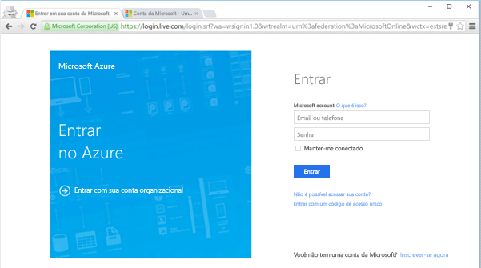
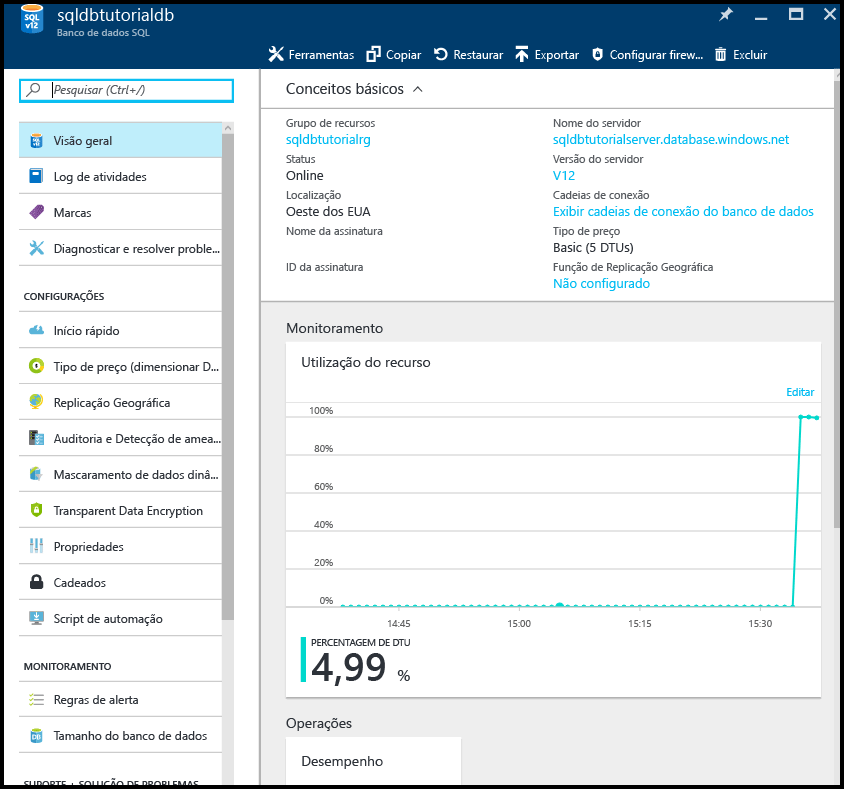
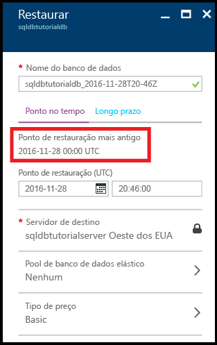
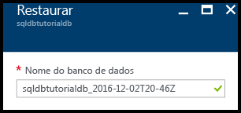
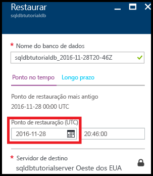
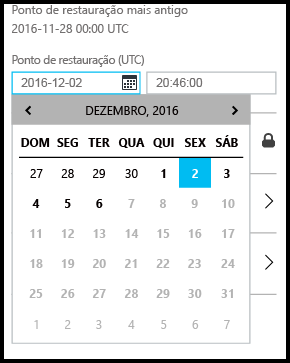
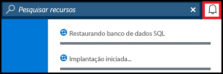
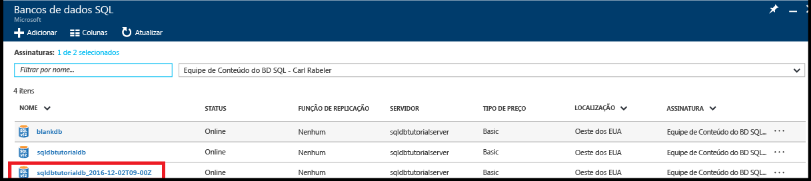
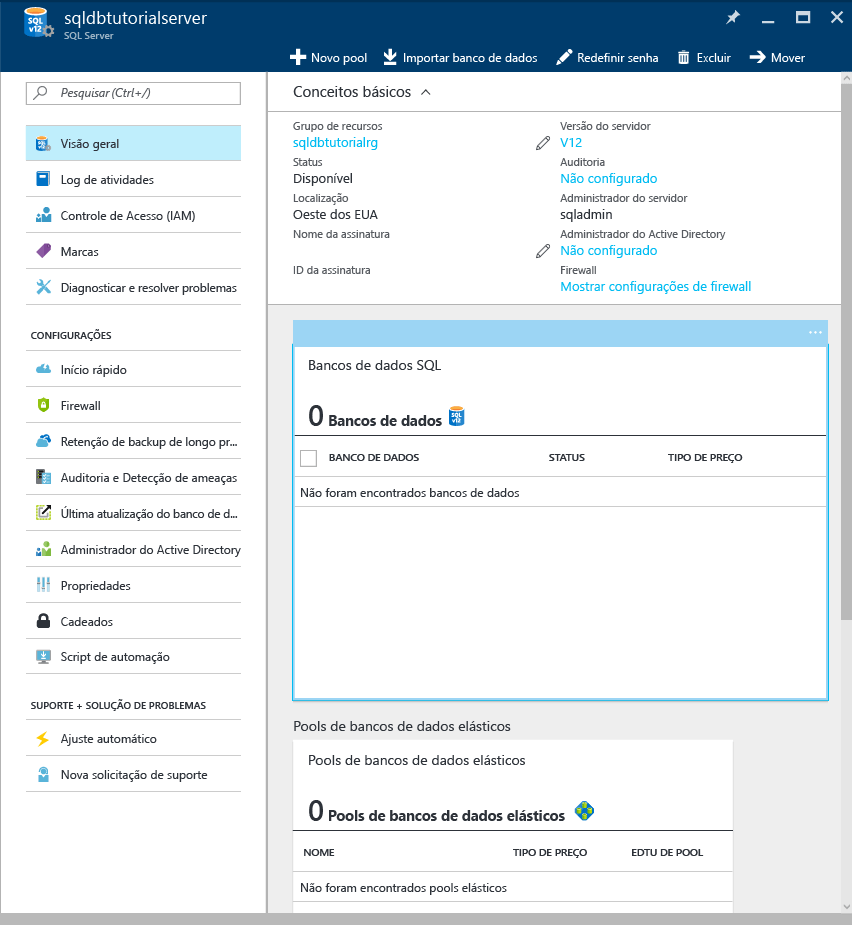
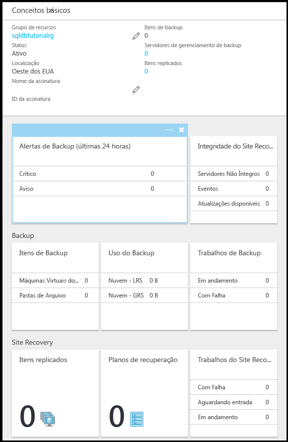

<!------------------
This topic is annotated with TEMPLATE guidelines for TUTORIAL TOPICS.

Metadata guidelines

title
    60 characters or less. Tells users clearly what they will do (deploy an ASP.NET web app to App Service). Not the same as H1. It's 60 characters or fewer including all characters between the quotes and the Microsoft Docs site identifier.

description
    115-145 characters. Duplicate of the first sentence in the introduction. This is the abstract of the article that displays under the title when searching in Bing or Google. 

    Example: "This tutorial shows how to deploy an ASP.NET web application to a web app in Azure App Service by using Visual Studio 2015."
------------------>

<!----------------

TEMPLATE GUIDELINES for tutorial topics

The tutorial topic shows users how to solve a problem using a product or service. It includes the prerequisites and steps users need to be successful.  

It is a "solve a problem" topic, not a "learn concepts" topic.

DO include this:
    • What users will do
    • What they will create or accomplish by the end of the tutorial
    • Time estimate
    • Optional but useful: Include a diagram or video. Diagrams help users see the big picture of what they are doing. A video of the steps can be used by customers as an alternative to following the steps in the topic.
    • Prerequisites: Technical expertise and software requirements
    • End-to-end steps. At the end, include next steps to deeper or related tutorials so users can learn more about the service

DON'T include this:
    • Conceptual info about the service. This info is in overview topics that you can link to in the prerequisites section if necessary

------------------->

<!------------------
GUIDELINES for the H1 
    
    The H1 should answer the question "What will I do in this topic?" Write the H1 heading in conversational language and use search keywords as much as possible. Since this is a "solve a problem" topic, make sure the title indicates that. Use a strong, specific verb like "Deploy."  
        
    Heading must use an industry standard term. If your feature is a proprietary name like "elastic pools", use a synonym. For example: "Learn about elastic pools for multi-tenant databases." In this case multi-tenant database is the industry-standard term that will be an anchor for finding the topic.

-------------------->

# Introdução ao Backup e Restauração para Proteção e Recuperação dos Dados

<!------------------
    GUIDELINES for introduction
    
    The introduction is 1-2 sentences.  It is optimized for search and sets proper expectations about what to expect in the article. It should contain the top keywords that you are using throughout the article.The introduction should be brief and to the point of what users will do and what they will accomplish. 

    In this example:
     

Sentence #1 Explains what the user will do. This is also the metadata description. 
    This tutorial shows how to deploy an ASP.NET web application to a web app in Azure App Service by using Visual Studio 2015. 

Sentence #2 Explains what users will learn and the benefit.  
    When you’re finished, you’ll have a simple web application up and running in the cloud.

-------------------->

Neste tutorial de introdução, você aprenderá a usar o portal do Azure para:

- Exibir os backups existentes de um banco de dados
- Restaurar um banco de dados em um ponto anterior no tempo
- Configurar a retenção de longo prazo de um arquivo de backup do banco de dados no cofre dos Serviços de Recuperação do Azure
- Restaurar um banco de dados a partir do cofre dos Serviços de Recuperação do Azure

**Tempo estimado**: este tutorial levará cerca de 30 minutos para concluir (supondo que você já atendeu aos pré-requisitos).

## Pré-requisitos

* Você precisa de uma conta do Azure. Você pode [abrir uma conta gratuita do Azure](/pricing/free-trial/?WT.mc_id=A261C142F) ou [Ativar os benefícios de assinante do Visual Studio](/pricing/member-offers/msdn-benefits-details/?WT.mc_id=A261C142F). 

* Você deve ser capaz de se conectar ao portal do Azure usando uma conta que seja membro da função de colaborador ou proprietário da assinatura. Para obter mais informações sobre o controle de acesso baseado em função (RBAC), confira [Introdução ao gerenciamento de acesso no Portal do Azure](../active-directory/role-based-access-control-what-is.md).

* Você concluiu a [Introdução aos servidores do Banco de Dados SQL do Azure, bancos de dados e regras de firewall usando o portal do Azure e o SQL Server Management Studio](sql-database-get-started.md) ou a versão equivalente do [PowerShell](sql-database-get-started-powershell.md) deste tutorial. Do contrário, conclua este tutorial de pré-requisito ou execute o script do PowerShell no final da [versão do PowerShell](sql-database-get-started-powershell.md) deste tutorial antes de continuar.

<!------------------
> [!TIP]
> You can perform these same tasks in a getting started tutorial by using either [C#](sql-database-get-started-csharp.md) or [PowerShell](sql-database-get-started-powershell.md).
>
-------------------->

## Entrar usando sua conta existente
Usando a [assinatura existente](https://account.windowsazure.com/Home/Index), siga estas etapas para se conectar ao portal do Azure.

1. Abra seu navegador preferido e conecte-se ao [portal do Azure](https://portal.azure.com/).
2. Entre no [Portal do Azure](https://portal.azure.com/).
3. Na página **Entrar** , forneça as credenciais da sua assinatura.
   
   

## Exibir o ponto de restauração mais antigo a partir dos backups gerados pelo serviço de um banco de dados

Nesta seção do tutorial, você exibe informações sobre o ponto de restauração mais antigo dos [backups automatizados gerados pelo serviço](sql-database-automated-backups.md) do banco de dados. 

1. Abra a folha **Banco de dados SQL** de seu banco de dados, **sqldbtutorialdb**.

    

2. Na barra de ferramentas, clique em **Restaurar**.

    

3. Na folha Restaurar, examine o ponto de restauração mais antigo.

    

## Restaurar um banco de dados em um ponto anterior no tempo

Nesta seção do tutorial, você restaura o banco de dados para um novo banco de dados a partir de um ponto específico no tempo.

1. Na folha **Restaurar** do banco de dados, examine o nome padrão do novo banco de dados para o qual restaurar o banco de dados em um ponto anterior no tempo (o nome é o nome do banco de dados existente anexado com um carimbo de data e hora). Esse nome muda para refletir a hora especificada nas próximas etapas.

    

2. Clique no ícone do **calendário** na caixa de entrada **Restaurar ponto (UTC)**.

    

2. No calendário, selecione uma data dentro do período de retenção

    

3. Na caixa de entrada **Restaurar ponto (UTC)**, especifique a hora na data selecionada para a qual você deseja restaurar os dados no banco de dados a partir dos backups automatizados do banco de dados.

    

    >[!NOTE]
    >Observe que o nome do banco de dados foi alterado para refletir a data e hora selecionadas. Observe também que você não pode alterar o servidor no qual está restaurando para um ponto específico no tempo. Para restaurar em um servidor diferente, use a [Restauração Geográfica](sql-database-disaster-recovery.md#recover-using-geo-restore). Finalmente, observe que você pode restaurar em um [pool elástico](sql-database-elastic-jobs-overview.md) ou em um tipo de preços diferente. 
    >

4. Clique em **OK** para restaurar seu banco de dados em um ponto anterior no tempo para o novo banco de dados.

5. Na barra de ferramentas, clique no ícone de notificação para exibir o status do trabalho de restauração.

    

6. Quando o trabalho de restauração for concluído, abra a folha **Bancos de dados SQL** para exibir o banco de dados recém-restaurado.

    

   > [!NOTE]
   > A partir daqui, você pode conectar o banco de dados restaurado usando o SQL Server Management Studio para executar as tarefas necessárias, tais como, [extrair um pouco de dados do banco de dados restaurado para copiar para o banco de dados existente ou excluir o banco de dados existente e renomear o banco de dados restaurado com o nome do banco de dados existente](sql-database-recovery-using-backups.md#point-in-time-restore).
   >

## Configurar a retenção de longo prazo dos backups automatizados em um cofre dos Serviços de Recuperação do Azure 

Nesta seção do tutorial, você [configura um cofre dos Serviços de Recuperação do Azure para manter os backups automatizados](sql-database-long-term-retention.md) por um período maior que o período de retenção da camada de serviços. 

1. Abra a folha **SQL Server** de seu servidor, **sqldbtutorialserver**.

    

2. Clique em **Retenção de backup de longo prazo**.

   

3. Na folha **sqldbtutorial - retenção de backup de longo prazo**, revise e aceite os termos da visualização (a menos que você já tenha feito isso - ou este recurso não esteja mais na visualização).

   

4. Para configurar a retenção de backup de longo prazo do banco de dados sqldbtutorialdb, selecione esse banco de dados na grade, em seguida, clique em **Configurar** na barra de ferramentas.

   

5. Na folha **Configurar**, clique em **Configurar as definições necessárias** em **Cofre do serviço de recuperação**.

   

6. Na folha **Cofre dos Serviços de Recuperação**, selecione um cofre existente, se houver. Caso contrário, se nenhum cofre dos serviços de recuperação for encontrado para sua assinatura, clique para sair do fluxo e crie um cofre dos serviços de recuperação.

   

7. Na folha **Cofres dos Serviços de Recuperação**, clique em **Adicionar**.

   
   
8. Na folha **Cofre dos Serviços de Recuperação**, forneça um nome válido para o novo cofre dos Serviços de Recuperação.

   

9. Selecione sua assinatura e grupo de recursos, em seguida, selecione o local do cofre. Quando terminar, clique em **Criar**.

   

   > [!IMPORTANT]
   > O cofre deve estar localizado na mesma região do servidor lógico do SQL Azure e deve usar o mesmo grupo de recursos como o servidor lógico.
   >

10. Depois do novo cofre ser criado, execute as etapas necessárias para retornar para a folha **Cofre dos Serviços de Recuperação**.

11. Na folha **Cofre dos serviços de recuperação**, clique no cofre, em seguida, clique em **Selecionar**.

   

12. Na folha **Configurar**, forneça um nome válido para a nova política de retenção, modifique a política de retenção padrão conforme apropriado, em seguida, clique em **OK**.

   

13. Na folha **sqldbtutorial - retenção de backup de longo prazo**, clique em **Salvar**, em seguida, clique em **OK** para aplicar a política de retenção de backup de longo prazo em todos os bancos de dados selecionados.

   

14. Clique em **salvar** para habilitar a retenção de backup a longo prazo, usando essa nova política no cofre de serviços de recuperação do Azure que você configurou.

   

15. Após a habilitação da retenção de backup de longo prazo, abra a folha **sqldbtutorialvault** (vá para **Todos os recursos** e selecione na lista de recursos de sua assinatura).

   

   > [!IMPORTANT]
   > Uma vez configurados, os backups aparecerão no cofre nos próximos sete dias. Não continue neste tutorial até que os backups apareçam no cofre.
   >

## Exibir backups na retenção de longo prazo

Nesta seção do tutorial, você exibe informações sobre os backups do banco de dados na [retenção de backup de longo prazo](sql-database-long-term-retention.md). 

1. Abra a folha **sqldbtutorialvault** (vá para **Todos os recursos** e selecione na lista de recursos de sua assinatura) para exibir a quantidade de armazenamento usada por seus backups do banco de dados no cofre.

   

2. Abra a folha **Banco de dados SQL** de seu banco de dados, **sqldbtutorialdb**.

    

3. Na barra de ferramentas, clique em **Restaurar**.

    

4. Na folha Restaurar, clique em **Longo prazo**.

5. Nos backups do cofre do Azure, clique em **Selecionar um backup** para exibir os backups do banco de dados disponíveis na retenção de backup de longo prazo.

    

## Restaurar um banco de dados a partir de um backup na retenção de backup de longo prazo

Nesta seção do tutorial, você restaura o banco de dados para um novo banco de dados a partir de um backup no cofre dos Serviços de Recuperação do Azure.

1. Na folha **Backups do cofre do Azure**, clique no backup para restaurar, em seguida, clique em **Selecionar**.

    

2. Na caixa de texto **Nome do banco de dados**, forneça o nome do banco de dados restaurado.

    

3. Clique em **OK** para restaurar seu banco de dados a partir do backup no cofre para o novo banco de dados.

4. Na barra de ferramentas, clique no ícone de notificação para exibir o status do trabalho de restauração.

    

5. Quando o trabalho de restauração for concluído, abra a folha **Bancos de dados SQL** para exibir o banco de dados recém-restaurado.

    

   > [!NOTE]
   > A partir daqui, você pode conectar o banco de dados restaurado usando o SQL Server Management Studio para executar as tarefas necessárias, tais como, [extrair um pouco de dados do banco de dados restaurado para copiar para o banco de dados existente ou excluir o banco de dados existente e renomear o banco de dados restaurado com o nome do banco de dados existente](sql-database-recovery-using-backups.md#point-in-time-restore).
   >

<!--**Next steps**: *Reiterate what users have done, and give them interesting and useful next steps so they want to go on.*-->

## Próximas etapas

- Para saber mais sobre os backups automáticos gerados pelo serviço, consulte [backups automáticos](: https://azure.microsoft.com/en-us/documentation/articles/)sql-database-automated-backups.MD)
- Para saber mais sobre a retenção de backup de longo prazo, consulte [retenção de backup de longo prazo](sql-database-long-term-retention.md)
- Para saber mais sobre a restauração a partir de backups, consulte [restaurar a partir do backup](sql-database-recovery-using-backups.md)

<!--HONumber=Dec16_HO2-->

