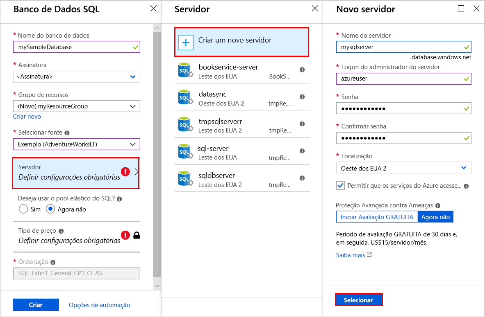
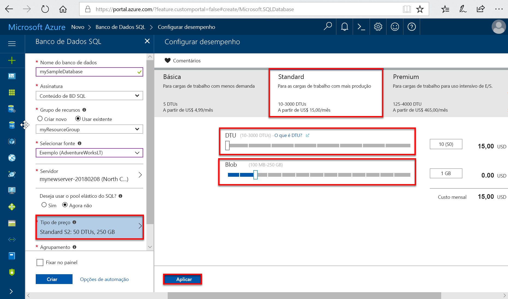
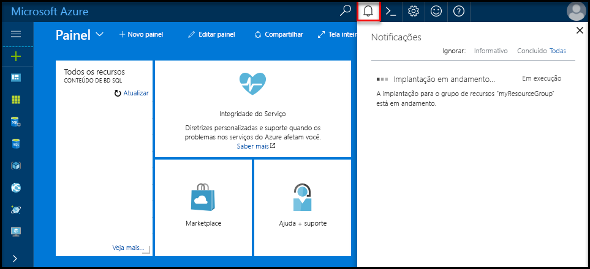
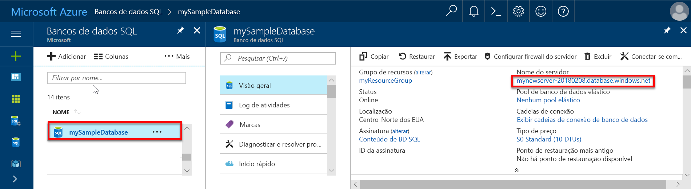
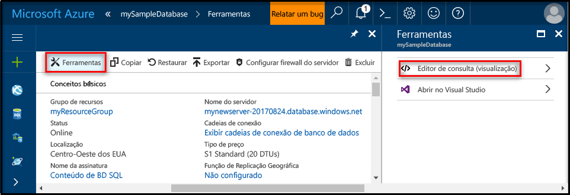
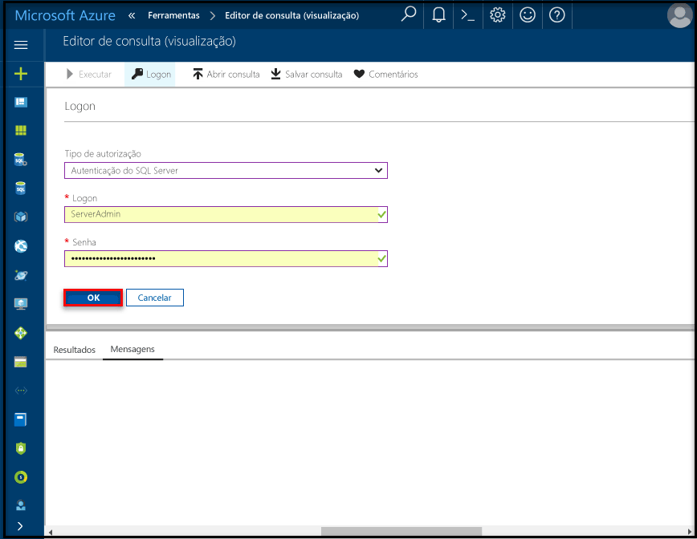
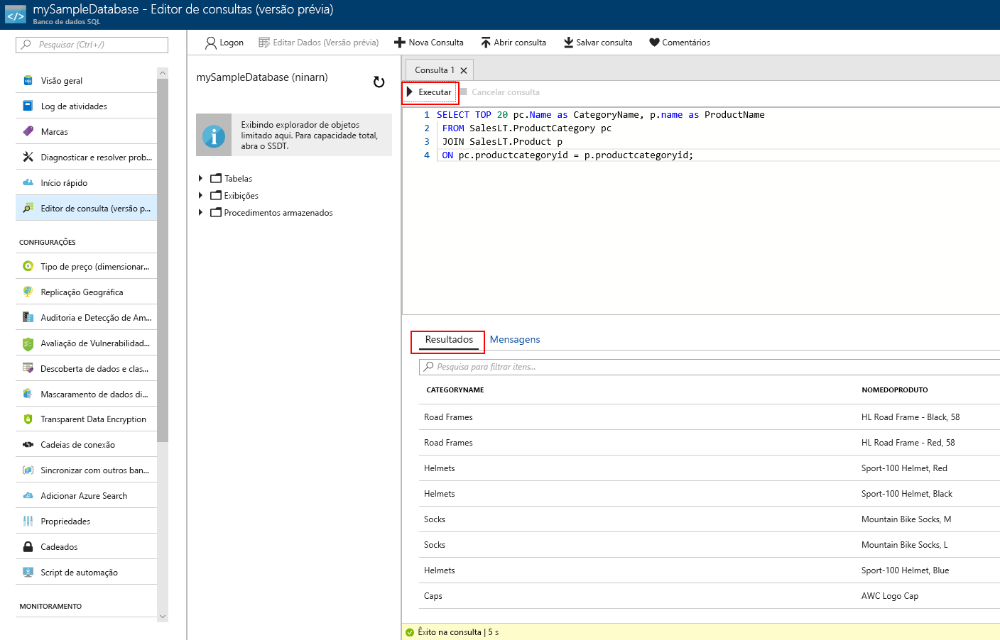

# <a name="create-an-azure-sql-database-in-the-azure-portal"></a>Criar um Banco de Dados SQL do Azure no portal do Azure

Este tutorial de início rápido percorre como criar um banco de dados SQL no Azure. O Banco de Dados SQL do Azure é uma oferta de "Banco de Dados como Serviço" que permite executar e dimensionar os bancos de dados do SQL Server altamente disponíveis na nuvem. Este guia rápido mostra como começar criando um banco de dados SQL com o portal do Azure.

Se você não tiver uma assinatura do Azure, crie uma conta [gratuita](https://azure.microsoft.com/free/) antes de começar.

## <a name="log-in-to-the-azure-portal"></a>Faça logon no Portal do Azure

Faça logon no [Portal do Azure](https://portal.azure.com/).

## <a name="create-a-sql-database"></a>Criar um banco de dados SQL

Um banco de dados SQL do Azure é criado com um conjunto definido de [recursos de computação e armazenamento](sql-database-service-tiers.md). O banco de dados é criado dentro de um [grupo de recursos do Azure](../azure-resource-manager/resource-group-overview.md) e em um [servidor lógico de banco de dados SQL do Azure](sql-database-features.md). 

Execute estas etapas para criar um Banco de Dados SQL que contém os dados de exemplo do Adventure Works LT. 

1. Clique no botão **Novo** no canto superior esquerdo do Portal do Azure.

2. Selecione **Bancos de Dados** na página **Novo** e selecione **Criar** em **Banco de Dados SQL** na página **Novo**.

   

3. Preencha o formulário do Banco de Dados SQL com as informações abaixo, conforme mostrado na imagem anterior:   

   | Configuração       | Valor sugerido | Descrição | 
   | ------------ | ------------------ | ------------------------------------------------- | 
   | **Nome do banco de dados** | mySampleDatabase | Para ver os nomes do banco de dados válidos, consulte [Identificadores do Banco de Dados](https://docs.microsoft.com/en-us/sql/relational-databases/databases/database-identifiers). | 
   | **Assinatura** | Sua assinatura  | Para obter detalhes sobre suas assinaturas, consulte [Assinaturas](https://account.windowsazure.com/Subscriptions). |
   | **Grupo de recursos**  | myResourceGroup | Para ver os nomes do grupo de recursos válidos, consulte [Regras e restrições de nomenclatura](https://docs.microsoft.com/azure/architecture/best-practices/naming-conventions). |
   | **Fonte da origem** | Exemplo (AdventureWorksLT) | Carrega o esquema AdventureWorksLT e os dados no novo banco de dados |

   > [!IMPORTANT]
   > Você deve selecionar o banco de dados de exemplo neste formulário porque ele é usado no restante deste início rápido.
   > 

4. Em **Servidor**, clique em **Definir configurações obrigatórias** e preencha o formulário do SQL Server (servidor lógico) com as informações abaixo, conforme mostrado na imagem a seguir:   

   | Configuração       | Valor sugerido | Descrição | 
   | ------------ | ------------------ | ------------------------------------------------- | 
   | **Nome do servidor** | Qualquer nome exclusivo globalmente | Para ver os nomes do servidor válidos, consulte [Regras e restrições de nomenclatura](https://docs.microsoft.com/azure/architecture/best-practices/naming-conventions). | 
   | **Logon de administrador do servidor** | Qualquer nome válido | Para ver os nomes de logon válidos, consulte [Identificadores do Banco de Dados](https://docs.microsoft.com/en-us/sql/relational-databases/databases/database-identifiers). |
   | **Senha** | Qualquer senha válida | Sua senha deve ter, pelo menos, oito caracteres e deve conter caracteres de três das seguintes categorias: caracteres com letras maiúsculas, letras minúsculas, números e caracteres não alfanuméricos. |
   | **Assinatura** | Sua assinatura | Para obter detalhes sobre suas assinaturas, consulte [Assinaturas](https://account.windowsazure.com/Subscriptions). |
   | **Grupo de recursos** | myResourceGroup | Para ver os nomes do grupo de recursos válidos, consulte [Regras e restrições de nomenclatura](https://docs.microsoft.com/azure/architecture/best-practices/naming-conventions). |
   | **Localidade** | Qualquer local válido | Para obter mais informações sobre as regiões, consulte [Regiões do Azure](https://azure.microsoft.com/regions/). |

   > [!IMPORTANT]
   > O logon de administrador do servidor e a senha que você especificar aqui são necessárias para fazer logon no servidor e em seus bancos de dados mais tarde neste início rápido. Lembre-se ou registre essas informações para o uso posterior. 
   >  

   

5. Quando tiver concluído o formulário, clique em **Selecionar**.

6. Clique em **Tipo de preço** para especificar a camada de serviço, o número de DTUs e a quantidade de armazenamento. Explore as opções para a quantidade de DTUs e o armazenamento disponível em cada camada de serviço. 

   > [!IMPORTANT]
   > \* Tamanhos de armazenamento maiores que a quantidade de armazenamento incluída estão em versão prévia e aplicam-se custos extras. Para obter detalhes, confira [Preços de Banco de Dados SQL](https://azure.microsoft.com/pricing/details/sql-database/). 
   >
   >\* Na camada Premium, mais de 1 TB de armazenamento está atualmente disponível nas seguintes regiões: Leste dos EUA 2, Oeste dos EUA, Gov. EUA - Virgínia, Europa Ocidental, Alemanha Central, Sudeste Asiático, Leste do Japão, Leste da Austrália, Canadá Central e Leste do Canadá. Consulte [Limitações atuais de P11-P15](sql-database-resource-limits.md#single-database-limitations-of-p11-and-p15-when-the-maximum-size-greater-than-1-tb).  
   > 

7. Para este tutorial de início rápido, selecione a camada de serviço **Standard** e use o controle deslizante para selecionar **100 DTUs (S3)** e **400** GB de armazenamento.

   

8. Aceite os termos da versão prévia para usar a opção **Armazenamento Complementar**. 

   > [!IMPORTANT]
   > \* Tamanhos de armazenamento maiores que a quantidade de armazenamento incluída estão em versão prévia e aplicam-se custos extras. Para obter detalhes, confira [Preços de Banco de Dados SQL](https://azure.microsoft.com/pricing/details/sql-database/). 
   >
   >\* Na camada Premium, mais de 1 TB de armazenamento está atualmente disponível nas seguintes regiões: Leste dos EUA 2, Oeste dos EUA, Gov. EUA - Virgínia, Europa Ocidental, Alemanha Central, Sudeste Asiático, Leste do Japão, Leste da Austrália, Canadá Central e Leste do Canadá. Consulte [Limitações atuais de P11-P15](sql-database-resource-limits.md#single-database-limitations-of-p11-and-p15-when-the-maximum-size-greater-than-1-tb).  
   > 

9. Depois de selecionar a camada de servidor, o número de DTUs e a quantidade de armazenamento, clique em **Aplicar**.  

10. Agora que você concluiu o formulário do Banco de Dados SQL, clique em **Criar** para provisionar o banco de dados. O provisionamento demora alguns minutos. 

11. Na barra de ferramentas, clique em **Notificações** para monitorar o processo de implantação.
    
     

## <a name="create-a-server-level-firewall-rule"></a>Criar uma regra de firewall no nível de servidor

O serviço do Banco de Dados SQL cria um firewall no nível do servidor impedindo que os aplicativos e ferramentas externos conectem o servidor ou os bancos de dados no servidor, a menos que uma regra de firewall seja criada para abrir o firewall para endereços IP específicos. Execute estas etapas a fim de criar uma [regra de firewall no nível do servidor do Banco de Dados SQL](sql-database-firewall-configure.md) para o endereço IP do seu cliente e habilitar a conectividade externa por meio do firewall do Banco de Dados SQL somente para seu endereço IP. 

> [!NOTE]
> O Banco de Dados SQL se comunica pela porta 1433. Se você estiver tentando conectar-se a partir de uma rede corporativa, o tráfego de saída pela porta 1433 poderá não ser permitido pelo firewall de sua rede. Se isto acontecer, você não poderá conectar o servidor do Banco de Dados SQL do Azure, a menos que o departamento de TI abra a porta 1433.
>

1. Depois da implantação ser concluída, clique em **Bancos de dados SQL** no menu à esquerda, depois, clique em **mySampleDatabase** na página **Bancos de dados SQL**. A página de visão geral de seu banco de dados é aberta, mostrando o nome totalmente qualificado do servidor (como **mynewserver-20170824.database.windows.net**) e fornece opções para configurações adicionais. 

2. Copie esse nome do servidor totalmente qualificado para se conectar ao servidor e a seus bancos de dados nos próximos guias de início rápido. 

    

3. Clique em **Definir o firewall do servidor** na barra de ferramentas, conforme mostrado na imagem anterior. A página **Configurações do firewall** do servidor de Banco de Dados SQL é aberta. 

    

4. Clique em **Adicionar IP do cliente** na barra de ferramentas para adicionar seu endereço IP atual a uma nova regra de firewall. Uma regra de firewall pode abrir a porta 1433 para um único endereço IP ou um intervalo de endereços IP.

5. Clique em **Salvar**. Uma regra de firewall no nível do servidor é criada para a porta de abertura 1433 de seu endereço IP atual no servidor lógico.

6. Clique em **OK**, em seguida, feche a página **Configurações do Firewall**.

Agora, você pode conectar o servidor do Banco de Dados SQL e seus bancos de dados usando o SQL Server Management Studio ou outra ferramenta de sua escolha neste endereço IP usando a conta do administrador do servidor criada anteriormente.

> [!IMPORTANT]
> Por padrão, o acesso através do firewall do Banco de Dados SQL está habilitado para todos os serviços do Azure. Clique em **DESATIVAR** nesta página para desabilitar todos os serviços do Azure.
>

## <a name="query-the-sql-database"></a>Consultar o Banco de Dados SQL

Agora que você criou um banco de dados de exemplo no Azure, usaremos a ferramenta de consulta interna no portal do Azure para confirmar que você pode conectar o banco de dados e consultar os dados. 

1. Na página de Banco de Dados SQL do seu banco de dados, clique em **Ferramentas** na barra de ferramentas e clique em **Editor de consultas (versão prévia)**.

    

2. Marque a caixa de seleção **Termos da versão prévia** e clique em **OK**. A página do Editor de consulta é aberta.

3. Clique em **Logon**, revise as informações de logon e clique em **OK** para se conectar usando a autenticação do SQL Server com o logon e a senha de administrador do servidor criados anteriormente.

    

4. Clique em **OK** para fazer logon.

5. Depois de autenticado como **ServerAdmin**, digite a consulta a seguir no painel do editor de consulta.

   ```sql
   SELECT TOP 20 pc.Name as CategoryName, p.name as ProductName
   FROM SalesLT.ProductCategory pc
   JOIN SalesLT.Product p
   ON pc.productcategoryid = p.productcategoryid;
   ```

6. Clique em **Executar** e reveja os resultados da consulta no painel **Resultados**.

   

7. Feche o **Editor de consultas**, clique em **OK** para descartar as edições não salvas e feche a página **Ferramentas**.

## <a name="clean-up-resources"></a>Limpar recursos

Salvar esses recursos se você deseja ir para as [Próximas etapas](#next-steps) e saiba como se conectar e consultar o banco de dados usando vários métodos diferentes. No entanto, se você deseja excluir os recursos criados neste início rápido, use as etapas a seguir. 


1. No menu à esquerda no Portal do Azure, clique em **Grupos de recursos** e clique em **myResourceGroup**. 
2. Em sua página de grupo de recursos, clique em **Excluir**, digite **myResourceGroup** na caixa de texto e clique **Excluir**.

## <a name="next-steps"></a>Próximas etapas

Agora que você tem um banco de dados, você pode se conectar e consultar usando suas ferramentas favoritas. Saiba mais escolhendo sua ferramenta abaixo:

- [SQL Server Management Studio](sql-database-connect-query-ssms.md)
- [Visual Studio Code](sql-database-connect-query-vscode.md)
- [.NET](sql-database-connect-query-dotnet.md)
- [PHP](sql-database-connect-query-php.md)
- [Node.js](sql-database-connect-query-nodejs.md)
- [Java](sql-database-connect-query-java.md)
- [Python](sql-database-connect-query-python.md)
- [Ruby](sql-database-connect-query-ruby.md)
