<properties
	pageTitle="Tutorial do Banco de Dados SQL: Criar um banco de dados SQL | Microsoft Azure"
	description="Saiba como configurar um servidor lógico do Banco de Dados SQL, regra de firewall do servidor, banco de dados SQL e dados de exemplo. Além disso, saiba como conectar com as ferramentas do cliente, configurar usuários e configurar uma regra de firewall do banco de dados."
	keywords="tutorial do banco de dados SQL, criar um banco de dados SQL"
	services="sql-database"
	documentationCenter=""
	authors="CarlRabeler"
	manager="jhubbard"
	editor=""/>

<tags
	ms.service="sql-database"
	ms.workload="data-management"
	ms.tgt_pltfrm="na"
	ms.devlang="na"
	ms.topic="hero-article"
	ms.date="09/07/2016"
	ms.author="carlrab"/>

# Tutorial do Banco de Dados SQL: criar um banco de dados SQL em minutos usando o portal do Azure

> [AZURE.SELECTOR]
- [Portal do Azure](sql-database-get-started.md)
- [C#](sql-database-get-started-csharp.md)
- [PowerShell](sql-database-get-started-powershell.md)

Neste tutorial, você aprenderá a usar o portal do Azure para:

- Criar um Banco de Dados SQL do Azure com dados de exemplo.
- Crie uma regra de firewall de nível de servidor para um único endereço IP ou para um intervalo de endereços IP.

Você pode executar as mesmas tarefas usando o [C#](sql-database-get-started-csharp.md) ou o [PowerShell](sql-database-get-started-powershell.md).

[AZURE.INCLUDE [Logon](../../includes/azure-getting-started-portal-login.md)]

## Criar seu primeiro banco de dados SQL do Azure 

1. Se você não estiver conectado, conecte-se ao [Portal do Azure](http://portal.azure.com).
2. Clique em **Novo**, clique em **Dados + Armazenamento** e localize o **Banco de Dados SQL**.

    

3. Clique em **Banco de Dados SQL** para abrir a folha Banco de Dados SQL. O conteúdo dessa folha varia dependendo da quantidade das assinaturas e dos objetos existentes (como servidores existentes).

    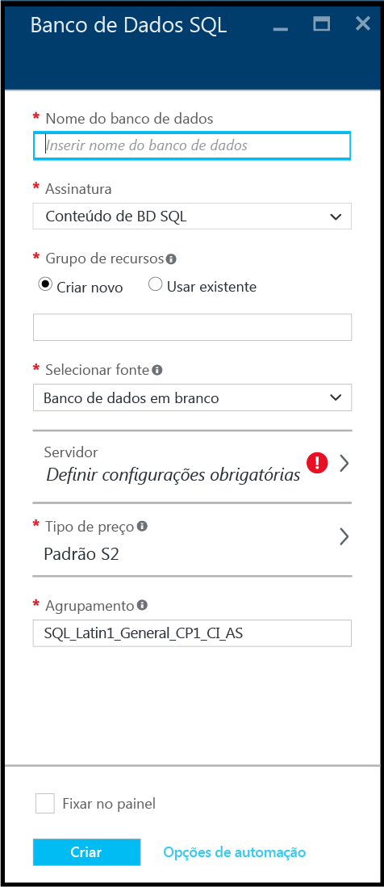

4. Na caixa de texto **Nome do banco de dados**, forneça um nome para o seu primeiro banco de dados, como "meu-bancodedados". Uma marca de seleção verde indica que você forneceu um nome válido.

    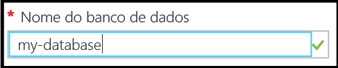

5. Se você tiver várias assinaturas, selecione uma.
6. Em **Grupo de recursos**, clique em **Criar novo** e forneça um nome para seu primeiro grupo de recursos, como "meu-grupoderecursos". Uma marca de seleção verde indica que você forneceu um nome válido.

    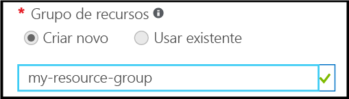

7. Em **Selecionar fonte**, clique em **Exemplo** e, em **Selecionar exemplo**, clique em **AdventureWorksLT [V12]**.

    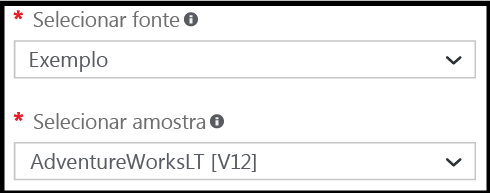

8. Em **Servidor**, clique em **Definir configurações obrigatórias**.

    

9. Na folha Servidor, clique em **Criar um novo servidor**. Um Banco de Dados SQL do Azure é criado em um objeto de servidor, que pode ser tanto um novo servidor quanto um existente.

    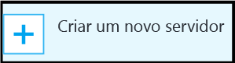

10. Examine a folha **Novo servidor** para entender as informações que você precisa fornecer para o novo servidor.

    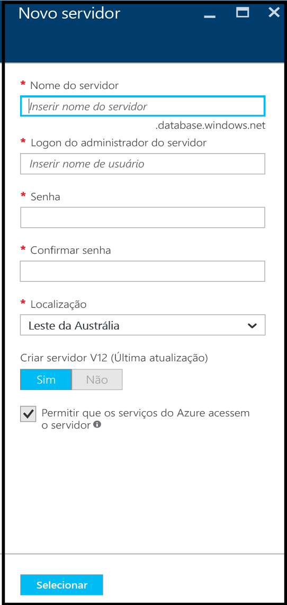

11. Na caixa de texto **Nome do servidor**, forneça um nome para seu primeiro servidor, como "meu-novo-objetodeservidor". Uma marca de seleção verde indica que você forneceu um nome válido.

    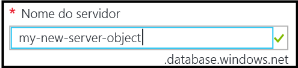
 
12. Em **Logon de administrador do servidor**, forneça um nome de usuário para o logon de administrador do servidor, como "minha\_contadeadministrador". Esse logon é conhecido como o logon principal do servidor. Uma marca de seleção verde indica que você forneceu um nome válido.

    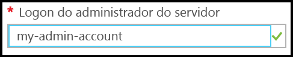

13. Em **Senha** e em **Confirmar senha**, forneça uma senha para a conta de logon principal do servidor, como "s3nh@". Uma marca de seleção verde indica que você forneceu uma senha válida.

    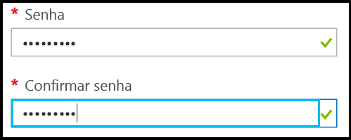
 
14. Em **Local**, selecione um data center apropriado para seu local, como "Leste da Austrália".

    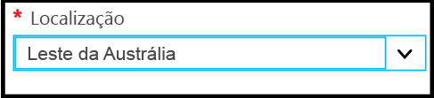

15. Em **Criar servidor V12 (última atualização), observe que você só tem a opção de criar uma versão atual do Azure SQL Server.

    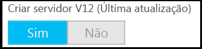

16. Observe que, por padrão, a caixa de seleção **Permitir que os serviços do azure acessem o servidor** está marcada e não pode ser alterada aqui. Essa é uma propriedade avançada. Você pode alterar essa configuração nas configurações de firewall do servidor para o objeto de servidor, embora na maioria dos cenários isso não seja necessário.

    

17. Na folha Novo servidor, revise suas escolhas e clique em **Selecionar** a fim de escolher esse novo servidor para o novo banco de dados.

    

18. Na folha Banco de Dados SQL, em **Tipo de preço**, clique em **S2 Standard** e clique em **Básico** para escolher o tipo de preço menos dispendioso para seu primeiro banco de dados. Você sempre pode alterar o tipo de preço mais tarde.

    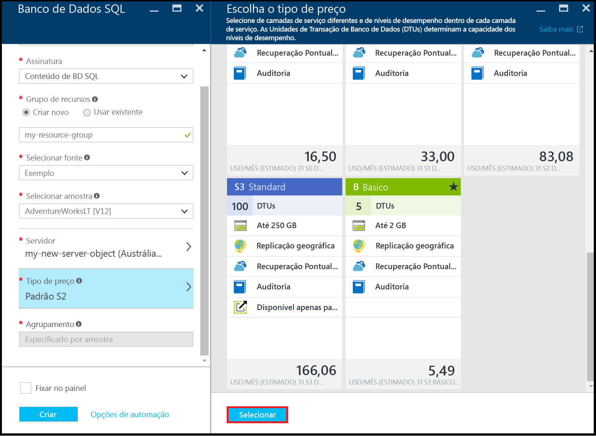

19. Na folha Banco de Dados SQL, examine suas escolhas e clique em **Criar** para criar seus primeiros servidor e banco de dados. Os valores que você forneceu são validados e a implantação é iniciada.

    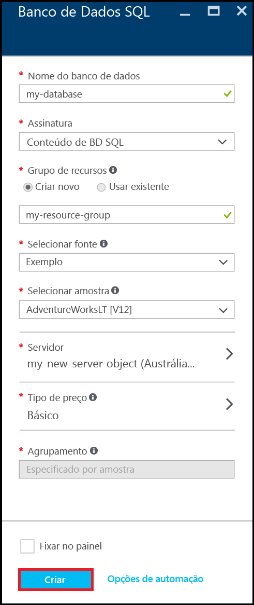

20. Na barra de ferramentas da portal, clique nos itens **Notificações** para verificar o status da implantação.

    

>[AZURE.IMPORTANT]Quando a implantação for concluída, os novos servidor e banco de dados do Azure SQL são criados no Azure. Você não poderá se conectar a seu novo servidor ou banco de dados usando as ferramentas do SQL Server enquanto não criar uma regra de firewall de servidor para abrir o firewall do Banco de Dados SQL para conexões de fora do Azure.

[AZURE.INCLUDE [Criar regra de firewall de servidor](../../includes/sql-database-create-new-server-firewall-portal.md)]

## Próximas etapas
Agora que você concluiu este tutorial do Banco de Dados SQL e criou um banco de dados com alguns dados de exemplo, está pronto para explorar usando suas ferramentas favoritas.

- Se você estiver familiarizado com o Transact-SQL e o SQL Server Management Studio (SSMS), saiba como [Conectar e consultar um banco de dados SQL com o SSMS](sql-database-connect-query-ssms.md).

- Se você conhece o Excel, saiba como [Conectar um banco de dados SQL no Azure com o Excel](sql-database-connect-excel.md).

- Se você estiver pronto para começar a codificar, escolha a linguagem de programação em [Bibliotecas de conexão para Banco de Dados SQL e SQL Server](sql-database-libraries.md).

- Se você quiser mover seus bancos de dados SQL Server locais para o Azure, consulte [Migrando um banco de dados para o Banco de Dados SQL](sql-database-cloud-migrate.md) para saber mais.

- Se você quiser carregar alguns dados em uma nova tabela de um arquivo CSV usando a ferramenta da linha de comando BCP, consulte [Carregando dados no Banco de Dados SQL a partir de um arquivo CSV usando o BCP](sql-database-load-from-csv-with-bcp.md).

- Se quiser começar a explorar a segurança do Banco de Dados SQL do Azure, confira [Introdução à segurança](sql-database-get-started-security.md)

## Recursos adicionais

[O que é o Banco de Dados SQL?](sql-database-technical-overview.md)

<!---HONumber=AcomDC_0914_2016-->