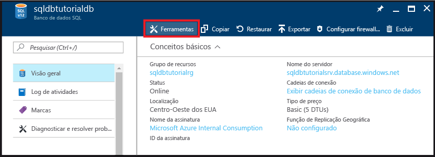
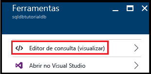
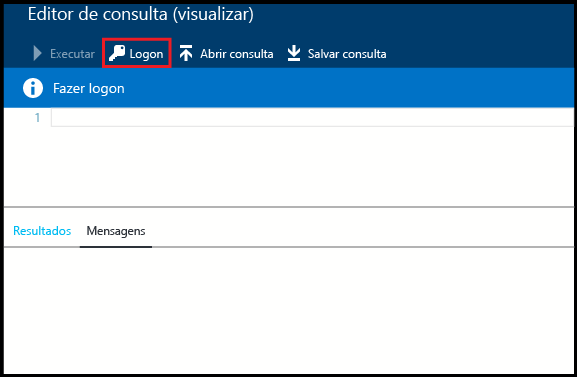
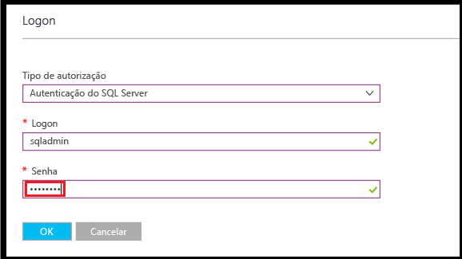
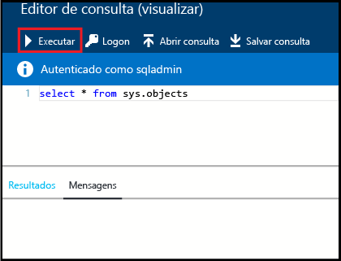
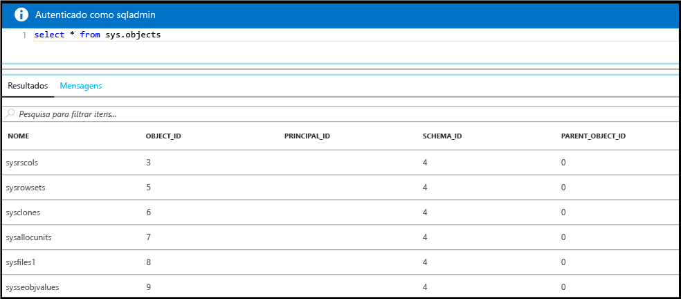
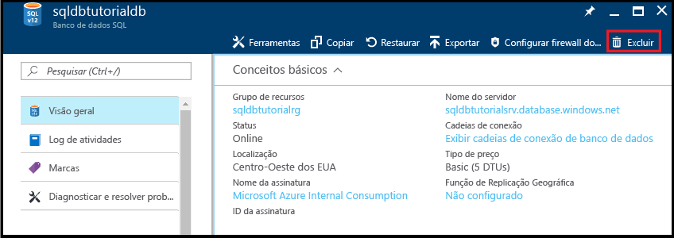

# <a name="create-connect-to-and-query-your-first-azure-sql-databases-in-the-azure-portal-and-using-ssms"></a>Criar, conectar e consultar seus bancos de dados do SQL Azure primeiro no portal do Azure e usando o SSMS

Neste tutorial, você aprenderá a criar, conectar e consultar bancos de dados do SQL Azure no portal do Azure e usando o SQL Server Management Studio. Depois de concluir este tutorial, você:

* Terá criado um grupo de recursos contendo um servidor lógico, uma regra de firewall no nível de servidor e dois bancos de dados.
* Saberá como exibir propriedades de servidor e banco de dados no portal do Azure e usando o SQL Server Management Studio.
* Saberá como consultar um banco de dados no portal do Azure e usando o SQL Server Management Studio.

**Tempo estimado**: este tutorial leva cerca de 30 minutos (supondo que você já atenda aos pré-requisitos).

> [!TIP]
> Você também pode aprender como criar, conectar e consultar um banco de dados SQL do Azure usando [PowerShell](sql-database-get-started-powershell.md) ou [c#](sql-database-get-started-csharp.md).
>

> [!NOTE]
> Este tutorial ajuda você a obter o conteúdo destes tópicos de aprendizagem: [Visão geral do servidor de Banco de Dados SQL](sql-database-server-overview.md), [Visão geral do banco de dados SQL](sql-database-overview.md) e [Visão geral de regras de firewall do Banco de Dados SQL do Azure](sql-database-firewall-configure.md). Para obter uma visão geral sobre o serviço do Banco de Dados SQL, consulte [O que é o Banco de Dados SQL?](sql-database-technical-overview.md).
>  

## <a name="prerequisites"></a>Pré-requisitos

* **Uma conta do Azure**. Você pode [abrir uma conta gratuita do Azure](https://azure.microsoft.com/free/) ou [Ativar os benefícios de assinante do Visual Studio](https://azure.microsoft.com/pricing/member-offers/msdn-benefits/). 

* **O Azure cria permissões**. Você deve ser capaz de se conectar ao portal do Azure com uma conta que seja membro da função de colaborador ou proprietário da assinatura. Para obter mais informações sobre o controle de acesso baseado em função (RBAC), confira [Introdução ao gerenciamento de acesso no Portal do Azure](../active-directory/role-based-access-control-what-is.md).

* **SQL Server Management Studio**. Você pode baixar e instalar a versão mais recente do SSMS (SQL Server Management Studio) em [Baixar o SQL Server Management Studio](https://msdn.microsoft.com/library/mt238290.aspx). Sempre use a versão mais recente do SSMS ao se conectar ao Banco de Dados SQL do Azure, já que sempre há o lançamento de novos recursos.

### <a name="sign-in-to-the-azure-portal"></a>Entrar no Portal do Azure

As etapas neste procedimento mostram como conectar-se para o portal do Azure usando o [conta do Azure](https://account.windowsazure.com/Home/Index).

1. Abra seu navegador preferido e conecte-se ao [portal do Azure](https://portal.azure.com/).
2. Entre no [Portal do Azure](https://portal.azure.com/).
3. Na página **Entrar** , forneça as credenciais da sua assinatura.
   
   


<a name="create-logical-server-bk"></a>

## <a name="create-a-new-logical-sql-server"></a>Criar um novo servidor SQL lógico

As etapas neste procedimento mostram como criar um servidor lógico no portal do Azure na região de sua escolha. Um servidor lógico é o objeto no qual você cria seus bancos de dados SQL e o objeto no qual você cria regras de firewall para permitir que os usuários se conectem por meio do firewall do banco de dados SQL. 

1. Clique em **Novo**, digite **sql server** e, em seguida, clique em **ENTER**.

    
2. Clique em **SQL server (servidor lógico)**.
   
    
3. Clique em **Criar** para abrir a nova folha Somente SQL Server (servidor lógico).

    
3. Na caixa de texto **Nome do servidor**, forneça um nome válido para o novo servidor lógico. Uma marca de seleção verde indica que você forneceu um nome válido.
    
    

    > [!IMPORTANT]
    > O nome totalmente qualificado do novo servidor deve ser globalmente exclusivo e estar o formato: **<nome_do_servidor>.database.windows.net**. Você usa esse nome totalmente qualificado do servidor mais tarde neste tutorial para se conectar ao seu servidor e seus bancos de dados.
    >
    
4. Na caixa de texto **Logon do administrador de servidor**, forneça um nome de usuário para o logon de autenticação do SQL para este servidor. Esse logon é conhecido como o logon principal do servidor. Uma marca de seleção verde indica que você forneceu um nome válido.
    
    
5. Nas caixas de texto **Senha** e **Confirmar senha**, forneça uma senha para a conta de logon da entidade de segurança. Uma marca de seleção verde indica que você forneceu uma senha válida.
    
    
6. No **assinatura** caixa suspensa, selecione uma assinatura em que você tenha permissão para criar objetos.

    
7. Em **grupo de recursos** caixa de texto, selecione **criar novo** e, em seguida, forneça um nome válido para o novo grupo de recursos. Uma marca de seleção verde indica que você forneceu um nome válido.

    

8. No **local** caixa de texto, selecione um data center no qual criar o seu servidor lógico.
    
    
    
    > [!TIP]
    > A caixa de seleção para **Permitir que os serviços do Azure acessem o servidor** não pode ser alterado nessa folha. Você pode alterar essa configuração na folha de firewall do servidor. Para obter mais informações, confira [Introdução à segurança](sql-database-control-access-sql-authentication-get-started.md).
    >
    
9. Selecione o **fixar no painel** caixa de seleção.

10. Clique em **criar** para implantar esse script para o Azure para criar seu servidor lógico.

    

11. Depois que o servidor tiver sido criado, examine as propriedades do servidor que são exibidas por padrão. 

    
12. Clique em **Propriedades** para exibir propriedades adicionais do servidor lógico SQL.

    
13. Copie o nome totalmente qualificado do servidor para a área de transferência para usar posteriormente neste tutorial.

    

## <a name="create-a-server-level-firewall-rule"></a>Criar uma regra de firewall no nível de servidor

As etapas neste procedimento mostram como criar uma regra de firewall no nível de servidor no portal do Azure. Por padrão, um firewall de banco de dados SQL impede que a conectividade externa para seu servidor lógico e seus bancos de dados. Para permitir que você se conectar ao seu servidor, você precisa criar uma regra de firewall para o endereço IP do computador do qual você se conectar no próximo procedimento. Para saber mais, veja [Visão geral de regras de firewall do Banco de Dados SQL](sql-database-firewall-configure.md).

1. Na folha do servidor SQL, clique em **Firewall** para abrir a folha de Firewall para o servidor. Observe que o endereço IP é exibido para o computador cliente.

    

2. Clique em **Adicionar IP do cliente** na barra de ferramentas para criar uma regra de firewall para seu endereço IP atual.

    

    > [!NOTE]
    > Você pode criar uma regra de firewall para um único endereço IP ou um intervalo inteiro de endereços. Abrir o firewall permite que os administradores do SQL e os usuários façam logon em qualquer banco de dados no servidor para o qual eles têm credenciais válidas.
    >

4. Clique em **Salvar** na barra de ferramentas para salvar essa regra de firewall no nível de servidor e, em seguida, clique em **OK** para fechar a caixa de diálogo Êxito.

    

## <a name="connect-to-the-server-with-ssms"></a>Conectar ao servidor com SSMS

As etapas neste procedimento mostram como se conectar ao seu servidor lógico do SQL usando o SQL Server Management Studio. SSMS é a principal ferramenta uso que DBA para gerenciar bancos de dados e servidores SQL.

1. Abra o SQL Server Management Studio (digite **Microsoft SQL Server Management Studio** na caixa de pesquisa do Windows e clique em **Enter** para abrir o SSMS).

    
3. No **conectar ao servidor** caixa de diálogo, insira o nome do servidor totalmente qualificado do procedimento anterior, selecione autenticação do SQL Server e, em seguida, forneça o logon e senha que você especificou durante a configuração do servidor.

    
4. Clique em **conectar** para iniciar a conexão e abrir o Pesquisador de objetos no SSMS.

    
5. No Pesquisador de objetos, expanda **Bancos de dados**, expanda **Bancos de dados do sistema** e expanda **mestre** para exibir objetos no banco de dados mestre.

    
6. Clique com o botão direito do mouse em **mestre** e depois clique em **Nova consulta**.

    

8. Na janela de consulta, digite o seguinte:

   ```select * from sys.objects```

9.  Na barra de ferramentas, clique em **Executar** para retornar uma lista de todos os objetos de sistema no banco de dados mestre.

    

    > [!NOTE]
    > Para começar com a segurança do SQL, consulte [Introdução à autenticação do SQL](sql-database-control-access-sql-authentication-get-started.md)
    >

## <a name="create-a-database-with-sample-data"></a>Criar um banco de dados com dados de exemplo

As etapas neste procedimento mostram como criar um banco de dados com dados de exemplo no portal do Azure associado ao servidor lógico que você criou anteriormente. 

1. No Portal do Azure, clique em **Bancos de dados SQL** na folha padrão.

    
2. Na folha dos Bancos de dados SQL, clique em **Adicionar**. 

    

    
3. No **nome do banco de dados** texto caixa, forneça um nome de banco de dados válido.

    
4. Em **Selecionar fonte**, selecione **exemplo (AdventureWorksLT)**.
   
    
5. Em **Server**, verifique se o servidor está selecionado. Observe também que, ao adicionar um banco de dados a um servidor, ele pode ser adicionado como um banco de dados individual (esse é o padrão) ou adicionado a um pool elástico. Para saber mais sobre pools elásticos, confira [Pools elásticos](sql-database-elastic-pool.md).

6. Em **tipo de preços**, altere o tipo de preços para **básica** e clique em **selecione**. Você pode aumentar o tipo de preços mais tarde, se desejado, mas para fins de aprendizado, recomendamos que você use a faixa de custo mais baixa.

    
7. Marque a caixa de seleção **Fixar no painel** e clique em **Criar**.

    

8. Depois que o banco de dados tiver sido criado, exiba suas propriedades no portal do Azure. Tutoriais subsequentes o ajudarão a entender as opções disponíveis nessa folha. 

    

## <a name="query-the-database-in-the-azure-portal"></a>Abra o banco de dados no Portal do Azure

As etapas neste procedimento mostram como consultar o banco de dados diretamente no portal do Azure. 

1. Na folha de bancos de dados SQL, clique em **Ferramentas** na barra de ferramentas.

    
2. Na folha Ferramentas, clique em **Editor de consultas (visualização)**.

    
3. Clique na caixa de seleção para confirmar que o editor de consultas é um recurso de visualização e clique em **OK**.
4. Na folha **Editor de consultas**, clique em **Logon**.

    
5. Examine o tipo de autorização e o logon e forneça a senha para esse logon. 

    
6. Clique em **OK** para tentar fazer logon.
7. Depois que você está autenticado, digite a consulta a seguir na janela de consulta e, em seguida, clique em **executar**.

   ```select * from sys.objects```

    

8. Examine os resultados da consulta no painel **Resultados**.

    

## <a name="query-the-database-with-ssms"></a>Consultar o banco de dados com SSMS

As etapas neste procedimento mostram como conectar ao banco de dados usando o SQL Server Management Studio e consultar os dados de exemplo para exibir os objetos no banco de dados.

1. Alterne para o SQL Server Management Studio e, no Pesquisador de Objetos, clique em **Bancos de dados** e, em seguida, clique em **Atualizar** na barra de ferramentas para exibir o banco de dados de exemplo.

    
2. No Pesquisador de Objetos, expanda o novo banco de dados para exibir seus objetos.

    
3. Clique em seu banco de dados de exemplo e depois clique em **Nova Consulta**.

    
4. Na janela de consulta, digite o seguinte:

   ```select * from sys.objects```
   
9.  Na barra de ferramentas, clique em **Executar** para retornar uma lista de todos os objetos de sistema no banco de dados de exemplo.

    

## <a name="create-a-blank-database-with-ssms"></a>Criar um banco de dados em branco com SSMS

As etapas neste procedimento mostram como criar um novo banco de dados usando o SQL Server Management Studio.

1. No Pesquisador de Objetos, clique com o botão direito do mouse em **Bancos de Dados** e em **Novo banco de dados**.

    

2. Na caixa de diálogo **Novo Banco de Dados**, forneça um nome de banco de dados na caixa de texto de Nome do banco de dados. 

    

3. Na caixa de diálogo Novo Banco de Dados, clique em **Opções** e, em seguida, altere a edição para **Básica**.

    

    > [!TIP]
    > Analise as outras opções na caixa de diálogo que você pode modificar em um Banco de dados SQL do Azure. Para saber mais informações sobre estas opções, confira [Criar Banco de dados](https://msdn.microsoft.com/library/dn268335.aspx).
    >

4. Clique em **OK** para criar o banco de dados em branco.
5. Ao concluir, atualize o nó do Banco de dados no Pesquisador de Objetos para exibir o banco de dados em branco recém-criado. 

    

## <a name="troubleshoot-connectivity"></a>Solucionar problemas de conectividade

Você recebe mensagens de erro quando a conexão com o banco de dados SQL falha. Os problemas de conexão podem ser causados pela reconfiguração de banco de dados do SQL Azure, as configurações do firewall, tempo limite de conexão ou informações de logon incorreto. Para uma ferramenta de solução de problemas de conectividade, consulte [solução de problemas de conectividade com o Banco de Dados SQL do Microsoft Azure](https://support.microsoft.com/help/10085/troubleshooting-connectivity-issues-with-microsoft-azure-sql-database).

## <a name="delete-a-single-database-in-the-azure-portal"></a>Excluir um banco de dados no portal do Azure

As etapas neste procedimento mostram como excluir um banco de dados com o portal do Azure.

1. Na folha de bancos de dados SQL no portal do Azure, clique em banco de dados que você deseja excluir. 
2.  o banco de dados SQL, clique em **excluir**.

    
2. Clique em **Sim** para confirmar que deseja excluir este banco de dados permanentemente.

    

> [!TIP]
> Durante o período de retenção do banco de dados, você pode restaurar os backups automáticos iniciados pelo serviço (desde que não exclua o próprio servidor). Para bancos de dados edição Básica, você poderá restaurá-los dentro de sete dias. Para todas as outras edições, você poderá restaurá-los dentro de 35 dias. Se você excluir o servidor, não poderá recuperá-lo ou qualquer um de seus bancos de dados excluídos. Para obter mais informações sobre backups de banco de dados, confira [Saiba mais sobre backups de banco de dados SQL](sql-database-automated-backups.md) e para obter informações sobre como restaurar um banco de dados por meio de backups, confira [Recuperação de banco de dados](sql-database-recovery-using-backups.md). Para obter um artigo de instruções sobre como restaurar um banco de dados excluído, confira [Restaurar um banco de dados Azure SQL excluído - portal do Azure](sql-database-restore-deleted-database-portal.md).
>


## <a name="next-steps"></a>Próximas etapas
Agora que você concluiu este tutorial, há vários tutoriais adicionais que talvez você queira explorar que criam o que você aprendeu neste tutorial. 

- Para obter uma introdução ao tutorial de autenticação do SQL Server, confira [Autenticação e autorização do SQL](sql-database-control-access-sql-authentication-get-started.md)
- Para obter uma introdução ao tutorial de autenticação do Azure Active Directory, confira [Autenticação e autorização do AAD](sql-database-control-access-aad-authentication-get-started.md)
* Se você deseja consultar o banco de dados de exemplo no portal do Azure, confira [Visualização pública: experiência interativa de consulta para bancos de dados SQL](https://azure.microsoft.com/updates/azure-sql-database-public-preview-t-sql-editor/)
* Se você conhece o Excel, saiba como [Conectar um banco de dados SQL no Azure com o Excel](sql-database-connect-excel.md).
* Se você estiver pronto para começar a codificar, escolha a linguagem de programação em [Bibliotecas de conexão para Banco de Dados SQL e SQL Server](sql-database-libraries.md).
* Se você quiser mover seus bancos de dados SQL Server locais para o Azure, confira [Migrando um banco de dados para o Banco de Dados SQL](sql-database-cloud-migrate.md).
* Se quiser carregar alguns dados em uma nova tabela de um arquivo CSV com a ferramenta da linha de comando BCP, confira [Carregando dados no Banco de Dados SQL a partir de um arquivo CSV com o BCP](sql-database-load-from-csv-with-bcp.md).
* Se você deseja iniciar a criação de tabelas e outros objetos, confira o tópico "Para criar uma tabela" em [Criando uma tabela](https://msdn.microsoft.com/library/ms365315.aspx).

## <a name="additional-resources"></a>Recursos adicionais

- Para uma visão geral técnica, confira [O que é o Banco de Dados SQL?](sql-database-technical-overview.md)
- Para saber mais sobre preços, confira [Preços do Banco de Dados SQL do Azure](https://azure.microsoft.com/pricing/details/sql-database/).


