# <a name="get-started-with-azure-sql-database-servers-databases-and-firewall-rules-by-using-the-azure-portal-and-sql-server-management-studio"></a>Introdução aos servidores de banco de dados SQL, bancos de dados e regras de firewall usando o portal do Azure e o SQL Server Management Studio

Neste tutorial de introdução, você aprenderá a usar o portal do Azure para:

* Criar um novo grupo de recursos do Azure
* Criar um servidor lógico do SQL do Azure
* Exibir propriedades de servidor lógico do SQL do Azure
* Criar uma regra de firewall no nível de servidor
* Criar o banco de dados de exemplo do Adventure Works LT
* Exibir propriedades de banco de dados de exemplo do Adventure Works LT no Azure

Neste tutorial, você também usa a versão mais recente do SQL Server Management Studio para:

* Conectar-se ao servidor lógico e seu banco de dados mestre
* Exibir propriedades do banco de dados mestre
* Conectar-se ao banco de dados de exemplo
* Exibir propriedades do banco de dados de usuário

Ao concluir este tutorial, você terá um banco de dados de exemplo e um banco de dados em branco em execução em um grupo de recursos do Azure e conectado a um servidor lógico. Você também terá uma regra de firewall de nível de servidor configurada para habilitar a entidade de segurança de nível de servidor fazer logon no servidor de um endereço IP especificado (ou o intervalo de endereços IP). 

**Tempo estimado**: este tutorial levará cerca de 30 minutos (supondo que você já atende aos pré-requisitos).

## <a name="prerequisites"></a>Pré-requisitos

* Você precisa de uma conta do Azure. Você pode [abrir uma conta gratuita do Azure](/pricing/free-trial/?WT.mc_id=A261C142F) ou [Ativar os benefícios de assinante do Visual Studio](/pricing/member-offers/msdn-benefits-details/?WT.mc_id=A261C142F). 

* Você deve ser capaz de se conectar ao portal do Azure usando uma conta que seja membro da função de colaborador ou proprietário da assinatura. Para obter mais informações sobre o controle de acesso baseado em função (RBAC), confira [Introdução ao gerenciamento de acesso no Portal do Azure](../active-directory/role-based-access-control-what-is.md).

> [!TIP]
> Você pode executar as mesmas tarefas em um tutorial guia de Introdução usando o [C#](sql-database-get-started-csharp.md) ou o [PowerShell](sql-database-get-started-powershell.md).
>

### <a name="sign-in-by-using-your-existing-account"></a>Entrar usando sua conta existente
Usando a [assinatura existente](https://account.windowsazure.com/Home/Index), siga estas etapas para se conectar ao portal do Azure.

1. Abra seu navegador preferido e conecte-se ao [portal do Azure](https://portal.azure.com/).
2. Entre no [Portal do Azure](https://portal.azure.com/).
3. Na página **Entrar** , forneça as credenciais da sua assinatura.
   
   


<a name="create-logical-server-bk"></a>

## <a name="create-a-new-logical-sql-server-in-the-azure-portal"></a>Criar um novo servidor lógico do SQL no portal do Azure

1. Clique em **Novo**, digite **sql server** e, em seguida, clique em **ENTER**.

    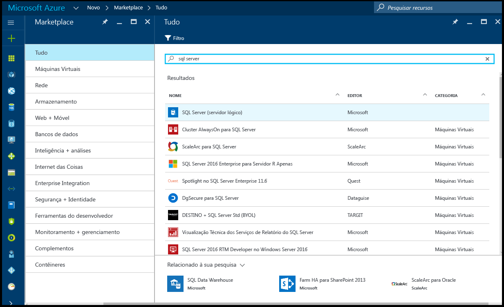
2. Clique em **SQL server (servidor lógico)**.
   
    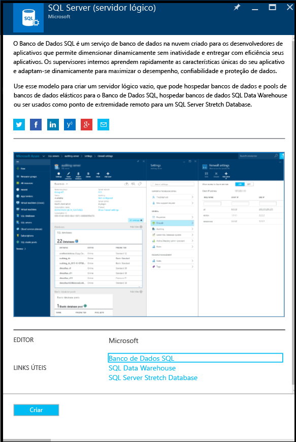
3. Clique em **Criar** para abrir a nova folha do SQL Server (servidor lógico).

    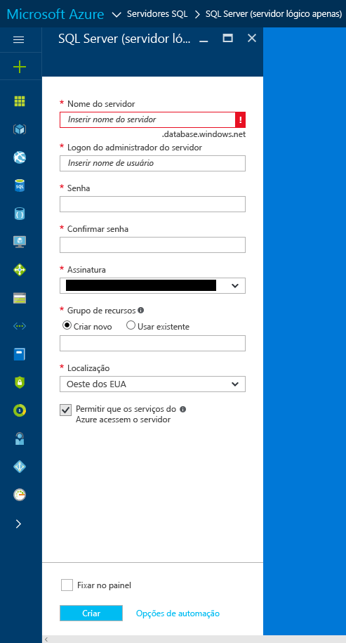
3. Na caixa de texto Nome do servidor, forneça um nome válido para o novo servidor lógico. Uma marca de seleção verde indica que você forneceu um nome válido.
    
    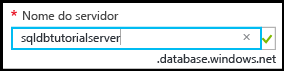

    > [!IMPORTANT]
    > O nome totalmente qualificado para o novo servidor será <nome_do_servidor>.database.windows.net.
    >
    
4. Na caixa de texto de logon do administrador de servidor, forneça um nome de usuário para o logon de autenticação do SQL para este servidor. Esse logon é conhecido como o logon principal do servidor. Uma marca de seleção verde indica que você forneceu um nome válido.
    
    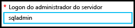
5. Nas caixas de texto **Senha** e **Confirmar senha**, forneça uma senha para a conta de logon da entidade de segurança. Uma marca de seleção verde indica que você forneceu uma senha válida.
    
    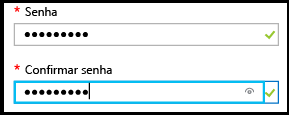
6. Selecione uma assinatura em que você tenha permissão para criar objetos.

    
7. Na caixa de texto Grupo de recursos, selecione **Criar novo** e, na caixa de texto grupo de recursos, forneça um nome válido para o novo grupo de recursos (você também pode usar um grupo de recursos existente, caso já tenha criado um). Uma marca de seleção verde indica que você forneceu um nome válido.

    

8. Na caixa de texto **Local**, selecione um data center apropriado para seu local, como "Leste da Austrália".
    
    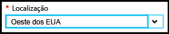
    
    > [!TIP]
    > A caixa de seleção para **Permitir que os serviços do Azure acessem o servidor** não pode ser alterado nessa folha. Você pode alterar essa configuração na folha de firewall do servidor. Para obter mais informações, confira [Introdução à segurança](sql-database-get-started-security.md).
    >
    
9. Clique em **Criar**.

    

## <a name="view-the-logical-sql-server-properties-in-the-azure-portal"></a>Exibir as propriedades lógicas do SQL Server no portal do Azure

1. No portal do Azure, clique em **Mais serviços**.

    
2. Na caixa de texto de Filtro, digite **SQL** e, em seguida, clique na estrela de servidores SQL para especificar servidores SQL como um favorito no Azure. 

    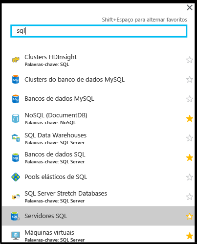
3. Na folha padrão, clique em **SQL servers** para abrir a lista de servidores SQL em sua assinatura do Azure. 

    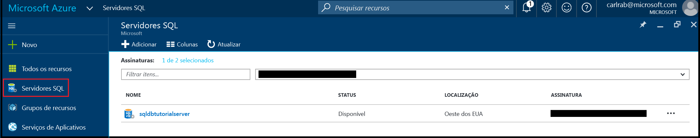

4. Clique em seu novo SQL server para exibir suas propriedades no portal do Azure. Tutoriais subsequentes o ajudarão a entender as opções disponíveis nessa folha.

    
5. Em Configurações, clique em **Propriedades** para exibir várias propriedades do SQL server lógico.

    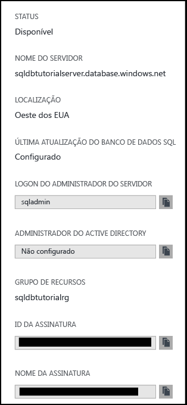
6. Copie o nome totalmente qualificado do servidor para a área de transferência para usar posteriormente neste tutorial.

    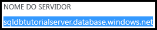

## <a name="create-a-server-level-firewall-rule-in-the-azure-portal"></a>Criar uma regra de firewall de nível de servidor no portal do Azure

1. Na folha do SQL server, em Configurações, clique em **Firewall** para abrir a folha de Firewall para o SQL server.

    

2. Examine o endereço IP do cliente exibido e confirme se esse é o endereço IP na Internet usando um navegador de sua escolha (perguntar "o que é meu endereço IP). Ocasionalmente, eles não coincidem por vários motivos.

    

3. Supondo que os endereços IP têm correspondência, clique em **Adicionar IP do cliente** na barra de ferramentas.

    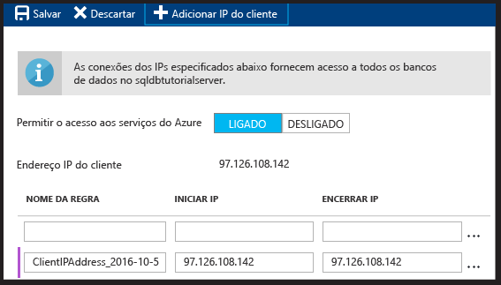

    > [!NOTE]
    > Você pode abrir o firewall do Banco de dados SQL no servidor para um único endereço IP ou um intervalo inteiro de endereços. Abrir o firewall permite que os administradores do SQL e os usuários façam logon em qualquer banco de dados no servidor ao qual eles têm credenciais válidas.
    >

4. Clique em **Salvar** na barra de ferramentas para salvar essa regra de firewall de nível de servidor e, em seguida, clique em **OK**.

    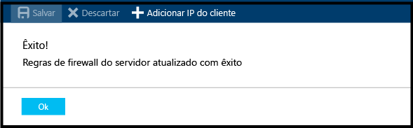

## <a name="connect-to-sql-server-using-sql-server-management-studio-ssms"></a>Conectar-se ao SQL server usando o SSMS (SQL Server Management Studio)

1. Se você ainda não o fez, baixe e instale a versão mais recente do SSMS em [Baixar o SQL Server Management Studio](https://msdn.microsoft.com/library/mt238290.aspx). Para se manter atualizado, a versão mais recente do SSMS avisará você quando houver uma nova versão disponível para download.

2. Depois de instalar, digite **Microsoft SQL Server Management Studio** na caixa de pesquisa do Windows e clique em **Enter** para abrir o SSMS:

    
3. Na caixa de diálogo Conectar ao servidor, insira as informações necessárias para se conectar ao SQL server usando a Autenticação do SQL Server.

    
4. Clique em **Conectar**.

    
5. No Pesquisador de objetos, expanda **Bancos de dados**, expanda **Bancos de dados do sistema** e expanda **mestre** para exibir objetos no banco de dados mestre.

    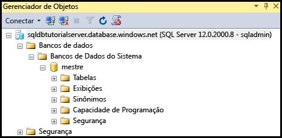
6. Clique com o botão direito do mouse em **mestre** e depois clique em **Nova consulta**.

    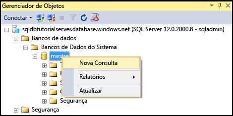

8. Na janela de consulta, digite o seguinte:

   ```select * from sys.objects```

9.  Na barra de ferramentas, clique em **Executar** para retornar uma lista de todos os objetos de sistema no banco de dados mestre.

    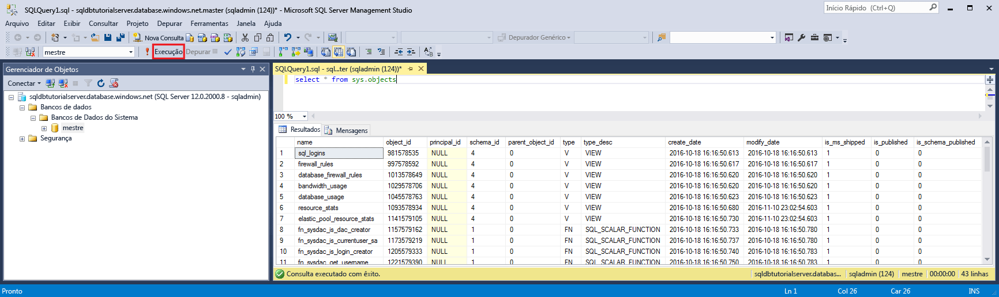

    > [!NOTE]
    > Para explorar a segurança do SQL, confira [Introdução à segurança do SQL](sql-database-get-started-security.md)
    >

## <a name="create-new-database-in-the-azure-portal-using-adventure-works-lt-sample"></a>Criar novo banco de dados no portal do Azure usando o exemplo Adventure Works LT

1. No Portal do Azure, clique em **Bancos de dados SQL** na folha padrão.

    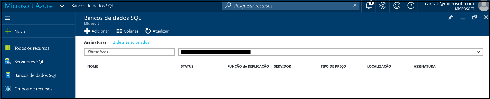
2. Na folha dos Bancos de dados SQL, clique em **Adicionar**.

    
3. Na folha do Banco de dados SQL, examine as informações concluídas para você.

    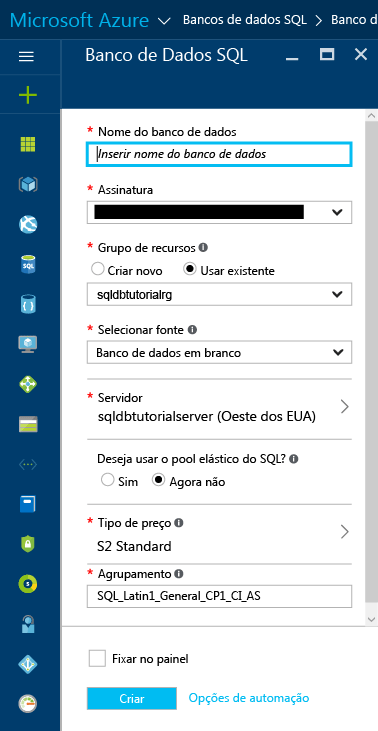
4. Forneça um nome de banco de dados válido.

    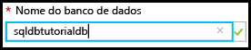
5. Em Selecionar fonte, clique em **Exemplo** e depois em Selecionar exemplo, clique em **AdventureWorksLT [V12]**.
   
    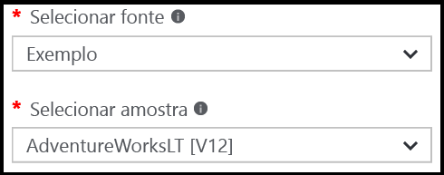
6. Em servidor, forneça o nome de usuário de logon de administrador de servidor e a senha.

    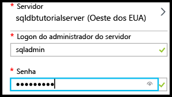

    > [!NOTE]
    > Ao adicionar um banco de dados a um servidor, ele pode ser adicionado como um único banco de dados (esse é o padrão) ou para um pool elástico do SQL. Para saber mais sobre pools elásticos, confira [Pools elásticos](sql-database-elastic-pool.md).
    >

7. No tipo de preço, altere o tipo de preço para **Básico** (você pode aumentar o tipo de preço mais tarde, se desejado, mas para fins de aprendizado, recomendamos que você use a camada de custo mais baixa).

    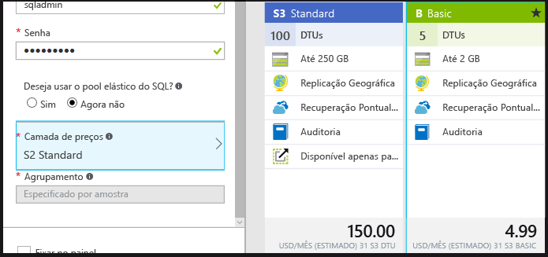
8. Clique em **Criar**.

    

## <a name="view-database-properties-in-the-azure-portal"></a>Exibir propriedades de banco de dados no portal do Azure

1. Na folha de bancos de dados SQL, clique em seu novo banco de dados para exibir suas propriedades no portal do Azure. Tutoriais subsequentes o ajudarão a entender as opções disponíveis nessa folha. 

    
2. Clique em **Propriedades** para exibir informações adicionais sobre seu banco de dados.

    

3. Clique em **Mostrar cadeias de conexão de banco de dados**.

    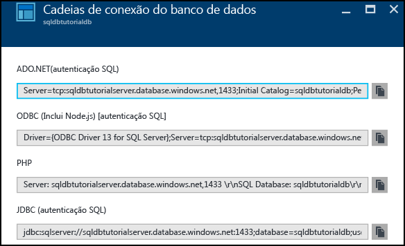
4. Clique em **Visão geral** e, em seguida, clique no nome do servidor no painel do Essentials.
    
    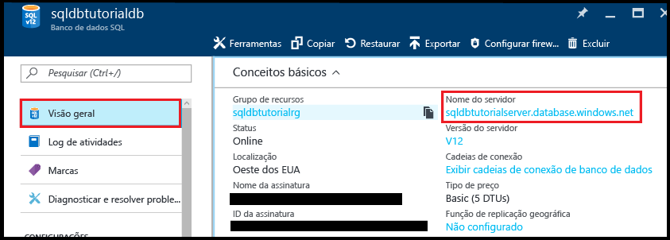
5. No painel do Essentials para o servidor, confira seu banco de dados adicionado recentemente.

    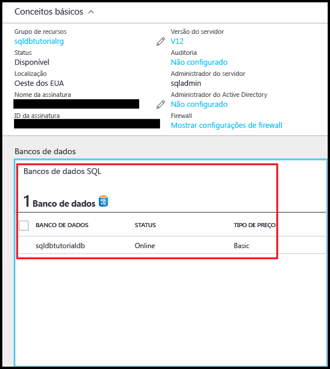

## <a name="connect-and-query-sample-database-using-sql-server-management-studio"></a>Conectar e consultar o banco de dados de exemplo usando o SQL Server Management Studio

1. Alterne para o SQL Server Management Studio e, no Pesquisador de Objetos, clique em **Bancos de dados** e, em seguida, clique em **Atualizar** na barra de ferramentas para exibir o banco de dados de exemplo.

    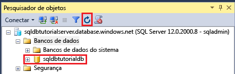
2. No Pesquisador de Objetos, expanda o novo banco de dados para exibir seus objetos.

    
3. Clique em seu banco de dados de exemplo e depois clique em **Nova Consulta**.

    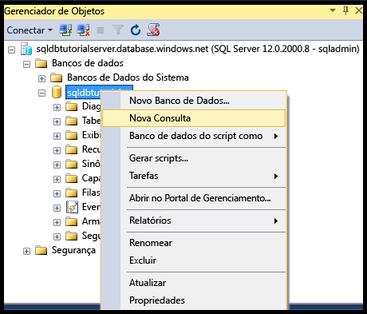
4. Na janela de consulta, digite o seguinte:

   ```select * from sys.objects```
   
9.  Na barra de ferramentas, clique em **Executar** para retornar uma lista de todos os objetos de sistema no banco de dados de exemplo.

    

## <a name="create-a-new-blank-database-using-sql-server-management-studio"></a>Crie um novo banco de dados em branco usando o SQL Server Management Studio

1. No Pesquisador de Objetos, clique com o botão direito do mouse em **Bancos de Dados** e em **Novo banco de dados**.

    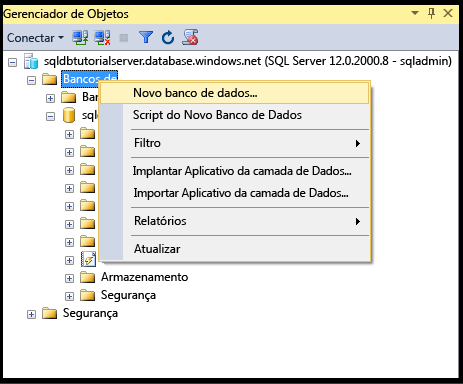

    > [!NOTE]
    > Você também pode fazer com que o SSMS crie um script de criação de banco de dados para criar um novo banco de dados usando o Transact-SQL.
    >

2. Na caixa de diálogo Novo Banco de Dados, forneça um nome de banco de dados na caixa de texto de Nome do banco de dados. 

    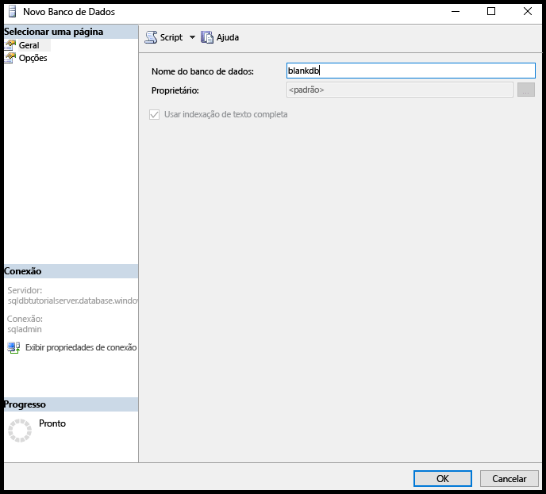

3. Na caixa de diálogo Novo Banco de Dados, clique em **Opções** e, em seguida, altere a edição para **Básica**.

    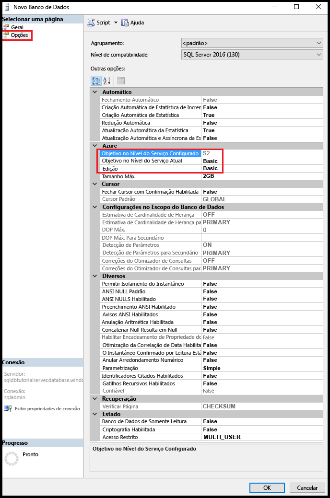

    > [!TIP]
    > Analise as outras opções na caixa de diálogo que você pode modificar em um Banco de dados SQL do Azure. Para saber mais informações sobre estas opções, confira [Criar Banco de dados](https://msdn.microsoft.com/library/dn268335.aspx).
    >

4. Clique em **OK** para criar o banco de dados em branco.
5. Ao concluir, atualize o nó do Banco de dados no Pesquisador de Objetos para exibir o banco de dados em branco recém-criado. 

    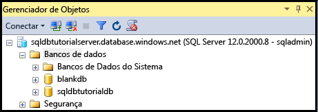

> [!TIP]
> Você pode economizar algum dinheiro enquanto estiver aprendendo excluindo bancos de dados que você não está usando. Para bancos de dados edição Básica, você poderá restaurá-los dentro de sete dias. No entanto, não exclua um servidor. Se você fizer isso, não poderá recuperar o servidor ou qualquer um de seus bancos de dados excluídos.
>


## <a name="next-steps"></a>Próximas etapas
Agora que você concluiu este tutorial, há vários tutoriais adicionais que talvez você queira explorar que criam o que você aprendeu neste tutorial. 

* Se quiser começar a explorar a segurança do Banco de Dados SQL do Azure, confira [Introdução à segurança](sql-database-get-started-security.md).
* Se você conhece o Excel, saiba como [Conectar um banco de dados SQL no Azure com o Excel](sql-database-connect-excel.md).
* Se você estiver pronto para começar a codificar, escolha a linguagem de programação em [Bibliotecas de conexão para Banco de Dados SQL e SQL Server](sql-database-libraries.md).
* Se você quiser mover seus bancos de dados SQL Server locais para o Azure, confira [Migrando um banco de dados para o Banco de Dados SQL](sql-database-cloud-migrate.md).
* Se você quiser carregar alguns dados em uma nova tabela de um arquivo CSV usando a ferramenta da linha de comando BCP, consulte [Carregando dados no Banco de Dados SQL a partir de um arquivo CSV usando o BCP](sql-database-load-from-csv-with-bcp.md).
* Se você deseja iniciar a criação de tabelas e outros objetos, confira o tópico "Para criar uma tabela" em [Criando uma tabela](https://msdn.microsoft.com/library/ms365315.aspx).

## <a name="additional-resources"></a>Recursos adicionais
[O que é o Banco de Dados SQL?](sql-database-technical-overview.md)


<!--HONumber=Dec16_HO1-->


