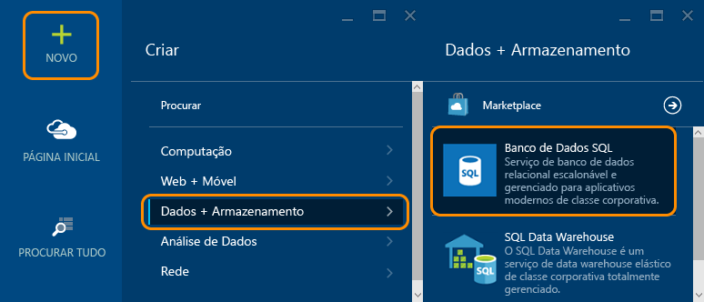
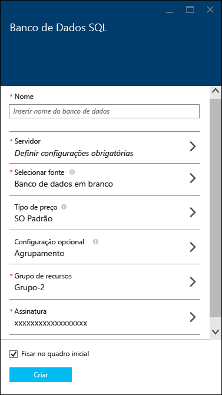
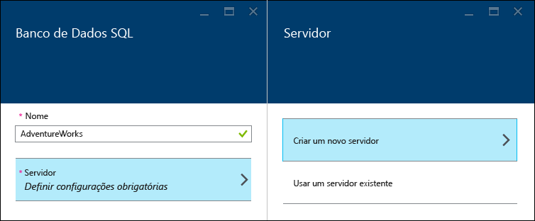
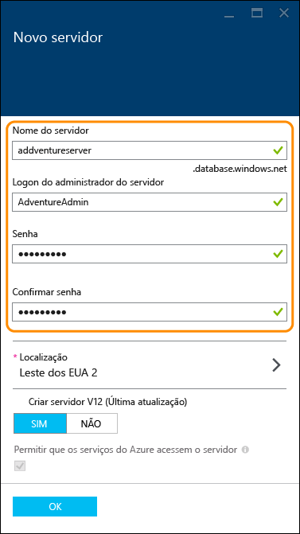
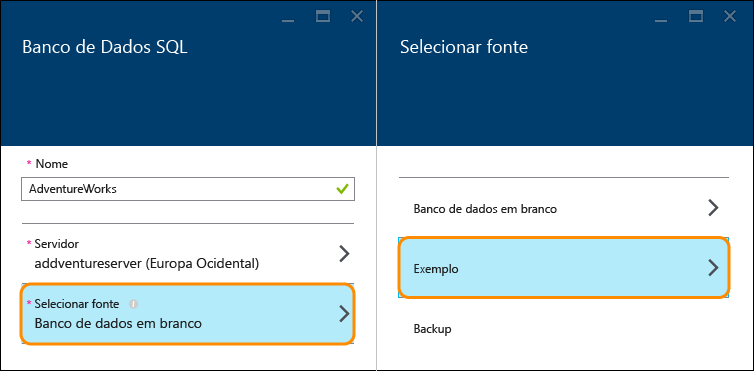
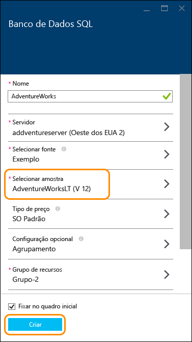
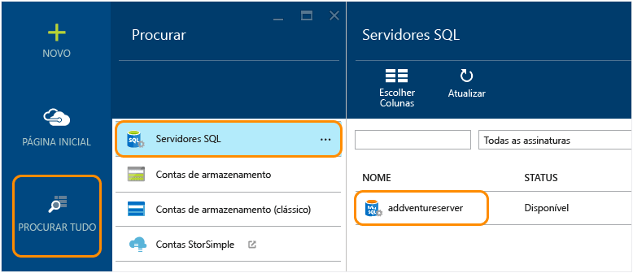
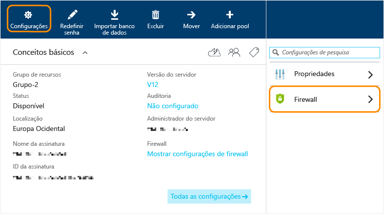
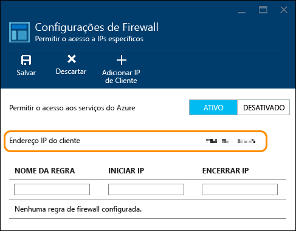
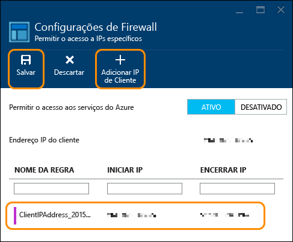

<properties
	pageTitle="Introdução ao banco de dados SQL | Microsoft Azure"
	description="Crie em questão de minutos seu primeiro banco de dados de nuvem com o Banco de Dados SQL do Azure, o serviço de gerenciamento de bando de dados relacional da Microsoft (RDBMS) na nuvem, usando o Portal do Azure e o exemplo de banco de dados AdventureWorks."
	services="sql-database"
	documentationCenter=""
	authors="jeffgoll"
	manager="jeffreyg"
	editor=""/>

<tags
	ms.service="sql-database"
	ms.workload="data-management"
	ms.tgt_pltfrm="na"
	ms.devlang="na"
	ms.topic="hero-article"
	ms.date="10/09/2015"
	ms.author="jeffreyg"/>

# Criar seu primeiro banco de dados SQL do Azure

**Banco de dados individual**

> [AZURE.SELECTOR]
- [Azure portal](sql-database-get-started.md)
- [C#](sql-database-get-started-csharp.md)
- [PowerShell](sql-database-get-started-powershell.md)

Este artigo mostra como criar um exemplo de banco de dados SQL em poucos minutos usando o portal de visualização do Azure. Você aprenderá a:

- Criar um servidor para hospedar o banco de dados criado e depois configurar uma regra de firewall para ele
- Criar um banco de dados por meio de um exemplo do AdventureWorks, que contém dados com os quais você pode trabalhar

Você precisará de uma conta do Azure e uma assinatura antes de começar. Se não tiver uma, inscreva-se para fazer uma [avaliação gratuita](http://azure.microsoft.com/pricing/free-trial/).

> [AZURE.NOTE]Esse guia abrange a configuração de um banco de dados usando o serviço de banco de dados relacional da Microsoft na nuvem, o Banco de Dados SQL do Azure. Outra opção é executar o SQL Server em uma Máquina Virtual do Azure. Consulte [Noções básicas sobre o Banco de Dados SQL e o SQL Server em VMs do Azure](data-management-azure-sql-database-and-sql-server-iaas.md) para obter uma comparação rápida, ou você pode consultar [Provisionar uma máquina virtual do SQL server](virtual-machines-provision-sql-server.md) para obter uma introdução a uma máquina virtual.

## Etapa 1: entrar e iniciar a configuração do banco de dados SQL
1. Entre no [portal de visualização do Azure](http://portal.azure.com/).
2. Clique em **Novo** > **Dados + Armazenamento** > **Banco de Dados SQL**.

	
	
	A folha de configurações do **Banco de dados SQL** que aparece é onde você configurará os detalhes do servidor e do banco de dados.

	

## Etapa 2: escolher as configurações de servidor
Um banco de dados SQL no Azure reside em um servidor de banco de dados. Um servidor pode hospedar vários bancos de dados. Durante a configuração de um banco de dados, você também pode criar e configurar o servidor que hospedará, ou você pode usar um criado anteriormente. Vamos configurar um novo.

1. Digite um **Nome** para o banco de dados (usamos **AdventureWorks**). Voltaremos aqui para mostrar outras configurações de banco de dados mais tarde.
2. Em **Servidor**, clique em **Definir as configurações necessárias** e depois clique em **Criar um novo servidor**.

	

3. Na folha **Novo servidor**, digite um **Nome do Servidor**, que seja exclusivo para todo o Azure e fácil de lembrar. Você precisará desse nome mais tarde quando se conectar e trabalhar com o banco de dados.
4. Digite um **Logon de administrador de servidor** que seja fácil de lembrar (usamos **AdventureAdmin**). Depois, digite uma **Senha** segura e digite-a novamente em **Confirmar senha**.

	

	 Deixe a opção **Criar servidor V12 (atualização mais recente)** definida como **Sim** para usar os recursos mais recentes. O **Local** determina a região do data center na qual o servidor será criado.

	>[AZURE.TIP]Crie servidores de banco de dados em um local próximo aos aplicativos que usarão o banco de dados. Se desejar alterar o local, basta clicar em **Local**, escolher um local diferente e clicar em **OK**.

5. Clique em **OK** para voltar à folha do **Banco de dados SQL**.

O banco de dados e o servidor não foram criados ainda. Isso ocorre após a próxima etapa, em que você escolherá criar o banco de dados por meio do exemplo do AdventureWorks e confirmará as configurações.

## Etapa 3: configurar e criar o banco de dados
1. Na folha do **Banco de dados SQL**, clique em **Selecionar origem** e clique em **Exemplo**. 

	

2. Volte para a folha do **Banco de dados SQL**, em que **Selecionar exemplo** agora mostra **AdventureWorks LT [V12]**. Clique em **Criar** para iniciar a criação do servidor e do banco de dados.

	

	>[AZURE.NOTE]Para estas instruções rápidas, não alteramos as configurações de **Camada de preços**, **Agrupamento** e **Grupo de recursos**. Você pode alterar a camada de preços de um banco de dados e escalar vertical e horizontalmente a qualquer momento, sem tempo de inatividade. Confira [Preços do banco de dados SQL](http://azure.microsoft.com/pricing/details/sql-database/) e [Camadas de preços do banco de dados SQL](sql-database-service-tiers.md) para obter mais informações. O agrupamento de um banco de dados não pode ser alterado depois de você configurá-lo aqui. Confira [Agrupamento e suporte a Unicode](https://msdn.microsoft.com/library/ms143726.aspx) para obter detalhes sobre o agrupamento. Confira [Visão geral do Gerenciador de Recursos do Azure](resource-group-overview.md) para obter mais detalhes sobre os grupos de recursos do Azure.

Volte para o Quadro inicial do Azure, em que um bloco mostra o andamento até que o banco de dados seja criado e esteja online. Você também pode clicar em **Procurar todos** e em **Bancos de dados SQL** para confirmar que o banco de dados está online.
	
Parabéns! Agora você tem um banco de dados em execução na nuvem. Já está quase pronto. Só falta uma etapa importante. Você precisa criar uma regra no servidor de banco de dados para que você possa se conectar ao banco de dados.

## Etapa 4: configurar o firewall

Você precisa configurar uma regra de firewall no servidor que permita conexões por meio do endereço IP do computador cliente para que você possa trabalhar com o banco de dados. Isso não só ajuda a garantir que você possa se conectar, mas é uma ótima maneira de ver a área onde você pode obter outros detalhes sobre seus servidores SQL no Azure.

1. Clique em **Procurar todos**, role para baixo e clique em **Servidores SQL**. Depois, clique no nome do servidor que você criou anteriormente na lista de **Servidores SQL**.

	

	
3. Na folha de propriedades do banco de dados que é exibida à direita, clique em **Configurações** e em **Firewall** na lista.

	

	As **Configurações de firewall** mostram o atual **Endereço IP do cliente**.

	

4. Clique em **Adicionar IP do cliente** para que o Azure crie uma regra para esse endereço IP e depois clique em **Salvar**.

	

	>[AZURE.IMPORTANT]Seu endereço IP de cliente provavelmente será alterado periodicamente, e você não poderá acessar o seu servidor até que você crie uma nova regra de firewall. Você pode verificar seu endereço IP usando o [Bing](http://www.bing.com/search?q=my%20ip%20address) e depois adicionar um único endereço IP ou um intervalo de endereços IP. Veja [Como definir as configurações de firewall](sql-database-configure-firewall-settings.md) para obter mais detalhes.

## Próximas etapas
Agora que você tem um banco de dados com alguns dados de exemplo, você está pronto para explorar o uso de suas ferramentas favoritas.

- Se você está familiarizado com o Transact-SQL e o SQL Server Management Studio, saiba como [Conectar e consultar um banco de dados SQL com o SSMS](sql-database-connect-query-ssms.md).

- Se você está familiarizado com o Excel, saiba como [Conectar-se ao banco de dados SQL com o Excel](sql-database-connect-excel.md).

- Se você está pronto para começar a codificação, veja [Conectar e consultar o banco de dados SQL com o C#](sql-database-connect-query.md) e [Usando o banco de dados SQL por meio do .NET (C#)](sql-database-develop-dotnet-simple.md). Veja os [Exemplos de código de início rápido para o banco de dados SQL](sql-database-develop-quick-start-client-code-samples.md) para obter exemplos do Node.js, Python, Ruby, Java, PHP e C++ e instruções adicionais para o C#.

- Se deseja mover seus bancos de dados SQL Server local para o Azure, veja [Migrando um banco de dados para o Banco de dados SQL do Azure](sql-database-cloud-migrate.md) para obter mais informações.

<!---HONumber=Oct15_HO3-->