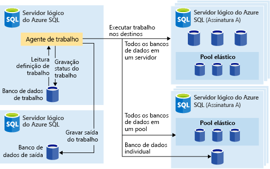
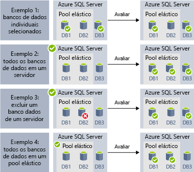
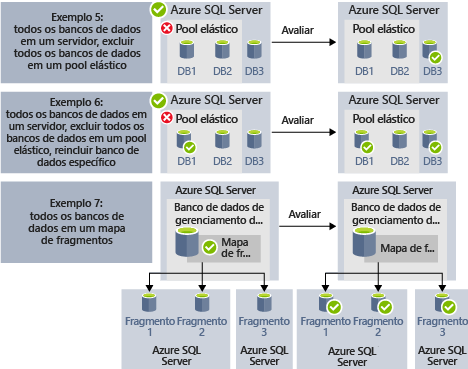

# <a name="automate-management-tasks-using-database-jobs"></a>Automatizar tarefas de gerenciamento usando trabalhos de banco de dados

O Banco de Dados SQL do Azure permite que você crie e agende trabalhos que podem ser executados periodicamente em um ou vários bancos de dados para executar consultas T-SQL e executar tarefas de manutenção. Cada trabalho registrará o status de execução e também repetirá as operações se ocorrer uma falha.
É possível definir o banco de dados de destino ou grupos de bancos de dados SQL do Azure em que o trabalho será executado e também definir agendas para executar um trabalho.
Um trabalho lida com a tarefa de fazer logon no banco de dados de destino. Você também define, atualiza e mantém os scripts T-SQL a serem executados em um grupo de bancos de dados SQL do Azure.

Há vários cenários, quando você pode usar a automação de trabalhos:
- Automatizar tarefas de gerenciamento e, em seguida, agendá-las para serem executadas a todo dia da semana, após horas etc.
  - Implantar alterações de esquema, gerenciamento de credenciais, coleta de dados de desempenho ou coleta de telemetria do locatário (cliente).
  - Atualizar dados de referência (informações comuns a todos os bancos de dados), carregar dados do armazenamento de blobs do Azure.
  - Recompilar índices para melhorar o desempenho da consulta. Configure trabalhos para serem executados em um conjunto de bancos de dados de modo recorrente, por exemplo, fora dos horários de pico.
  - Coletar resultados de consulta de um conjunto de bancos de dados em uma tabela central em uma base contínua. Consultas de desempenho podem ser executadas continuamente e configuradas para disparar tarefas adicionais a serem executadas.
- Coletar dados para relatórios
  - Agregar dados de uma coleção de bancos de dados SQL do Azure em apenas uma tabela de destino.
  - Executar consultas de processamento de dados mais longas em um grande conjunto de bancos de dados, por exemplo, a coleta de telemetria do cliente. Resultados são coletados em uma única tabela de destino para análise posterior.
- Movimentações de dados
 - Crie trabalhos que replicam as alterações feitas em seus bancos de dados para outros bancos de dados ou colete atualizações feitas em bancos de dados remotos e aplique o que foi alterado no banco de dados.
 - Crie trabalhos que carregam dados de ou para seus bancos de dados usando o SSIS (SQL Server Integration Services).

As tecnologias de agendamento de trabalhos a seguir estão disponíveis no Banco de Dados SQL do Azure:
- Os **Trabalhos do SQL Agent** são um componente de agendamento de trabalho do SQL Server clássico e eficaz disponível na Instância Gerenciada. Os Trabalhos do SQL Agent não estão disponíveis em bancos de dados Singleton.
- Os **Trabalhos de banco de dados elástico** são o serviço de agendamento de trabalhos que executa trabalhos personalizados em um ou vários Bancos de Dados SQL do Azure.

Vale a pena observar algumas diferenças entre o SQL Agent (disponível localmente e como parte da Instância Gerenciada do Banco de Dados SQL) e o agente Trabalho do Banco de Dados Elástico (disponível para o Banco de Dados SQL Singleton e para o SQL Data Warehouse).

|  |Trabalhos elásticos  |SQL Agent |
|---------|---------|---------|
|Escopo     |  Qualquer número de bancos de dados SQL do Azure e/ou data warehouses na mesma nuvem do Azure do agente de trabalho. Os destinos podem estar em diferentes servidores lógicos, assinaturas e/ou regiões. <br><br>Os grupos de destino podem ser compostos de bancos de dados ou data warehouses individuais ou dos bancos de dados em um servidor, pool ou mapa de fragmentos (enumerados dinamicamente no tempo de execução do trabalho). | Qualquer banco de dados único na mesma instância do SQL Server que o SQL Agent. |
|Ferramentas e APIs com suporte     |  Portal, PowerShell, T-SQL, Azure Resource Manager      |   T-SQL, SSMS (SQL Server Management Studio)     |

## <a name="sql-agent-jobs"></a>Trabalhos do SQL Agent

Os trabalhos do SQL Agent são séries especificadas de scripts T-SQL com relação ao seu banco de dados. Use trabalhos para definir uma tarefa administrativa que pode ser executada uma ou mais vezes e monitorada quanto a êxito ou falha.
Um trabalho pode ser executado em um servidor local ou em vários servidores remotos. O Trabalho do SQL Agent é um componente interno do Mecanismo de Banco de Dados executado dentro do serviço de Instância Gerenciada.
Há vários conceitos importantes em Trabalhos do SQL Agent:
- **Etapas de trabalho** conjunto de uma ou mais etapas que devem ser executadas dentro do trabalho. Para cada etapa de trabalho, é possível definir a estratégia de repetição e a ação que deverá acontecer se a etapa de trabalho tiver êxito ou falhar.
- **Agendas** definem quando o trabalho deve ser executado.
- **Notificações** permitem que você defina regras que serão usadas para notificar operadores por meio de emails após a conclusão do trabalho.

### <a name="job-steps"></a>Etapas de trabalho

As etapas do Trabalho do SQL Agent são sequências de ações que o SQL Agent deve executar. Cada etapa tem a seguinte etapa que deverá ser executada se a etapa tiver êxito ou falhar, número de repetições em caso de falha.
O SQL Agent permite que você crie diferentes tipos das etapas de trabalho, como a etapa de trabalho Transact-SQL que executa um único lote do Transact-SQL com relação ao banco de dados ou as etapas comando/PowerShell do sistema operacional que podem executar um script personalizado do sistema operacional; as etapas de trabalho do SSIS permitem que você carregue dados usando o tempo de execução do SSIS ou as etapas de [replicação](sql-database-managed-instance-transactional-replication.md) que podem publicar alterações do seu banco de dados em outros.

[Replicação transacional](sql-database-managed-instance-transactional-replication.md) é um recurso do Mecanismo de Banco de Dados que permite que você publique as alterações feitas em uma ou várias tabelas em um banco de dados e publique/distribua-as a um conjunto de bancos de dados do assinante. A publicação das alterações é implementada usando os seguintes tipos de etapa de trabalho do SQL Agent:
- Leitor do log de transações.
- Instantâneo.
- Distribuidor.

Outros tipos de etapas de trabalho não têm suporte no momento, incluindo:
- Não há suporte para a etapa de trabalho de replicação de mesclagem.
- Não há suporte para leitor de fila.
- O Analysis Services não é suportado

### <a name="job-schedules"></a>Agendas de trabalho

Uma agenda especifica quando um trabalho é executado. Mais de um trabalho pode ser executado na mesma agenda e mais de uma agenda pode ser aplicada ao mesmo trabalho.
Uma agenda pode definir as condições a seguir para a hora em que um trabalho é executado:
- Sempre que uma instância é reiniciada (ou quando o SQL Server Agent é iniciado). O trabalho é ativado após cada failover.
- Uma vez, em uma data e hora específicas, que é útil para a execução atrasada de algum trabalho.
- Em uma agenda recorrente.

> [!Note]
> No momento, a Instância Gerenciada não permitirá que você inicie um trabalho quando a instância estiver “ociosa”.

### <a name="job-notifications"></a>Notificações de trabalho

Os trabalhos do SQL Agent permitem que você receba notificações quando o trabalho for concluído com êxito ou com falha. É possível receber a notificação por email.

Primeiro, você precisaria configurar a conta de email que será usada para enviar as notificações por email e atribuir a conta ao perfil do email chamado `AzureManagedInstance_dbmail_profile`, conforme mostrado no exemplo a seguir:

```sql
-- Create a Database Mail account
EXECUTE msdb.dbo.sysmail_add_account_sp
    @account_name = 'SQL Agent Account',
    @description = 'Mail account for Azure SQL Managed Instance SQL Agent system.',
    @email_address = '$(loginEmail)',
    @display_name = 'SQL Agent Account',
    @mailserver_name = '$(mailserver)' ,
    @username = '$(loginEmail)' ,  
    @password = '$(password)' 

-- Create a Database Mail profile
EXECUTE msdb.dbo.sysmail_add_profile_sp
    @profile_name = 'AzureManagedInstance_dbmail_profile',
    @description = 'E-mail profile used for messages sent by Managed Instance SQL Agent.' ;

-- Add the account to the profile
EXECUTE msdb.dbo.sysmail_add_profileaccount_sp
    @profile_name = 'AzureManagedInstance_dbmail_profile',
    @account_name = 'SQL Agent Account',
    @sequence_number = 1;
```

Você também precisaria habilitar o Database Mail na Instância Gerenciada:

```sql
GO
EXEC sp_configure 'show advanced options', 1;  
GO  
RECONFIGURE;  
GO  
EXEC sp_configure 'Database Mail XPs', 1;  
GO  
RECONFIGURE 
```

É possível notificar o operador de que algo aconteceu com seus trabalhos do SQL Agent. Um operador define uma informação de contato para um indivíduo responsável pela manutenção de uma ou mais Instâncias Gerenciadas. Em algum momento, as responsabilidades do operador são atribuídas a um indivíduo.
Em sistemas com várias Instâncias Gerenciadas ou SQL Servers, muitos indivíduos podem compartilhar as responsabilidades do operador. Um operador não contém informações de segurança nem define uma entidade de segurança.

É possível criar operadores usando o SSMS ou o script Transact-SQL mostrado no exemplo a seguir:

```sql
EXEC msdb.dbo.sp_add_operator 
    @name=N'Mihajlo Pupun', 
        @enabled=1, 
        @email_address=N'mihajlo.pupin@contoso.com'
```

É possível modificar qualquer trabalho e atribuir um operador que será notificado por email se o trabalho for concluído, falhar ou tiver êxito usando o SSMS ou o seguinte script Transact-SQL:

```sql
EXEC msdb.dbo.sp_update_job @job_name=N'Load data using SSIS', 
        @notify_level_email=3,                        -- Options are: 1 on succeed, 2 on failure, 3 on complete
        @notify_email_operator_name=N'Mihajlo Pupun'
```

### <a name="sql-agent-job-limitations"></a>Limitações de trabalho do SQL Agent

Alguns recursos do SQL Agent disponíveis no SQL Server não são compatíveis com a Instância Gerenciada:
- As configurações do agente SQL são somente leitura. O procedimento `sp_set_agent_properties` não tem suporte na Instância Gerenciada.
- No momento, não há suporte para habilitar/desabilitar o Agent na Instância Gerenciada. O SQL Agent sempre está em execução.
- As notificações são parcialmente suportadas
 - Não há suporte para pager.
 - Não há suporte a NetSend.
 - Ainda não há suporte para alertas.
- Não há suporte para proxies.
- Não há suporte para Eventlog.

Para obter informações sobre o SQL Server Agent, consulte [SQL Server Agent](https://docs.microsoft.com/sql/ssms/agent/sql-server-agent).

## <a name="elastic-database-jobs"></a>Trabalhos de Banco de Dados Elástico

Os **Trabalhos de Banco de Dados Elástico** permitem executar um ou mais scripts T-SQL em paralelo, em um grande número de bancos de dados, seja com agendamento ou sob demanda.

**Execute trabalhos em qualquer combinação de bancos de dados**: um ou mais bancos de dados individuais, todos os bancos de dados em um servidor, todos os bancos de dados em um pool elástico ou mapa de fragmentos, com a flexibilidade extra de poder incluir ou excluir qualquer banco de dados. **Os trabalhos podem ser executados em diversos servidores e pools, até mesmo em bancos de dados presentes em assinaturas diferentes.** Os servidores e pools são enumerados dinamicamente no tempo de execução e, portanto, os trabalhos são executados em todos os bancos de dados existentes no grupo de destino no momento da execução.

A imagem a seguir mostra um agente de trabalho executando trabalhos em diferentes tipos de grupos de destino:



### <a name="elastic-job-components"></a>Componentes do Trabalho Elástico

|Componente  | Descrição (confira mais detalhes abaixo da tabela) |
|---------|---------|
|[**Agente de Trabalho Elástico**](#elastic-job-agent) |  O recurso do Azure que você cria para executar e gerenciar trabalhos.   |
|[**Banco de dados de trabalhos**](#job-database)    |    Um banco de dados SQL do Azure que o agente de trabalho usa para armazenar dados relacionados ao trabalho, definições de trabalho, etc.      |
|[**Grupo de destino**](#target-group)      |  O conjunto de servidores, pools, bancos de dados e mapas de fragmentos nos quais o trabalho é executado.       |
|[**Trabalho**](#job)  |  Um trabalho é uma unidade de trabalho composta de uma ou mais [etapas de trabalho](#job-step). As etapas de trabalho especificam qual script T-SQL deve ser executado, bem como outros detalhes necessários para a execução do script.  |


#### <a name="elastic-job-agent"></a>Agente de trabalho elástico

Um agente de Trabalho Elástico é o recurso do Azure para criar, executar e gerenciar trabalhos. O agente de Trabalho Elástico é um recurso do Azure que você cria no portal (há suporte também para [PowerShell](elastic-jobs-powershell.md) e REST). 

A criação de um **agente de Trabalho Elástico** requer um banco de dados SQL já criado. O agente configura esse banco de dados existente como o [*Banco de dados do trabalho*](#job-database).

O agente de Trabalho Elástico é gratuito. O banco de dados de trabalhos usa a mesma taxa de cobrança de qualquer banco de dados SQL.

#### <a name="job-database"></a>Banco de dados de trabalhos

O *banco de dados de trabalhos* é usado para definir os trabalhos e rastrear o status e o histórico das execuções de trabalho. O *banco de dados de trabalhos* também é usado para armazenar metadados de agente, logs, resultados e definições de trabalho. Além disso, ele contém muitos procedimentos armazenados úteis e outros objetos de banco de dados usados para criar, executar e gerenciar trabalhos usando o T-SQL.

Na versão prévia atual, um banco de dados existente do SQL Azure (S0 ou superior) é necessário para criar um agente de Trabalho Elástico.

O *Banco de dados de trabalhos* não precisa ser literalmente novo, mas deve ser uma camada limpa, vazia, S0 ou de serviço superior. A camada de serviço recomendada do *Banco de dados de trabalhos* é S1 ou superior, mas isso depende das necessidades de desempenho de seus trabalhos, considerando o número de etapas de trabalho e quantas vezes e com que frequência os trabalhos são executados. Por exemplo, um banco de dados S0 pode ser suficiente para um agente de trabalho que executa apenas alguns trabalhos por hora, mas não para um agente que executa um trabalho por minuto; neste caso, seria indicada uma camada de serviço mais alta.


##### <a name="job-database-permissions"></a>Permissões de banco de dados de trabalhos

Durante a criação do agente de trabalho, um esquema, tabelas e uma função chamada *jobs_reader* são criados no *Banco de dados de trabalhos*. A função, projetada para oferecer aos administradores um controle de acesso mais rígido para monitoramento de trabalho, tem a seguinte permissão:


|Nome da função  |permissões de esquema 'jobs'  |permissões de esquema 'jobs_internal'  |
|---------|---------|---------|
|**jobs_reader**     |    SELECIONAR     |    Nenhum     |

> [!IMPORTANT]
> Considere as implicações de segurança antes de conceder acesso ao *banco de dados de trabalhos* como um administrador de banco de dados. Um usuário mal-intencionado com permissões para criar ou editar tarefas pode criar ou editar um trabalho que usa uma credencial armazenada para se conectar a um banco de dados sob controle do usuário mal-intencionado, o que permitiria que o usuário mal-intencionado determinasse a senha da credencial.


#### <a name="target-group"></a>Grupo de destino

Um *grupo de destino* define o conjunto de bancos de dados em que uma etapa de trabalho será executada. Um grupo de destino pode conter qualquer quantidade ou combinação dos seguintes itens:

- **Servidor SQL do Azure**: se um servidor for especificado, todos os bancos de dados existentes no servidor no momento da execução do trabalho farão parte do grupo. A credencial de banco de dados mestre deve ser fornecida para que o grupo possa ser enumerado e atualizado antes da execução do trabalho.
- **Pool elástico**: se um pool elástico for especificado, todos os bancos de dados presentes no pool elástico no momento da execução do trabalho farão parte do grupo. Assim como ocorre para servidores, a credencial de banco de dados mestre deve ser fornecida para que o grupo possa ser atualizado antes da execução do trabalho.
- **Banco de dados único**: especifica um ou mais bancos de dados individuais como parte do grupo.
- **Mapa de fragmentos**: bancos de dados de um mapa de fragmentos.

> [!TIP]
> No momento da execução do trabalho, a *enumeração dinâmica* reavalia o conjunto de bancos de dados em grupos de destino que incluem servidores ou grupos. A enumeração dinâmica garante que os **trabalhos serão executados em todos os bancos de dados existentes no servidor ou pool no momento da execução do trabalho**. A reavaliação da lista de bancos de dados no tempo de execução é especialmente útil para cenários em que a associação de pools ou servidores é alterada com frequência.

É possível incluir ou excluir pools e bancos de dados individuais do grupo. Isso permite a criação de um grupo de destino com qualquer combinação de bancos de dados. Por exemplo, você pode adicionar um servidor a um grupo de destino, mas excluir bancos de dados específicos em um pool elástico (ou excluir um pool inteiro).

Um grupo de destino pode incluir bancos de dados em várias assinaturas e em várias regiões. Observe que as execuções entre regiões têm maior latência do que as execuções dentro da mesma região.

Os exemplos a seguir mostram como definições de grupo-alvo diferentes são enumeradas dinamicamente no momento da execução do trabalho para determinar em quais bancos de dados o trabalho será executado:



O **exemplo 1** mostra um grupo de destino que consiste em uma lista de bancos de dados individuais. Quando uma etapa de trabalho é executada usando esse grupo de destino, a ação da etapa do trabalho é executada em cada um dos bancos de dados.<br>
O **exemplo 2** mostra um grupo de destino que contém um Azure SQL Server como destino. Quando uma etapa de trabalho é executada usando esse grupo de destino, o servidor é enumerado dinamicamente para determinar a lista de bancos de dados que estão atualmente no servidor. A ação da etapa de trabalho será executada em cada um desses bancos de dados.<br>
O **exemplo 3** mostra um grupo de destino semelhante ao do *exemplo 2*, mas o banco de dados individual é especificamente excluído. A ação da etapa de trabalho *não* será executada no banco de dados excluído.<br>
O **exemplo 4** mostra um grupo de destino que contém um pool elástico como destino. Semelhante ao *exemplo 2*, o pool será enumerado dinamicamente no tempo de execução do trabalho para determinar a lista de bancos de dados no pool.
<br><br>




O **exemplo 5** e o **exemplo 6** mostram cenários avançados em que os SQL Servers do Azure, os pools elásticos e os bancos de dados podem ser combinados usando regras de inclusão e exclusão.<br>
O **exemplo 7** mostra que os fragmentos em um mapa de fragmentos também podem ser avaliados no tempo de execução do trabalho.

#### <a name="job"></a>Trabalho

Um *trabalho* é uma unidade de trabalho executada com agendamento ou como um único trabalho. Um trabalho consiste em uma ou mais *etapas de trabalho*.

##### <a name="job-step"></a>Etapa de trabalho

Cada etapa de trabalho especifica um script T-SQL a ser executado, um ou mais grupos de destino no qual executar o script T-SQL e as credenciais de que o agente de trabalho precisa para se conectar ao banco de dados de destino. Cada etapa de trabalho tem tempo limite e políticas de repetição personalizáveis e pode, opcionalmente, especificar parâmetros de saída.

#### <a name="job-output"></a>Saída do trabalho

O resultado das etapas de um trabalho em cada banco de dados de destino é registrado em detalhes, e a saída do script pode ser capturada em uma tabela específica. Você pode especificar um banco de dados para salvar os dados retornados de um trabalho.

#### <a name="job-history"></a>Histórico de trabalho

O histórico de execução do trabalho é armazenado no *Banco de dados de trabalhos*. Um trabalho de limpeza do sistema limpa o histórico de execuções com mais de 45 dias. Para remover o histórico de menos de 45 dias, chame o procedimento armazenado **sp_purge_history** no *Banco de dados de trabalhos*.
### <a name="agent-performance-capacity-and-limitations"></a>Desempenho, capacidade e limitações do agente

Os Trabalhos Elásticos usam o mínimo de recursos de computação enquanto aguardam a conclusão dos trabalhos de longa execução.

Dependendo do tamanho do grupo de destino de bancos de dados e do tempo de execução desejado para um trabalho (número de trabalhos simultâneos), o agente requer quantidades diferentes de computação e desempenho do *banco de dados de trabalhos* (quanto mais destinos e trabalhos, maior será a quantidade de computação necessária).

Atualmente, a versão prévia está limitada a 100 trabalhos simultâneos.

#### <a name="prevent-jobs-from-reducing-target-database-performance"></a>Impedir que os trabalhos reduzam o desempenho do banco de dados de destino

Para que os recursos não fiquem sobrecarregados ao executar trabalhos em bancos de dados em um pool elástico do SQL, os trabalhos podem ser configurados para limitar o número de bancos de dados em que o trabalho pode ser executado simultaneamente.

## <a name="next-steps"></a>Próximas etapas

- [O que é o SQL Server Agent](https://docs.microsoft.com/sql/ssms/agent/sql-server-agent) 
- [Como criar e gerenciar trabalhos elásticos](elastic-jobs-overview.md) 
- [Criar e gerenciar trabalhos elásticos usando o PowerShell](elastic-jobs-powershell.md) 
- [Criar e gerenciar Trabalhos Elásticos usando T-SQL (Transact-SQL)](elastic-jobs-tsql.md) 
