# <a name="configure-and-restore-from-azure-sql-database-long-term-backup-retention"></a>Configurar e restaurar de uma retenção de backup de longo prazo do Banco de Dados SQL do Azure

Você pode configurar o cofre dos Serviços de Recuperação do Azure para armazenar backups do banco de dados SQL do Azure e, em seguida, recuperar um banco de dados usando os backups retidos no cofre usando o portal do Azure ou o PowerShell.

## <a name="azure-portal"></a>Portal do Azure

As próximas seções mostram como usar o portal do Azure para configurar o cofre dos Serviços de Recuperação do Azure, exibir os backups no cofre e restaurar do cofre.

### <a name="configure-the-vault-register-the-server-and-select-databases"></a>Configurar o cofre, registrar o servidor e selecionar bancos de dados

Você [configura um cofre dos Serviços de Recuperação do Azure para reter os backups automatizados](sql-database-long-term-retention.md) por um período maior que o período de retenção da camada de serviços. 

1. Abra a página **SQL Server** do servidor.

   

2. Clique em **Retenção de backup de longo prazo**.

   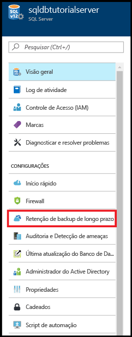

3. Na página **Retenção de backup de longo prazo** do servidor, leia e aceite os termos da visualização (a menos que você já tenha feito isso ou que esse recurso não esteja mais em visualização).

   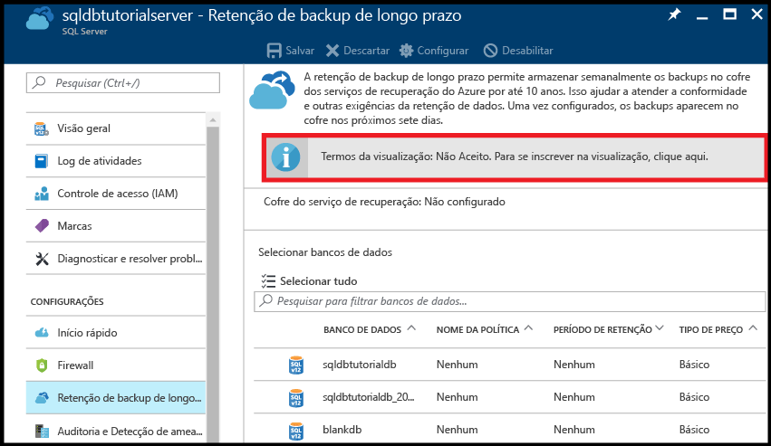

4. Para configurar a retenção de backup de longo prazo, selecione o banco de dados na grade e clique em **Configurar** na barra de ferramentas.

   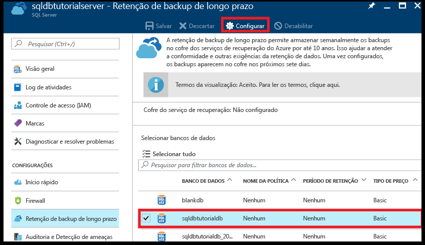

5. Na página **Configurar**, clique em **Definir as configurações necessárias** em **Cofre do serviço de recuperação**.

   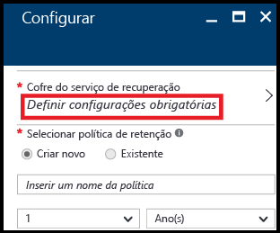

6. Na página **Cofre dos serviços de recuperação**, selecione um cofre existente, se houver. Caso contrário, se nenhum cofre dos serviços de recuperação for encontrado para sua assinatura, clique para sair do fluxo e crie um cofre dos serviços de recuperação.

   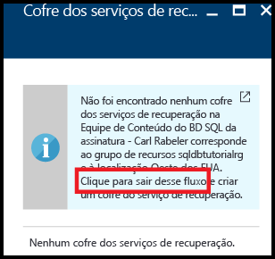

7. Na página **Cofres dos Serviços de Recuperação**, clique em **Adicionar**.

   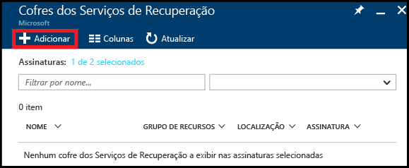
   
8. Na página **Cofre dos Serviços de Recuperação**, forneça um nome válido para o cofre dos Serviços de Recuperação.

   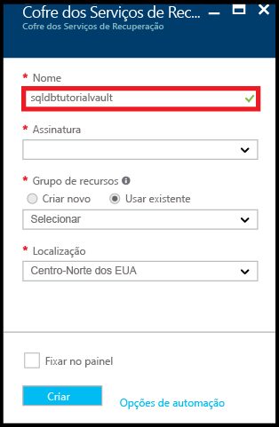

9. Selecione sua assinatura e grupo de recursos, em seguida, selecione o local do cofre. Quando terminar, clique em **Criar**.

   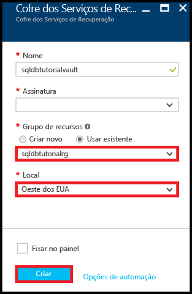

   > [!IMPORTANT]
   > O cofre deve estar localizado na mesma região do servidor lógico do SQL Azure e deve usar o mesmo grupo de recursos como o servidor lógico.
   >

10. Depois que o novo cofre for criado, execute as etapas necessárias para retornar à página **Cofre dos Serviços de Recuperação**.

11. Na página **Cofre dos serviços de recuperação**, clique no cofre e, em seguida, em **Selecionar**.

   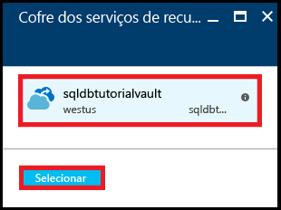

12. Na página **Configurar**, forneça um nome válido para a nova política de retenção, modifique a política de retenção padrão, conforme apropriado e clique em **OK**.

   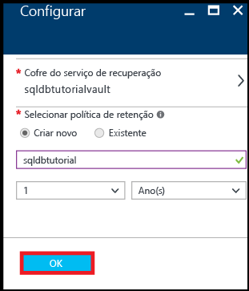
   
   >[!NOTE]
   >Os nomes de política de retenção não permitem alguns caracteres, incluindo espaços.

13. Na página **Retenção de backup de longo prazo** do banco de dados, clique em **Salvar** e em **OK** para aplicar a política de retenção de backup de longo prazo a todos os bancos de dados selecionados.

   

14. Clique em **salvar** para habilitar a retenção de backup a longo prazo, usando essa nova política no cofre de serviços de recuperação do Azure que você configurou.

   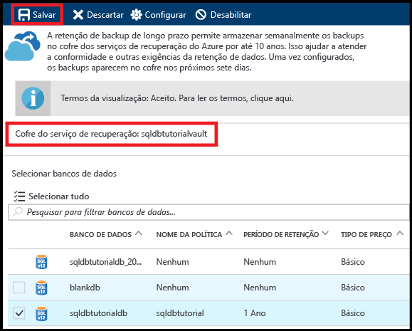

> [!IMPORTANT]
> Uma vez configurados, os backups aparecerão no cofre nos próximos sete dias. Não continue neste tutorial até que os backups apareçam no cofre.
>

### <a name="view-backups-in-long-term-retention-using-azure-portal"></a>Exibir backups na retenção de longo prazo usando o portal do Azure

Exiba informações sobre os backups de banco de dados na [retenção de backup de longo prazo](sql-database-long-term-retention.md). 

1. No portal do Azure, abra o cofre dos Serviços de Recuperação do Azure do banco de dados (acesse **Todos os recursos** e selecione-o na lista de recursos de sua assinatura) para exibir a quantidade de armazenamento usada pelos backups de banco de dados no cofre.

   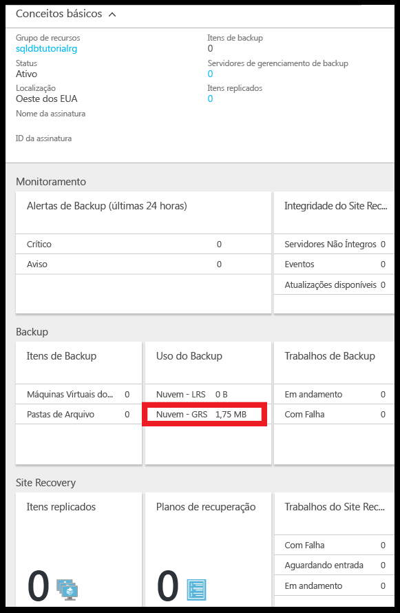

2. Abra a página **Banco de dados SQL** do banco de dados.

   

3. Na barra de ferramentas, clique em **Restaurar**.

   

4. Na página Restaurar, clique em **Longo prazo**.

5. Nos backups do cofre do Azure, clique em **Selecionar um backup** para exibir os backups do banco de dados disponíveis na retenção de backup de longo prazo.

   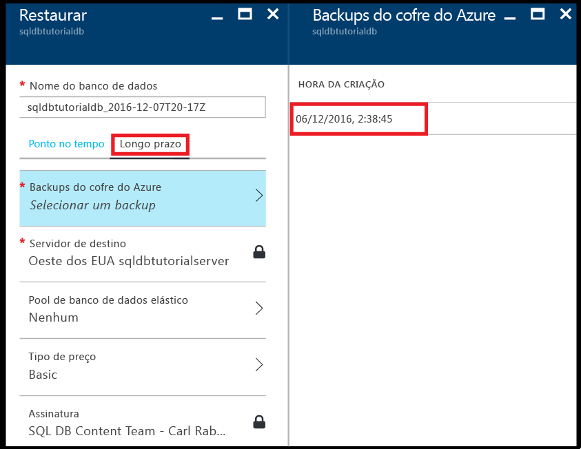

### <a name="restore-a-database-from-a-backup-in-long-term-backup-retention-using-the-azure-portal"></a>Restaurar um banco de dados com base em um backup na retenção de backup de longo prazo usando o portal do Azure

Você restaura o banco de dados para um novo banco de dados com base em um backup no cofre dos Serviços de Recuperação do Azure.

1. Na página **Backups do cofre do Azure**, clique no backup a ser restaurado e, em seguida, clique em **Selecionar**.

   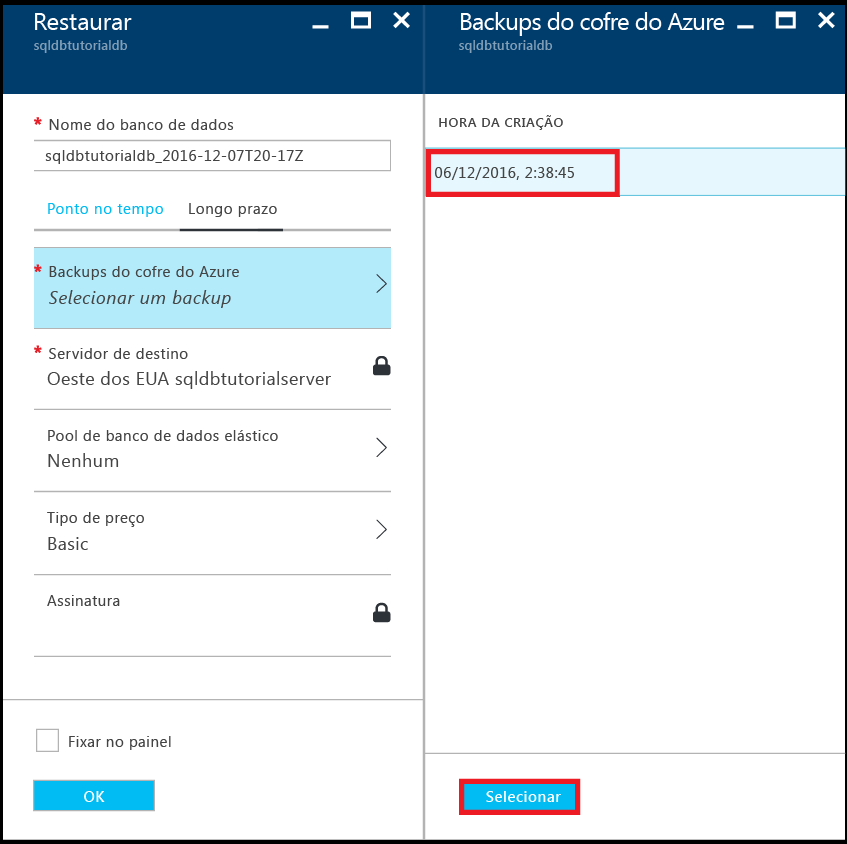

2. Na caixa de texto **Nome do banco de dados**, forneça o nome do banco de dados restaurado.

   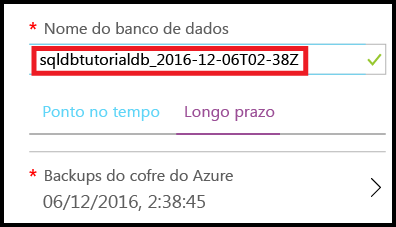

3. Clique em **OK** para restaurar seu banco de dados a partir do backup no cofre para o novo banco de dados.

4. Na barra de ferramentas, clique no ícone de notificação para exibir o status do trabalho de restauração.

   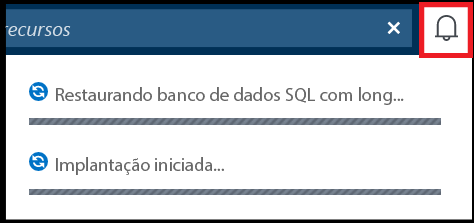

5. Quando o trabalho de restauração for concluído, abra a página **Bancos de dados SQL** para exibir o banco de dados recém-restaurado.

   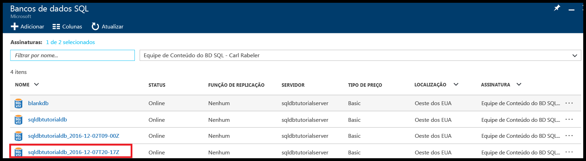

> [!NOTE]
> A partir daqui, você pode conectar o banco de dados restaurado usando o SQL Server Management Studio para executar as tarefas necessárias, tais como, [extrair um pouco de dados do banco de dados restaurado para copiar para o banco de dados existente ou excluir o banco de dados existente e renomear o banco de dados restaurado com o nome do banco de dados existente](sql-database-recovery-using-backups.md#point-in-time-restore).
>

## <a name="powershell"></a>PowerShell

As próximas seções mostram como usar o PowerShell para configurar o cofre dos Serviços de Recuperação do Azure, exibir os backups no cofre e restaurar do cofre.

### <a name="create-a-recovery-services-vault"></a>Criar um cofre dos Serviços de Recuperação

Use o [New-AzureRmRecoveryServicesVault](/powershell/module/azurerm.recoveryservices/new-azurermrecoveryservicesvault) para criar um cofre dos serviços de recuperação.

> [!IMPORTANT]
> O cofre deve estar localizado na mesma região do servidor lógico do SQL Azure e deve usar o mesmo grupo de recursos como o servidor lógico.

```PowerShell
# Create a recovery services vault

#$resourceGroupName = "{resource-group-name}"
#$serverName = "{server-name}"
$serverLocation = (Get-AzureRmSqlServer -ServerName $serverName -ResourceGroupName $resourceGroupName).Location
$recoveryServiceVaultName = "{new-vault-name}"

$vault = New-AzureRmRecoveryServicesVault -Name $recoveryServiceVaultName -ResourceGroupName $ResourceGroupName -Location $serverLocation 
Set-AzureRmRecoveryServicesBackupProperties -BackupStorageRedundancy LocallyRedundant -Vault $vault
```

### <a name="set-your-server-to-use-the-recovery-vault-for-its-long-term-retention-backups"></a>Definir o servidor para usar o cofre de recuperação para seus backups de retenção de longo prazo

Use o cmdlet [Set-AzureRmSqlServerBackupLongTermRetentionVault](/powershell/module/azurerm.sql/set-azurermsqlserverbackuplongtermretentionvault) para associar um cofre dos serviços de recuperação criado anteriormente a um SQL Server específico do Azure.

```PowerShell
# Set your server to use the vault to for long-term backup retention 

Set-AzureRmSqlServerBackupLongTermRetentionVault -ResourceGroupName $resourceGroupName -ServerName $serverName -ResourceId $vault.Id
```

### <a name="create-a-retention-policy"></a>Criar uma política de retenção

Em uma política de retenção, você define por quanto tempo um backup de banco de dados deve ser mantido. Use o cmdlet [Get-AzureRmRecoveryServicesBackupRetentionPolicyObject](https://docs.microsoft.com/powershell/resourcemanager/azurerm.recoveryservices.backup/v2.3.0/get-azurermrecoveryservicesbackupretentionpolicyobject) para obter a política de retenção padrão a ser usada como modelo para criação de políticas. Neste modelo, o período de retenção é definido para 2 anos. Em seguida, execute o [New-AzureRmRecoveryServicesBackupProtectionPolicy](/powershell/module/azurerm.recoveryservices.backup/new-azurermrecoveryservicesbackupprotectionpolicy) para finalmente criar a política. 

> [!NOTE]
> Alguns cmdlets exigem que você defina o contexto de cofre antes da execução ([Set-AzureRmRecoveryServicesVaultContext](/powershell/module/azurerm.recoveryservices/set-azurermrecoveryservicesvaultcontext)); portanto, esse cmdlet é visto em alguns trechos de código relacionados. Você define o contexto porque a política faz parte do cofre. Você pode criar várias políticas de retenção para cada compartimento e aplicar a política desejada a bancos de dados específicos. 


```PowerShell
# Retrieve the default retention policy for the AzureSQLDatabase workload type
$retentionPolicy = Get-AzureRmRecoveryServicesBackupRetentionPolicyObject -WorkloadType AzureSQLDatabase

# Set the retention value to two years (you can set to any time between 1 week and 10 years)
$retentionPolicy.RetentionDurationType = "Years"
$retentionPolicy.RetentionCount = 2
$retentionPolicyName = "my2YearRetentionPolicy"

# Set the vault context to the vault you are creating the policy for
Set-AzureRmRecoveryServicesVaultContext -Vault $vault

# Create the new policy
$policy = New-AzureRmRecoveryServicesBackupProtectionPolicy -name $retentionPolicyName -WorkloadType AzureSQLDatabase -retentionPolicy $retentionPolicy
$policy
```

### <a name="configure-a-database-to-use-the-previously-defined-retention-policy"></a>Configurar um banco de dados para usar a política de retenção definida anteriormente

Use o cmdlet [Set-AzureRmSqlDatabaseBackupLongTermRetentionPolicy](/powershell/module/azurerm.sql/set-azurermsqldatabasebackuplongtermretentionpolicy) para aplicar a nova política a um banco de dados específico.

```PowerShell
# Enable long-term retention for a specific SQL database
$policyState = "enabled"
Set-AzureRmSqlDatabaseBackupLongTermRetentionPolicy -ResourceGroupName $resourceGroupName -ServerName $serverName -DatabaseName $databaseName -State $policyState -ResourceId $policy.Id
```

### <a name="view-backup-info-and-backups-in-long-term-retention"></a>Exibir informações de backup e backups de retenção de longo prazo

Exiba informações sobre os backups de banco de dados na [retenção de backup de longo prazo](sql-database-long-term-retention.md). 

Use os seguintes cmdlets para exibir informações de backup:

- [Get-AzureRmRecoveryServicesBackupContainer](/powershell/module/azurerm.recoveryservices.backup/get-azurermrecoveryservicesbackupcontainer)
- [Get-AzureRmRecoveryServicesBackupItem](/powershell/module/azurerm.recoveryservices.backup/get-azurermrecoveryservicesbackupitem)
- [Get-AzureRmRecoveryServicesBackupRecoveryPoint](/powershell/module/azurerm.recoveryservices.backup/get-azurermrecoveryservicesbackuprecoverypoint)

```PowerShell
#$resourceGroupName = "{resource-group-name}"
#$serverName = "{server-name}"
$databaseNeedingRestore = $databaseName

# Set the vault context to the vault we want to restore from
#$vault = Get-AzureRmRecoveryServicesVault -ResourceGroupName $resourceGroupName
Set-AzureRmRecoveryServicesVaultContext -Vault $vault

# the following commands find the container associated with the server 'myserver' under resource group 'myresourcegroup'
$container = Get-AzureRmRecoveryServicesBackupContainer -ContainerType AzureSQL -FriendlyName $vault.Name

# Get the long-term retention metadata associated with a specific database
$item = Get-AzureRmRecoveryServicesBackupItem -Container $container -WorkloadType AzureSQLDatabase -Name $databaseNeedingRestore

# Get all available backups for the previously indicated database
# Optionally, set the -StartDate and -EndDate parameters to return backups within a specific time period
$availableBackups = Get-AzureRmRecoveryServicesBackupRecoveryPoint -Item $item
$availableBackups
```

### <a name="restore-a-database-from-a-backup-in-long-term-backup-retention"></a>Restaurar um banco de dados a partir de um backup na retenção de backup de longo prazo

A restauração da retenção de backup de longo prazo usa o cmdlet [Restore-AzureRmSqlDatabase](/powershell/module/azurerm.sql/restore-azurermsqldatabase).

```PowerShell
# Restore the most recent backup: $availableBackups[0]
#$resourceGroupName = "{resource-group-name}"
#$serverName = "{server-name}"
$restoredDatabaseName = "{new-database-name}"
$edition = "Basic"
$performanceLevel = "Basic"

$restoredDb = Restore-AzureRmSqlDatabase -FromLongTermRetentionBackup -ResourceId $availableBackups[0].Id -ResourceGroupName $resourceGroupName `
 -ServerName $serverName -TargetDatabaseName $restoredDatabaseName -Edition $edition -ServiceObjectiveName $performanceLevel
$restoredDb
```


> [!NOTE]
> A partir daqui, você pode conectar o banco de dados restaurado usando o SQL Server Management Studio para executar as tarefas necessárias, tais como, extrair um pouco de dados do banco de dados restaurado para copiar para o banco de dados existente ou excluir o banco de dados existente e renomear o banco de dados restaurado com o nome do banco de dados existente. Confira [recuperação pontual](sql-database-recovery-using-backups.md#point-in-time-restore).

## <a name="next-steps"></a>Próximas etapas

- Para saber mais sobre backups automáticos gerados pelo serviço, veja [backups automáticos](sql-database-automated-backups.md)
- Para saber mais sobre a retenção de backup de longo prazo, consulte [retenção de backup de longo prazo](sql-database-long-term-retention.md)
- Para saber mais sobre a restauração a partir de backups, consulte [restaurar a partir do backup](sql-database-recovery-using-backups.md)
