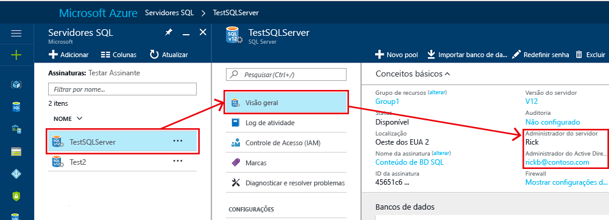

# <a name="controlling-and-granting-database-access"></a>Controle e concessão de acesso de banco de dados

Quando as regras de firewall tiverem sido configuradas, as pessoas podem se conectar a um Banco de Dados SQL como uma das contas de administrador, como o proprietário do banco de dados ou como um usuário do banco de dados.  

>  [!NOTE]  
>  Este tópico aplica-se ao servidor SQL do Azure e aos bancos de dados SQL e SQL Data Warehouse criados no servidor do SQL do Azure. Para simplificar, o banco de dados SQL é usado quando se refere ao Banco de Dados SQL e ao SQL Data Warehouse. 
>

> [!TIP]
> Para obter um tutorial, consulte [Proteger o Banco de Dados SQL do Azure](sql-database-security-tutorial.md).
>


## <a name="unrestricted-administrative-accounts"></a>Contas administrativas irrestritas
Há duas contas administrativas (**Administrador do servidor** e **Administrador do Active Directory**) que agem como administradores. Para identificar essas contas de administrador do servidor SQL, abra o portal do Azure e navegue até as propriedades do servidor SQL.



- **Administrador do servidor**   
Quando você cria um servidor SQL no Azure, você deve designar um **Logon de administrador do servidor**. O servidor SQL cria essa conta como um logon no banco de dados mestre. Essa conta é conectada usando a autenticação do SQL Server (nome de usuário e senha). Só pode existir uma dessas contas.   
- **Administrador do Azure Active Directory**   
Uma conta do Azure Active Directory, seja ela individual ou de grupo de segurança, também pode ser configurada como um administrador. A configuração de um administrador do Azure AD é opcional, mas é necessário configurar um administrador do Azure AD a fim de usar as contas do Azure AD para se conectar ao Banco de Dados SQL. Para saber mais sobre como configurar o acesso ao Azure Active Directory, consulte [Conexão ao Banco de Dados SQL ou ao SQL Data Warehouse usando a autenticação do Azure Active Directory](sql-database-aad-authentication.md) e [Suporte do SSMS para MFA do Azure AD com o Banco de Dados SQL e o SQL Data Warehouse](sql-database-ssms-mfa-authentication.md).
 

As contas do **Administrador do servidor** e do **Administrador do Azure AD** têm as seguintes características:
- Essas são as únicas contas que podem se conectar automaticamente a qualquer Banco de Dados SQL no servidor. (Para se conectar a um banco de dados do usuário, outras contas devem ser o proprietário do banco de dados, ou ter uma conta de usuário do banco de dados do usuário.)
- Essas contas inserem bancos de dados de usuário, pois o usuário `dbo` e elas têm todas as permissões nos bancos de dados do usuário. (O proprietário de um banco de dados do usuário também insere o banco de dados como o usuário `dbo`.) 
- Essas contas não inserem o banco de dados `master`, pois o usuário `dbo` e elas têm permissões limitadas no mestre. 
- Essas contas não são membros da função de servidor fixo do SQL Server padrão `sysadmin`, que não está disponível no Banco de Dados SQL.  
- Essas contas podem criar, alterar e remover bancos de dados, logons, usuários nas regras de firewall mestre e de nível de servidor.
- Essas contas podem adicionar e remover membros das funções `dbmanager` e `loginmanager`.
- Essas contas podem visualizar a tabela do sistema `sys.sql_logins`.

### <a name="configuring-the-firewall"></a>Configuração do firewall
Quando o firewall no nível do servidor é configurado para um endereço IP individual ou para um intervalo de endereços IP, o **Administrador do servidor SQL** e o **Administrador do Azure Active Directory** podem se conectar ao banco de dados mestre e a todos os bancos de dados do usuário. O firewall no nível do servidor inicial pode ser configurado por meio do [portal do Azure](sql-database-get-started-portal.md), usando o [PowerShell](sql-database-get-started-powershell.md) ou usando a [API REST](https://msdn.microsoft.com/library/azure/dn505712.aspx). Depois que uma conexão é estabelecida, as regras de firewall adicionais no nível do servidor também podem ser configuradas usando o [Transact-SQL](sql-database-configure-firewall-settings.md).

### <a name="administrator-access-path"></a>Caminho de acesso do administrador
Quando o firewall no nível de servidor é configurado corretamente, o **Administrador do servidor SQL** e o **Administrador do Azure Active Directory** podem se conectar usando ferramentas de cliente, como o SQL Server Management Studio ou o SQL Server Data Tools. Somente as ferramentas mais recentes fornecem todos os recursos e capacidades. O diagrama a seguir mostra uma configuração típica para as duas contas de administrador.


Ao usar uma porta aberta no firewall no nível do servidor, os administradores podem se conectar a qualquer Banco de Dados SQL.

### <a name="connecting-to-a-database-by-using-sql-server-management-studio"></a>Conectar-se a um banco de dados usando o SQL Server Management Studio
Para obter uma explicação passo a passo da criação de um servidor, de um banco de dados, de regras de firewall no nível do servidor e do uso do SQL Server Management Studio para consultar um banco de dados, veja [Introdução aos servidores, bancos de dados e regras de firewall do Banco de Dados SQL usando o portal do Azure e o SQL Server Management Studio](sql-database-get-started-portal.md).

> [!IMPORTANT]
> Recomendamos que você sempre use a versão mais recente do Management Studio a fim de permanecer sincronizado com as atualizações no Microsoft Azure e no Banco de Dados SQL. [Atualizar o SQL Server Management Studio](https://msdn.microsoft.com/library/mt238290.aspx).


## <a name="additional-server-level-administrative-roles"></a>Funções administrativas no nível do servidor adicionais
Além das funções administrativas no nível do servidor discutidas anteriormente, o Banco de Dados SQL fornece duas funções administrativas restritas no banco de dados mestre, às quais as contas de usuário podem ser adicionadas para a concessão de permissões para manter o banco de dados ou gerenciar logons.

### <a name="database-creators"></a>Criadores de Banco de Dados
Uma dessas funções administrativas é a função **dbmanager**. Os membros dessa função podem criar novos bancos de dados. Para usar essa função, você cria um usuário no banco de dados `master` e, em seguida, adiciona o usuário à função de banco de dados **dbmanager**. Para criar um banco de dados, o usuário deve ser um usuário baseado em um logon do SQL Server no banco de dados mestre ou um usuário de banco de dados baseado em um usuário do Azure Active Directory independente.

1. Com uma conta de administrador, conecte-se ao banco de dados mestre.
2. Etapa opcional: crie um logon de autenticação do SQL Server usando a instrução [CREATE LOGIN](https://msdn.microsoft.com/library/ms189751.aspx) . Exemplo de instrução:
   
   ```
   CREATE LOGIN Mary WITH PASSWORD = '<strong_password>';
   ```
   
   > [!NOTE]
   > Você deve usar uma senha forte ao criar um logon ou um usuário de banco de dados independente. Para obter mais informações, consulte [Senhas fortes (a página pode estar em inglês)](https://msdn.microsoft.com/library/ms161962.aspx).
    
   Para melhorar o desempenho, logons (entidades de nível de servidor) são temporariamente armazenados em cache no nível do banco de dados. Para atualizar o cache de autenticação, veja [DBCC FLUSHAUTHCACHE](https://msdn.microsoft.com/library/mt627793.aspx).

3. No banco de dados mestre, crie um usuário usando a instrução [CREATE USER](https://msdn.microsoft.com/library/ms173463.aspx). O usuário pode ser usuário de banco de dados independente de autenticação no Azure Active Directory (se você tiver configurado o ambiente para autenticação do Azure AD), ou um usuário de banco de dados independente de autenticação do SQL Server, ou um usuário de autenticação do SQL Server com base em um logon de autenticação do SQL Server (criado na etapa anterior). Exemplo de instruções:
   
   ```
   CREATE USER [mike@contoso.com] FROM EXTERNAL PROVIDER;
   CREATE USER Tran WITH PASSWORD = '<strong_password>';
   CREATE USER Mary FROM LOGIN Mary; 
   ```

4. Adicione o novo usuário à função do banco de dados **dbmanager** usando a instrução [ALTER ROLE](https://msdn.microsoft.com/library/ms189775.aspx) . Exemplo de instruções:
   
   ```
   ALTER ROLE dbmanager ADD MEMBER Mary; 
   ALTER ROLE dbmanager ADD MEMBER [mike@contoso.com];
   ```
   
   > [!NOTE]
   > O dbmanager é uma função de banco de dados no banco de dados mestre, portanto, você só pode adicionar um usuário de banco de dados à função dbmanager. Não é possível adicionar um logon no nível do servidor à função no nível do banco de dados.
    
5. Se for necessário, configure uma regra de firewall para permitir que o novo usuário se conecte. (O novo usuário poderá ser coberto por uma regra de firewall existente.)

Agora, o usuário pode se conectar ao banco de dados mestre e criar novos bancos de dados. A conta de criação do banco de dados se torna o proprietário do banco de dados.

### <a name="login-managers"></a>Gerentes de logon
A outra função administrativa é a função de gerente de logon. Os membros dessa função podem criar novos logons no banco de dados mestre. Se quiser, você poderá concluir as mesmas etapas (criar um logon e usuário, e adicionar um usuário à função **loginmanager**) para permitir que um usuário crie novos logons no mestre. Normalmente, os logons não são necessários, pois a Microsoft recomenda o uso de usuários de banco de dados independentes, que são autenticados no nível do banco de dados em vez de usar os usuários baseados em logons. Para obter mais informações, consulte [Usuários do banco de dados independente - Tornando o banco de dados portátil](https://msdn.microsoft.com/library/ff929188.aspx).

## <a name="non-administrator-users"></a>Usuários não administradores
Em geral, as contas que não são de administrador não precisam de acesso ao banco de dados mestre. Crie usuários do banco de dados independente no nível do banco de dados usando a instrução [CREATE USER (Transact-SQL)](https://msdn.microsoft.com/library/ms173463.aspx) . O usuário pode ser usuário de banco de dados independente de autenticação no Azure Active Directory (se você tiver configurado o ambiente para autenticação do Azure AD), ou um usuário de banco de dados independente de autenticação do SQL Server, ou um usuário de autenticação do SQL Server com base em um logon de autenticação do SQL Server (criado na etapa anterior). Para obter mais informações, consulte [Usuários do banco de dados independente - Tornando o banco de dados portátil](https://msdn.microsoft.com/library/ff929188.aspx). 

Para criar usuários, conectar-se ao banco de dados e executar instruções semelhantes aos exemplos a seguir:

```
CREATE USER Mary FROM LOGIN Mary; 
CREATE USER [mike@contoso.com] FROM EXTERNAL PROVIDER;
```

Inicialmente, apenas um dos administradores ou o proprietário do banco de dados pode criar usuários. Para autorizar que outros usuários criem novos usuários, conceda ao usuário selecionado a permissão `ALTER ANY USER` usando uma instrução como:

```
GRANT ALTER ANY USER TO Mary;
```

Para conceder a outros usuários o controle total do banco de dados, torne-os membros da função do banco de dados fixa **db_owner** usando a instrução `ALTER ROLE`.

> [!NOTE]
> O motivo mais comum para criar usuários de banco de dados baseados em logons é quando você tem usuários de autenticação do SQL Server que precisam de acesso a vários bancos de dados. Usuários baseados em logons são vinculados ao logon, e somente uma senha é mantida para esse logon. Os usuários do banco de dados independente em bancos de dados individuais são cada entidade individual, e cada uma delas mantém sua própria senha. Isso pode confundir os usuários de banco de dados independente se eles não mantiverem suas senhas idênticas.

### <a name="configuring-the-database-level-firewall"></a>Configuração do firewall no nível do banco de dados
Como prática recomendada, os usuários não administradores só devem ter acesso por meio do firewall aos bancos de dados que eles usam. Em vez de autorizar seus endereços IP pelo firewall no nível do servidor e conceder acesso a todos os bancos de dados, use a instrução [sp_set_database_firewall_rule](https://msdn.microsoft.com/library/dn270010.aspx) para configurar o firewall no nível do banco de dados. O firewall no nível de banco de dados não pode ser configurado usando o portal.

### <a name="non-administrator-access-path"></a>Caminho de acesso do não administrador
Quando o firewall no nível do banco de dados está configurado corretamente, os usuários do banco de dados podem se conectar usando as ferramentas de cliente como o SQL Server Management Studio ou o SQL Server Data Tools. Somente as ferramentas mais recentes fornecem todos os recursos e capacidades. O diagrama a seguir mostra um caminho de acesso não do administrador típico.


## <a name="groups-and-roles"></a>Grupos e funções
O gerenciamento de acesso eficiente usa as permissões atribuídas a grupos e funções, em vez de usuários individuais. 

- Ao usar a autenticação do Azure Active Directory, coloque os usuários do Azure Active Directory em um grupo do Azure Active Directory. Crie um usuário de banco de dados independente para o grupo. Coloque um ou mais usuários de banco de dados em uma [função de banco de dados](https://msdn.microsoft.com/library/ms189121) e então atribua [permissões](https://msdn.microsoft.com/library/ms191291.aspx) à função de banco de dados.

- Ao usar a autenticação do SQL Server, crie usuários de banco de dados independentes no banco de dados. Coloque um ou mais usuários de banco de dados em uma [função de banco de dados](https://msdn.microsoft.com/library/ms189121) e então atribua [permissões](https://msdn.microsoft.com/library/ms191291.aspx) à função de banco de dados.

As funções do banco de dados podem ser funções internas, como **db_owner**, **db_ddladmin**, **db_datawriter**, **db_datareader**, **db_denydatawriter** e **db_denydatareader**. **db_owner** é usada normalmente para conceder permissão total a apenas alguns usuários. As outras funções fixas de banco de dados são úteis para mover rapidamente um banco de dados simples para desenvolvimento, mas não são recomendadas para a maioria dos bancos de dados de produção. Por exemplo, a função do banco de dados fixa **db_datareader** concede acesso de leitura a todas as tabelas no banco de dados, sendo, em geral, mais do que é estritamente necessário. É muito melhor usar a instrução [CREATE ROLE](https://msdn.microsoft.com/library/ms187936.aspx) para criar suas próprias funções do banco de dados definidas pelo usuário e conceder cuidadosamente a cada função as permissões mínimas necessárias para o negócio. Quando um usuário for membro de várias funções, ele agregará as permissões de todas elas.

## <a name="permissions"></a>Permissões
Há mais de 100 permissões que podem ser concedidas ou negadas individualmente no Banco de Dados SQL. Muitas dessas permissões são aninhadas. Por exemplo, a permissão `UPDATE` em um esquema inclui a permissão `UPDATE` em cada tabela dentro desse esquema. Assim como ocorre na maioria dos sistemas de permissão, a negação de uma permissão substitui uma concessão. Devido à natureza aninhada e ao número de permissões, talvez seja necessário realizar um estudo cuidadoso para criar um sistema de permissões apropriado a fim de proteger corretamente o banco de dados. Comece com a lista de permissões em [Permissões (Mecanismo do Banco de Dados)](https://msdn.microsoft.com/library/ms191291.aspx) e examine o [gráfico com tamanho de pôster](http://go.microsoft.com/fwlink/?LinkId=229142) das permissões.


### <a name="considerations-and-restrictions"></a>Considerações e restrições
Ao gerenciar logons e usuários no Banco de Dados SQL, considere o seguinte:

* É necessário estar conectado ao banco de dados **mestre** ao executar as instruções `CREATE/ALTER/DROP DATABASE`.   
* O usuário de banco de dados correspondente para o logon do **Administrador do servidor** não pode ser alterado ou descartado. 
* O inglês (EUA) é o idioma padrão do logon do **Administrador do servidor**.
* Somente os administradores (Logon do **Administrador do servidor** ou do administrador do Azure AD) e os membros da função **dbmanager** de banco de dados no banco de dados **mestre** têm permissão para executar as instruções `CREATE DATABASE` e `DROP DATABASE`.
* Você deve estar conectado ao banco de dados mestre ao executar as instruções `CREATE/ALTER/DROP LOGIN` . No entanto, não é recomendado usar logons. Utilize os usuários de bancos de dados independentes.
* Para se conectar a um banco de dados do usuário, é necessário fornecer o nome do banco de dados na cadeia de conexão.
* Somente o logon da entidade de segurança no nível do servidor e os membros da função **loginmanager** do banco de dados no banco de dados **mestre** têm permissão para executar as instruções `CREATE LOGIN`, `ALTER LOGIN` e `DROP LOGIN`.
* Ao executar as instruções `CREATE/ALTER/DROP LOGIN` e `CREATE/ALTER/DROP DATABASE` em um aplicativo do ADO.NET, o uso de comandos parametrizados não é permitido. Para obter mais informações, veja [Comandos e parâmetros](https://msdn.microsoft.com/library/ms254953.aspx).
* Ao executar as instruções `CREATE/ALTER/DROP DATABASE` e `CREATE/ALTER/DROP LOGIN`, cada uma dessas instruções deve ser a única instrução em um lote do Transact-SQL. Caso contrário, ocorrerá um erro. Por exemplo, o Transact-SQL a seguir verifica se o banco de dados existe. Se ele existir, uma instrução `DROP DATABASE` é chamada para remover o banco de dados. Como a instrução `DROP DATABASE` não é a única instrução no lote, a execução da seguinte instrução Transact-SQL resulta em um erro.

  ```
  IF EXISTS (SELECT [name]
           FROM   [sys].[databases]
           WHERE  [name] = N'database_name')
  DROP DATABASE [database_name];
  GO
  ```

* Ao executar a instrução `CREATE USER` com a opção `FOR/FROM LOGIN`, ela deve ser a única instrução em um lote do Transact-SQL.
* Ao executar a instrução `ALTER USER` com a opção `WITH LOGIN`, ela deve ser a única instrução em um lote do Transact-SQL.
* Para o `CREATE/ALTER/DROP`, um usuário requer a permissão `ALTER ANY USER` no banco de dados.
* Quando o proprietário de uma função de banco de dados tenta adicionar ou remover outro usuário de banco de dados de ou para essa função de banco de dados, pode ocorrer o seguinte erro: **O usuário ou a função “Nome” não existe neste banco de dados.** Esse erro ocorre porque o usuário não está visível para o proprietário. Para resolver esse problema, conceda ao proprietário da função a permissão `VIEW DEFINITION` no usuário. 


## <a name="next-steps"></a>Próximas etapas

- Para saber mais sobre regras de firewall, veja [Firewall do Banco de Dados SQL do Azure](sql-database-firewall-configure.md).
- Para obter uma visão geral de todos os recursos de segurança do Banco de Dados SQL, veja a [visão geral de segurança do SQL](sql-database-security-overview.md).
- Para obter um tutorial, consulte [Proteger o Banco de Dados SQL do Azure](sql-database-security-tutorial.md).
- Para saber mais sobre exibições e procedimentos armazenados, veja [Criação de exibições e procedimentos armazenados](https://msdn.microsoft.com/library/ms365311.aspx)
- Para saber mais sobre como conceder acesso a um objeto de banco de dados, veja [Concessão de acesso a um objeto de banco de dados](https://msdn.microsoft.com/library/ms365327.aspx)
