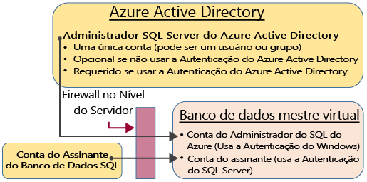
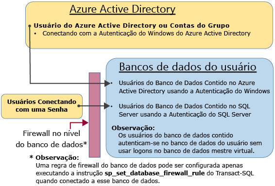

<properties
   pageTitle="Autenticação e autorização do Banco de Dados SQL: concessão de acesso | Microsoft Azure"
   description="Saiba mais sobre o gerenciamento de segurança de banco de dados SQL, especialmente sobre como gerenciar o acesso ao banco de dados e a segurança de logon por meio da conta de entidade de segurança no nível do servidor."
   keywords="segurança do banco de dados SQL, gerenciamento de segurança de banco de dados, segurança de logon, segurança de banco de dados, acesso ao banco de dados"
   services="sql-database"
   documentationCenter=""
   authors="BYHAM"
   manager="jhubbard"
   editor=""
   tags=""/>

<tags
   ms.service="sql-database"
   ms.devlang="na"
   ms.topic="article"
   ms.tgt_pltfrm="na"
   ms.workload="data-management"
   ms.date="08/24/2016"
   ms.author="rickbyh"/>

# Autenticação e Autorização do Banco de Dados SQL: Concessão de Acesso 


> [AZURE.SELECTOR]
- [Tutorial de introdução](sql-database-get-started-security.md)
- [Conceder acesso](sql-database-manage-logins.md)


Comece aqui para obter uma visão geral dos conceitos de acesso do Banco de Dados SQL para administradores, não administradores e funções.

## Contas administrativas irrestritas

Há duas contas administrativas possíveis com permissões irrestritas de acesso ao banco de dados mestre virtual e a todos os bancos de dados do usuário. Essas contas são chamadas de contas de entidade no nível do servidor.

### Conta de assinante do Banco de Dados SQL do Azure 

Uma conta de logon único é criada quando uma instância lógica do SQL é criada, chamada Conta de assinante do Banco de Dados SQL. Essa conta é conectada usando a autenticação do SQL Server (nome de usuário e senha). Essa conta é um administrador na instância do servidor lógico e em todos os bancos de dados do usuário conectados a essa instância. As permissões da Conta de assinante não podem ser restringidas. Só pode existir uma dessas contas.

### Administrador do Azure Active Directory
Uma conta do Azure Active Directory também pode ser configurada como um administrador. Essa conta pode ser um Usuário individual do Azure AD ou pode ser um Grupo do Azure AD contendo vários usuários do Azure AD. A configuração de um administrador do Azure AD é opcional, mas é necessário configurar um administrador do Azure AD a fim de usar a Autenticação do Windows para contas do Azure AD para se conectar ao Banco de Dados SQL. Para saber mais sobre como configurar o acesso ao Azure Active Directory, consulte [Conexão ao Banco de Dados SQL ou ao SQL Data Warehouse usando a autenticação do Azure Active Directory](sql-database-aad-authentication.md) e [SSMS support for Azure AD MFA with SQL Database and SQL Data Warehouse](sql-database-ssms-mfa-authentication.md) (Suporte do SSMS para MFA do Azure AD com o Banco de Dados SQL e o SQL Data Warehouse).

### Configuração do firewall
Quando o firewall no nível do servidor é configurado, a Conta de assinante do Banco de Dados SQL do Azure e a conta do Azure Active Directory podem se conectar ao banco de dados mestre virtual e a todos os bancos de dados do usuário. O firewall no nível do servidor pode ser configurado por meio do portal. Depois que uma conexão é estabelecida, as regras de firewall adicionais no nível do servidor também podem ser configuradas usando a instrução Transact-SQL [sp\_set\_firewall\_rule](https://msdn.microsoft.com/library/dn270017.aspx). Para saber mais sobre como configurar o firewall, confira [Como configurar um firewall do Banco de Dados SQL do Azure usando o Portal do Azure](sql-database-configure-firewall-settings.md).

### Caminho de acesso do administrador

Quando o firewall no nível de servidor é configurado corretamente, a Conta de assinante do Banco de Dados SQL e os Administradores de SQL Server do Azure Active Directory podem se conectar usando ferramentas de cliente, como o SQL Server Management Studio ou o SQL Server Data Tools. Somente as ferramentas mais recentes fornecem todos os recursos e capacidades. O diagrama a seguir mostra uma configuração típica para as duas contas de administrador. 

Ao usar uma porta aberta no firewall no nível do servidor, os administradores podem se conectar a qualquer Banco de Dados SQL.

### Conectar-se a um banco de dados usando o SQL Server Management Studio
Para conferir um passo a passo de como se conectar usando o SQL Server Management Studio, consulte [Conectar-se ao Banco de Dados SQL com o SQL Server Management Studio e executar um exemplo de consulta T-SQL](sql-database-connect-query-ssms.md).


> [AZURE.IMPORTANT] Recomendamos que você sempre use a versão mais recente do Management Studio a fim de permanecer sincronizado com as atualizações no Microsoft Azure e no Banco de Dados SQL. [Atualizar o SQL Server Management Studio](https://msdn.microsoft.com/library/mt238290.aspx).


## Contas especiais adicionais
Banco de Dados SQL fornece duas funções administrativas restritas no banco de dados mestre virtual as quais as contas de usuário podem ser adicionadas.

### Criadores de Banco de Dados
As contas administrativas podem criar novos bancos de dados. Para criar uma conta adicional que pode criar bancos de dados, você deve criar um usuário no mestre e adicionar o usuário à função especial do banco de dados **dbmanager**. O usuário pode ser um usuário de banco de dados independente ou um usuário com base em um logon do SQL Server no banco de dados mestre virtual.

1.	Com uma conta de administrador, conecte-se ao banco de dados mestre virtual.
2.	Etapa opcional: crie um logon de autenticação do SQL Server usando a instrução [CREATE LOGIN](https://msdn.microsoft.com/library/ms189751.aspx). Exemplo de instrução:

     ```
     CREATE LOGIN Mary WITH PASSWORD = '<strong_password>';
     ```

     > [AZURE.NOTE] Você deve usar uma senha forte ao criar um logon ou um usuário de banco de dados independente. Para obter mais informações, consulte [Senhas fortes (a página pode estar em inglês)](https://msdn.microsoft.com/library/ms161962.aspx).

3.	No banco de dados mestre virtual, crie um usuário usando a instrução [CREATE USER](https://msdn.microsoft.com/library/ms173463.aspx). O usuário pode ser usuário de banco de dados independente de autenticação no Azure Active Directory (se você tiver configurado o ambiente para autenticação do Azure AD), ou um usuário de banco de dados independente de autenticação do SQL Server, ou um usuário de autenticação do SQL Server com base em um logon de autenticação do SQL Server (criado na etapa anterior). Exemplo de instruções:

     ```
     CREATE USER [mike@contoso.com] FROM EXTERNAL PROVIDER;
     CREATE USER Tran WITH PASSWORD = '<strong_password>';
     CREATE USER Mary FROM LOGIN Mary; 
     ```

4.	Adicione o novo usuário à função do banco de dados **dbmanager** usando a instrução [ALTER ROLE](https://msdn.microsoft.com/library/ms189775.aspx). Exemplo de instruções:

     ```
     ALTER ROLE dbmanager ADD MEMBER Mary; 
     ALTER ROLE dbmanager ADD MEMBER [mike@contoso.com];
     ```

     > [AZURE.NOTE] O dbmanager é uma função de banco de dados no banco de dados mestre virtual, portanto você só pode adicionar um usuário à função dbmanager. Não é possível adicionar um logon no nível do servidor à função no nível do banco de dados.

5.	Se for necessário, configure o firewall no nível do servidor para permitir que o novo usuário se conecte.

Agora o usuário pode se conectar ao banco de dados mestre virtual e criar novos bancos de dados. A conta de criação do banco de dados se torna o proprietário do banco de dados.

### Gerentes de logon

Se quiser, você poderá concluir as mesmas etapas (criar um logon e usuário e adicionar um usuário à função **loginmanager**) para permitir que um usuário crie novos logons no mestre virtual. Normalmente, isso não é necessário, pois a Microsoft recomenda o uso de usuários de banco de dados independente, que são autenticados no nível do banco de dados em vez de usar os usuários baseados em logons. Para obter mais informações, veja [Usuários de bancos de dados independentes - Tornando seu banco de dados portátil](https://msdn.microsoft.com/library/ff929188.aspx).

## Usuários não administradores

Em geral, contas que não são de administrador não precisam de acesso ao banco de dados mestre virtual. Crie usuários do banco de dados independente no nível do banco de dados usando a instrução [CREATE USER (Transact-SQL)](https://msdn.microsoft.com/library/ms173463.aspx). O usuário pode ser usuário de banco de dados independente de autenticação no Azure Active Directory (se você tiver configurado o ambiente para autenticação do Azure AD), ou um usuário de banco de dados independente de autenticação do SQL Server, ou um usuário de autenticação do SQL Server com base em um logon de autenticação do SQL Server (criado na etapa anterior). Para obter mais informações, veja [Usuários de bancos de dados independentes - Tornando seu banco de dados portátil](https://msdn.microsoft.com/library/ff929188.aspx).

Para criar usuários, conectar-se ao banco de dados e executar instruções semelhantes aos exemplos a seguir:

```
CREATE USER Mary FROM LOGIN Mary; 
CREATE USER [mike@contoso.com] FROM EXTERNAL PROVIDER;
```

Inicialmente, apenas um dos administradores ou o proprietário do banco de dados pode criar usuários. Para autorizar que outros usuários criem novos usuários, conceda ao usuário selecionado a permissão `ALTER ANY USER` usando uma instrução como:

```
GRANT ALTER ANY USER TO Mary;
```

Para conceder a outros usuários o controle total do banco de dados, torne-os membros da função do banco de dados fixa **db\_owner** usando a instrução `ALTER ROLE`.

> [AZURE.NOTE] O principal motivo para criar usuários de banco de dados baseados em logons é para situações nas quais você tem usuários de autenticação do SQL Server que precisam de acesso a vários bancos de dados. Usuários baseados em logons são vinculados ao logon, e somente uma senha é mantida para esse logon. Os usuários do banco de dados independente em bancos de dados individuais são cada entidade individual, e cada uma delas mantém sua própria senha. Isso pode confundir os usuários de banco de dados independente se eles não mantiverem suas senhas idênticas.

### Configuração do firewall no nível do banco de dados

Como prática recomendada, os usuários não administradores só devem ter acesso por meio do firewall aos bancos de dados que eles usam. Em vez de autorizar seus endereços IP pelo firewall no nível do servidor e conceder acesso a todos os bancos de dados, use a instrução [sp\_set\_database\_firewall\_rule](https://msdn.microsoft.com/library/dn270010.aspx) para configurar o firewall no nível do banco de dados. O firewall no nível de banco de dados não pode ser configurado usando o portal.

### Caminho de acesso do não administrador

Quando o firewall no nível do banco de dados está configurado corretamente, os usuários do banco de dados podem se conectar usando as ferramentas de cliente como o SQL Server Management Studio ou o SQL Server Data Tools. Somente as ferramentas mais recentes fornecem todos os recursos e capacidades. O diagrama a seguir mostra um caminho de acesso não do administrador típico. 
 
## Grupos e funções
O gerenciamento de acesso eficiente usa as permissões atribuídas a grupos e funções, em vez de usuários individuais. Por exemplo, ao usar a autenticação do Azure Active Directory:

- Coloque os usuários do Azure Active Directory em um grupo do Azure Active Directory. Crie um usuário de banco de dados independente para o grupo. Coloque um ou mais usuários de banco de dados em uma função de banco de dados. E, em seguida, atribua permissões à função de banco de dados.

Ao usar a autenticação do SQL Server:

- Crie usuários de banco de dados independentes no banco de dados. Coloque um ou mais usuários de banco de dados em uma função de banco de dados. E, em seguida, atribua permissões à função de banco de dados.

As funções do banco de dados podem ser funções internas, como **db\_owner**, **db\_ddladmin**, **db\_datawriter**, **db\_datareader**, **db\_denydatawriter** e **db\_denydatareader**. **db\_owner** é usada normalmente para conceder permissão total a apenas alguns usuários. As outras funções fixas de banco de dados são úteis para mover rapidamente um banco de dados simples para desenvolvimento, mas não são recomendadas para a maioria dos bancos de dados de produção. Por exemplo, a função do banco de dados fixa **db\_datareader** concede acesso de leitura a todas as tabelas no banco de dados, sendo, em geral, mais do que é estritamente necessário. É muito melhor usar a instrução [CREATE ROLE](https://msdn.microsoft.com/library/ms187936.aspx) para criar suas próprias funções do banco de dados definidas pelo usuário e conceder cuidadosamente a cada função as permissões mínimas necessárias para o negócio. Quando um usuário for membro de várias funções, ele agregará as permissões de todas elas.

## Permissões

Há mais de 100 permissões que podem ser concedidas ou negadas individualmente no Banco de Dados SQL. Muitas dessas permissões são aninhadas. Por exemplo, a permissão `UPDATE` em um esquema inclui a permissão `UPDATE` em cada tabela dentro desse esquema. Assim como ocorre na maioria dos sistemas de permissão, a negação de uma permissão substitui uma concessão. Devido à natureza aninhada e ao número de permissões, talvez seja necessário realizar um estudo cuidadoso para criar um sistema de permissões apropriado a fim de proteger corretamente o banco de dados. Comece com a lista de permissões em [Permissões (Mecanismo do Banco de Dados)](https://msdn.microsoft.com/library/ms191291.aspx) e examine o [gráfico com tamanho de pôster](http://go.microsoft.com/fwlink/?LinkId=229142) das permissões.


## Próximas etapas

[Protegendo o Banco de Dados SQL](sql-database-security.md)

[Criação de uma tabela (Tutorial)](https://msdn.microsoft.com/library/ms365315.aspx)

[Inserção e atualização de dados em uma tabela (Tutorial)](https://msdn.microsoft.com/library/ms365309.aspx)

[Leitura dos dados em uma tabela (Tutorial)](https://msdn.microsoft.com/library/ms365310.aspx)

[Criação de exibições e procedimentos armazenados](https://msdn.microsoft.com/library/ms365311.aspx)

[Concessão de acesso a um objeto de banco de dados](https://msdn.microsoft.com/library/ms365327.aspx)


## Recursos adicionais

[Protegendo o Banco de Dados SQL](sql-database-security.md)

[Central de segurança do mecanismo de banco de dados do SQL Server e banco de dados SQL do Azure](https://msdn.microsoft.com/library/bb510589.aspx)

<!---HONumber=AcomDC_0824_2016-->