<properties
	pageTitle="Gerenciar um Banco de Dados SQL do Azure usando o Portal do Azure | Microsoft Azure"
	description="Saiba como usar o Portal do Azure para gerenciar um banco de dados relacional na nuvem usando o Portal do Azure."
	services="sql-database"
	documentationCenter=""
	authors="stevestein"
	manager="jhubbard"
	editor=""/>

<tags
	ms.service="sql-database"
	ms.devlang="NA"
	ms.workload="data-management"
	ms.topic="article"
	ms.tgt_pltfrm="NA"
	ms.date="09/19/2016"
	ms.author="sstein"/>

# Gerenciando Bancos de Dados SQL do Azure usando o Portal do Azure

> [AZURE.SELECTOR]
- [Portal do Azure](sql-database-manage-portal.md)
- [SSMS](sql-database-manage-azure-ssms.md)
- [PowerShell](sql-database-command-line-tools.md)

O [portal do Azure](https://portal.azure.com/) permite que você crie, monitore e gerencie servidores e bancos de dados SQL Azure. Este artigo fornece uma descrição rápida e links para os detalhes das tarefas mais comuns.

## Exibir seus bancos de dados, servidores e pools SQL do Azure

Para exibir os serviços disponíveis do Banco de Dados SQL, clique em **Mais serviços** e digite **SQL** na caixa de pesquisa:

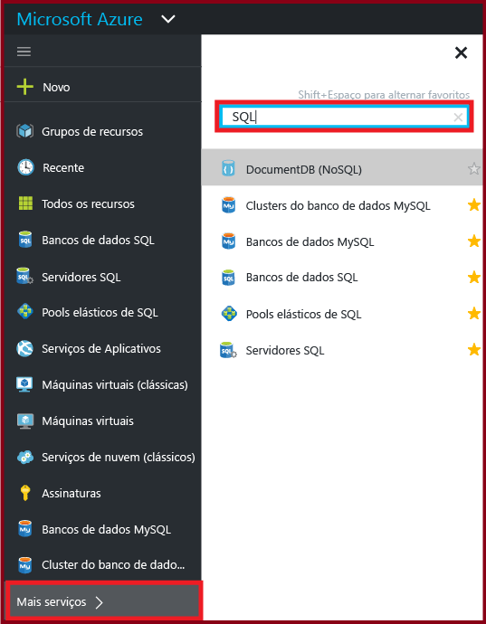

## Como criar ou exibir Bancos de Dados SQL do Azure?

Para abrir a folha **Bancos de Dados SQL**, clique em **Bancos de Dados SQL** e, em seguida, clique no banco de dados com o qual você deseja trabalhar ou clique em **+Adicionar** para criar um Banco de Dados SQL. Para obter detalhes, confira [Criar um Banco de Dados SQL em minutos usando o Portal do Azure](sql-database-get-started.md).

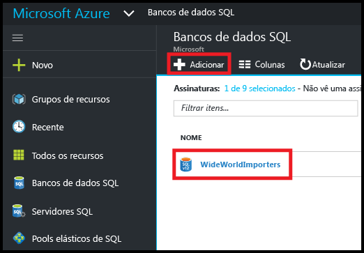

## Como criar ou exibir os servidores do SQL Azure?

Para abrir a folha **Servidores SQL**, clique em **Servidores SQL** e, em seguida, clique no servidor com o qual você deseja trabalhar ou clique em **+Adicionar** para criar um servidor SQL. Para obter detalhes, confira [Criar um Banco de Dados SQL em minutos usando o Portal do Azure](sql-database-get-started.md).

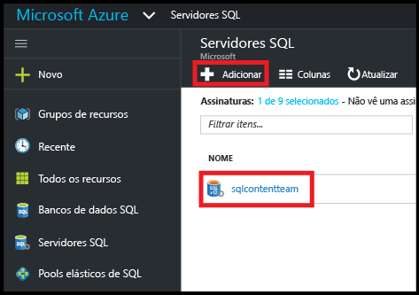

## Como criar ou exibir os pools elásticos de SQL?

Para abrir a folha **Pools elásticos de SQL**, clique em **Pools elásticos de SQL** e, em seguida, clique no pool com o qual você deseja trabalhar ou clique em **+Adicionar** para criar um pool. Para obter detalhes, confira [Criar um pool de banco de dados elástico com o Portal do Azure](sql-database-elastic-pool-create-portal.md).

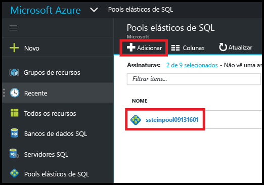

## Como atualizar ou exibir as configurações de banco de dados SQL?

Para exibir ou atualizar as configurações de banco de dados, clique na configuração desejada na folha do banco de dados SQL:

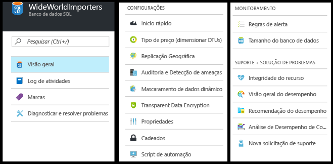

## Como localizar um nome de servidor totalmente qualificado de bancos de dados SQL?

Para exibir o nome de seu servidor de bancos de dados, clique em **Visão geral** na folha **Banco de Dados SQL** e observe o nome do servidor:

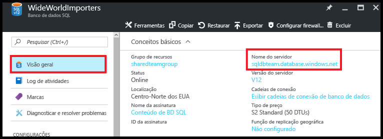

## Como gerenciar as regras de firewall para controlar o acesso a meu banco de dados e servidor do SQL?

Para exibir, criar ou atualizar regras de firewall, clique em **Definir firewall do servidor** na folha **Banco de Dados SQL**. Para obter detalhes, confira [Configurar uma regra de firewall no nível de servidor do Banco de Dados SQL do Azure usando o Portal do Azure](sql-database-configure-firewall-settings.md).

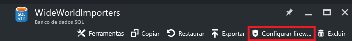

## Como posso alterar meu nível de desempenho ou camada de serviço do Banco de Dados SQL?

Para atualizar a camada de serviço ou o nível de desempenho de um banco de dados SQL, clique em **Tipo de preços (dimensionar DTUs)** na folha **Banco de Dados SQL**. Para obter detalhes, confira [Alterar a camada de serviços e o nível de desempenho (tipo de preço) de um banco de dados SQL](sql-database-scale-up.md).

## Como configurar a auditoria e detecção de ameaças para um banco de dados SQL?

Para configurar a detecção de ameaças e a auditoria para um banco de dados SQL, clique em **Auditoria e Detecção de ameaças** na folha **Banco de Dados SQL**. Para obter detalhes, consulte [Introdução à auditoria do Banco de Dados SQL](sql-database-auditing-get-started.md) e [Introdução à detecção de ameaças do Banco de Dados SQL](sql-database-threat-detection-get-started.md).

## Como configurar máscara de dados dinâmicos para um banco de dados SQL?

Para configurar a máscara de dados dinâmica para um banco de dados SQL, clique em **Máscara de dados dinâmicos** na folha **Banco de dados SQL**. Para obter detalhes, confira [Introdução ao mascaramento de dados dinâmicos do banco de dados SQL](sql-database-dynamic-data-masking-get-started.md).

## Como configurar a TDE (Transparent Data Encryption) para um banco de dados SQL?

Para configurar a Transparent Data Encryption para um banco de dados SQL, clique em **Transparent Data Encryption** na folha **Banco de Dados SQL**. Para obter detalhes, consulte [Habilitar TDE em um banco de dados usando o portal](https://msdn.microsoft.com/library/dn948096#Anchor_1).

## Como exibir ou alterar o tamanho máximo de um banco de dados SQL?

Para exibir ou alterar o tamanho do banco de dados SQL, clique em **Tamanho de banco de dados** na folha **Banco de dados SQL**. Atualize o tamanho máximo de um banco de dados alterando a camada de serviço ou o nível de desempenho. Para obter detalhes, confira [Alterar a camada de serviços e o nível de desempenho (tipo de preço) de um banco de dados SQL](sql-database-scale-up.md).

## Como monitorar e melhorar o desempenho de um banco de dados SQL?

Para monitorar e melhorar as características de desempenho de um banco de dados SQL, clique em **Visão geral do desempenho** na folha **Banco de dados SQL**. Para obter detalhes, consulte [Análise de desempenho do Banco de Dados SQL](sql-database-performance.md).

## Como configurar a replicação geográfica?

Para configurar a replicação geográfica para um banco de dados SQL, clique em **Replicação geográfica** na folha **Banco de dados SQL**. Para obter detalhes, confira [Configurar a replicação geográfica para o Banco de Dados SQL do Azure com o Portal do Azure](sql-database-geo-replication-portal.md).

## Como fazer um failover para um banco de dados SQL com replicação geográfica?

Para realizar um failover para um secundário replicado geograficamente, clique em **Replicação geográfica** na folha **Banco de Dados SQL** e clique em **Failover**. Para obter detalhes, confira [Iniciar um failover planejado ou não planejado para o Banco de Dados SQL do Azure com o Portal do Azure](sql-database-geo-replication-failover-portal.md).

## Como copiar um banco de dados SQL?

Para copiar um banco de dados SQL, clique em **Copiar** na folha **Banco de Dados SQL**. Para obter detalhes, confira [Copiar um Banco de Dados SQL do Azure usando o Portal do Azure](sql-database-copy-portal.md).

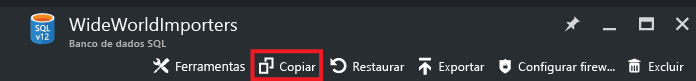

## Como arquivar um Banco de Dados SQL do Azure em um arquivo BACPAC?

Para criar um BACPAC de um banco de dados SQL, clique em **Exportar** na folha **Banco de Dados SQL**. Para obter detalhes, confira [Arquivar um Banco de Dados SQL do Azure em um arquivo BACPAC usando o Portal do Azure](sql-database-export.md).

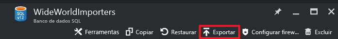

## Como restaurar um banco de dados SQL para um ponto anterior no tempo?

Para restaurar um banco de dados SQL, clique em **Restaurar** na folha **Banco de Dados SQL**. Para obter detalhes, confira [Restaurar um Banco de Dados SQL do Azure para um determinado momento anterior com o Portal do Azure](sql-database-point-in-time-restore-portal.md).

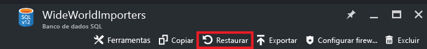

## Como criar um arquivo do banco de dados SQL do Azure de um arquivo BACPAC?

Para criar um banco de dados SQL de um arquivo BACPAC, clique em **Importar banco de dados** na folha **SQL Server**. Para obter detalhes, confira [Importar um arquivo BACPAC para criar um Banco de Dados SQL do Azure](sql-database-import.md).

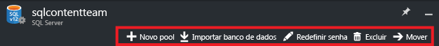

## Como restaurar um banco de dados SQL excluído?

Para restaurar um banco de dados SQL excluído, clique em **Bancos de dados excluídos** na folha **SQL Server** (o SQL Server que continha o banco de dados excluído). Para obter detalhes, confira [Restaurar um Banco de Dados SQL do Azure excluído usando o Portal do Azure](sql-database-restore-deleted-database-portal.md).

## Como excluir um banco de dados SQL?

Para excluir um banco de dados SQL, clique em **Excluir** na folha **Banco de Dados SQL**.

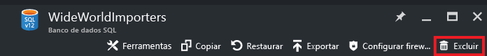

## Recursos adicionais

- [Banco de Dados SQL](sql-database-technical-overview.md)
- [Monitorar e gerenciar um pool de banco de dados elástico com o Portal do Azure](sql-database-elastic-pool-manage-portal.md)

<!---HONumber=AcomDC_0921_2016-->