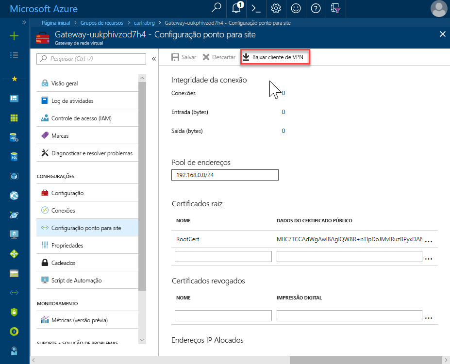
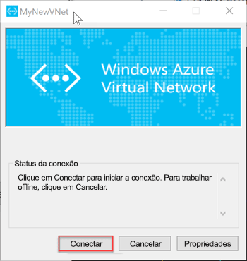

# <a name="configure-a-point-to-site-connection-to-an-azure-sql-database-managed-instance-from-on-premises"></a>Configurar uma conexão ponto a ponto com uma Instância Gerenciada do Banco de Dados SQL do Azure a partir de locais

Este início rápido demonstra como se conectar a uma Instância Gerenciada do Banco de Dados SQL do Azure usando o [SSMS](https://docs.microsoft.com/sql/ssms/sql-server-management-studio-ssms) (SQL Server Management Studio) em um computador cliente local por meio de uma conexão ponto a site. Para obter informações sobre conexões ponto a site, confira [Sobre a VPN Ponto a Site](../vpn-gateway/point-to-site-about.md)

## <a name="prerequisites"></a>Pré-requisitos

Este início rápido:

- Usa como ponto de partida os recursos criados neste início rápido: [Criar uma Instância Gerenciada](sql-database-managed-instance-get-started.md).
- Exige o PowerShell 5.1 e o Azure PowerShell 5.4.2 ou superior no computador cliente local.
- Exige a versão mais recente do [SSMS](https://docs.microsoft.com/sql/ssms/sql-server-management-studio-ssms) (SQL Server Management Studio) no computador cliente local

## <a name="attach-a-vpn-gateway-to-your-managed-instance-virtual-network"></a>Anexar um gateway de VPN à rede virtual da Instância Gerenciada

1. Abra o PowerShell no computador cliente local.
2. Copie e cole o script do PowerShell. Esse script anexa um Gateway de VPN à rede virtual da Instância Gerenciada criada no início rápido [Criar uma Instância Gerenciada](sql-database-managed-instance-get-started.md). Esse script executa as seguintes três etapas:

   - Cria e instala certificados no computador cliente
   - Calcula o intervalo de IP de sub-rede do futuro Gateway de VPN
   - Cria a GatewaySubnet
   - Implanta o modelo do Azure Resource Manager que anexa o Gateway de VPN à sub-rede da VPN

     ```powershell
     $scriptUrlBase = 'https://raw.githubusercontent.com/Microsoft/sql-server-samples/master/samples/manage/azure-sql-db-managed-instance/attach-vpn-gateway'

     $parameters = @{
       subscriptionId = '<subscriptionId>'
       resourceGroupName = '<resourceGroupName>'
       virtualNetworkName = '<virtualNetworkName>'
       certificateNamePrefix  = '<certificateNamePrefix>'
       }

     Invoke-Command -ScriptBlock ([Scriptblock]::Create((iwr ($scriptUrlBase+'/attachVPNGateway.ps1?t='+ [DateTime]::Now.Ticks)).Content)) -ArgumentList $parameters, $scriptUrlBase
     ```

3. Forneça os parâmetros solicitados no script do PowerShell. Os valores de `<subscriptionId>`, `<resourceGroup>` e `<virtualNetworkName>` devem corresponder àqueles usados no início rápido [Criar uma Instância Gerenciada](sql-database-managed-instance-get-started.md). O valor de `<certificateNamePrefix>` pode ser uma cadeia de caracteres de sua escolha.

4. Execute o script do PowerShell.

## <a name="create-a-vpn-connection-to-your-managed-instance"></a>Criar uma conexão VPN à Instância Gerenciada

1. Entre no [Portal do Azure](https://portal.azure.com/).
2. Abra o grupo de recursos no qual você criou o gateway de rede virtual e, em seguida, abra o recurso de gateway de rede virtual.

      

3. Clique em **Configuração Ponto a Site** e, em seguida, clique em **Baixar cliente VPN**.

      
4. Extraia os arquivos do arquivo zip e, em seguida, abra a pasta extraída.
5. Navegue para a pasta WindowsAmd64 e abra o arquivo **VpnClientSetupAmd64.exe**.
6. Se você receber uma mensagem **O Windows protegeu seu computador**, clique em **Mais informações** e, em seguida, em **Executar mesmo assim**.

    \
7. Clique em **Sim** na caixa de diálogo Controle de Conta de Usuário para continuar.
8. Na caixa de diálogo MyNewVNet, clique em **Sim** para instalar um cliente VPN para MyNewVNet.

## <a name="connect-to-the-vpn-connection"></a>Conectar-se à conexão VPN

1. Acesse as conexões VPN no computador cliente e clique em **MyNewVNet** para estabelecer uma conexão com essa VNET.

      
2. Clique em **Conectar**.
3. Na caixa de diálogo MyNewVNet, clique em **Conectar**.

      
4. Quando você receber uma mensagem indicando que o Gerenciador de Conexões precisa obter privilégio elevado para atualizar a tabela de rotas, clique em **Continuar**.
5. Clique em **Sim** na caixa de diálogo Controle de Conta de Usuário para continuar.

      

   Você estabeleceu uma conexão VPN à VNET da Instância Gerenciada.

## <a name="use-ssms-to-connect-to-the-managed-instance"></a>Usar o SSMS para se conectar à Instância Gerenciada

1. No computador cliente local, abra o SSMS (SQL Server Management Studio).
2. Na caixa de diálogo **Conectar ao Servidor**, insira o **nome do host** totalmente qualificado da Instância Gerenciada na caixa **Nome do servidor**, selecione **Autenticação do SQL Server**, forneça o logon e a senha e, em seguida, clique em **Conectar**.

      

Depois de se conectar, você pode exibir seus bancos de dados do sistema e do usuário no nó Bancos de Dados e vários objetos nos nós Segurança, Objetos do Servidor, Replicação, Gerenciamento, SQL Server Agent e XEvent Profiler.

## <a name="next-steps"></a>Próximas etapas

- Para obter um início rápido que mostra como se conectar por meio de uma máquina virtual do Azure, confira [Configurar uma conexão ponto a site](sql-database-managed-instance-configure-p2s.md)
- Para obter uma visão geral das opções de conexão para aplicativos, confira [Conectar seus aplicativos à Instância Gerenciada](sql-database-managed-instance-connect-app.md).
- Para restaurar um banco de dados do SQL Server existente do local para uma Instância Gerenciada, use o [DMS (Serviço de Migração de Banco de Dados do Azure) para realizar a migração](../dms/tutorial-sql-server-to-managed-instance.md) para restaurar de um arquivo de backup do banco de dados ou o [comando T-SQL RESTORE](sql-database-managed-instance-get-started-restore.md) para restaurar de um arquivo de backup do banco de dados.
