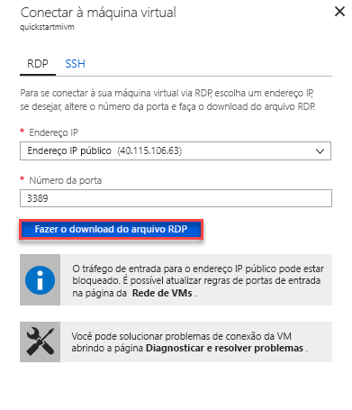

# Início Rápido: Configurar a VM do Azure para se conectar a uma Instância Gerenciada do Banco de Dados SQL do Azure

Este início rápido demonstra como configurar uma máquina virtual do Azure para se conectar a uma Instância Gerenciada do Banco de Dados SQL do Azure usando o SSMS (SQL Server Management Studio). Para ver um início rápido que mostra como se conectar de um computador cliente local usando uma conexão ponto a site, confira [Configurar uma conexão ponto a site](sql-database-managed-instance-configure-p2s.md)

## Pré-requisitos

Este início rápido usa os recursos criados em [Criar uma Instância Gerenciada](sql-database-managed-instance-get-started.md) como um ponto de partida.

## Entre no Portal do Azure

Entre no [Portal do Azure](https://portal.azure.com/).

## Criar uma nova sub-rede na VNet de Instância Gerenciada

As etapas a seguir criam uma sub-rede na VNet da Instância Gerenciada para uma máquina virtual do Azure conectar-se à Instância Gerenciada. A sub-rede da Instância Gerenciada é dedicada a Instâncias Gerenciadas. Você não pode criar nenhum outro recurso (por exemplo, máquinas virtuais do Azure) nessa sub-rede.

1. Abra o grupo de recursos para a Instância Gerenciada que você criou no início rápido [Criar uma Instância Gerenciada](sql-database-managed-instance-get-started.md). Selecione a rede virtual para a Instância Gerenciada.

   

2. Selecione **sub-redes** e, em seguida, selecione **+ Sub-rede** para criar uma sub-rede.

   

3. Preencha o formulário usando as informações nesta tabela:

   | Configuração| Valor sugerido | Descrição |
   | ---------------- | ----------------- | ----------- |
   | **Nome** | Qualquer nome válido|Para ver os nomes válidos, consulte [Regras e restrições de nomenclatura](https://docs.microsoft.com/azure/architecture/best-practices/naming-conventions).|
   | **Intervalo de endereços (bloco CIDR)** | Um intervalo válido | O valor padrão é bom para este início rápido.|
   | **Grupo de segurança de rede** | Nenhum | O valor padrão é bom para este início rápido.|
   | **Tabela de rotas** | Nenhum | O valor padrão é bom para este início rápido.|
   | **Pontos de extremidade de serviço** | 0 selecionado | O valor padrão é bom para este início rápido.|
   | **Delegação de sub-rede** | Nenhum | O valor padrão é bom para este início rápido.|

   

4. Selecione **OK** para criar essa sub-rede adicional na VNet de Instância Gerenciada.

## Criar uma máquina virtual na nova sub-rede na rede virtual

As etapas a seguir mostram como criar uma máquina virtual na nova sub-rede para conexão à Instância Gerenciada.

## Preparar a máquina virtual do Azure

Uma vez que a Instância Gerenciada do SQL é colocada na sua Rede Virtual privada, você precisa criar uma VM do Azure com uma ferramenta de cliente SQL instalada como o SQL Server Management Studio ou o Azure Data Studio. Essa ferramenta permite que você se conecte à Instância Gerenciada e execute consultas. Este início rápido usa o SQL Server Management Studio.

A maneira mais fácil de criar uma máquina virtual cliente com todas as ferramentas necessárias é usar os modelos do Azure Resource Manager.

1. Verifique se você está conectado ao portal do Azure em outra guia do navegador. Em seguida, selecione o botão a seguir para criar uma máquina virtual de cliente e instale o SQL Server Management Studio:

    

2. Preencha o formulário usando as informações na tabela a seguir:

   | Configuração| Valor sugerido | DESCRIÇÃO |
   | ---------------- | ----------------- | ----------- |
   | **Assinatura** | Uma assinatura válida | Precisa ser uma assinatura na qual você tem permissão para criar novos recursos. |
   | **Grupo de recursos** |O grupo de recursos que você especificou no início rápido [Criar Instância Gerenciada](sql-database-managed-instance-get-started.md).|Esse grupo de recursos precisa ser aquele no qual a VNet existe.|
   | **Localidade** | O local para o grupo de recursos | Esse valor é preenchido com base no grupo de recursos selecionado. |
   | **Nome da máquina virtual**  | Qualquer nome válido | Para ver os nomes válidos, consulte [Regras e restrições de nomenclatura](https://docs.microsoft.com/azure/architecture/best-practices/naming-conventions).|
   |**Nome de Usuário do Administrador**|Qualquer nome de usuário válido|Para ver os nomes válidos, consulte [Regras e restrições de nomenclatura](https://docs.microsoft.com/azure/architecture/best-practices/naming-conventions). Não use "serveradmin", que é uma função de nível de servidor reservada. Você usa esse nome de usuário sempre que você [se conecta à VM](#connect-to-virtual-machine).|
   |**Senha**|Qualquer senha válida|A senha deve ter no mínimo 12 caracteres e atender a [requisitos de complexidade definidos](../virtual-machines/windows/faq.md#what-are-the-password-requirements-when-creating-a-vm). Você usa essa senha sempre que você [se conecta à VM](#connect-to-virtual-machine).|
   | **Tamanho da Máquina Virtual** | Qualquer tamanho válido | O padrão neste modelo de **Standard_B2s** é suficiente para este início rápido. |
   | **Localidade**|[resourceGroup().location].| Não altere esse valor. |
   | **Nome da Rede Virtual**|A rede virtual em que você criou a instância gerenciada.|
   | **Nome da sub-rede**|O nome da sub-rede que você criou no procedimento anterior| Não escolha a sub-rede na qual você criou a Instância Gerenciada.|
   | **Localização de artefatos** | [deployment().properties.templateLink.uri] | Não altere esse valor. |
   | **token SAS de Localização de artefatos** | deixar em branco | Não altere esse valor. |

   

   Se você tiver usado o nome sugerido da VNet e a sub-rede padrão em [Como criar sua Instância Gerenciada](sql-database-managed-instance-get-started.md), não precisará alterar dois últimos parâmetros. Caso contrário, você deverá alterar esses valores para os valores inseridos quando você configurou o ambiente de rede.

3. Selecione a caixa de seleção **Concordo com os termos e condições declarados acima**.
4. Selecione **Comprar** para implantar a VM do Azure em sua rede.
5. Selecione o ícone **Notificações** para exibir o status da implantação.

> [!IMPORTANT]
> Não continue por aproximadamente 15 minutos após a criação da máquina virtual para dar tempo para que os scripts de pós-criação instalem o SQL Server Management Studio.

## Conectar-se à máquina virtual

As etapas a seguir mostram como se conectar à sua máquina virtual recém-criada usando uma conexão de área de trabalho remota.

1. Após a conclusão da implantação, vá para o recurso da máquina virtual.

      

2. Selecione **Conectar**.

   Um formulário de Protocolo RDP (arquivo .rdp) é exibido com o IP endereço IP público e o número da porta para a máquina virtual.

     

3. Selecione **Baixar Arquivo RDP**.

   > [!NOTE]
   > Você também pode usa SSH para se conectar à VM.

4. Feche o formulário **Conectar-se à máquina virtual**.
5. Para se conectar à sua VM, abra o arquivo RDP baixado.
6. Quando solicitado, selecione **Conectar**. Em um Mac, você precisa de um cliente RDP, como este [Cliente de Área de Trabalho Remota](https://itunes.apple.com/us/app/microsoft-remote-desktop/id715768417?mt=12) da Mac App Store.

7. Insira o nome de usuário e a senha especificados na criação da máquina virtual e escolha **OK**.

8. Você pode receber um aviso de certificado durante o processo de entrada. Escolha **Sim** ou **Continuar** para prosseguir com a conexão.

Você está conectado à máquina virtual no painel do Gerenciador do Servidor.

## Usar o SSMS para se conectar à Instância Gerenciada

1. Na máquina virtual, abra o SSMS (SQL Server Management Studio).

   Ele leva alguns instantes para abrir, já que precisa concluir sua configuração, pois essa é a primeira vez em que SSMS está sendo iniciado.
2. Na caixa de diálogo **Conectar ao Servidor**, digite o **nome do host** totalmente qualificado para a Instância Gerenciada na caixa **Nome do servidor**. Selecione **Autenticação do SQL Server**, forneça seu nome de usuário e senha e, em seguida, selecione **Conectar**.

      

Depois de se conectar, você pode exibir seus bancos de dados do sistema e do usuário no nó Bancos de Dados e vários objetos nos nós Segurança, Objetos do Servidor, Replicação, Gerenciamento, SQL Server Agent e XEvent Profiler.

## Próximas etapas

- Para ver um início rápido que mostra como se conectar de um computador cliente local usando uma conexão ponto a site, confira [Configurar uma conexão ponto a site](sql-database-managed-instance-configure-p2s.md).
- Para obter uma visão geral das opções de conexão para aplicativos, confira [Conectar seus aplicativos à Instância Gerenciada](sql-database-managed-instance-connect-app.md).
- Para restaurar um banco de dados do SQL Server existente do local para uma Instância Gerenciada, use o [DMS (Serviço de Migração de Banco de Dados do Azure) para realizar a migração](../dms/tutorial-sql-server-to-managed-instance.md) ou o [comando T-SQL RESTORE](sql-database-managed-instance-get-started-restore.md) para restaurar de um arquivo de backup do banco de dados.
